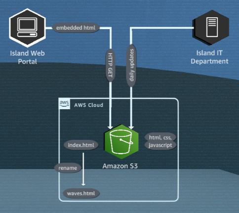
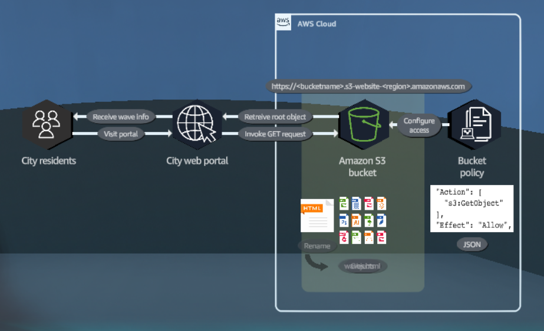
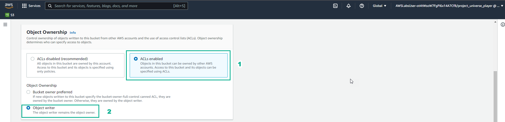
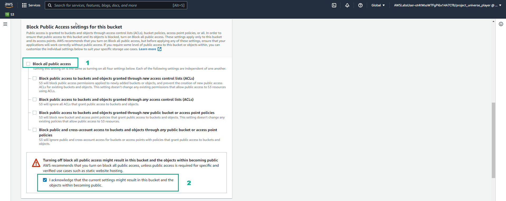
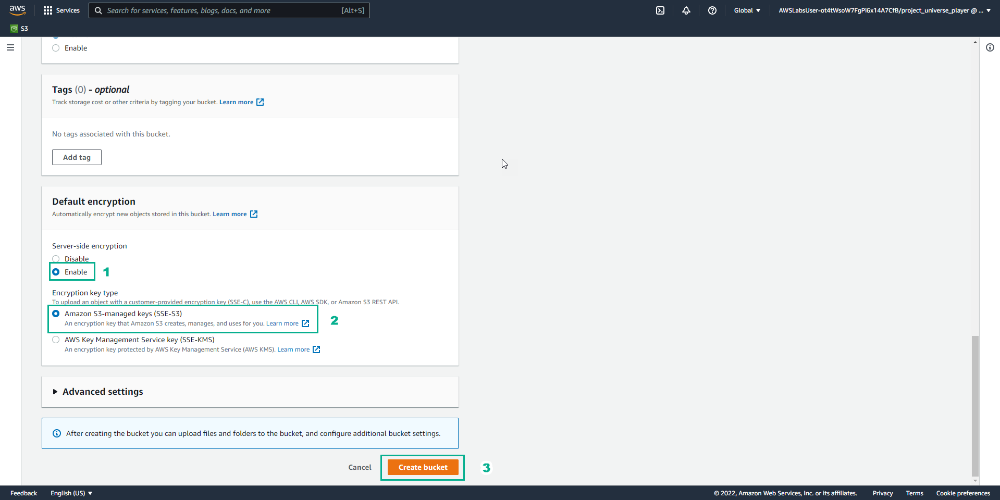
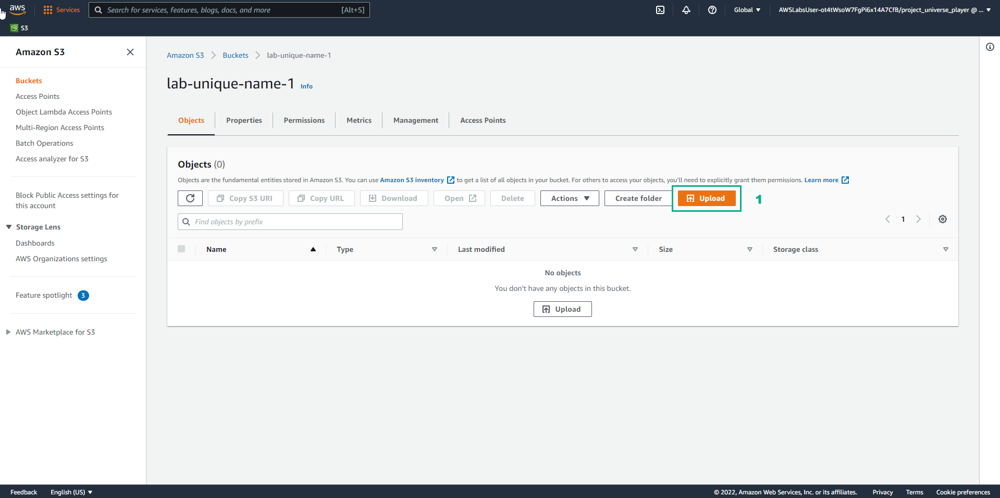
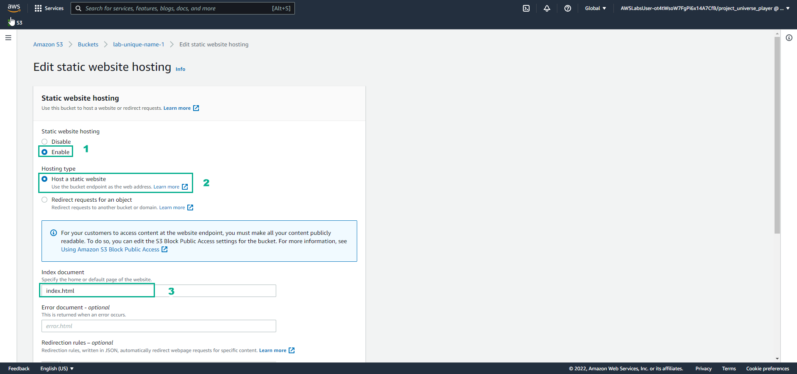
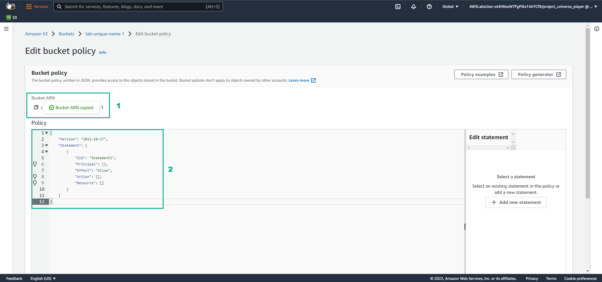

# Cloud Computing Essentials

### **Overview**

The city's web portal team wants a solution that will make their beach wave size prediction webpage more reliable

## Learn

### 1. Using Amazon S3, you can store and retrieve any amount of data from anywhere. You can also store any type of data.

### 2. To store data in Amazon S3, you work resources known as buckets and objects. A bucket is a container fro objects. An objects is ay type of file and any metadata that describes that file.

### 3. This solution uses an Amazon S3 bucket to host a static website. In Amazon S3, the static website can sustain any conceivable level of traffic, at a very modest cost, without the need to set up, monitor, scale or manage any web servers.



### 4. Files that support the webpage functionality, such as client-side scripts and style sheets, are uploaded into the S3 bucket together with and HTML file. You can configure any of your S3 buckets as a static website.

### 5. When an S3 bucket is configured for website hosting, the bucket is assigned a URL. When requests are made to this URL, Amazon S3 returnds the HTML file, known as the root object, that ws set for bucket.

### 6. For others to access the S3 bucket, or specific objects in it, permissions must be configured to allow that access. A bucket policy can be created to configure these permissions.

### 7. A bucket policy defines who can access the bucket and what type of operations can be performed. Bucket policies are written in JSON format.



## Practice

### 1. Go to the Amazon S3

- Select Buckets
- Select Create bucket
- Bucket name, enter lab-unique-name-1
- AWS Region, enter US East (N. Virginia) us-east-1

### 2. In Object Ownership

- Select ACLs enabled
- Select Object writer



### 3. In the Amazon S3 interface

- Uncheck Block all public access
- Select I acknowledge…



- In the Default encryption section, select Enable
- Select \*\*Amazon S3-managed keys (SSE-S3)
- Select Create bucket



### 4. In the Amazon S3 interface

- Select Upload



- Select Add files
- Select necessary files
- Select Upload
- View successfully uploaded files
- Select Close

### 5. In the Amazon S3 interface

- Select Properties
- Select Edit
- Select Enable
- Select Host a static website
- In Index document, enter index.html



- Select Save changes

### 6. In the Amazon S3 interface

- Select Permissions
- View Block all public access
- Select Edit

### 7. In the Edit bucket policy interface

- Copy Bucket RNA
- Remove Policy



### 8. In the Edit bucket policy interface

- Replace Bucket ARN into Resource in this policy

```
{
  "Id": "StaticWebPolicy",
  "Version": "2012-10-17",
  "Statement": [
    {
      "Sid": "S3GetObjectAllow",
      "Action": [
        "S3:GetObject"
      ],
      "Effect": "Allow",
      "Resource": "copied arn",
      "Principal": "*"
    }
  ]
}
```

- Copy the contents of the policy
- Paste in Policy
- Select Save changes

### 9. ​​In the Amazon S3 interface

- Select Properties
- See Hosting type
- Copy Bucket website endpoint
- Paste Bucket website endpoint into the browser
- View results

### Congratulations to the player on completing the lab
