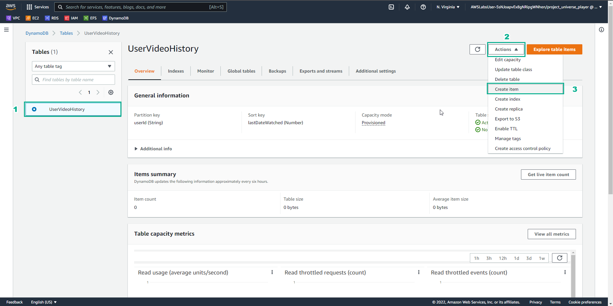
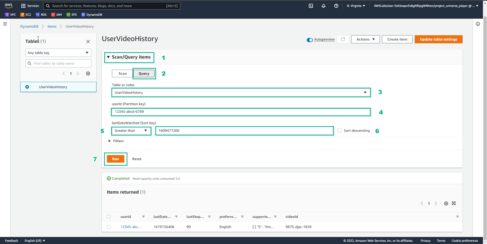

# First NoSQL Database

## **Overview**

Create a database to help our video streaming team track customer viewing behaviors from metadata, such as movies watched and device type.

## **Learn**

### 1. This solution uses Amazon DynamoDB, which has a flexible schema, so each row can have any number of attributes at nay point in time

### 2. DynamoDB is a key-value and document database that delivers single-digit millisecond performance at any scale. This level of performance addresses the fast response time required by the solution

### 3. DynamoDB tables support two types of primary keys: a partition key only, or a partition key and sort key. This solution uses a partition key (userId) and a sort key (lastDateWatched)

### 4. When getting a specific item (GetItem operation), you must specify the primary key for the item that you want. You can retrieve the entire item or just a subset of its attributes

### 5. To query this table, you must provide the partition key value and apply a condition to the sort key values so that you retrieve only a subset of t he data

### 6. With a flexible schema, you can add a new attribute (such as 'rating') to a specific record even after it has been created

## **Practice**

### 1. In the AWS Console interface

- Find DynamoDB
- Select Amazon DynamoDB

### 2. In the DynamoDb interface

- Select Create table

### 3. In the Create table interface

- Table name, enter UserVideoHistory
- Partition key, enter userId, attribute String
- Sort key, enter lastDateWatched, attribute Number

- Select Default settings
- Select Create table

### 4. In the Tables interface

- View UserVideoHistory
- See Status as Active

### 5. In the UseVideoHistory interface

- Select UserVideoHistory
- Select Actions
- Select Create item

### 6. In the Create item interface

- userId, enter 12345-abcd-6789
- lastDateWatched, enter 1619156406

- Select Add new attribute
- Select String

- Attribute name, enter videoId
- Value, enter 9875-djac-1859
- Select Add new attribute
- Select String
- Attribute name, enter preferredLanguage
- Value, enter English
- Select Add new attribute
- Select List
- Attribute, enter supportedDeviceTypes
- In Value, select Insert a field
- Select String
- Enter Amazon Fire TV
- Select Insert a field
- Select String
- Enter Amazon Fire Tablet
- Select Create item

### 7. In the DynamoDB interface

- Select Explore items
- Select UserVideoHistory
- View Items returned

### 8. In the Item editor interface

- Select Add new attribute
- Select Number
- Attribute, enter lastStopTime
- Value, enter 90

### 9. In the UserVideoHistory interface

- Select Scan/Query items
- Select Query
- In Table or index, select UserVideoHistory
- In userID (Partition key), select 12345-abcd-6789
- In lastDateWatched (Sortkey), select Greater than, select 1609477200
- Select Run

- View Query results from Items returned
- In userId (Partition key), enter abd5-zxcg-12385
- Select Run
- View results from Items returned

- Select Scan
- Select Run
- View results from Items returned

Congratulations to the player on completing the lab

## **DIY**

### 1. In the AWS Console interface

- Find Amazon DynamoDB
- Select Amazon DynamoDB
- Select Create table

### 2. In the DynamoDB interface

- Select Update settings
- Select UserVideoHistory
- Select Actions
- Select Create item

### 3. In the Create item interface

- In userId, enter 12345-abcd-6785
- In lastDateWatched, enter 1619156407

- Select Add new attribute
- Select Number
- Attribute name, enter Rating ** (note to lowercase)**
- Value, enter 5
- Select Create item

### 4. In the DynamoDB interface

- View Items returned

### 5. In the Item editor interface

- In Attribute name, enter rating
- Select Save changes
