# Auto-healing and Scaling Applications

## **Overview**

Create and configure an Amazon EC2 Auto Scaling group that follows scheduled scaling activities to add and remove EC2 instances.

## **Learn**

### 1. Amazon EC2 Auto Scaling helps ensure that you have the correct number of EC2 instances available to handle the load on your application

### 2. You can specify the minimum and maximum number of instances in each Auto Scaling group, which helps ensure that your group doesn't go below or above these limits.

### 3. If you specify a desired capacity, either when you create the group or at any time after, Amazon EC2 Auto Scaling helps ensure that group has the desired amount of instances

### 4. Scheduled scaling helps you set up your own timings for scaling in and out according to predictable load changes

### 5. You can configure the Auto Scaling group to, for example, increase capacity on Tuesday at 8:00 PM and decrease capacity on Wednesday at 1:00 AM

### 6. You can use dynamic scaling to define how to scale capacity in response to changing demand

### 7. In this solution, an Amazon CloudWatch alarm is configured to monitor CPU utilization greater than 70 percent

### 8. You can create a dynamic scaling policy to track a specific CloudWatch metric (ALARM: cpu avg > 70%) that adds servers if the alarm is invoked

### 9. In this solution, a scheduled scaling event terminates all instances in the Auto Scaling group

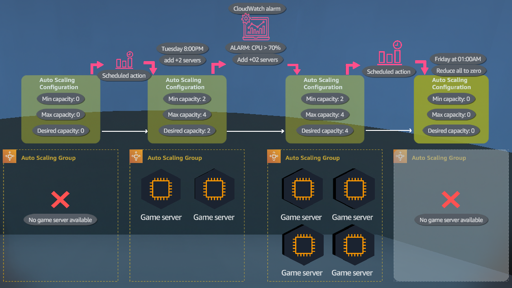

## **Practice**

### 1. In the AWS Console interface

- Find EC2
- Select EC2

### 2. In the EC2 interface

- Select Instances

### 3. In the Instances interface

- Select Game Server

### 4. Open the browser

- Paste Public IPv4 address
- Select Enter
- View results

### 5. In the EC2 interface

- Select Instances
- Select Game Server
- Select Actions
- Select Image and templates
- Select Create image

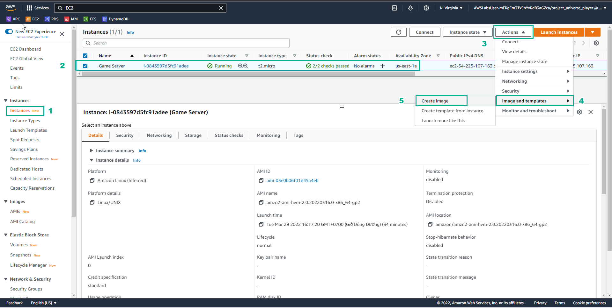

### 6. In the Create image interface

- Image name, enter Game Server
- Image description, enter Regular customer game server

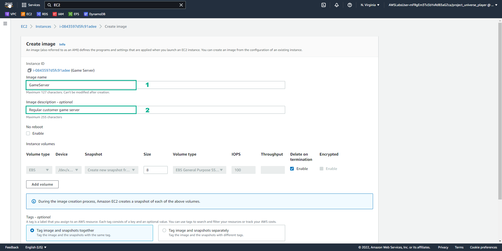

### 7. In the Create image interface

- Tag, select Tag image and snapshots together
- Select Create image

### 8. In the EC2 interface

- Select AMIs
- Select Game Server
- Select refresh
- View Status
- Select Launch Templates

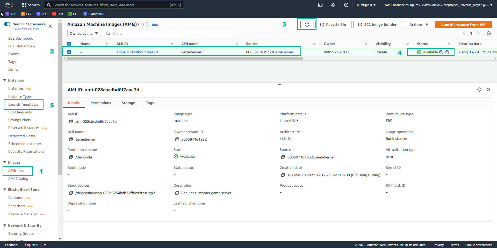

### 9. In the EC2 launch templates interface

- Select Create launch templates

### 10. In the interface Create lauch template

- Launch template name, enter GameServerTemplate
- Template version description, enter Regular customer game server template
- Uncheck Provide guidance to help me set up a template tht I can use with EC2 Auto Scaling

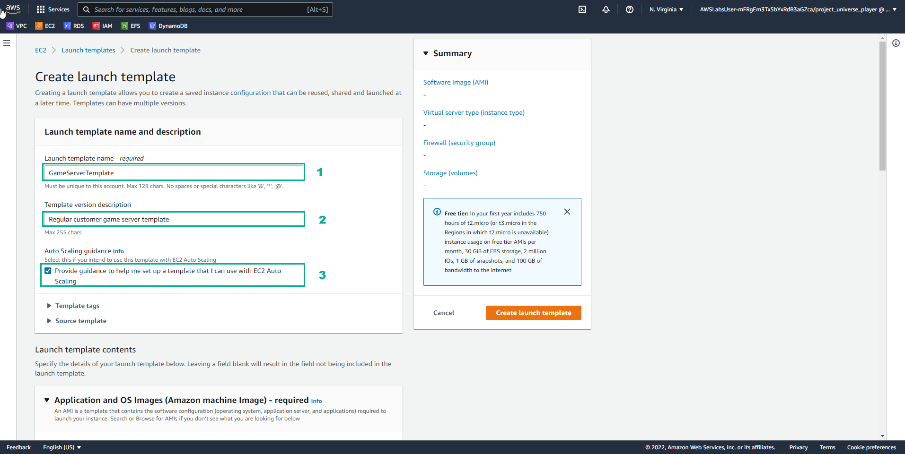

### 11. In the Create launch template interface

- Select AMIs
- Select Owned by me
- In Amazon Machine Image (AMI), select GameServer

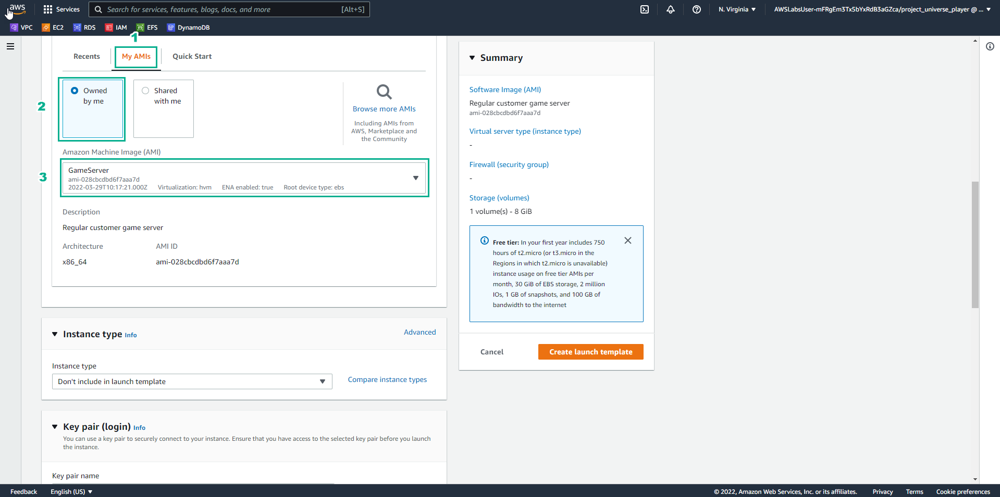

### 12. In the Create launch template interface

- In Instance type, select t2.nano
- Select Create new key pair

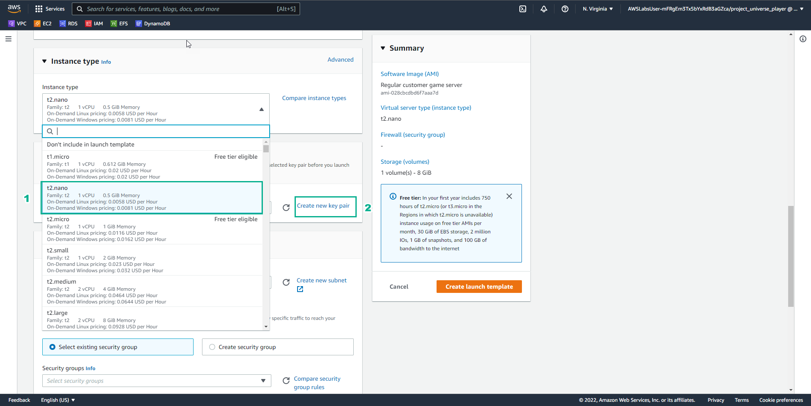

### 13. In the Create key pair interface

- Key pair name, enter GameServerKeyPair
- Key pair type, select RSA
- Private key file format, select .pem
- Select Create key pair

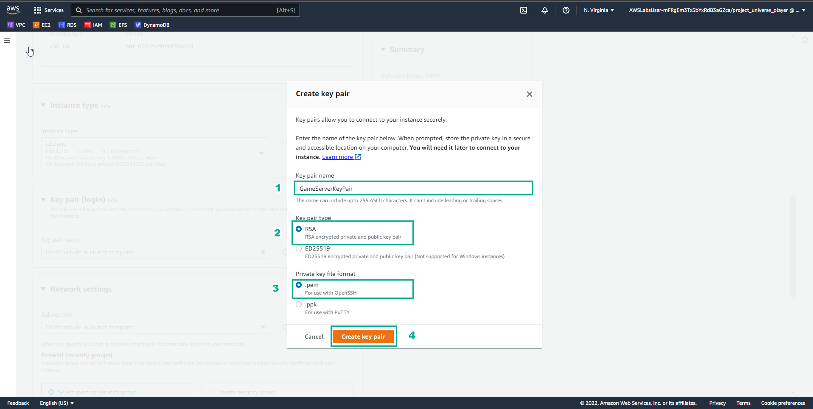

### 14. In the Create launch template interface

- In Network settings, select Select existing security group
- Select WebServerSecurityGroup

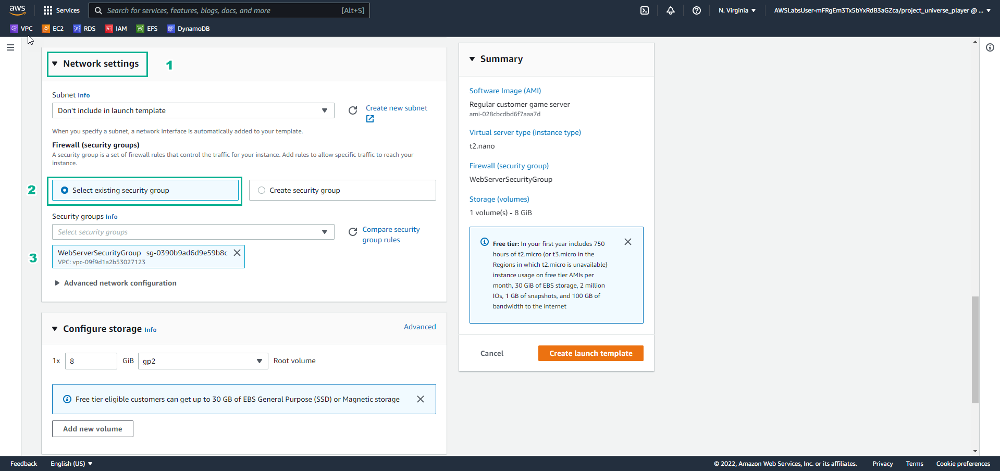

- Watch Sumary
- Select Create launch template

### 15. Successful template initialization interface

- Select View launch templates

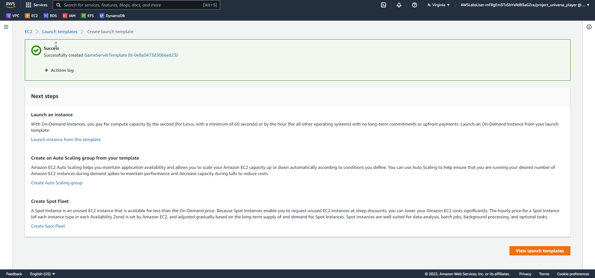

### 16. In the Launch templates interface

- View the template just created
- Select Auto Scaling Groups

### 17. In the Amazon EC2 Auto Scaling interface

- Select Create Auto Scaling group

### 18. In the Auto Scaling groups interface

- In Choose launch template or conriguration
- Auto Scaling group name, enter RegularCustomerGameServer
- Launch template, enter GameServerTemplate

### 19. In the Auto Scaling interface

- Select Next

### 20. In the EC2 Auto Scaling Group interface

- In Choose instance launch options
- In Network, Select VPC
- Select Availability Zones and subnets

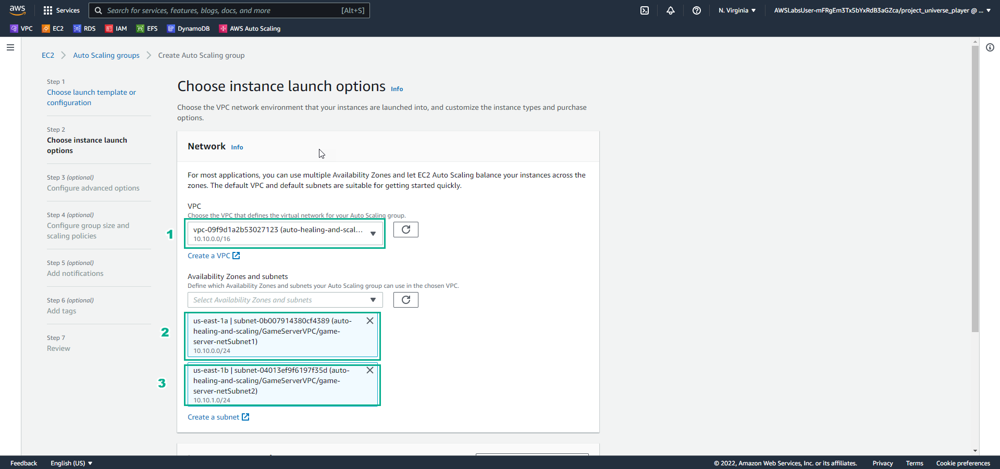

- Select Next
- In Load balancing, select No load balancer
- In health check grace period, enter 240 seconds
- Select Next

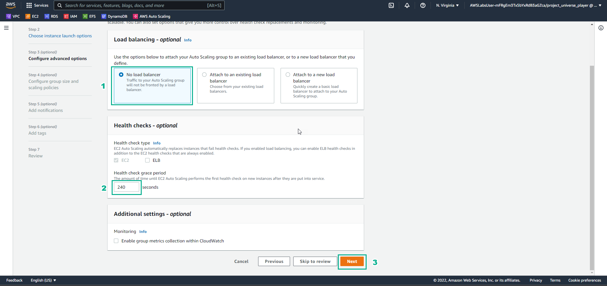

- In Configure group size and scaling policies
- In Group size
- Desired capacity, enter 2
- Minimum capacity, enter 2
- Maximum capacity, enter 4
- In Scaling policies, select tarfget tracking scaling policy

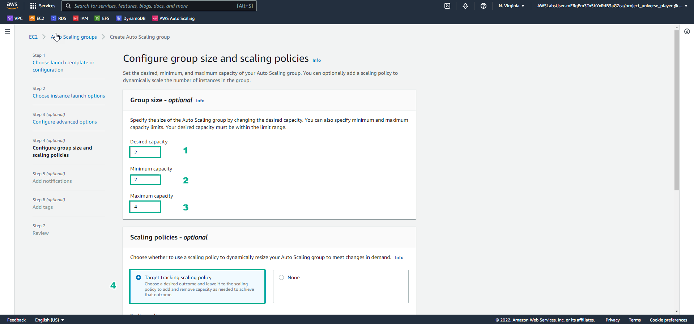

### 21. In the EC2 Auto Scaling interface

- In Scaling policy name, enter CPU Utilization
- Metric type, select Aerage CPU utilization
- Target value, enter 70
- Select Next

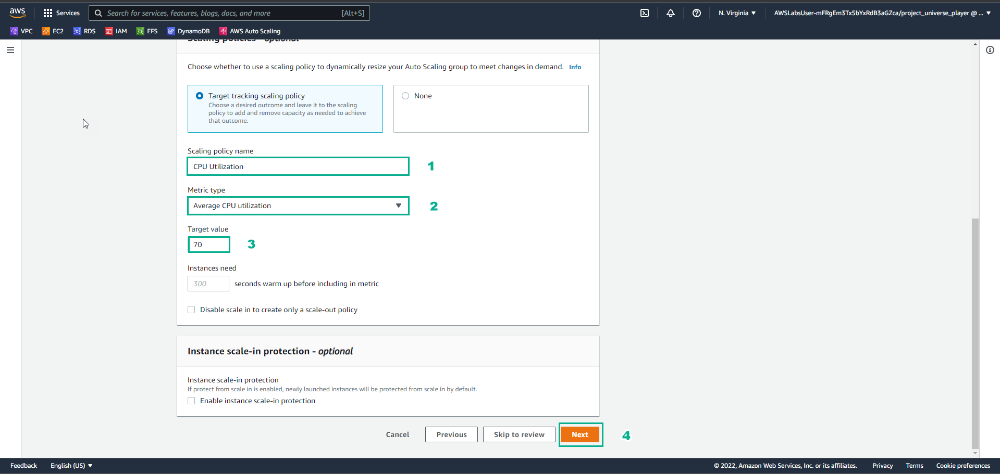

### 22. In the EC2 Auto Scaling Group interface

- Select Skip to review
- Select Create Auto Scaling group
- View initialization results RegularCustomerGameServer
- Select Activity
- View Activity history
- Select Automatic scaling
- Select Create scheduled action

### 23. In the Create scheduled action interface

- Name, enter SecondWaveOfRegulars
- Desired capacity, enter 3
- Min, enter 3
- Max, enter 4
- Recurrence, select Every week
- Specific start time, choose a time in the future
- Select Create

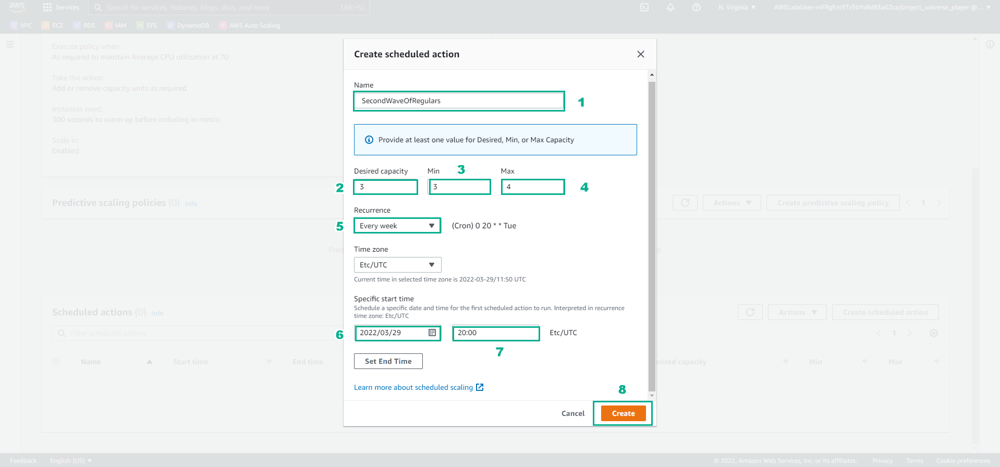

Congratulations to the player on completing the lab

## **DIY**

### 1. In the AWS Console interface

- Find EC2
- Select EC2

### 2. In EC2 interface

- Select Instances
- Select Game Server
- Select Actions
- Select Image and templates
- Select Create image

### 3. In the Create image interface

- Image name, enter GameServer
- Image description, enter Regular customer game server

### 4. In the EC2 interface

- Tags, select tag image and snapshots together
- Select Create image
- Select AMIs
- Select GameServer
- Select Refresh
- View Status
- Select Launch Templates

### 5. In the EC2 launch templates interface

- Select Create launch templates

### 6. In the Create launch template interface

- Lauch template name, enter GameServerTemplate
- Template version description, enter Regular customer game server template

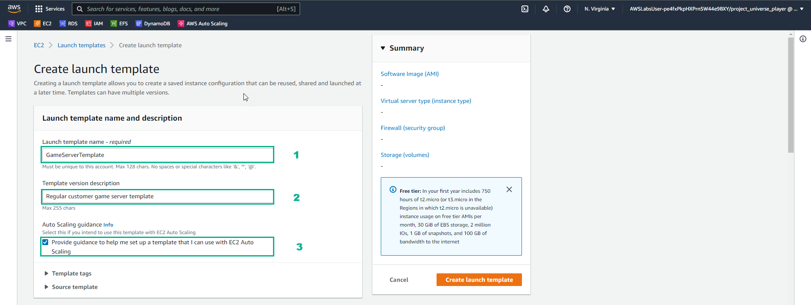

### 7. In the EC2 launch template interface

- Select My AMIs
- Select Owned by me
- Amazon Machine Image (AMI), select GameServer

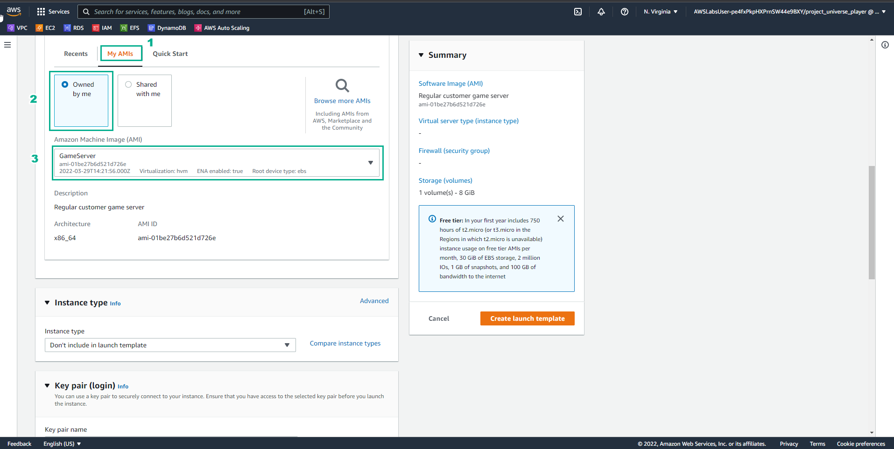

- In Instance type, select t2.nano
- Select Create new key pair
- Select Select existing security group

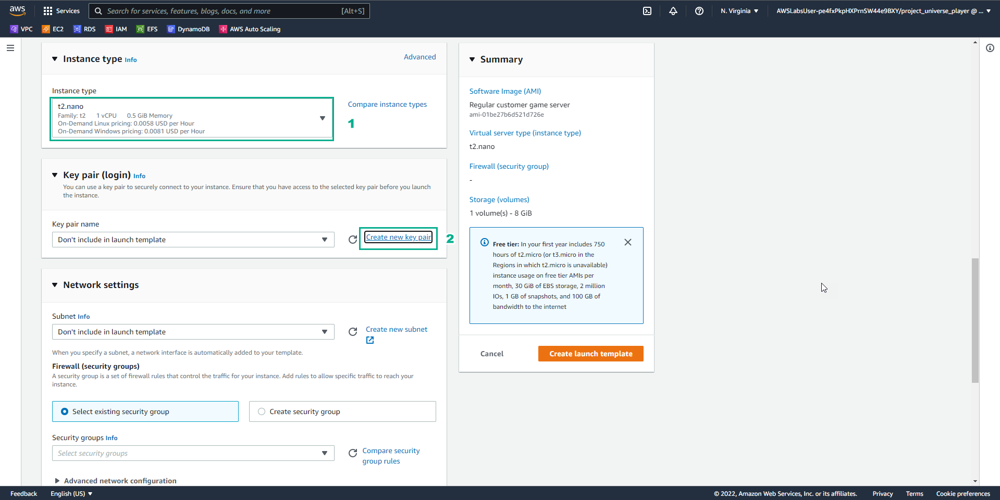

### 8. In the Create key pair interface

- Key pair name, enter GameServerKeyPair
- Key pair type\*, enter RSA
- Private key file format, select .pem
- Select Create key pair

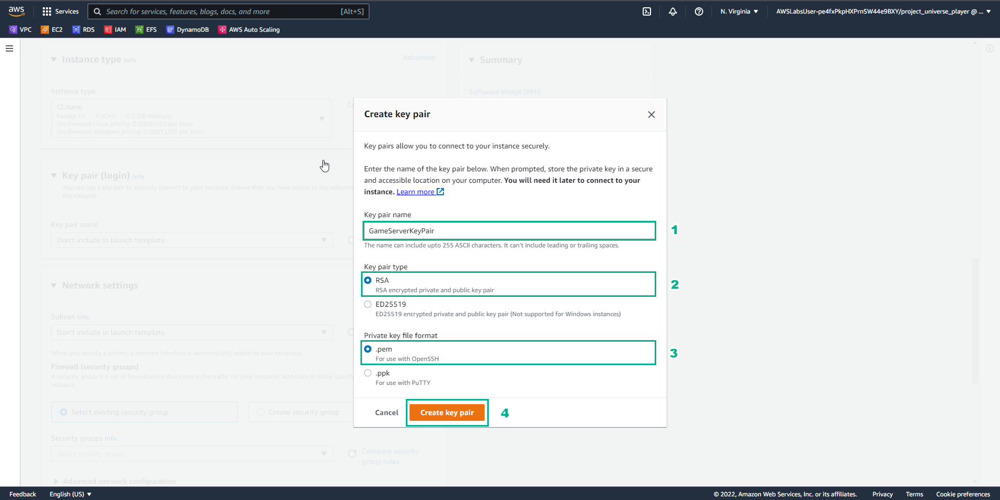

### 9. In the EC2 launch template interface

- In Network settings, select Select existing security group
- Security group, select WebServerSecurityGroup

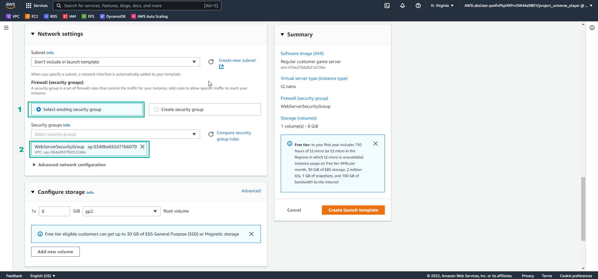

- Watch Sumary
- Select Create launch template

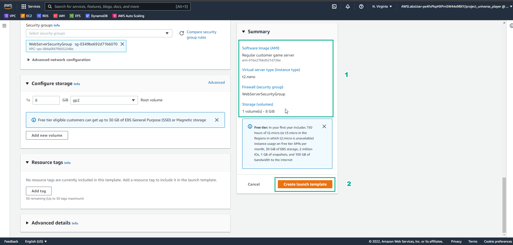

### 10. In the Create launch template interface

- See the successful template initialization
- Select View launch templates

### 11. In the Launch templates interface

- Select Auto Scaling Groups

### 12. In the Amazon EC2 Auto Scaling interface

- Select Create Auto Scaling group

### 13. In the Create Auto Scaling group interface

- Auto Scaling group name, enter RegularCustomerGameServer
- Launch template, enter GameServerTemplate

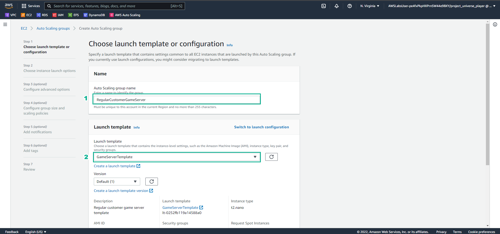

- Select Next
- Select VPC
- Select Availability Zone and subnet
- Select Next

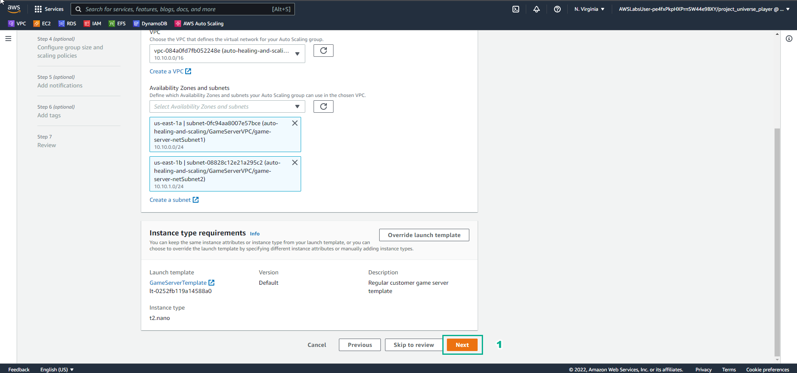

- In Load balancing, select No load balancer
- Health check grace period, enter 240
- Select Next
- Desired capacity, enter 2
- Minimum capacity, enter 2
- Maximum capacity, enter 4
- Select Target tracking scaling policy
- Scaling policy name, enter CPU Utilization
- Tager value, enter 70
- Select Next
- Select Skip to review
- Select Create Auto Scaling group

### 14. In the EC2 interface

- View initialization results Auto Scaling group
- Select RegularCustomerGameServer

### 15. In the RegularCustomerGameServer interface

- Select Activity
- View Activity history
- Select Automatic scaling
- Select Create scheduled action

### 16. In the Create scheduled action interface

- Name, enter SecondWaveOfRegulars
- Desired capacity, enter 0
- Min, enter 0
- Max, enter 0
- Recurrence, select Every day
- Specific start time, select date and year and select 01:00
- Select Create

Congratulations to the award-winning player
