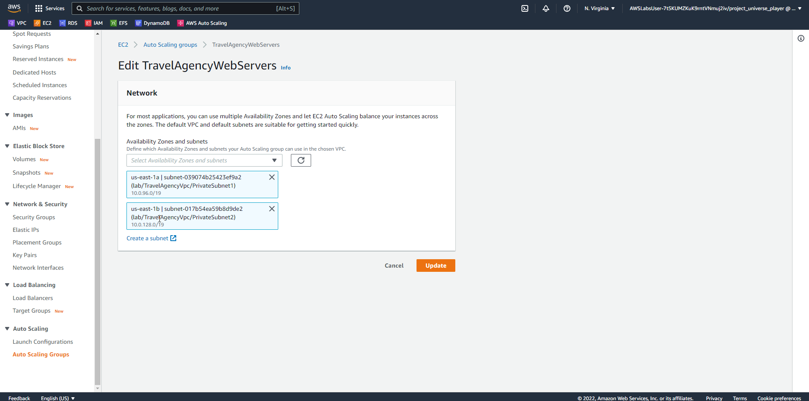
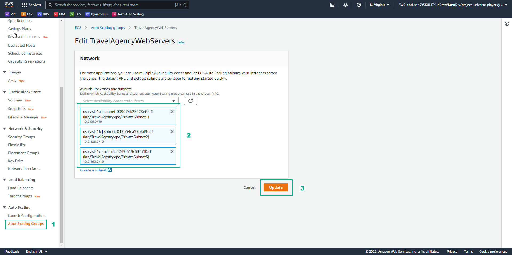

# High Available Web Applications

## **Overview**

Increase website reliability by creating a highly available architecture that spans multiple AZ with load balancing and health monitoring.

## **Learn**

### 1. This classic web application solution uses an AWS Cloud computing infrastructure to ensure that an application is highly available

### 2. Amazon Route 53 provides DNS services to streamline domain management

### 3. Amazon CloudFront is used to deliver static and dynamic content. CloudFront can cache frequently accessed content to decrease latency.

### 4. Amazon S3 is used to store static assets, such as images and video.

### 5. Elastic Load Balancing is used to distribute traffic across multiple AZ, Amazon EC2 Auto Scalling groups are deployed for redundancy.

### 6. AWS Auto Scaling creates groups of servers that grow or shrink in capacity, depending on demand

### 7. AWS Auto Scaling also works derictly with Amazon CloudWatch, for metrics data, and with Elastic Load Balancing to add and remove hosts for load distribution

### 8. For example, if a web server reports greater than 80 percent CPU utilization over a period of time, an additional web server could be quickly deployed and automatically added to the load balancer.

## **Practice**

### 1. In the AWS Console interface

- Find EC2
- Select EC2

### 2. In the EC2 interface

- Select Auto Scaling Groups
- Select TravelAgencuWebServers
- View details of Desired capacity, Minimum capacity, Maximum capacity

### 3. In the Auto Scaling groups interface

- Select Instance management
- View instances
- Select Deatils
- In Network, see Subnet ID
- In Load balancing, select Edit

### 4. In the Edit TravleAgencyWebServers interface

- Select Add a new load balancer
- Select Application Load Balancer
- In Load balancer scheme, select Internet-facing

### 5. In the Availability Zone and subnets interface

- Select all 3 availability zones
- Select Public subnet
- In Default routing (forward to), select Create a target group
- Select Update

### 6. In the VPC interface

- elect Security Groups
- Select Create security group

### 7. In the Create security group interface

- Security group name, enter TravelAgencyLoadBalancer
- Description, enter Allow access to the Travel Agency Balancer from the Internet
- Select VPC
- In Inbound rules, select Add rule

### 8. In the Create security group interface

- In Inbound rules, select HTTP, select Source as Custom, select 0.0.0.0/0
- In Outbound rules, select HTTP, select Destination as Custom, select Security group

- Select Create security group

### 9. In the Security Groups interface

- Select Security Groups
- Select TravelAgencyWebServer
- Select Actions
- Select Edit inblound rules

### 10. In the Inbound rules interface

- Select Delete
- Select Add rule

### 11. In the Edit inbound rules interface

- Select HTTP
- Select TravelAgencyLoadBalancer security group
- Select Save rules

### 12. In the VPC interface

- Select Load Balancers
- Select TravelAgencyWebServers-1 ALB
- Select Description

### 13. In the Security groups interface

- Select Edit security groups
- Select TravelAgencyLoadBalancer
- Uncheck TravelAgencyWebServer
- Select Save

### 14. In the VPC interface

- Select Load Balancers
- Select TravelAgencyWebServer-1 ALB
- In Description, copy ALB DNS name

### 15. Open a browser

- Paste ALB DNS name in
- Select Enter
- View results

### 16. In the browser interface

- Add at the end ALB DNS name: /health
- View results

### 17. In the VPC interface

- Select Target Groups
- Select TravelAgencyWebServers-1 target group
- Select Health checks
- Select Edit

### 18. In the Edit health check settings interface

- In Health check path, enter /health
- Select Advanced health check settings

### 19. In the Advanced health check settings interface

- Port, enter 80
- Healthy threshold, enter 5
- Unhealthy threshold, enter 2
- Timeout, enter 2
- Interval, enter 5
- Success code, enter 200
- Select Save changes

### 20. In the VPC interface

- Select Auto Scaling Groups
- Select TravelAgencyWebServers Auto Scaling group
- In Network, select Edit

### 21. In the Edit TravelAgencyWebServers interface

- Select lab/TravelAgencyVpc/PrivateSubnet1 subnet
- Uncheck lab/TravelAgencyVpc/PublicSubnet1 subnet
- Select Update

### 22. In the EC2 interface

- Select Instances
- Select lab/TravelAgencyWebServers instance
- Select Networking
- View Subnet ID
- Select instance state
- Select Terminate instance

### 23. In the Terminate instance interface

- Select Terminate

### 24. In the EC2 interface

- Select refresh
- Select new instance
- Select Networking
- View Subnet ID

### 25. In the VPC interface

- Select Auto Scaling Groups
- Select TravelAgencyWebServers Auto Scaling group
- Select Activity
- View Activity history

### 26. In the Activity history interface

- View Status
- View Description

### 27. In the browser health check

- Select refesh
- View the results

### 28. In the VPC interface

- Select Auto Scaling Groups
- Select TravelAgencyWebServers Auto Scaling group
- In Network, select Edit

### 29. In the Edit TravelAgencyWebServers interface

- Select lab/TravelAgency/Vpc/PrivateSubnet2
- Select Update

### 30. In the VPC interface

- Select Auto Scaling Groups
- Select TravelAgencyWebServers Auto Scaling group
- In Group details, select Edit

### 31. In the Group size interface

- In Desired capacity, enter 2
- In Maximum capacity, enter 2
- Select Update

### 32. In the EC2 interface

- Select Auto Scaling Groups
- Select TravelAgencyWebServers Auto Scaling group
- Select Activity
- Scroll down Activity history

### 33. In the Auto Scaling groups interface

- In Activity history, see Status and Description

### 34. In the EC2 interface

- Select Instances
- Select new instance ID
- Select Networking
- View Subnet ID

### 35. In the browser health check

- Refresh
- View results

Congratulations to the player on completing the lab

## **DIY**

### 1. In the AWS Console interface

- Find EC2
- Select EC2

### 2. In the EC2 interface

- Select Instances
- Select lab/TravelAgencyWebServers
- Select Details to view instance details
- Select Auto Scaling Groups
- Select TravelAgencyWebServers auto scaling group
- Select Details to see the details of the auto scaling group
- Select Auto Scaling Groups
- Select TravelAgencyWebServers Auto Scaling Group
- Select Instance management
- View instance information
- Select Auto Scaling Groups
- Select TravelAgencyWebServers
- Select Details to view Desired capacity, Minimum capacity, Maximum capacity
- Select Auto Scaling Groups
- Select TravelAgencyWebServers Auto Scaling Group
- In Network, see Subnet ID information
- In Load balancing, select Edit

### 3. In the Edit TravelAgencyWebServers interface

- Select Add a new load balancer

### 4. In the Load balancing interface

- Load balancer type, select Application Load Balancer
- Load balancer scheme, select Internet-facing

### 5. In the interface Edit TravelAgencyWebServers

- Availability Zones and subnets, select all 3 AZ\* and subnets
- In Default routing (forward to), select Create a target group
- Select Update

### 6. In the Auto Scaling Groups interface

- View update results
- Select TravelAgencyWebServers Auto Scaling Group
- Select Details to see details

### 7. In the EC2 interface

- Select Security Groups
- Select Create security group

### 8. In the Create security group interface

- Security group name, enter TravelAgencyLoadBalancer
- In Decription, enter Allow access to the Travel Agency Load Balancer from the Internet
- In VPC, select lab/TravelAgencyVpc
- Select Add rule

- Inbound rules, select HTTP
- Oubound rules, select HTTP
- Select Create security group

### 9. In the EC2 interface

- Select Security Groups
- Select TravelAgencyWebServer security group\*
- Select Actions
- Select Edit inbound rules

### 10. In the Edit inbound rules interface

- Select Delete
- Select Add rule
- Select HTTP
- Source select Custom, select TravelAgencyLoadBalancer
- Select Sae rules

### 11. In the EC2 interface

- Select Load Balancers
- Select TravelAgencyWebServers-1 Load Balancer
- Select Description to view description information

### 12. In the Load Balancer interface

- Select Edit security groups
- Select TravelAgencyLoadBalancer security group
- Uncheck TravelAgencyWebServer security group

### 13. In the EC2 interface

- Select Load Balancers
- Select TravelAgencyWebServer-1 Load Balancer
- In Description, view and copy DNS name

### 14. Open a browser

- Paste DNS name into the browser
- Select Enter and see the interface

### 15. In the browser

- Follow the end of DNS name: /health
- View results

### 16. In the EC2’ interface

- Select Target Groups
- Select TravelAgencyWebServers target group
- Select Health checks

### 17. In the interface Edit health check settings

- In Health check path, enter /health
- Select Advanced health check settings

### 18. In the Advanced health check settings interface

- In Unhealthly threshold, enter 2
- In Timeout, enter 2
- In Interval, enter 5
- Select Save changes

### 19. In the EC2 interface

- Select Auto Scaling Groups
- Select TravelAgencyWebServer Auto Scaling Group
- In Network, see Subnet ID
- Select Edit

### 20. In the Edit TravelAgencyWebServers interface

- In Availability Zones and subnets, select lab/TravelAgencyVpc/PrivateSubnet1

### 21. In the EC2 interface

- Select Instances
- Select lab/TravelAgencyWebServers instance
- Select Networking
- View edited Subnet ID
- Select Instance state
- Select Terminate instance

### 22. In the Terminate instance interface

- Select Terminate

### 23. In the Instances interface

- Select refresh
- Select lab/TravelAgencyWebServers instance
- Select Networking
- View Subnet ID

### 24. In the EC2 interface

- Select Auto Scaling Groups
- Select TravelAgencyWebServers Auto Scaling Group
- View Activity history

### 25. In the browser health check

- Select Refresh
- View results

### 26. In the EC2 interface

- Select Auto Scaling Groups
- Select TraveAgencyWebServers
- In Network, select Edit

### 27. In the Edit TravelAgencyWebServers interface

- In Availability Zones and sunets, select lab/TravelAgencyVpc/PrivateSubnet2
- Select Update

### 28. In the EC2 interface

- Select Auto Scaling Groups
- View update results
- Select TravelAgencyWebServers Auto Scaling group
- Select Details to see details
- In Group details select Edit

### 29. In the Group size interface

- Desired capacity, enter 2
- Minimum capacity, enter 1
- Maximum capacity, enter 2
- Select Update

### 30. In the EC2 interface

- Select Auto Scaling Groups
- Select TravleAgencyWebServers Auto Scaling Group
- View Activity history

### 31. In the EC2 interface

- Select Instance
- Select lab/TravelAgencyWebServers
- Select Networking
- View Subnet ID

### 32. In the browser health check

- Select Refresh
- View results
  

### 33. In the EC2 interface

- Select Auto Scaling Groups
- Select TravelAgencyWebServers Auto Scaling group
- In Network, see Subnet ID
- Select Edit

### 34. In the Edit TravelAgencyWebServers interface

- In Availability Zones and subnets, select lab/TravelAgencyVpc/PrivateSubnet3

### 35. Tron interface Edit TravelAgencyWebServers

- In Network there are 3 subnets:
- lab/TravelAgencyVpc/PrivateSubnet1
- lab/TravelAgencyVpc/PrivateSubnet2
- lab/TravelAgencyVpc/PrivateSubnet3
- Select Update

### 36. In the EC2 interface

- Select Auto Scaling Groups
- Select TravelAgencyWebServers Auto Scaling Group
- Select Details, see details Group details
- Select Edit

### 37. In the Group size interface

- Desired capacity, enter 3
- Minimum capacity, enter 1
- Maximum capacity, enter 3
- Select Update

### 38. ​​In the EC2 interface

- Select Auto Scaling Groups
- Select TravelAgencyWebServers Auto Scaling Group
- View Activity history
- Select Instances
- Select lab/TravelAgencyWebServers instance
- Select Networking
- View Subnet ID

### 39. In the browser health check

- Select Refresh
- View results

### 40. In the Auto Scaling Group interface

- Select TravelAgencyWebServers Auto Scaling Group
- Select Details
- View details Group details

### 41. In the EC2 interface

- Select Load Balancers
- Select TravelAgencyWebServers-1 Load Balancer
- Select Description and view description information
- Copy Name ALB
- Copy Auto Scaling group name

Congratulations to the player receiving the reward
