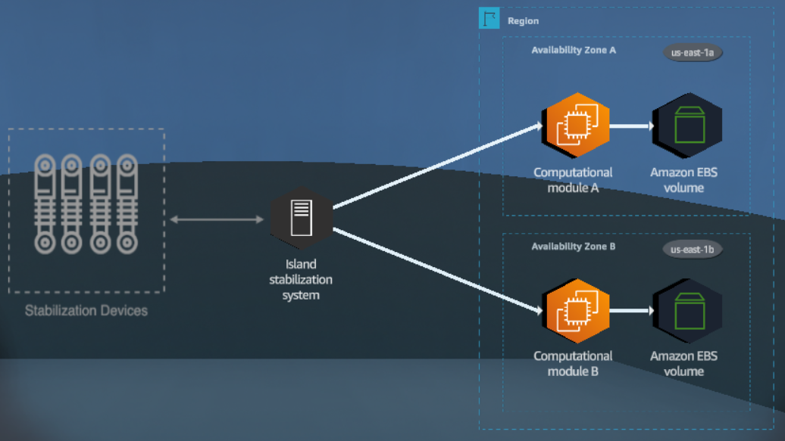
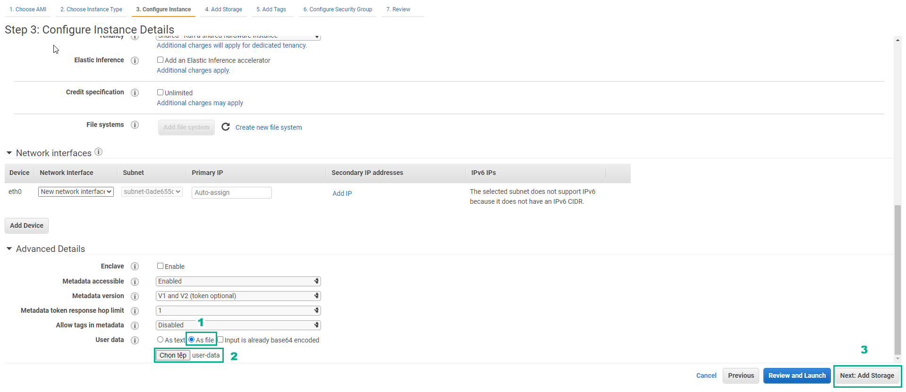
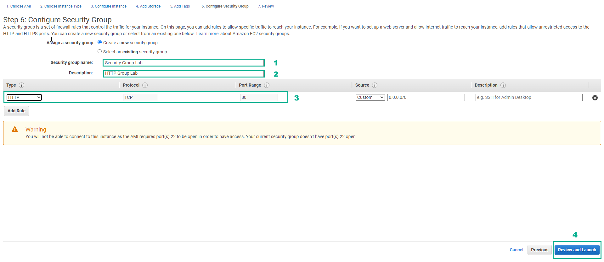
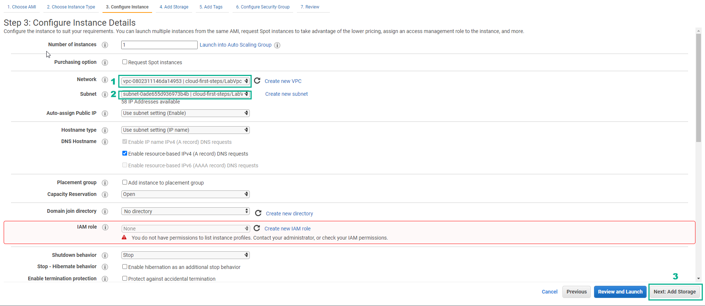
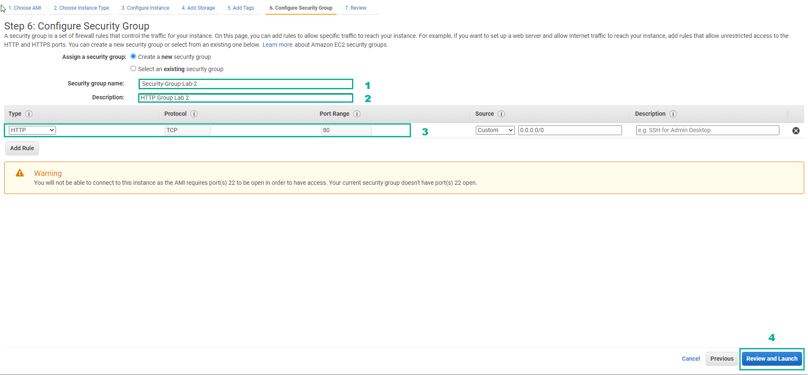

# Cloud First steps

## **Overview**

Launch two Amazon EC2 instances into separate AZs in the same region

## **Learn**

### 1. The island improves the reliability and availability of it's stabilization system by moving it's computational module to the AWS global infrastructure

### 2. The computational module can move to the cloud by using the compute capacity of Amazon EC2 instances

### 3. To improve availability, the computational module runs on Aamazon EC2 instances deployed in separate Availability Zones (AZs). Each AWS Region consists of two or more AZs with a 99.99% service-level agreement (SLA) commitment.

#### 4. Amazon Elastic Block Store (Amazon EBS) is an efficient, high-performance, block-storage service designed for use with Amazon EC2.

## **Practice**

### 1. Go to AWS Console page

- Find EC2 service and select
- Select EC2 Dashboard
- Select Launch instance
- Continue to select Launch instance
- Select Amazon Linux 2 AMI
- Choose an Instance Type, select t2.micro
- Select Next: Configure Instance Details

### 2. Go to AWS Console

- Select VPC
- Select Subnet

### 3. In the Configure Instance Details section

- In Advanced Details, select As file
- Select Select file, and load the file user-data
- Then, select Next: Add Storage

- Select Next: Add Tags
- Select Next: Configure Security Group

### 4. Create a security group

- Security group name, enter Security-Group-Lab
- Description, enter HTTP Group Lab
- Rule, select HTTP
- Select Review and Launch

- Double check and select Launch
- Select Proceed without a key pair
- Select I acknowledge…
- Select Launch Instances
- Select View Instance

### 5. Select the Amazon EC2 instance just created

- Find and copy Public(IPv4) DNS name
- Paste Public(IPv4) DNS name into the browser and Enter

Congratulations to the player on completing the lab

## **DIY**

### 1. In AWS Console, find and select EC2

### 2. Select Launch instance

### 3. In Choose an Amazon Machine Image (AMI)

- Select Amazon Linux 2 AMI (HVM) - Kernel 5.10, SSD Volume Type
- Select Select

### 4. In Choose an Instance Type

- Select t2.micro
- Then select Next: Configure Instance Details

### 5. In Configure Instance Details

- Select VPC
- Choose Subnet different from the subnet of Practice

### 6. In Advanced Details

- Select As file
- Select Select file and download the file user-data
- Select Next: Add Storage

### 7. In Add Storage, select Next: Add Tags

### 8. In Add Tags, select Next: Configure Security Group

### 9. In Configure Security Group, create a security group

- Security group name, enter Security-Group-Lab-2
- Description, enter HTTP Group Lab 2
- Rule, select HTTP
- Select Review and Launch

### 10. In Review Instance Launch, double check and select Launch

### 11. In Select an existing key pair or create a new key pair

- Select Proceed without a key pair
- Select I acknowledge…
- Select Launch Instances

### 12. Select View Instances

### 13. Result of creating 2 Amazon EC2 Instance
