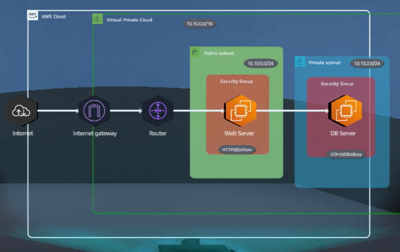
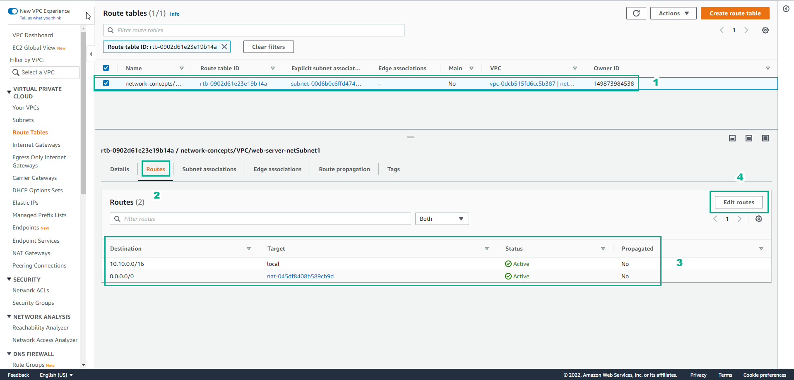
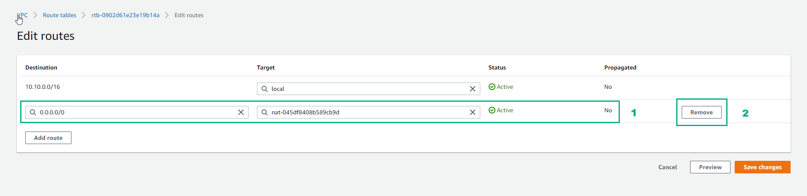
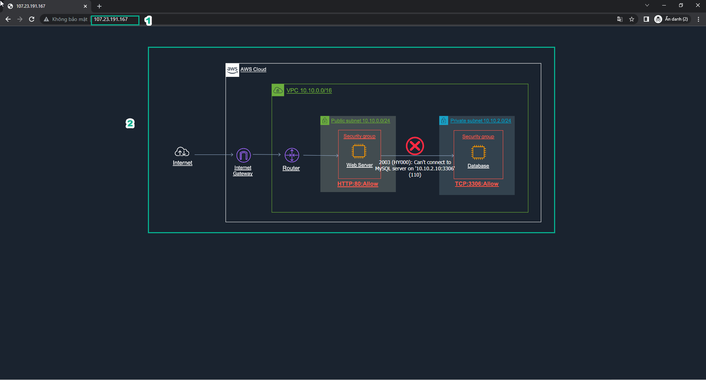
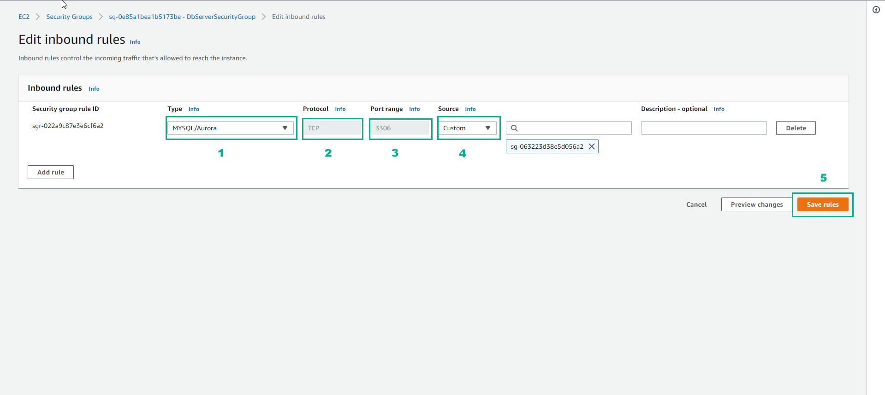
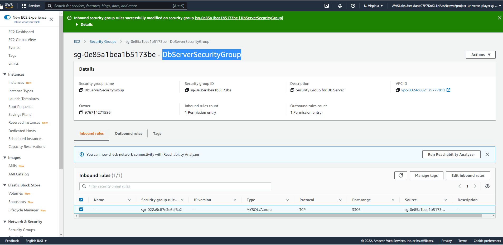

# Networking Concepts

Review and change VPC network configurations to fix a connect issue.

## **Overview**

### 1. This solution uses a common network architectural configuration that allows only internet traffic to reach publicly exposed AWS resources.

### 2. The Web Server and DB Server are deployed within a virtual private cloud (VPC), which is a logically isolated virtual network.

### 3. The Web Server is deployed inside a publicly exposed subnet and is assigned a public IP address to make it accessible from the internet.

### 4. The security group for the Web Server is configured to allow access through port 80, the default port for HTTP connections

### 5. A route table is configured within the VPC tha allows internet traffic, through an internet gateway, to the public subnet only.

### 6. The DB Server is protected and is only accessible from the subnet in which the Web Server resides.

### 7. The DB Server resides in a private subnet, which does not have a route table that allows access from the internet

## **Practice**

### 1. In the AWS Console interface

- Find and select EC2
- Select Instances
- Select Web Server instance
- Copy Public IPv4 address

### 2. Open the browser

- Paste Public Ipv4 address and browser
- View returned results

### 3. In the EC2 interface

- Select Web Server instance
- Select Networking
- In Networking details, see details Public IPv4 address and Private IPv4 addressses
- Select Web Server instance
- Select Networking
- Select Subnet ID

### 4. In the Subnet interface

- Select network-concepts
- Select Route table
- Choose the name Route table

### 5. In the Route tables interface

- Choose the name Route table
- Select Routes
- View details about Routes
- Select Edit routes

### 6. In the Edit routes interface

- View NAT gateway
- Select Remove

### 7. In the Edit routes interface

- Select Add route
- In Destination, enter 0.0.0.0/0
- In Target, select Internet Gateway
- Select igw-xxxxxxx(network-concepts/VPC)
- Select Save changes

### 8. In the Route Tables interface

- View details Route table
- Select Services

### 9. In the EC2 interface

- Select Web Server instance
- Select Security
- Select Security group

### 10. In the Security Groups interface

- Select Edit inbound rules

### 11. In the Edit inbound rules interface

- Select Add rule
- Type, select HTTP
- Source, select Anywhere-IPv4
- Select Save rules

### 12. In the EC2 interface

- Select Instances
- Select Web Server instance
- Select Networking
- Select and copy Public IPv4 address

### 13. Open a browser

- Paste Public Ipv4 address
- Results returned

Congratulations to the player on completing the lab

## **DIY**

### 1. In the AWS Console page, find and select EC2

### 2. Select Instances

- Select Security
- In Security groups, select DbServerSecurityGroup

### 3. In the Security Groups interface

- Select Edit inbound rules

### 4. In the Edit inbound rules interface

- Type: select MYSQL/Aurora
- Protocol: select TCP
- Prot range: enter 3306
- Source: choose Custom
- Then select Save rules

### 5. Interface after creating DbServerSecurityGroup

### 6. In the Security groups view, copy Security group name
