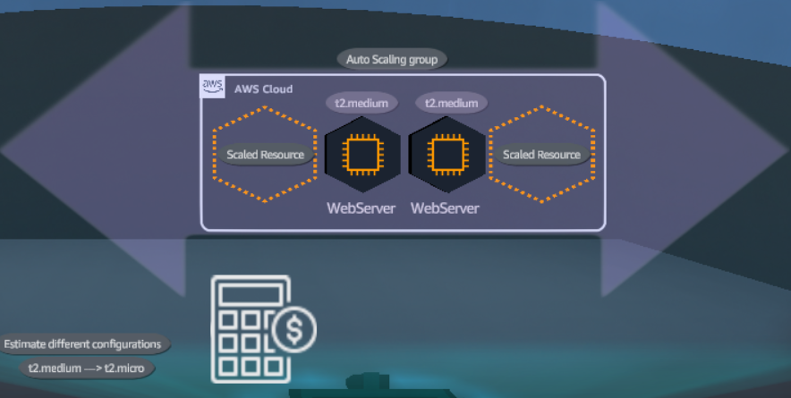
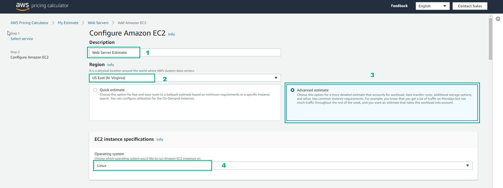
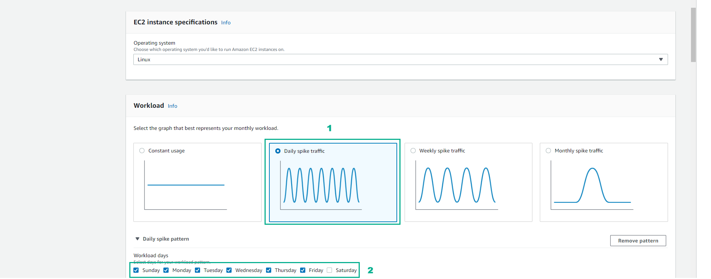
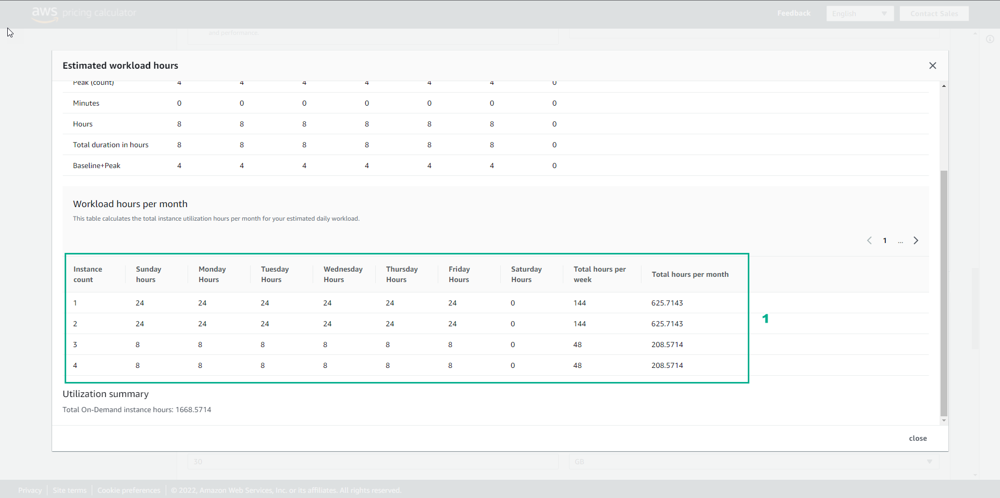

# Cloud Economics

## **Overview**

Configure a price estimate for an architecture that uses a variable amount of Amazon EC2 instances based on peak usage time.

## **Learn**

### 1. This solution uses the AWS Pricing Calculator to create estimates for your AWS use cases. You can model your solutions before building them, explore the AWS service price points, and review the calculations behind your estimates.

### 2. Using AWS, you can take control of costs and continuously optimize your spending so that you pay only for the resources you actually need.

### 3. Using a static number of resources as your demand fluctuates can overburden your servers when demand is high, which can result in underservered customers.

### 4. Cost inefficiencies occur when demand is low by spending money on unused computer capacity

### 5. With AWS your resources are elastic. Meaning you can provision the services thar you need on demand, and you pay for only what you use. This way, your infrastructure matches your demand.

### 6. Matching infrastructure to demand uses a concept called scaling

### 7. As demand increases, your services can scale out horizontally, thich means that you increase capacity by adding more resources (such as EC2 instances) to the system

### 8. As demand decreases, your systems can scale horizontally in the other direction, thich means the number of instances or other resources reserved for use will also decrease.

### 9. Using the AWS Pricing Calculator, you can generate an estimate with no commitment and explore AWS services and pricing for your architecture needs. You can use the service to help plan how you spend, find cost saving opportunities, and make informed decisions.

## **Practice**

### 1. Open the browser

- Access to [AWS Pricing Calculator](https://calculator.aws/#/)
- Select Create estimate
- Select My Estimate

### 2. In the My Estimate interface

- Select Add group

### 3. In the Add group interface

- In Group settings, Group name field enter Web Servers
- Then, select Add group

### 4. In the Web Server interface

- Select Add service

### 5. In the Add service interface

- Find EC2
- Select Configure

### 6. In the Configure Amazon EC2 interface

- In Description, enter Web Server Estimate
- Region, select US East (N. Virginia)
- Select Advanced estimate

### 7. In EC2 instance specifications

- Operating system, select Linux
- Workload, select Daily spike traffic
- Workload days, choose the days of the week

### 8. In Daily spike pattern

- Baseline, enter 2
- Peak, enter 4
- Duration of peak, enter 8 and 0-

### 9. In EC2 Instances

- Enter 2
- Select 4 GiB
- Chon5 Any Network Performance
- Select t2.medium

### 10. In Pricing strategy

- Select On-Demand
- Select Show calculations
- Select estimated workload hours

### 11. View Estimated workload hours

### 12. In Amazon Elastic Block Storage (EBS)

- Storage for each EC2 instance, select General Purpose SSD (gp2)
- Storage amount, enter 30
- Snapshot Frequency, select Weekly
- Amount changed per snapshot, select 1

### 13. In Data Transfer

- Select Internet (free), enter 1, select TB per month
- In Outbound Data Transfer, select Internet($0.05 - $0.09 per GB), enter 100, select GB per month
- Select Show calculations

### 14. Review and select Add to my estimate

### 15. Result interface Web Servers, select Share

### 16. In Save estimate

- Select Agree and continue

### 17. Select Copy public link

Congratulations to the player on completing the lab

## **DIY**

### 1. Go to the AWS Pricing Calculator

- Select Create estimate

### 2. In My Estimate

- Select Add group

### 3. In Add group

- Group name, enter Web Servers
- Select Add group

### 4. In the Web Servers interface

- Select Add service

### 5. In Add service

- Search EC2
- Select Configure

### 6. In Configure Amazon EC2

- Description, enter Web Server Estimate
- Region, select US East (N. Virginia)
- In EC2 instance specifications, select Linux

### 7. In the Workload interface

- Select Daily spike traffic
- Daily spike pattern, Workload days section, choose the days of the week
- Baseline, enter 2
- Peak, enter 4
- Duration of peak, enter 8 and 0

### 8. In EC2 Instances

- Select t2.micro

### 9. In Pricing strategy

- Pricing model, select On-demand
- Select Show calculations
- Select estimate workload hours

### 10. In Amazon Elastic Block Storage (EBS)

- Storage for each EC2 instance, select General Purpose SSD (gp2)
- Storage amount, enter 30
- Snapshot Frequency, enter Weekly
- Amount changed per snapshot, enter 1

### 11. View results Estimated workload hours

### 12. In Data Transfer

- Inbound Data Transfer, select Internet (free)
- Select 1
- Select TB per month
- Outbound Data Transfer, select Internet ($0.05 - $0.09 per GB)
- Select 100
- Select TB per month

### 13. Select Show calculations

- View and select Add to my estimate

### 14. In the Web Servers interface

- Select Share

### 15. In the Save estimate interface

- Select Copy public link
- After Copy public link

Congratulations to the player receiving the reward
