# Connecting VPC

Allow communication between applications hosted in different VPCs by using VPC peering. The Marketing and Developer EC2 instances need to access the Financial Services Server in the Financ department's VPC.

## **Overview**

### 1. This solution uses a separate virtual private cloud (VPC) for each department: Marketing, Finance, Developer. The VPCs are connected by using VPC peering so that the resources in each can communicate with one another.

### 2. The Finance VPC is central, containing resources that are shared with the Marketing and Developer VPCs.

### 3. Because VPCs are isolated by default, two VPC peering connections are created, one connection between the Marketing and Finance VPCs and the other connection between the Developer and Finance VPCs.

### 4. A VPC peering connection is a networking connection between two VPCs that you can use to route traffic between them by using private IPv4 or IPv6 addresses.

### 5. The route tables, for each VPC, point to the relevant VPC peering connection to access the entire CIDR block of a peered VPC.

### 6. To access the Finance VPC, the Marketing VPC route table pointss to the VPC peering connection.

### 7. Likewise, to access the Finance VPC, the Developer VPC route table points to the VPC peering connection

### 8. A VPC peering connection does not exist between the Marketing and Developer VPCs. These two VPCs do not share access.

### 9. The Marketing and Developers VPC's cannot send traffic to each other through the Finance VPC. VPC peering does not support transitive peering relationships or edge to edge routing

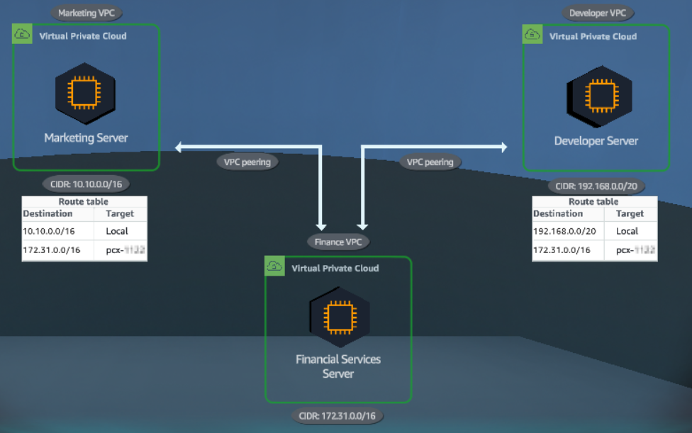

## **Overview**

### 1. In the AWS Console interface

- #Find VPC
- Select VPC

### 2. Interface VPCs

- Select Your VPCs
- View VPCs: Marketing, Finance and Developer

### 3. In the AWS Console interface

- Find EC2
- Select EC2

### 4. In the EC2 interface

- Select Instances (running)
- Select Financial Services Server
- Select Details to see details Financial Services Server
- View Subnet ID of FinancePrivateSubnet
- Select Marketing Server
- View VPC ID
- Select Connect

### 5. In the Connect to instance interface

- Select EC2 instance Connect
- Select Connect

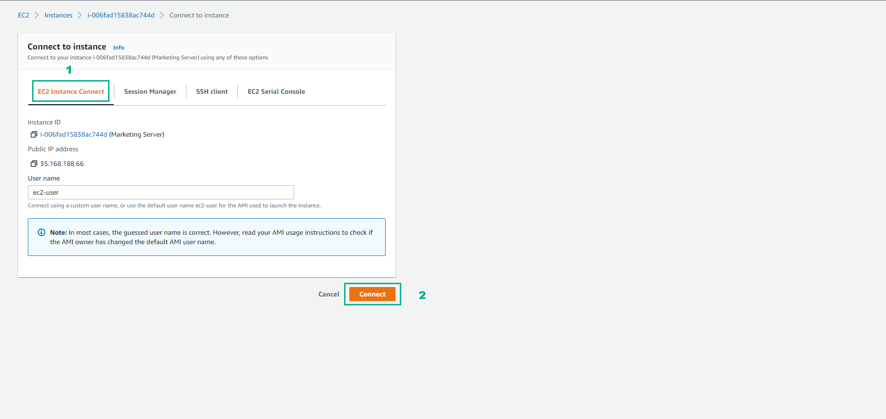

### 6. In the Amazon Linux 2 AMI interface

- Enter ping 172.31.0.10
- View results

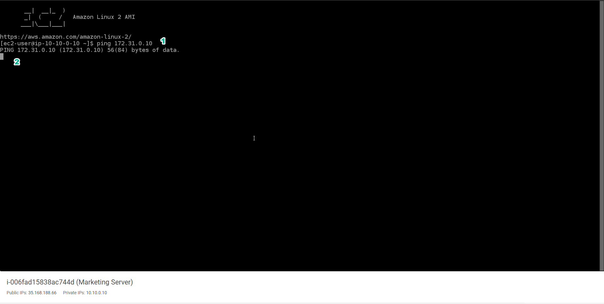

### 7. In the VPC interface

- Select Marketing Server
- Select Details to see details
- View and select Subnet ID
- Select MarketingPublicSubnetSubnet1
- Select Route table named MarketingPublicSubnetSubnet1

### 8. In the Route table interface

- Select Routes
- View the routing rules

### 9. In the VPC interface

- Select Peering Connections
- Select Create peering connection

### 10. In the Create peering connection interface

- In Peering connection settings, Name, enter Marketing <> Finance
- Select VPC ID
- Account, select My account
- Region, select This Region (us-east-1)
- Select VPC ID (Accepter)

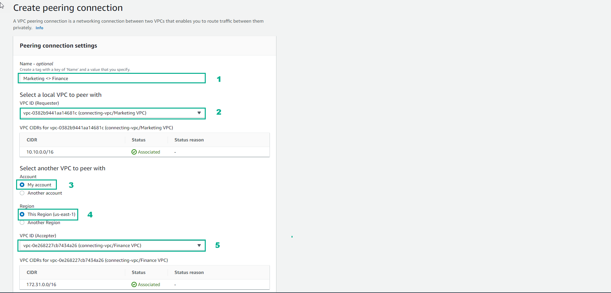

### 11. In the VPC interface

- Select Create peering connection

### 12. Results after creating Peering connections

- Select Actions, select Accept request

### 13. In the VPC interface

- In Accept VPC peering connection request, select Accept request
- Select Route Tables
- Select the route table named MarketingPublicSubnet1
- Select Routes
- Select Edit routes

### 14. In the Edit routes interface

- Select Add route
- In Destination, enter 172.31.0.0/16
- In Target, select Marketing <> Finance
- Select Save changes

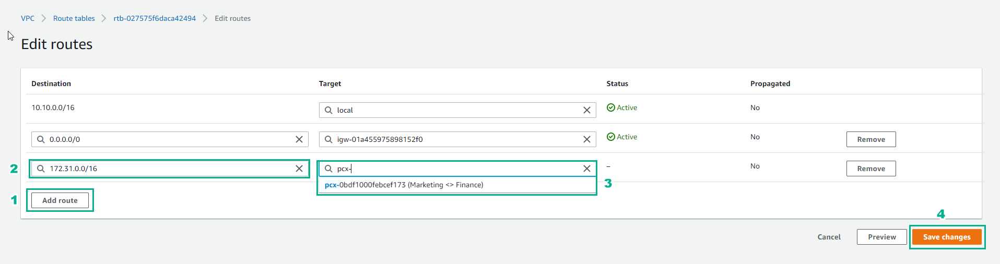

### 15. In the VPC interface

- Select Route Tables
- Select the route table named FinancePrivateSubnet1 (private subnet)
- Select Routes
- Select Edit routes

### 16. In the Edit routes interface

- Select Add route
- In Destination, enter 10.10.0.0/16
- Select peering connection name Marketing <> Finance
- Select Save changes

### 17. In the EC2 interface

- Select Marketing Server
- Select Connect

### 18. ​​In the Connect to instance interface

- Select EC2 instance Connect
- Select Connect

### 19. In the Marketing Server interface

- Enter ping 172.31.0.10
- View results

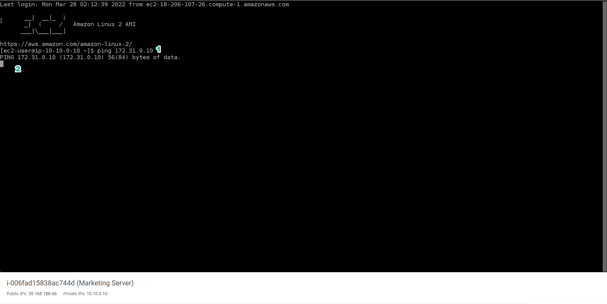

### 20. In the EC2 interface

- Select Financial Services Server
- Select Security
- Select the security group named FinanceServerSecurityGroup

### 21. In the VPC interface

- Select Inbound rules
- See inbound rules
- Select Edit inbound rules

### 22. In the Edit inbound rules interface

- Select Add rule
- Select All ICMP-IPv4
- In Source, enter 10.10.0.0/16
- Select Save rules

### 23. Results after Edit inbound rules

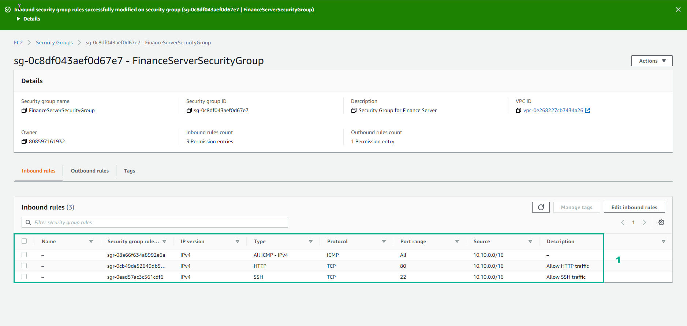

### 24. In the EC2 interface

- Connect Marketing Server using EC2 Connect
- In the CLI interface, enter ping 172.31.0.10
- View connection results of Marketing Server and - Finacial Services Server
  Use Ctrl + C

Congratulations to the player on completing the lab

## **DIY**

### 1. In the AWS Console interface

- Find VPC
- Select VPC
- Select Your VPCs
- View the VPC
- Find EC2
- Select EC2

### 2. In the EC2 interface

- Select Instances
- Select Developer Server
- Select Details
- View VPC ID
- Select Connect

### 3. In the Connect to instance interface

- Select EC2 instance Connect
- Select Connect

### 4. In CLI interface

- Enter ping 172.31.0.10
- View results

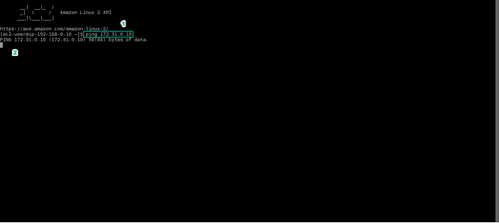

### 5. In the EC2 interface

- Select Developer Server
- Select Subnet ID

### 6. In the Subnet interface

- Select DeveloperPublicSubnet1
- Select Route table

### 7. In the Route tables interface

- Select DeveloperPublicSubnet1
- Select Routes
- View the route rules

### 8. In the VPC interface

- Select Peering Connections
- Select Create peering connection

### 9. In the Peering connection settings interface

- Name, enter Developer <> Finance
- Select VPC ID
- Account, select My account
- Region, select This Region (us-east-1)

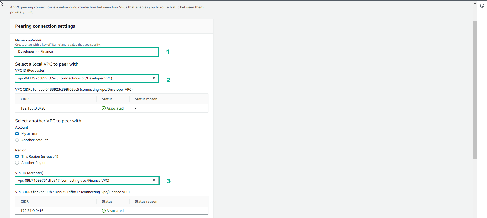

- Select Create peering connection

### 10. Initialization result

### 11. In the VPC interface

- Select Peering Connections
- Select Developer <> Finance
- View Status
- Select Actions
- Select Accept request

### 12. In the Accept VPC peering connection request interface

- Select Accept request

### 13. Result

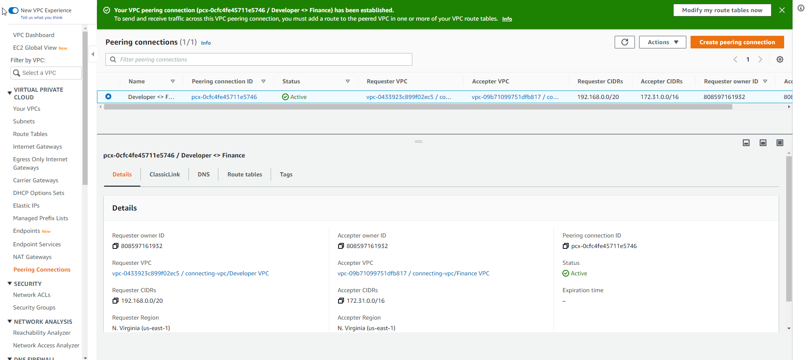

### 14. In the VPC interface

- Select Route Tables
- Select DeveloperPublicSubnet1
- Select Routes
- View the route rules
- Select Edit routes

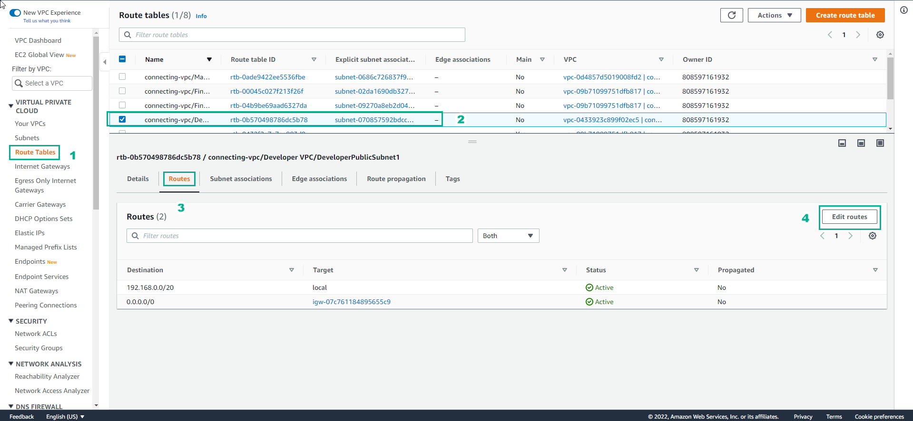

### 15. In the Edit routes interface

- Select Add route
- In Destination, enter 172.31.0.0/16
- Select Target, select Developer <> Finance
- Select Save changes

### 16. Results after initialization

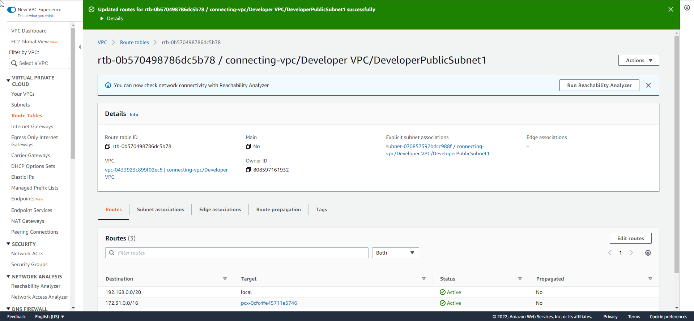

### 17. In the VPC interface

- Select Route Tables
- Select FinancePrivatesSubnet1
- Select Routes
- View the route rules
- Select Edit routes

### 18. In the Edit routes interface

- Select Add route
- In Destination, enter 192.168.0.10/32
- Select Target, select Developer <> Finance
- Select Save changes

### 19. Results after initialization

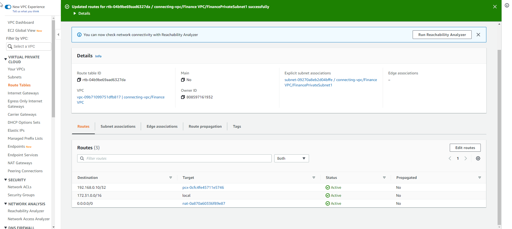

### 20. In the EC2 interface

- Select Instances
- Select Developer Server
- Select Connect

### 21. In the Connect to instance interface

- Select EC2 instance Connect
- Select Connect

### 22. In CLI interface

- Enter ping 172.31.0.10
- View results

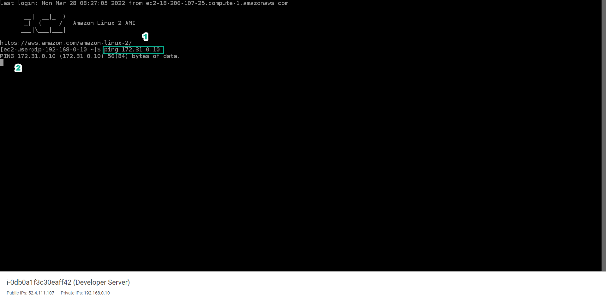

### 23. In the EC2 interface

- Select Instances
- Select Finacial Services Server
- Select Security
- Select Security groups

### 24. Select FinanceServerSecurityGroup

- Select Inbound rules
- View inbound rule
- Select Edit inbound rules

### 25. Select Edit inbound rules

- Select Add rule
- Select All ICMP-IPv4
- Select Custom
- Select 192.168.10.32
- Select Save rules

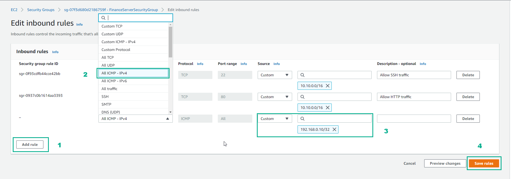

### 26. View Result

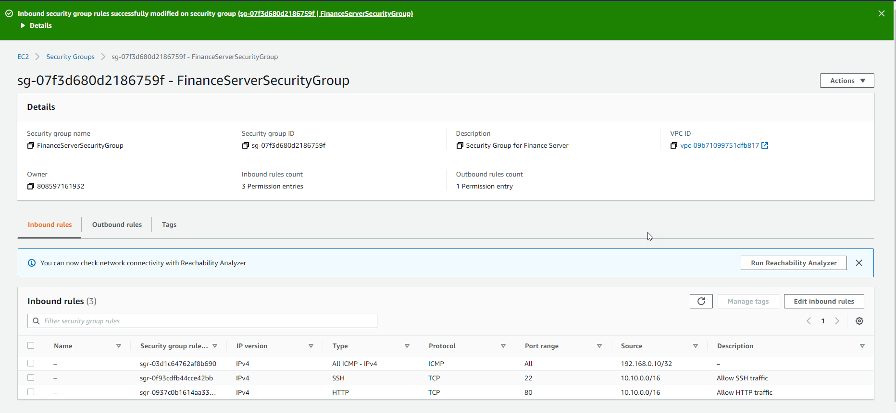

### 27. In CLI interface

- Enter ping 172.31.0.10
- View results

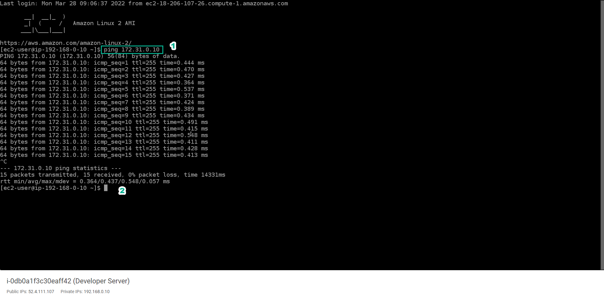

### 28. In the EC2 interface

- Select Instances
- Select The Developer Server
- Select Details
- Copy Instance ID

### 29. In the EC2 interface

- Select Instances
- Select Financial Services Server
- Select Details
- Copy Instance ID

Congratulations on completing the lab.
