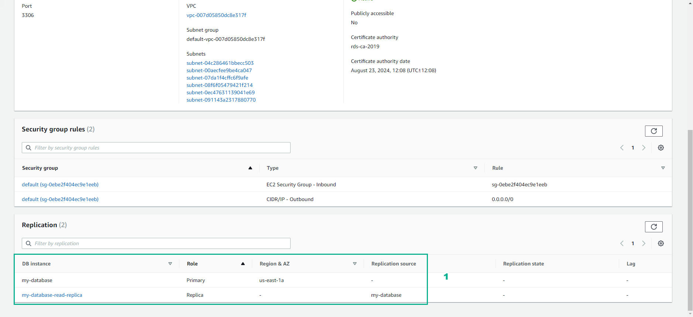

# Databases in Practice

Improve the operational efficiency availability, and performance efficiency of databases by using multiple Availability Zones and a read replica.

## **Overview**

### 1. The solution uses Amazon Relational Database Service (Amazon RDS), which is fully managed and removes the need for manual database infrastructure provisioning and maintenance.

### 2. Amazon RDS automates backups, database snapshots, and host replacement to reduce the administrative burden.

### 3. To achive high availability, deploy your database across multiple AZs. In a Multi-AZ deployment, Amazon RDS automatically creates a primary DB instance and synchronously replicates the data to and instance in a different AZ.

### 4. When it detects a failure, Amazon RDS automatically fails over to a standby instance in a different AZ, without manual intervention

### 5. Because the name record for your DB instance remains the same, your application can resume database operation without the need for manual administrative intervention.

### 6. For read-heavy database workloads, you can create one or more read-only replicas of a DB instance. This way, you can serve high-volume application read traffic from multiple copies of your data, increasing aggregate read throughput.

### 1. In the AWS Console interface

- Find RDS
- Select RDS

### 2. In the RDS interface

- Select Databases
- Select Create database
- In Choose a database creation method, select Standard create
- In Engine options, select MariaDB
- Version, select MariaDB 10.4.13
- Templates, select Dev/Test

### 3. In the RDS interface

- DB instance identifier, enter my-database
- Master username, enter admin
- Master password, enter 123456789admin
- Confirm password, enter 123456789admin

- In DB instance class, select Burstable classes (includes t classes)
- Select db.t3.large
- In Storage type, select General Purpose SSD (gp2)
- In Allocated storage, enter 20

- In Storage autoscaling, select Enable storage autoscaling
- In Maximum storage threshold, enter 1000
- In Multi-AZ deployment, select Create a standby instance (recommended production usage)

### 4. In the Connectivity interface

- Choose the default VPC
- Select the default Subnet group
- In Public access, select No
- In VPC security group, select Choose existing
- In Existing VPC security groups, select default

### 5. In the Additional configuration interface

- In Initial database name, enter my_database
- In DB parameter group, select default:mariadb-10-4
- In Option group, select default:mariadb-10-4
- In Backup, select Enable automated backups
- In Backup window, select No preference
- Select Copy tags to snapshots

### 6. In the RDS interface

- In Encrytion, select Enable encrytion
- In Performance Insights, uncheck Enable Performance Insights
- In Monitoring, uncheck Enable Enhanced monitoring

### 7. In the Create database interface

- In Maintenance, uncheck Enable auto minor version upgrade
- In Maintenance window, select No preference
- View Estimated monthly costs
- Select Create database

Congratulations to the player on completing the lab

## **DIY**

### 1. In the AWS Console interface

- Find RDS
- Select RDS

### 2. In the Amazon RDS interface

- Select Databases

### 3. In the Databases interface

- Select my-database
- Select Actions
- Select Create read replica

### 4. In the Create read replica DB instance interface

- In DB instance class, select db.t3.xlarge-4 vCPU
- In Multi-AZ deployment, select Yes
- In Storage type, select General Purpose (SSD)

### 5. In the Network & Security interface

- In Destination region, select US East (N. Virginia)
- In Destination DB subnet group, select default-vpc
- In Publicly accessible, select No
- In VPC security groups, select default

### 6. In the RDS interface

- In Read replica source, enter my-database
- In DB instance identifier, enter my-database-read-replica
- In Database options interface, in Database port, enter 3306
- Select Copy tags to snapshots

- In Monitoring, uncheck Disable enhanced monitoring
- In Performance Insights, uncheck Disable Performance Insights

- In Maintenance, select No
- Select Create read replica

### 7. View initialization results

Congratulations to the player on completing the lab
