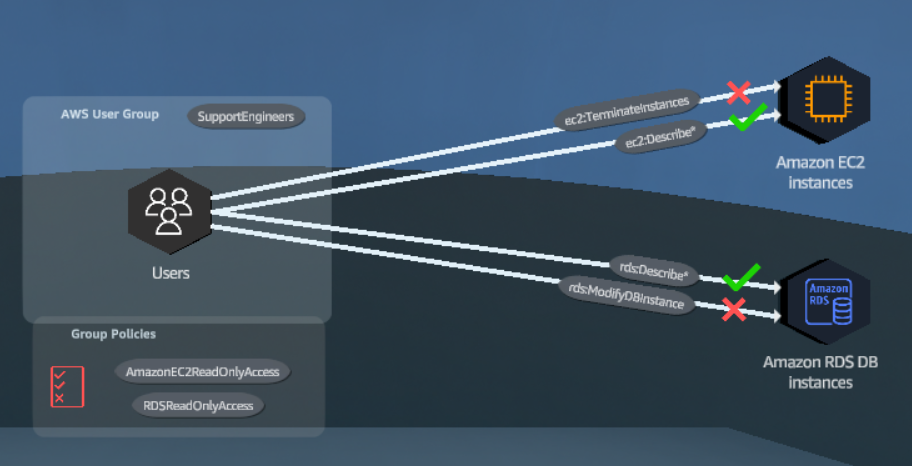
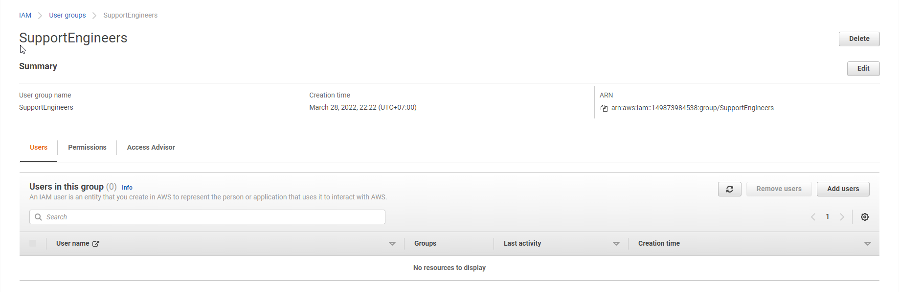
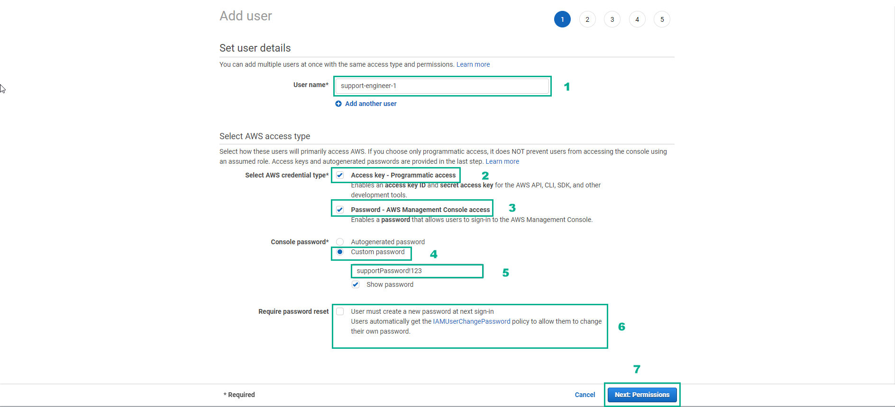
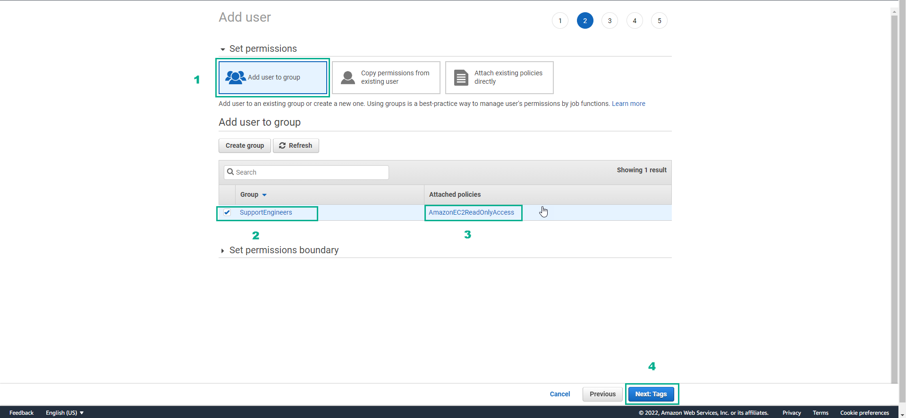
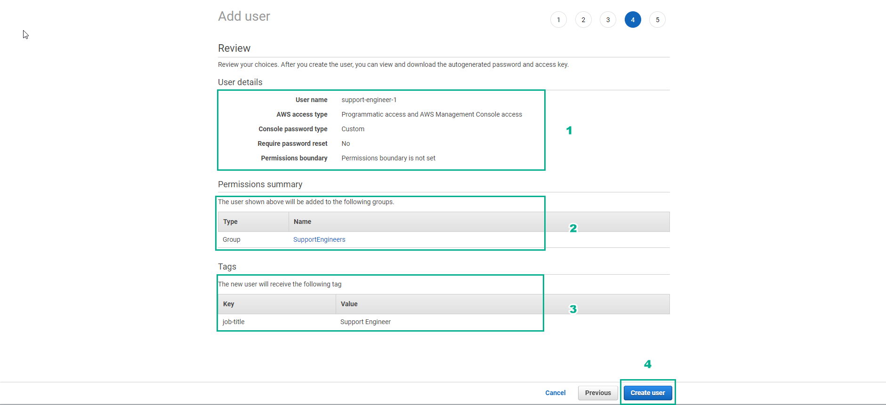
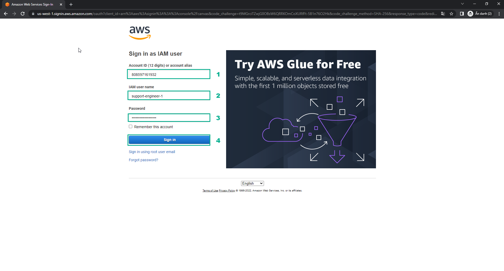
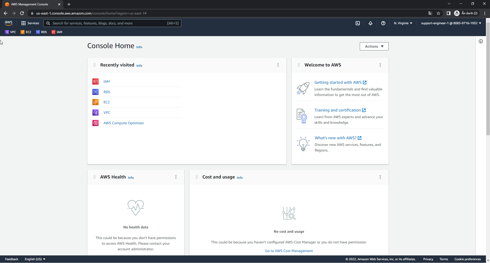
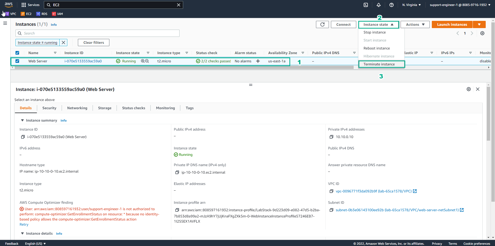
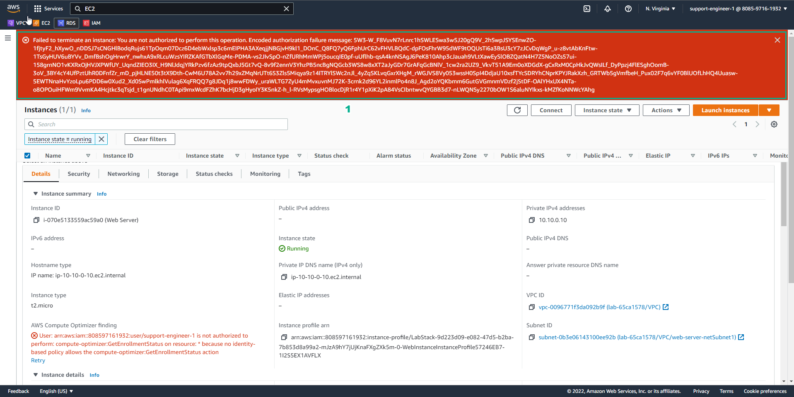
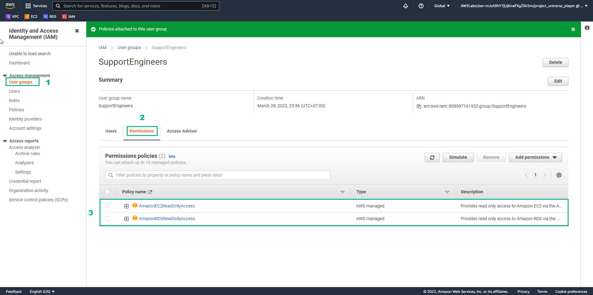

# Core Security Concepts

Use IAM to provide work permissons to engirees by using group settings and the least privilege principle

## **Overview**

### 1. This solution uses AWS Identity and Access Management (IAM) to create a SupportEngineers group with limited permissions

### 2. First, an IAM user group is created

### 3. A read-only access policy for the Amazon EC2 service is attached to the SupportEngineers group

### 4. IAM users are created and added to the SupportEngineers user group

### 5. All users that belong to the SupportEngineers group will inherit the permissions set the policies that are attached to the group

### 6. Multiple policies can be attached to the same user group to further refine permissions

## **Practice**

### 1. In the AWS Console interface

- Find IAM
- Select IAM

### 2. In the IAM interface

- Select Use groups
- Select Create group

### 3. In the Create user group interface

- In User group name, enter SupportEngineers

### 4. In the IAM interface

- Find AmazonEC2ReadOnlyAccess
- Select Enter
- Select AmazonEC2ReadOnlyAccess
- Select Create group

### 5. Initialization result

### 6. In the IAM interface

- Select Users
- Select Add users

### 7. In the Add user interface

- In User name, enter support-engineer-1
- In Select AWS credential type, select Access key - Programmatic access
- Select Password - AWS Management Console access
- Select Custom password, enter supportPassword!123
- Uncheck Require password reset

### 8. In the IAM interface

- Select Add user to group
- Select SupportEngineers
- View Attached policies
- Select Next Tags

### 9. In the Add user interface

- Key, enter job-title
- Value, enter Support Engineer
- Select Next: Review
- View User details
- View Permissions summary
- View Tags
- Select Create user

- See successful user initialization
- Choose the login path
- Select Close

### 10. In the login interface

- Enter Account ID
- Enter IAM user name
- Enter Password
- Select Sign in

### 11. Successful login interface

### 12. In the AWS Console interface

- Find EC2
- Select EC2
- Select Region N. Virginia

### 13. In the EC2 interface

- Select Instances (running)
- Select Web Server
- Select Instance state
- Select Terminate instance

- In Terminate instance, select Terminate

### 14. Lab results

Congratulations to the player on completing the lab

## **DIY**

### 1. In the AWS Console interface

- Find IAM
- Select IAM

### 2. In the IAM interface

- Select User groups
- Select Permissions
- Find AmazonEC2ReadOnlyAccess
- Select AmazonEC2ReadOnlyAccess
- Select Add permissions
- In Add permissions, select Attach policies
- Find RDSReadOnlyAccess
- Select AmazonRDSReadOnlyAccess
- Select Add permissions
- Select User groups
- Select Permissions
- View the Policy name

Congratulations to the award winning player
