# FIle Systems In the Cloud

## **Overview**

Deploy and maintain a file system infrastructure which is accessible from three different servers

## **Learn**

### 1. This solution uses three web servers distributed across separate AZ. The web servers need to share the same unstructured data. The data consists of PHP files, config files, plugins, and images.

### 2. Amazon Elastic File System (Amazon EFS) is used here as a shared file system. Amazon EFS can be used to share file data without provisioning or managing servers.

### 3. Amazon EFS automatically grows and shrinks as files are added and removed, so capacity doesn't need to be managed.

### 4. Servers access shared data in Amazon EFS by using mount targets in each AZ

### 5. Applications on each server view each mounted file system as a local path, similar to "/mnt/efs"

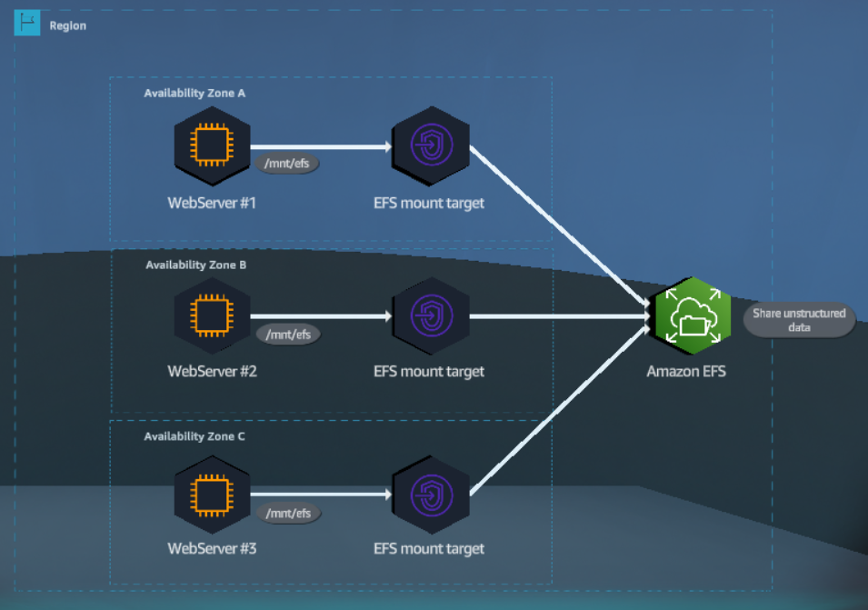

## **Practice**

### 1. In the AWS Console interface

- Find EC2
- Select EC2

### 2. In the EC2 interface

- Select Instances
- View instances
- View the Availability Zone
- Select Security Groups

### 3. In the Security Groups interface

- View Web Server Security Group
- Select Create security group

### 4. In the Create security group interface

- Security group name, enter PetModels-EFS-1-SG
- Description, enter Restrict access to webservers only
- Select VPC PetModels
- Select Add rule

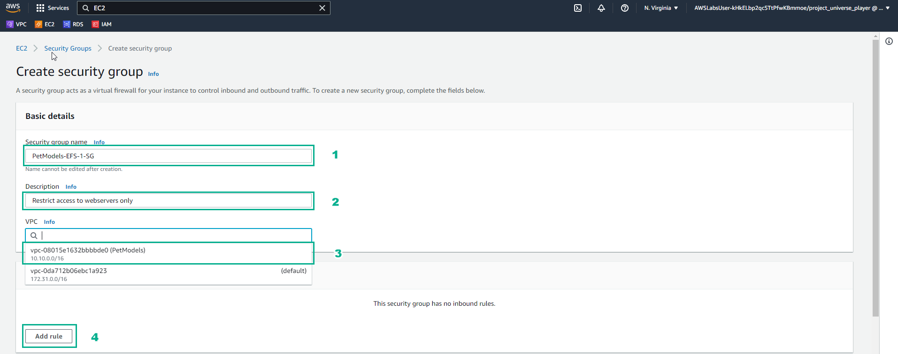

### 5. In the Create security group interface

- In Inbound rules, select NFS
- Select Security group, select webserver

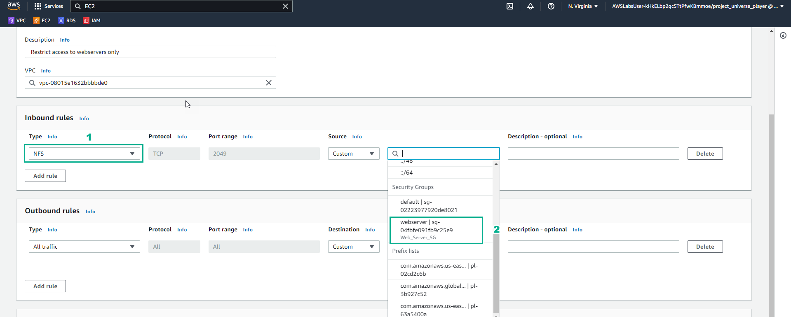

- Select Create security group
- View Security group name just created

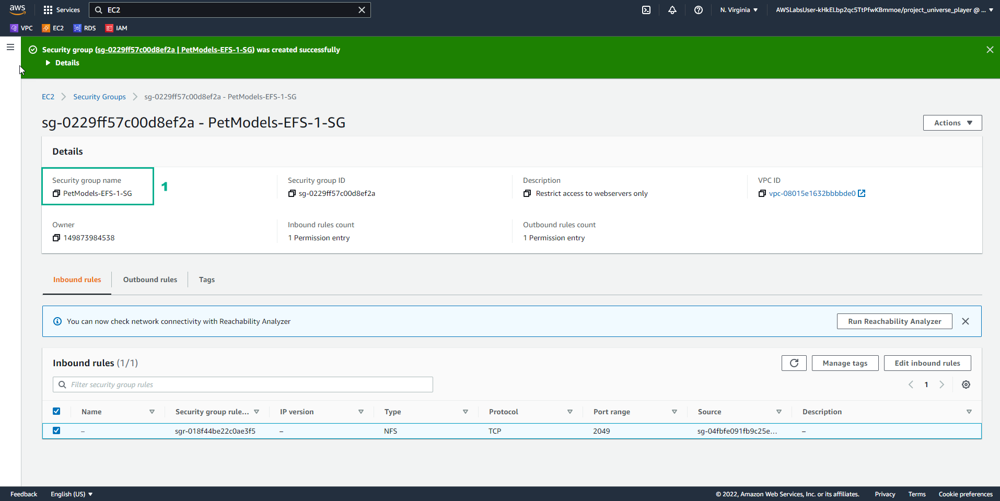

### 6. In the AWS Console interface

- Find EFS
- Select EFS

### 7. In the EFS interface

- Select Create file system

### 8. In the Create file system interface

- In Name your file system, enter PetModels-EFS-1
- In VPC, select VPC PetModels
- In Availability and durability, select Regional
- Select Customize

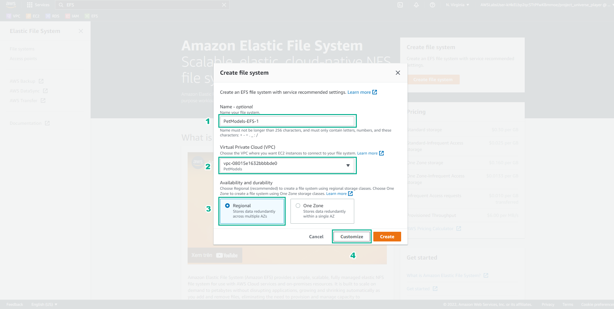

### 9. In the EFS interface

- In Automatic backups, uncheck Enable automatic backups
- In Transition into IA, select None

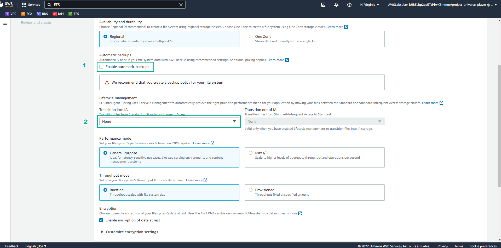

- Select Next

### 10. In the Network Access interface

- Remove security of AZ us-east-1a
- Select Remove remaining 2 AZs
- Select Next

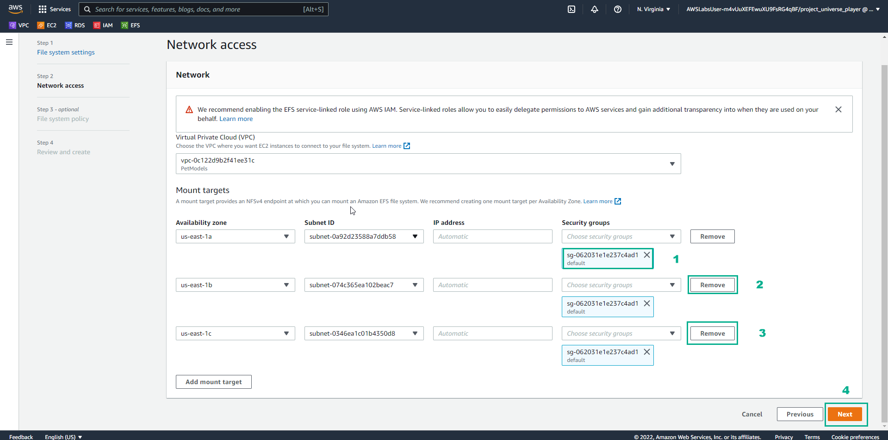

- In Security group, select PetModels-EFS-1-SG
- Select Next

### 11. In the File system policy interface

- Select Next

### 12. In the Create file system interface

- Select Create

### 13. In the EFS interface

- View successfully created file system
- Select File system created

### 14. In the file systems interface

- Select Attach

### 15. In the Attach interface

- In Using the EFS mount helper, copy the command line
- Select Close

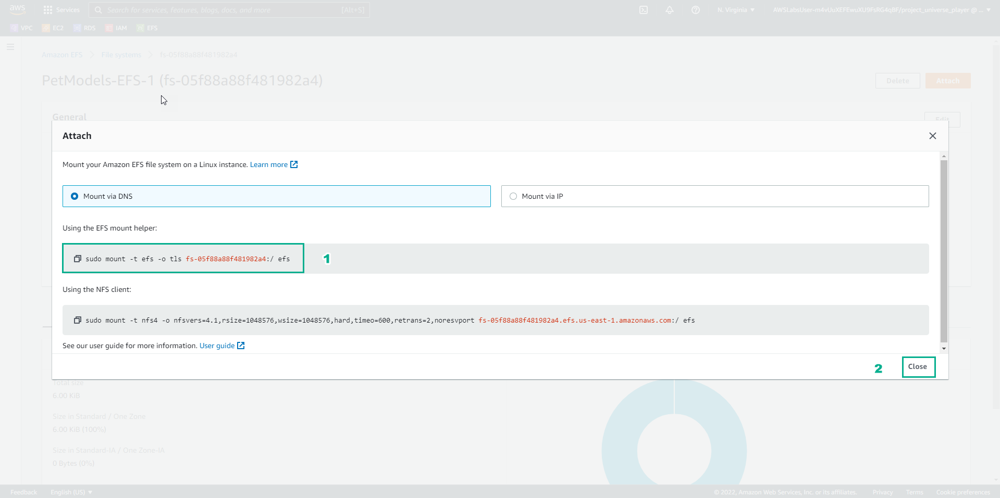

### 16. In the AWS Console interface

- Find EC2
- Select EC2

### 17. In the EC2 interface

- Select Instances

### 18. In the Instances interface

- Select PetModels-A instance
- Select Connect

### 19. In the Connect to instance interface

- Select EC2 Instance Connect
- Select Connect

### 20. In the PetModels-A interface

- Type sudo yum install -y amazon-efs-utils
- Then press Enter

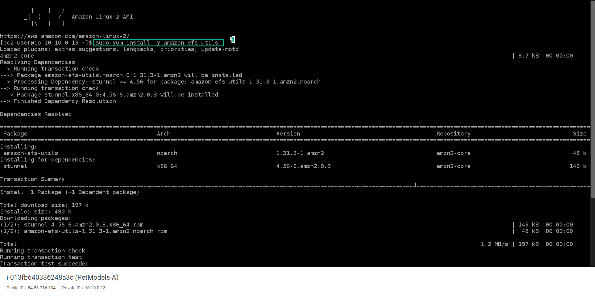

- Enter mkdir data
- Enter ls
- Enter Using the EFS mount helper copied in step 41, and change efs to data
- Enter cd data
- Type ```sudo bash -c “cat » efs-l-setup.log”
- Type efs-l mount in site A
- Use Ctrl + C

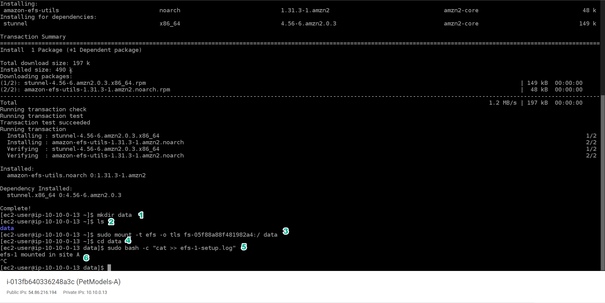

### 21. In the AWS Console interface

- Find EFS
- Select EFS

### 22. In the EFS interface

- Select Network
- Select Manage

### 23. In the Network access interface

- Select Add mount target
- After selecting Add mount target, select us-east-1b and select subnet

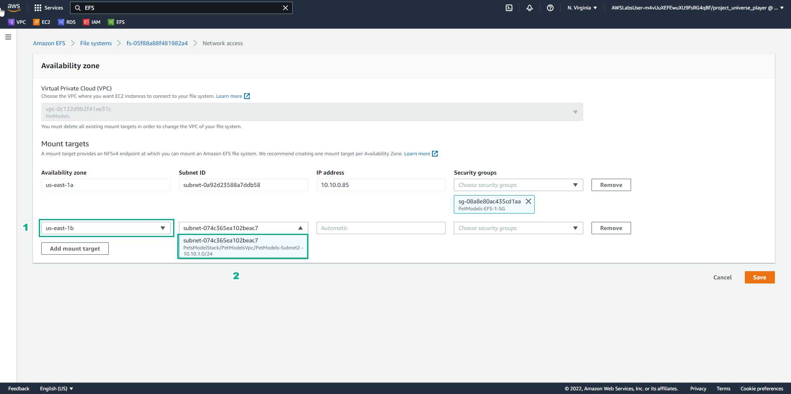

- Select Save

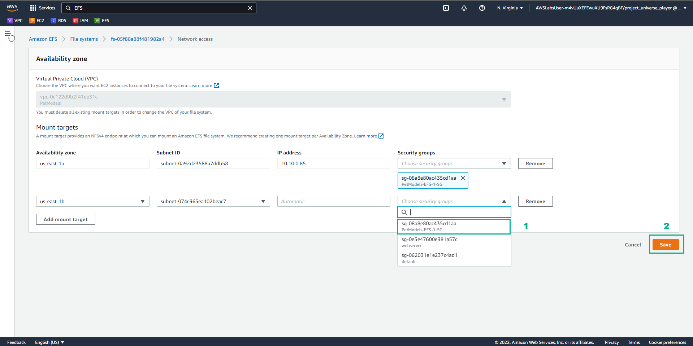

### 24. In the EFS interface

- View Mount target state
- Then select refresh

### 25. In the AWS Console interface

- Find EC2
- Select EC2

### 27. In the EC2 interface

- Select Instances

### 28. In the Instances interface

- Select PetModels-B

### 29. In the Connect to instance interface

- Select EC2 Instance Connect
- Select Connect

### 30. In the PetModels-B interface

- Type sudo yum install -y amazon-efs-utils

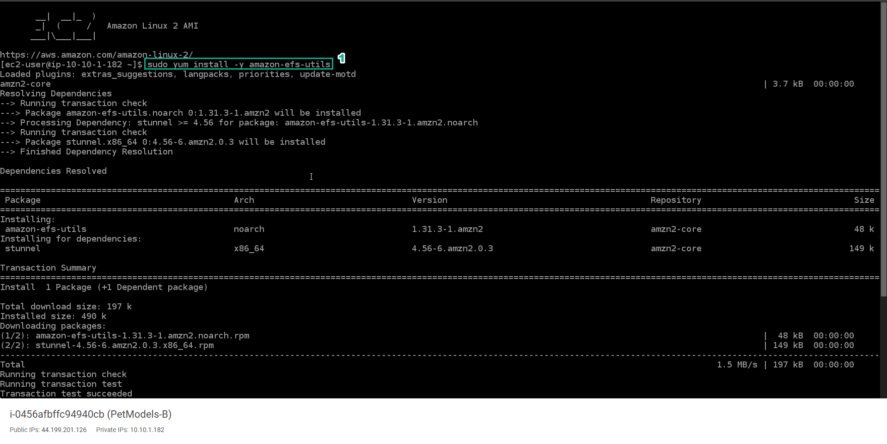

- Enter mkdir data
- Enter ls
- Enter the command line of Using the EFS mount helper copied in step 41, then change efs to data
- Enter cd data
- Type cat efs-l-setup.log
- Type sudo bash -c "cat >> efs-l-setup.log"
- Enter efs-1-mounted in site B
- Use Ctrl + C
- Type cat efs-l-setup.log
- View results

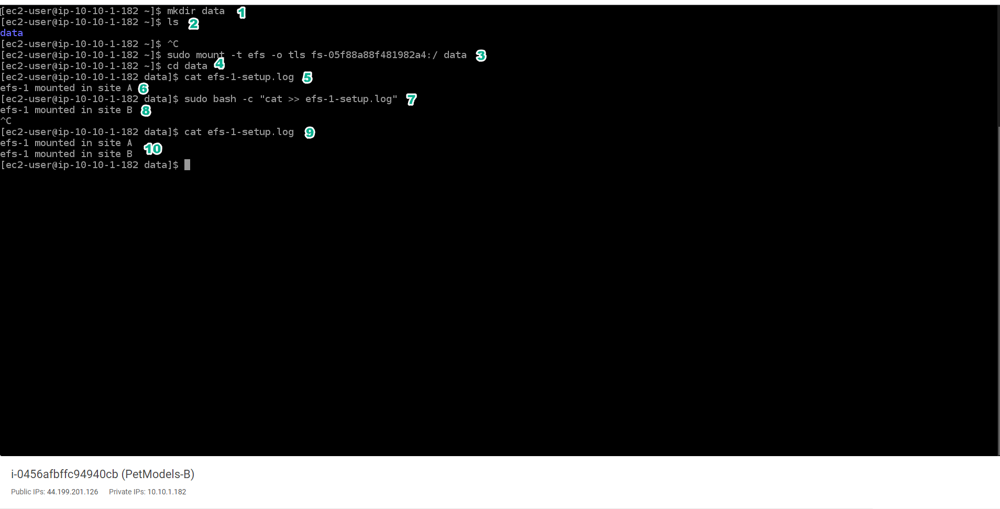

Congratulations to the player on completing the lab

## **DIY**

### 1. In the AWS Console interface

- Find EC2
- Select EC2

### 2. In the EC2 interface

- Select Instances
- View the instance
- Select Security Groups
- View Security Groups
- Select Create security group

### 3. In the Create security group interface

- Security group name, enter PetModels-EFS-1-SG
- Description, enter Restric access to webservers only
- Select PetModels VPC
- Select Add rule
- In Inbound rules, select NFS
- Select webserver Security group
- Select Create security group

### 4. In the Security groups interface

- View Security group name
- View the Inbound rules

### 5. In the AWS Console interface

- Find EFS
- Select EFS

### 6. In the EFS interface

- Select Create file system

### 7. In the Create file system interface

- Name, enter PetModels-EFS-1
- VPC, select PetModels
- Select Regional
- Select Customize

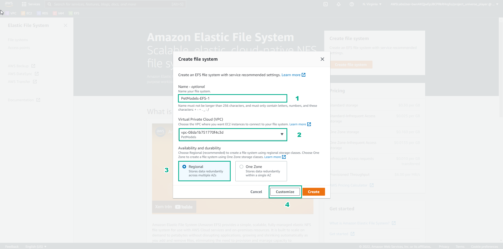

### 8. In the File Systems interface

- In Automatic backups, uncheck Enable automatic backups
- In Transition into A, select None

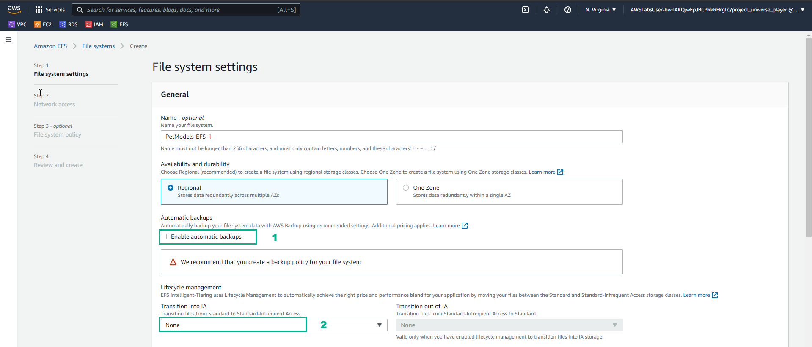

- Select Next

### 9. In the Network access interface

- Uncheck security group of us-east-1a
- Select Remove the remaining AZs

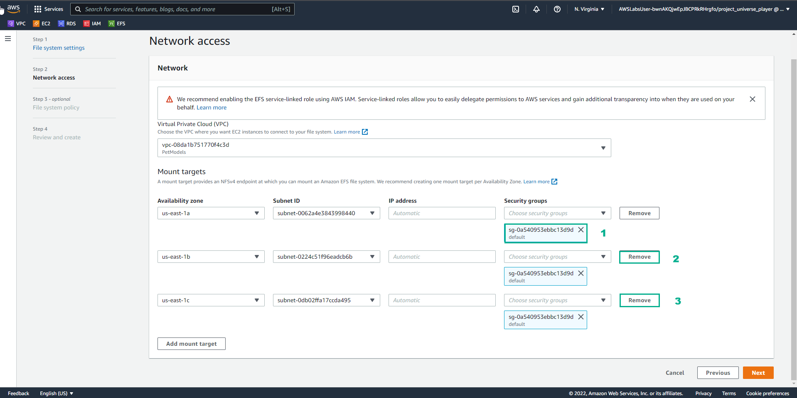

### 10. In the Network access interface

- Select us-east-1a
- Select Subnet ID
- Select Security group
- Select Next

### 11. In the File system policy interface

- Select Next

### 12. In the Create file system interface

- Select Create

### 13. In the File System interface

- See the successful file system initialization
- Select PetModels-EFS-1

### 14. In the PetModels-EFS-1 interface

- Select Attach

### 15. In the Attach interface

- Copy EFS mount helper
- Select Close

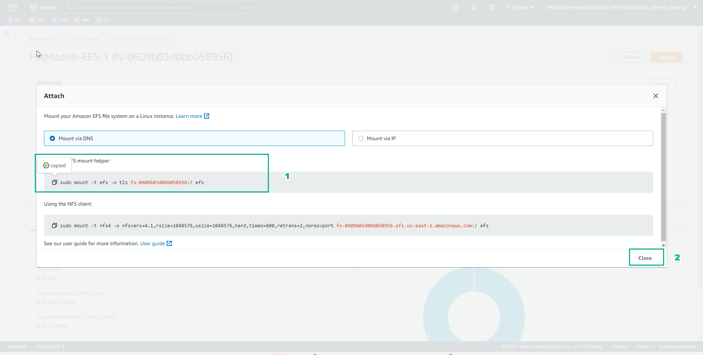

### 16. In the AWS Console interface

- Find EC2
- Select EC2

### 17. In the EC2 interface

- Select Instances
- View instances

### 18. In the Instances interface

- Select PetModels-A
- Select Connect

### 19. In the Connect to instance interface

- Select EC2 Instance Connect
- Select Connect

### 20. In the PetModels-A interface

- Type sudo yum install -y amazon-efs-utils

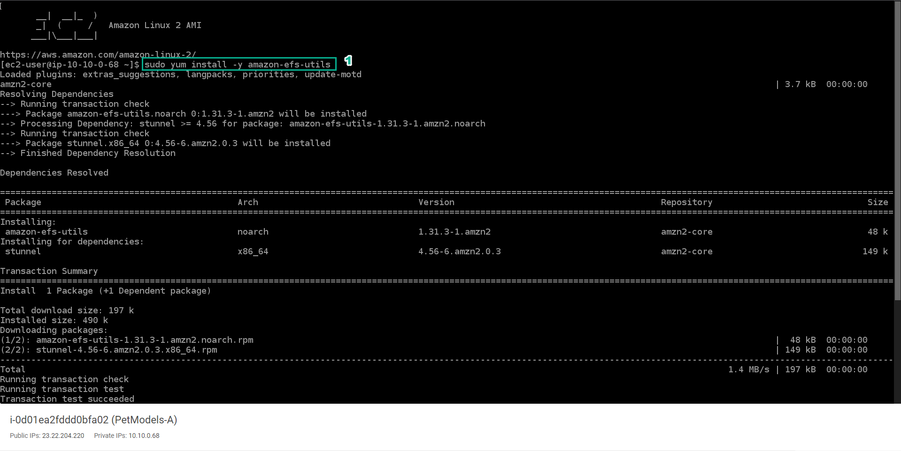

- Enter mkdir data
- Enter ls
- Enter the command line of Using the EFS mount helper copied in step 19, then change efs to data
- Enter cd data
- Type cat efs-l-setup.log
- Type sudo bash -c "cat >> efs-l-setup.log"
- Enter efs-1-mounted in site B
- Use Ctrl + C
- Type cat efs-l-setup.log
- View results

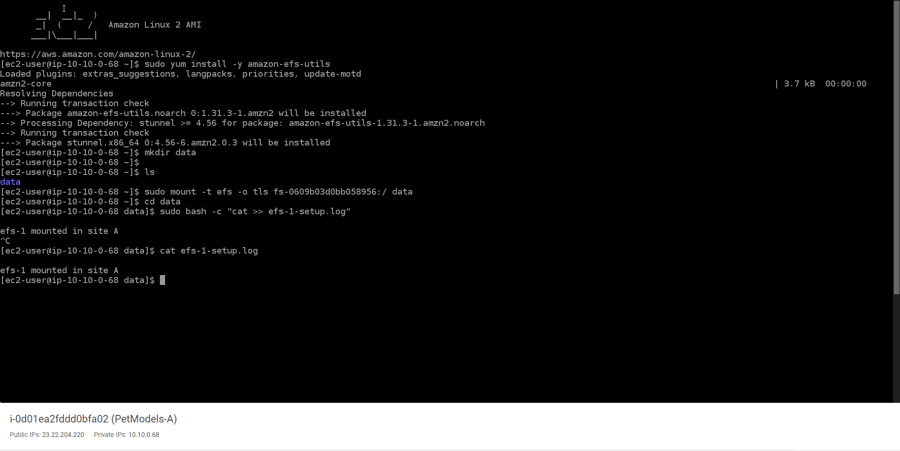

### 21. In the AWS Console interface

- Find EFS
- Select EFS
- Select PetModels-EFS-1

### 22. In the PetModels-EFS-1 interface

- Select Network
- Select Manage

### 23. In the Network access interface

- Select Add mount target
- Select us-east-1b
- Select Subnet ID
- Select PetModels-EFS-1-SG
- Select Save

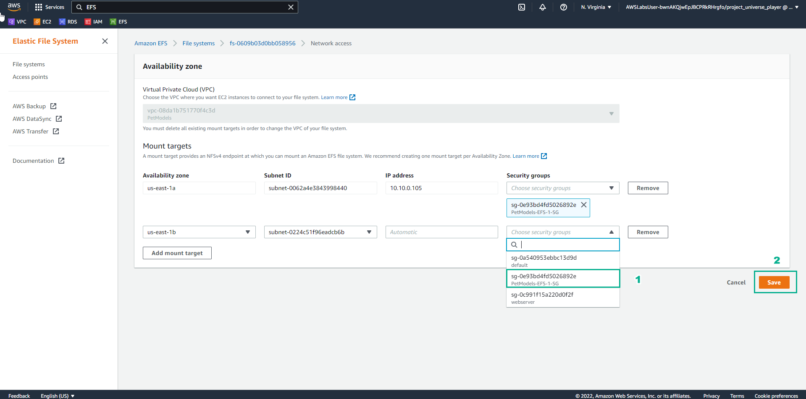

### 24. In the PetModels-EFS-1 interface

- View Mount target state
- Select refresh

### 25. In the AWS Console interface

- Find EC2
- Select EC2
- Select Instances

### 26. In the Instances interface

- Select PetMdels-B
- Select Connect

### 27. In the Connect to instance interface

- Select EC2 Instance Connect
- Select Connect

### 28. In the PetModels-B interface

- Type sudo yum install -y amazon-efs-utils

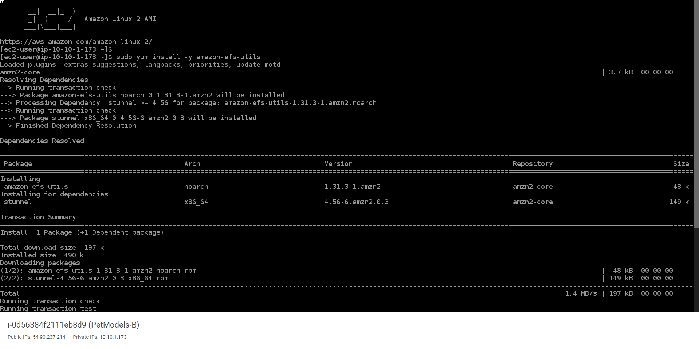

### 29. Enter mkdir data

- Enter ls
- Enter the command line of Using the EFS mount helper copied in step 19, then change efs to data
- Enter cd data
- Type cat efs-l-setup.log
- Type sudo bash -c "cat >> efs-l-setup.log"
- Enter efs-1-mounted in site B
- Use Ctrl + C
- Type cat efs-l-setup.log
- View results

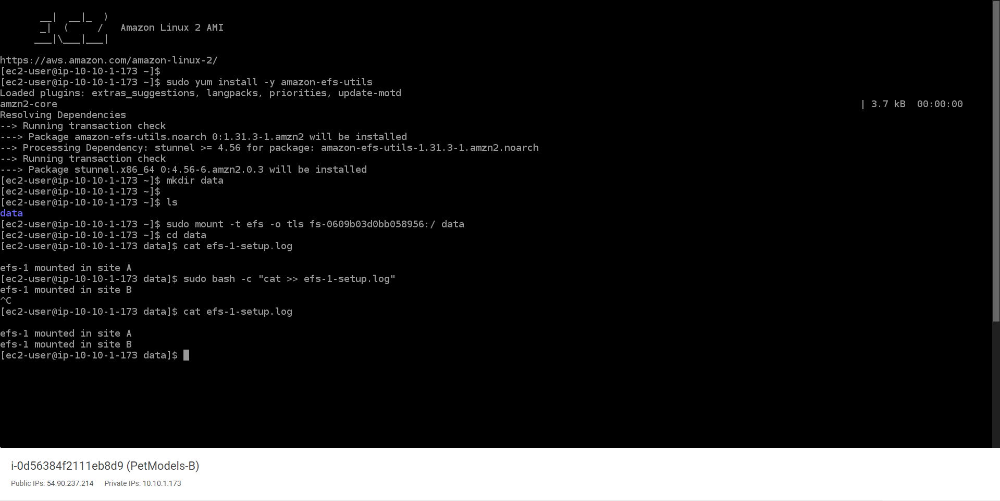

### 30. In the File systems interface

- Select PetModels-EFS-1

### 31. In the PetModels-EFS-1 interface

- Select Network
- Select Manage

### 32. In the Network access interface

- Select Add mount target
- Select us-east-1c
- Select Subnet ID
- Select security group
- Select Save

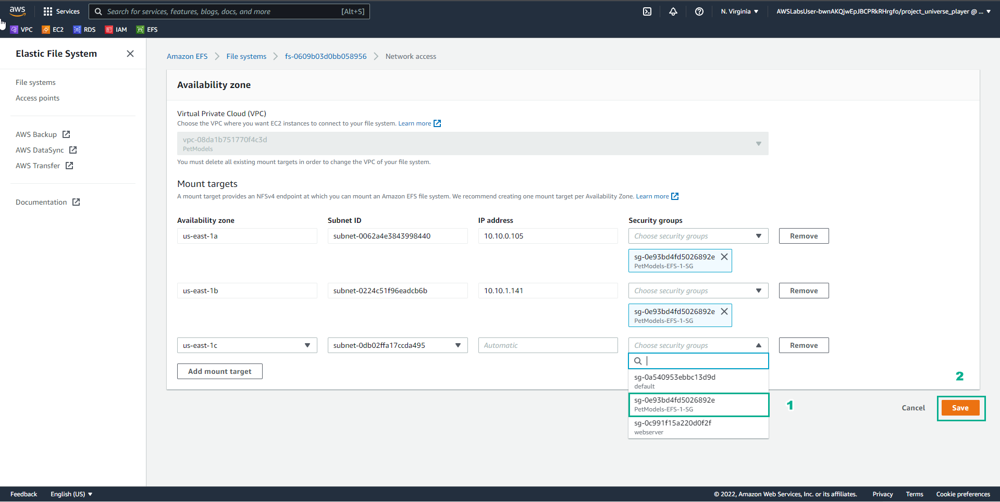

### 33. In the File system interface

- Select Network
- View Mount target state
- Select refresh

### 34. In the EC2 interface

- Find EC2
- Select EC2
- Select Instances
- Select PetModels-C
- Select Connect

### 35. In the Connect to instance interface

- Select EC2 Instance Connect
- Select Connect

### 36. In the PetModels-C interface

- Type sudo yum install -y amazon-efs-utils


### 37. Enter mkdir data

- Enter ls
- Enter the command line of Using the EFS mount helper copied in step 19, then change efs to data
- Enter cd data
- Type cat efs-l-setup.log
- Type sudo bash -c "cat >> efs-l-setup.log"
- Enter efs-1-mounted in site B
- Use Ctrl + C
- Type cat efs-l-setup.log
- View results

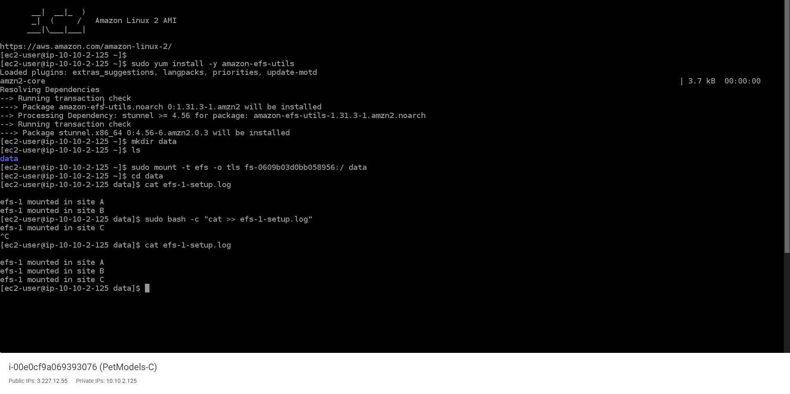
