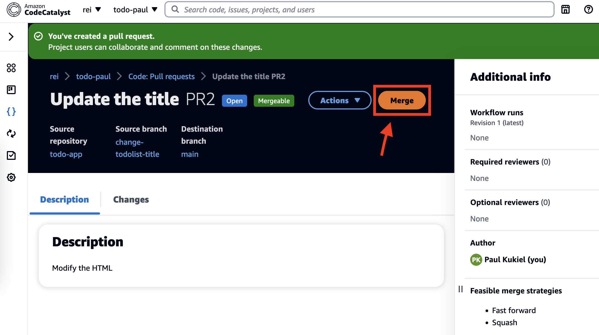
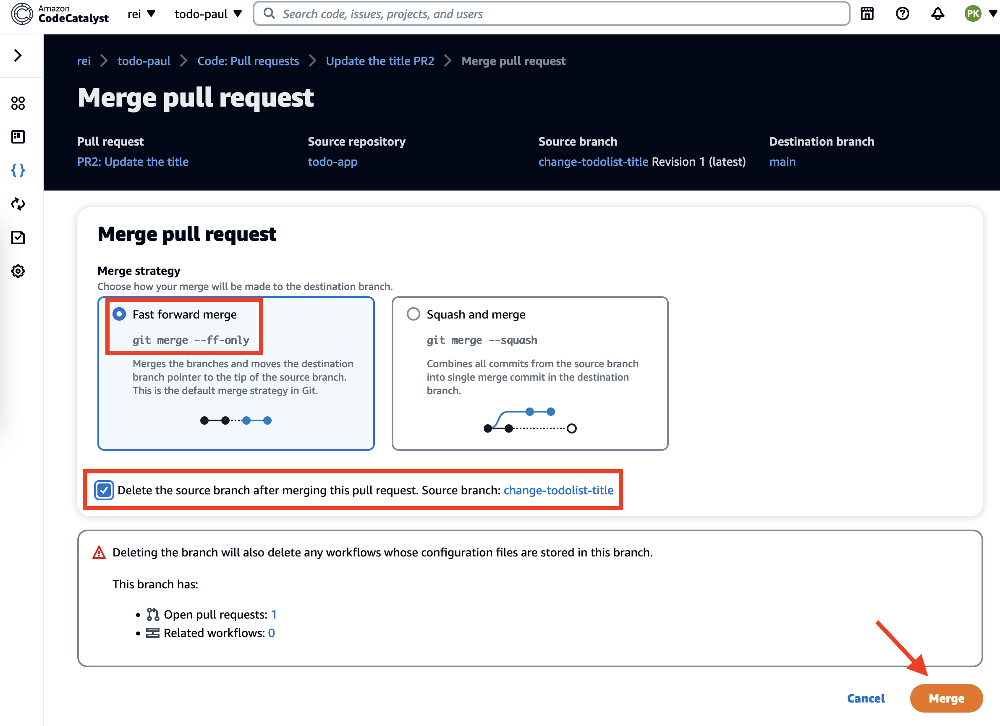
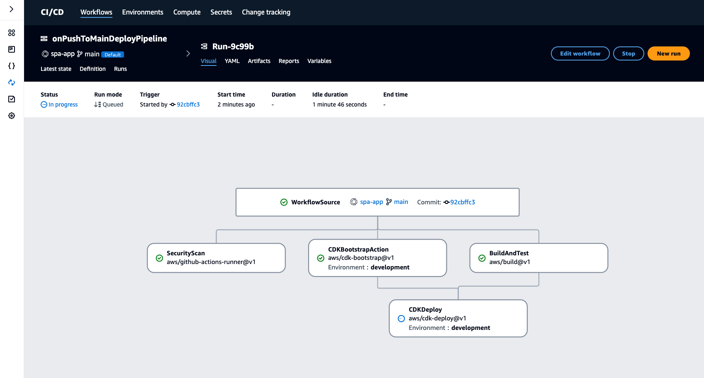

# Introduction

Building best-practices into CI/CD pipelines is more than just compiling and deploying your application code. DevSecOps is the combination of cultural philosophies, practices, and tools that exploits the advances made in IT automation to achieve a state of production immutability, frequent delivery of business value, and automated enforcement of security policy. DevSecOps is achieved by integrating and automating the enforcement of preventive, detective, and responsive security controls into the CI/CD pipeline. Many teams find this process complex and time consuming.

This hands-on session explores how to use Amazon CodeCatalyst as a unified software development service to quickly build and deliver applications on AWS. Learn how to use blueprints to automatically set up everything you need to start a new software development project, including CI/CD, deployable code, issue tracking, and AWS services configured according to best practices. Additionally, learn how to build in control gates to enforce compliance requirements from day one.

## Overview

In this workshop, you will leverage [Amazon CodeCatalyst's](https://codecatalyst.aws/explore) built-in "Blueprint" to create a "Single-page application" project. Once created, you will use this project to explore the concepts of Workflows (the CI/CD pipeline) and how to add GitHub Actions your project. You will experiment with the built in development environment to modify and commit code. On commit you will see how the workflow triggers a new build and deploy of your app. You will experiment with a few other features such as issue tracking and a dashboard for viewing reports generated from the Workflow.

## What is Amazon CodeCatalyst?

CodeCatalyst is a cloud-based integrated DevOps platform for software development teams. CodeCatalyst aims to make you more efficient in building and deploying applications by providing a unified experience across the various software development lifecycle (SDLC) stages. CodeCatalyst resources are structured inside projects that live inside CodeCatalyst Spaces. To help you and your team get started quickly, CodeCatalyst provides project blueprints. When you create a project from a blueprint, the blueprint provides you with resources such as a source repository, sample code, build scripts, and CI/CD workflows. CodeCatalyst space and project administrators can manage which team members have access to create, view, or update project resources.

## What can I do with Amazon CodeCatalyst?

You and your development team can use CodeCatalyst to carry out each aspect of software development, from planning your work to deploying your applications. Specifically, you can use CodeCatalyst to:

- Iterate and collaborate on code: Work collaboratively with your team on code with branches, merges, pull requests, and comments in your source code repositories. Create workspaces to quickly work on code without having to clone or set up connections to repositories.
- Build, test, and deploy your application with workflows: You can configure workflows with build, test, and deploy actions to handle the continuous integration and delivery of your applications. Workflows can be started manually or automatically on configurable events, such as code pushes and the creation or closure of pull requests.
- Prioritize your team's work with issue tracking: An important part of developing software is creating and maintaining a healthy backlog of items for your team to work on. With issues in CodeCatalyst, you can easily create backlogs and monitor the status of in-progress issues with boards.
- Set up monitoring and notifications: Monitor team activity and resource status, and configure notifications to stay up to date with important changes.

## AWS CodeCatalyst Onboarding

CodeCatalyst uses a new identity source separate from Identity Access Management (IAM). AWS Builder IDs are associated with a user's email address and are globally unique. This allows a single identity to be associated with multiple CodeCatalyst Spaces and projects, all of which can be linked with many different AWS accounts. This makes it easier for developer teams to collaborate on application projects without the complexities of managing different IAM identities across multiple AWS accounts.

## Invitation to Workshop Space and Creating AWS Builder ID

In this workshop you will receive an invitation to a CodeCatalyst Space and then need to create an AWS Builder IDs. Look in your email for a message from [notify@codecatalyst.aws](notify@codecatalyst.aws) as shown in the next screenshot.


Click on Accept Invitation and use the same email that the invitation was sent to.

Then follow these steps to sign in for the first time:

#### 1. Create your AWS Builder ID. Your AWS Builder ID is an identity you create to sign in to CodeCatalyst.

#### 2. In Your email address, enter the email address you want to associate with CodeCatalyst.

#### 3. In Your name, provide the first and last name you want displayed in applications where you use your AWS Builder ID. This will be your AWS Builder ID profile name, such as Mary Major. You can change the name later.

#### 4. A verification code will be sent to the email you specified. Enter this code in the Verification code field, and then choose Verify. You may need to look in your spam or junk folder to find the verification code.

#### 5. Once you verify your code, you will be asked to set a password. Select the checkbox confirming your agreement with the AWS Customer Agreement and the AWS Service Terms, and then choose Create my profile.

#### 6. On the Create your alias page, enter an alias you want to use for your unique user identifier in CodeCatalyst. Choose a shortened version of your name with no spaces, such as MaryMajor. Other CodeCatalyst users will be use this to @mention you in comments and pull requests. You cannot change your CodeCatalyst alias after its created.

Now you should be in the CodeCatalyst Space created for this event. You can move on to the next section.

## Starting a New Project

Using blueprints, you will create your first project in a manner of minutes.

#### 1. Once in the correct CodeCatalyst Space, click the Create Project button.

#### 2. On the next screen, make sure Start with a blueprint is selected at the top of the page, then scroll down to the Single-page application. Select it and click Next.


#### 3. For project name, use something unique. e.g. DC-Demo-XXXXXX

#### 4. Select the IAM Role from the drop down.

#### 5. Expand the Additional Configurations section and change the following.

#### 6. Change the Hosting setting to Cloudfront + S3

#### 7. Optional: Change CDK Programming Language to Python if you would prefer to see what it looks like in that language

#### 8. Optional: Change the CloudFormation stack names to something that personally identifies your project.


#### 9. Click Create project

**Note**

Once the project is created, it will take several minutes for the workflow to build out all the AWS infrastructure that is defined in the blueprint.

## Explore Your New Project

In this section, we will spend a few minutes looking through our project.

#### 1. Start by navigating to the left hand pane and clicking the Code dropdown and then clicking Source repositories.

- Click on your repository name to view the repository. This is where the source code will reside.
- Take a few minutes to review the information here.

#### 2. Now, lets look at our CI/CD pipeline that should be deploying your project our application currently.

- Again, navigate to the left-hand pane and click the CI/CD dropdown and then click Workflows.
- Notice that there should be an onPushToMainDeployPipeline which should be running similar to the image below.
- Take a few minutes to look around the application deployment pipeline by clicking on the latest run to see how CodeCatalyst handles CI/CD deployments.


#### 3. As the workflow completes, you can see any variables created by the workflow under the Variables tab in the workflow screen. Click on the Variables tab.

#### 4. Look for the variable called AppURL. This is the URL you can use to visit your deployed webpage. If the variable cannot be found, that step of the deployment may not yet be complete. Wait for the workflow to complete and check again.

**Note**

Feel free to continue to the next section while you wait for the worflow to complete


#### 5. Copy/paste the appURL into a browser to see your page running.


## GitHub Actions

**Note**

In this section we will modify our project's workflow to add a [GithHub Action](https://docs.aws.amazon.com/codecatalyst/latest/userguide/integrations-github-actions.html) . The action we will implement adds a [Trivy Security Scan](https://github.com/aquasecurity/trivy-action) to the workflow

#### 1. From the left-hand menu in your project, expand the CI/CD section and select Workflows to navigate back to Workflows screen


#### 2. Click the Actions button on the righthand side of the onPushToMainDeployPipeline workflow to expose the Edit option. Click Edit.


#### 3. Copy the following YAML snippet into the Actions section of your main workflow's YAML

```
 SecurityScan:
    Identifier: aws/github-actions-runner@v1
    Inputs:
      Sources:
        - WorkflowSource
    Configuration:
      Steps:
        - name: Trivy Vulnerability Scanner
          uses: aquasecurity/trivy-action@master
          with:
            scan-type: fs
            ignore-unfixed: true
            format: cyclonedx
            output: sbom.json
            severity: CRITICAL,HIGH
            security-checks: vuln,config,secret
    Outputs:
      Artifacts:
        - Name: sbom
          Files:
            - sbom.json
```

#### 4. Click the Validate button in the top right corner of the screen

#### 5. Once validation is done, the Commit button should become available. Commit the changes.

#### 6. Once you hit Commit, another workflow instance will get kicked off — which will take some time to run.

- Once it completes, you can revisit the workflow page to view the generated sbom.json file in the artifacts section.
- Please note that these files are saved as compressed archives that you will need to decompress after downloading in order to view the contents.


## Modify and Commit Code

**Note**

In this section we will create a cloud based development environment and make a simple modification to the website. Once done we will commit the changes back to our code repository in order to see the workflow get triggered.

## Launch a Dev Environment

#### 1. From the Project's Overview page, scroll to the bottom.

#### 2. Click the dropdown by Create Dev Environment in the My Dev Environments section. Select AWS Cloud9 (in browser).


#### 3. Select Clone a repository.

#### 4. For repository, select the repository we created earlier.

#### 5. Select Work in a new branch.

#### 6. Give your branch a name such as change-homepage for the branch.

#### 7. In the Create branch from section, make sure the main branch is selected.

#### 8. Click the Create button.


#### 1. Once your Cloud9 environment is running, open the file located at spa-app > src > App.css.

#### 2. On line 17, you will see an entry for the background-color:. Change the value to #ff9900.

#### 3. Save the file.

#### 4. Commit and push your changes by entering the following commands into the terminal at the bottom of the screen.

```
cd spa-app
git branch    #notice you are already on the branch
git add -A
git commit -m "Update the background color"
git push
```


## Create a Pull Request

**Note**

In this section we will create and merge a pull request into the main branch of our code repository. Doing this will trigger another workflow run that will deploy the changes.

#### 1. On the left panel, click the Code icon and select Pull requests.


#### 2. Click Create pull request

#### 3. Select your recently created branch as the source and main as the destination.

#### 4. Give your Pull Request a title and description.

#### 5. Notice you may assign a project member as reviewer. But for this lab we will not do that step.

#### 6. Scroll down to the bottom of the page. You will be able to see the code differences.

#### 7. Click Create.


#### 8. Start the Merge process by clicking Merge.



#### 9. Pick a Merge strategy.

#### 10. Select Delete the source branch after merging this pull request.

#### 11. Click Merge.



#### 12. Click on CI/CD and then click the Workflows submenu.


#### 13. Click on the most Recent run.


#### 14. From this view, you can explore the CI/CD Workflow. Wait a few minutes for the CI/CD pipeline to complete to see your changes.



#### 15. Select the Variables tab. From here you can see all outputs of the workflow. Search for AppURL. Copy and paste the value in your browser of choice to view your deployed website.


## Review Quality Reports

#### 1. Click on Reports in the left menu.


**Note**

Here you can any reports that were created as part of the workflow process.


#### 2. Click on any of the listed reports and explore.


## Issue Tracking

In this step, you will use the Issue Tracking feature to create and issue and add yourself as an assignee.

#### 1. In the left-hand menu clic Issues.

#### 2. From there, click the Create issue button.

#### 3. Fill out the Issue Title and Description fields.

#### 4. Under the Assignee section, click the "+ Add me" link.

#### 5. Click Create issue.


#### 6. Feel free to continue exploring the Issues screens.
