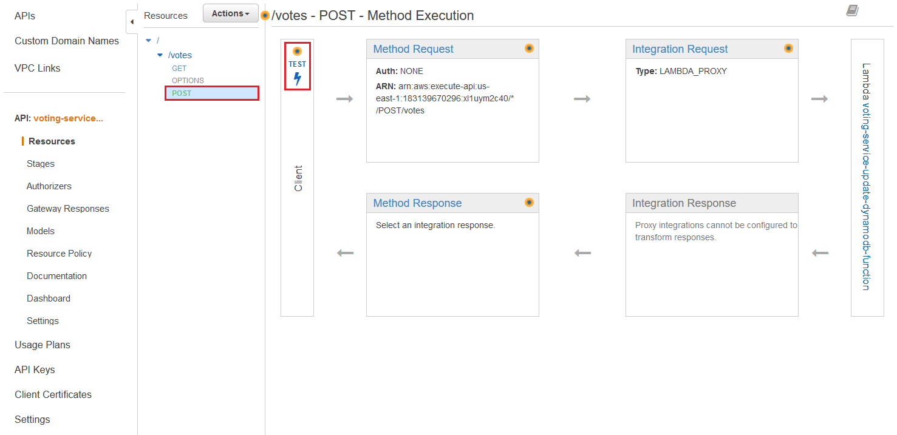

# Introduction

In this workshop, you will build the backend resources for a serverless voting application by using the AWS Serverless Application Model (SAM). You will configure a pre-deployed frontend to connect to the backend resources that you build. This serverless voting application will allow you to vote for your favorite pet. Votes from other users, with the same frontend configuration, will be totalled together. This workshop is intended for Solutions Architects and Developers with basic knowledge of AWS. Estimated completion time is 30-45 minutes.

## Frontend

The frontend is a JavaScript web application that interfaces with resources on the backend. You will only need to make minor configuration changes in the frontend to complete this workshop.

The frontend web application is managed with AWS Amplify Hosting and has already been deployed to a central AWS account. Amplify Hosting provides a simple, Git-based workflow for deploying and hosting fullstack serverless web applications. Amplify Hosting can create both the frontend and backend but for this workshop we will be using SAM for the backend resources only. The URL to access the frontend will be provided later in this workshop.

## Backend

The backend application architecture uses Amazon API Gateway, AWS Lambda, Amazon SQS, Amazon DynamoDB, and AWS IoT Core.

JavaScript executed in the frontend sends and receives data to and from a public backend API built using API Gateway and Lambda functions. SQS provides a message queuing service to decouple and scale the application. DynamoDB provides a persistence data storage layer which is used by the Lambda functions. DynamoDB Streams is integrated with a Lambda function to publish events to IoT Core for real-time updates in the frontend.


## Open Cloud9

- From the AWS Console, navigate to Cloud9.
- Locate the Cloud9 environment named "Workshop-IDE" and click "Open IDE".

## Create SAM Application

To get started, you will use the SAM CLI to initialize a serverless application with a pre-built SAM template. The SAM template will provide a folder structure with example files. From the terminal window, use the sam init command to create a "Hello World" application.

- Enter the command: sam init
- Enter 1 to select "AWS Quick Start Templates" as the template source.
- Enter 1 to select "Hello World Example" as the application template.
- Enter N when asked whether to use the most popular runtime and package type.
- Enter 11 to select "nodejs18.x" as the runtime.
- Enter 1 to select "Zip" as the package type.
- Enter 1 to select "Hello World Example" as the starter template.
- Enter N when asked whether to enable X-Ray tracing on the function(s) in your application.
- Enter sam-app as the project name.

## Modify SAM Folder

In the file explorer on the left of Cloud9, notice the new "sam-app" folder. This is the "Hello World" SAM application that you created in the previous step. Double-click the "template.yaml" file to view the resources of this example application.

It should look like this:


To accomodate the web application you will build during this workshop, use commands in the terminal window or interact with the file explorer to make the following modifications in the "sam-app" folder:

Delete the folder named "events". This folder is not needed for the workshop.

```c
cd ~/environment/sam-app
rm -r events
```

Delete the folder named "hello-world", including all of its sub-directories and files.

```c
cd ~/environment/sam-app
rm -r hello-world
```

Create a new folder named "src". This is where you will store Lambda function code later on.

```c
cd ~/environment/sam-app
mkdir src
```

## Summary

You created an example SAM application by using the sam init command to get started. Then you modified the folder structure to prepare for the web application you are about to build.

# Build Backend - 1st Iteration


For the first iteration of building the backend resources, you will create an API with two endpoints that are integrated with Lambda functions to get and post data to a DynamoDB table. In future iterations, you will modify the architecture to create a more resilient solution.

## Create SAM Template

Replace the entire contents of the "sam-app/template.yaml" file with the template below, then save the file. Scroll through the template.yaml file to view the resources being created.

```c
AWSTemplateFormatVersion: '2010-09-09'
Transform: AWS::Serverless-2016-10-31
Description: Building Serverless Applications with AWS SAM

Parameters:
  AppName:
    Description: Name of application.
    Type: String
  ApiStageName:
    Description: Name of API stage.
    Type: String

Globals:
  Function:
    CodeUri: src/
    Runtime: nodejs14.x
    Architectures:
      - x86_64
    Timeout: 3

Resources:
  # DynamoDB table to store data with stream enabled:
  VotesTable:
    Type: AWS::DynamoDB::Table
    Properties:
      TableName: !Sub '${AppName}-table'
      AttributeDefinitions:
        - AttributeName: PK
          AttributeType: S
        - AttributeName: SK
          AttributeType: S
      KeySchema:
        - AttributeName: PK
          KeyType: HASH
        - AttributeName: SK
          KeyType: RANGE
      BillingMode: PAY_PER_REQUEST
      StreamSpecification:
        StreamViewType: NEW_IMAGE

  # API Gateway REST API with CORS configured:
  RestApi:
    Type: AWS::Serverless::Api
    Properties:
      Name: !Sub '${AppName}-api'
      StageName: !Ref ApiStageName
      Cors:
        AllowMethods: "'GET,POST,OPTIONS'"
        AllowHeaders: "'Content-Type'"
        AllowOrigin: "'*'"
        MaxAge: "'0'"

  # Lambda Function that scans the DynamoDB table:
  ScanDynamoDBFunction:
    Type: AWS::Serverless::Function
    Properties:
      FunctionName: !Sub '${AppName}-scan-dynamodb-function'
      Handler: scan-dynamodb.handler
      # DynamoDB read access is required.
      Policies:
        - DynamoDBReadPolicy:
            TableName: !Ref VotesTable
      Environment:
        Variables:
          DDB_TABLE_NAME: !Ref VotesTable
      # Function invocation: API GET method on /votes resource.
      Events:
        ApiEvent:
          Type: Api
          Properties:
            RestApiId: !Ref RestApi
            Path: /votes
            Method: GET

  # Lambda Function that updates the DynamoDB table:
  UpdateDynamoDBFunction:
    Type: AWS::Serverless::Function
    Properties:
      FunctionName: !Sub '${AppName}-update-dynamodb-function'
      Handler: update-dynamodb.handler
      # DynamoDB write access is required.
      Policies:
        - DynamoDBWritePolicy:
            TableName: !Ref VotesTable
      Environment:
        Variables:
          DDB_TABLE_NAME: !Ref VotesTable
      # Function invocation: API POST method on /votes resource.
      Events:
        ApiEvent:
          Type: Api
          Properties:
            RestApiId: !Ref RestApi
            Path: /votes
            Method: POST

Outputs:
  ApiEndpoint:
    Description: 'API Gateway Endpoint'
    Value: !Sub 'https://${RestApi}.execute-api.${AWS::Region}.amazonaws.com/${ApiStageName}'
```

## Create Scan DynamoDB Function

Create a new file named "scan-dynamodb.js" in the "sam-app/src/" folder. Open the new file and paste in the code below, then save the file. This Lambda function checks the httpMethod of the incoming event. If the httpMethod is "GET", the DynamoDB table is scanned and all items are returned.

```c
const AWS = require('aws-sdk');
const ddb = new AWS.DynamoDB.DocumentClient();
const { DDB_TABLE_NAME } = process.env;

const ScanDynamoDB = async function () {
  try {
    const results = await ddb.scan({
      TableName: DDB_TABLE_NAME
    }).promise();
    console.log('Scan DynamoDB Success');
    return results.Items.sort((a, b) => a.order - b.order);
  } catch (err) {
    console.error('Scan DynamoDB Error: ', err);
    return {};
  }
}

exports.handler = async (event) => {
  console.log(JSON.stringify(event));
  let response = {};

  if (event.httpMethod === "GET") {
    const data = await ScanDynamoDB();

    response = {
      statusCode: 200,
      // Response includes required CORS headers.
      headers: {
        "Access-Control-Allow-Headers": "Content-Type",
        "Access-Control-Allow-Origin": "*",
        "Access-Control-Allow-Methods": "OPTIONS,GET"
      },
      // Body should be JSON stringified.
      body: JSON.stringify(data),
    }
  }

  console.log("Response: ", JSON.stringify(response));
  return response;
}
```

## Create Update DynamoDB Function

Create another new file named "update-dynamodb.js" in the "sam-app/src/" folder. Open the new file and paste in the code below, then save the file. This Lambda function checks the httpMethod of the incoming event. If the httpMethod is "POST", the body of the event is used to update an item in the DynamoDB table.

```c
const AWS = require('aws-sdk');
const ddb = new AWS.DynamoDB.DocumentClient();
const { DDB_TABLE_NAME } = process.env;

const UpdateDynamoDB = async function (id) {
  try {
    await ddb.update({
      TableName: DDB_TABLE_NAME,
      Key: {
        PK: id,
        SK: "total",
      },
      UpdateExpression: `SET votes = if_not_exists(votes, :default_votes) + :value`,
      ExpressionAttributeValues: {
        ":default_votes": 0,
        ":value": 1,
      },
    }).promise()
    console.log('Update DynamoDB Success');
    return {};
  } catch (err) {
    console.error('Update DynamoDB Error: ', err);
    return {};
  }
}

exports.handler = async (event) => {
  console.log(JSON.stringify(event));
  let response = {};

  if (event.httpMethod === "POST") {
    // Example body from API POST request: {"id":"dog"}
    const body = JSON.parse(event.body);
    const data = await UpdateDynamoDB(body.id);

    response = {
      statusCode: 200,
      // Response includes required CORS headers.
      headers: {
        "Access-Control-Allow-Headers": "Content-Type",
        "Access-Control-Allow-Origin": "*",
        "Access-Control-Allow-Methods": "OPTIONS,POST"
      },
      // Body should be JSON stringified.
      body: JSON.stringify(data),
    }
  }

  console.log("Response: ", JSON.stringify(response));
  return response;
}
```

## Deploy Backend Resources

Use the SAM CLI from the terminal window to deploy the application using the following commands:

```c
cd ~/environment/sam-app
sam deploy --guided
```

The guided process to deploy the SAM application begins. Use the instructions below to answer the prompts.

- Accept the default stack name (sam-app) and region by pressing enter each time.
- Enter voting-service as the parameter AppName.
- Enter dev as the parameter ApiStageName.
- Enter N to confirm changes before deploy.
- Enter Y to allow SAM CLI to create required IAM roles.
- Enter N when asked whether to disable rollback.
- Enter Y to the message "ScanDynamoDBFunction may not have authorization defined".
- Enter Y to the message "UpdateDynamoDBFunction may not have authorization defined".
- Accept the defaults for the remaining options by pressing enter each time.

Once the SAM application has been deployed, you should see the message "Successfully created..." in the terminal window.

## Summary

You created the SAM template.yaml file to provision a REST API, two Lambda functions, and a DynamoDB table. You created the code for two Lambda functions to scan and update the DynamoDB table. Then you deployed the SAM application by using the sam deploy --guided command.

# Review and Test

Navigate to API Gateway in the AWS Console (which should still be open in another browser tab) to test the REST API named "voting-service-api".

Under the "/votes" resource, select the "POST" method, then click TEST.


Paste the JSON below into the Request Body field, then click Test. You should receive a Status 200 response.

```c
{"id":"dog"}
```

Navigate to DynamoDB in the AWS Console to explore the items in the table named "voting-service-table".


## Summary

You made test API calls by using the API Gateway console and viewed the items in the DynamoDB table.

# Build Backend - 2nd Iteration


For the second iteration of building the backend resources, you will create another Lambda function that processes the events from DynamoDB Streams, which is already enabled on the DynamoDB table. The function will publish the changed data events from the DynamoDB table to an IoT Core topic. In order for public/unauthenticated visitors to receive realtime updates in the frontend, a Cognito Identity Pool and an IAM role with access to the IoT Core topic are required. In a future module, you will configure the IoT Core endpoint in the frontend.

Amazon Cognito provides authentication, authorization, and user management for your web and mobile apps. Your users can sign in directly with a user name and password, or through a third party such as Facebook, Amazon, Google or Apple. The two main components of Amazon Cognito are user pools and identity pools. User pools are user directories that provide sign-up and sign-in options for your app users. Identity pools enable you to grant your users access to other AWS services. The frontend for this workshop will use a Cognito Identity Pool to allow unauthenticated users to subscribe to the IoT Core topic for real-time updates.

## Modify SAM Template

Navigate back to Cloud9. Add the parameters below to the Parameters section of the "sam-app/template.yaml" file, then save the file. Keep in mind that spacing is important in a YAML file.

```c
  # Parameters required for realtime updates using IoT Core:
  IotEndpoint:
    Description: IoT device data endpoint.
    Type: String
  IotTopicName:
    Description: IoT topic name.
    Type: String
```

Add the resources below to the Resources section of the "sam-app/template.yaml" file, then save the file. Scroll through the template.yaml file to view the new resources being created.

```c
  # Cognito and IAM resources required to allow unauthenticated web users to subscribe to an IoT topic for real-time updates:
  CognitoUserPool:
    Type: AWS::Cognito::UserPool
    Properties:
      UserPoolName: !Sub '${AppName}-user-pool'
  CognitoUserPoolClient:
    Type: AWS::Cognito::UserPoolClient
    Properties:
      ClientName: Web
      UserPoolId:
        Ref: CognitoUserPool
  CognitoIdentityPool:
    Type: AWS::Cognito::IdentityPool
    Properties:
      IdentityPoolName: !Sub '${AppName}-identity-pool'
      AllowUnauthenticatedIdentities: true
      CognitoIdentityProviders:
        - ProviderName: !GetAtt CognitoUserPool.ProviderName
          ClientId: !Ref CognitoUserPoolClient
  CognitoUnauthRole:
    Type: AWS::IAM::Role
    Properties:
      AssumeRolePolicyDocument:
        Version: '2012-10-17'
        Statement:
          - Effect: Allow
            Principal:
              Federated: cognito-identity.amazonaws.com
            Action: sts:AssumeRoleWithWebIdentity
            Condition:
              StringEquals:
                'cognito-identity.amazonaws.com:aud': !Ref CognitoIdentityPool
              ForAnyValue:StringLike:
                'cognito-identity.amazonaws.com:amr': unauthenticated
      Policies:
        - PolicyName: !Sub '${AppName}-unauth-policy'
          PolicyDocument:
            Version: '2012-10-17'
            Statement:
              - Effect: Allow
                Action: iot:Connect
                Resource: !Sub 'arn:aws:iot:${AWS::Region}:${AWS::AccountId}:client/*'
              - Effect: Allow
                Action: iot:Receive
                Resource: !Sub 'arn:aws:iot:${AWS::Region}:${AWS::AccountId}:topic/${IotTopicName}'
              - Effect: Allow
                Action: iot:Subscribe
                Resource: !Sub 'arn:aws:iot:${AWS::Region}:${AWS::AccountId}:topicfilter/${IotTopicName}'
  IdentityPoolRoleAttachment:
    Type: AWS::Cognito::IdentityPoolRoleAttachment
    Properties:
      IdentityPoolId: !Ref CognitoIdentityPool
      Roles:
        unauthenticated: !GetAtt CognitoUnauthRole.Arn

  # Lambda Function integrated with the DyanmoDB stream that publishes data to an IoT topic for real-time updates:
  StreamFunction:
    Type: AWS::Serverless::Function
    Properties:
      FunctionName: !Sub '${AppName}-stream-iot-function'
      Handler: stream-iot.handler
      Policies:
        - DynamoDBCrudPolicy:
            TableName: !Ref VotesTable
        - Statement:
          - Effect: Allow
            Action: iot:Publish
            Resource: !Sub 'arn:aws:iot:${AWS::Region}:${AWS::AccountId}:topic/${IotTopicName}'
      Environment:
        Variables:
          IOT_ENDPOINT: !Ref IotEndpoint
          IOT_TOPIC: !Ref IotTopicName
      Events:
        Stream:
          Type: DynamoDB
          Properties:
            Stream: !GetAtt VotesTable.StreamArn
            BatchSize: 100
            StartingPosition: TRIM_HORIZON
```

Add the outputs below to the Outputs section of the "sam-app/template.yaml" file, then save the file.

```c
  # Outputs required for realtime updates using IoT Core:
  CognitoIdentityPoolId:
    Description: 'Cognito Identity Pool Id'
    Value: !Ref CognitoIdentityPool
  IotEndpoint:
    Description: 'IoT device data endpoint.'
    Value: !Ref IotEndpoint
```

## Create Stream IoT Function

Create a new file named "stream-iot.js" in the "sam-app/src/" folder. Open the new file and paste in the code below, then save the file. This Lambda function publishes changed data events from the DynamoDB table to an IoT Core topic.

```c
const AWS = require('aws-sdk');
const { IOT_ENDPOINT, IOT_TOPIC } = process.env;
const iot = new AWS.IotData({ endpoint: IOT_ENDPOINT });

exports.handler = async (event) => {
  console.log(JSON.stringify(event));
  console.log("IOT_ENDPOINT: ", IOT_ENDPOINT);
  console.log("IOT_TOPIC: ", IOT_TOPIC);

  const data = event.Records.map(record => {
    return {
      id: record.dynamodb.Keys.PK.S,
      votes: record.dynamodb.NewImage.votes.N
    }
  })

  // Data received from DyanmoDB stream is published to the an IoT topic for real-time updates.
  const result = await iot.publish({
    topic: IOT_TOPIC,
    payload: JSON.stringify(data)
  }).promise();

  console.log("Result: ", JSON.stringify(result));
  return;
}
```

## Get IoT Endpoint

Get the IoT Endpoint of your AWS account by using the following command in the terminal window:

```c
aws iot describe-endpoint --endpoint-type iot:Data-ATS
```

Copy the endpointAddress value for use in the next step. The endpoint will look something like "example123-ats.iot.us-east-1.amazonaws.com".

## Redeploy Backend Resources

Use the SAM CLI from the terminal window to redeploy the application using the following commands:

```c
cd ~/environment/sam-app
sam deploy --guided
```

The guided process to deploy the SAM application begins. Use the instructions below to answer the prompts.

- Accept the existing stack name, region, AppName, and ApiStageName by pressing enter each time. These values were stored in the "samconfig.toml" file when you ran the sam deploy --guided command the first time.
- Enter the IoT Core endpoint from the previous step as the parameter IotEndpoint.
- Enter votes as the parameter IotTopicName.
- Enter N to confirm changes before deploy.
- Enter Y to allow SAM CLI to create required IAM roles.
- Enter N when asked whether to disable rollback.
- Enter Y to the message "ScanDynamoDBFunction may not have authorization defined".
- Enter Y to the message "UpdateDynamoDBFunction may not have authorization defined".
- Accept the defaults for the remaining options by pressing enter each time.

Once the SAM application has been redeployed, you should see the message "Successfully created..." in the terminal window.

Make note of the CloudFormation output as this information will be needed in the next module.


## Summary

You modified the SAM template.yaml file to include a Cognito Identity Pool, an IAM role, and another Lambda function, which are required to support realtime updates in the frontend. You created the code for the Lambda function that publishes changed data events from the DynamoDB table to an IoT Core topic. You retrieved the IoT Endpoint by using the AWS CLI. Then you redeployed the SAM application by using the sam deploy --guided command.

# Configure Frontend


As mentioned in the introduction, the frontend voting application allows for the configuration of the backend endpoints that it connects to.

Open the [frontend voting application](https://s12d.com/vote) now.

Click the hamburger icon in the frontend voting application, update the config options using the CloudFormation output from the previous module, then click Save.

## Summary

You configured the frontend to connect to the backend resources, including the REST API, Cognito Identity Pool, and IoT Endpoint.

# Review and Test

Now you can vote for your favorite pet!

You can vote for any pet, as many times you like. Each vote makes a POST request to the "/votes" API resource which invokes a function to increment the total votes in the DynamoDB table.

Whenever the DynamoDB table is updated, DynamoDB Streams invokes a function to publish a message to an IoT Core topic. The frontend is subscribed to the topic which updates the total votes and graph in realtime.

When the voting application is loaded for the first time, or the browser is refreshed, it will make a GET request to the "/votes" API resource which invokes a function to perform a scan of the DynamoDB table. This updates the total votes and graph.

If you right-click in your web browser and choose Inspect, you can view the API calls being made from the Network tab.


After submitting your votes, navigate back to DynamoDB in the AWS Console to explore the items in the table named "voting-service-table". The total votes in the table should match the frontend.

## Summary

You used the frontend to submit votes, inspected the API calls from your web browser, and viewed the items in the DynamoDB table.

# Build Backend - 3rd Iteration


For the third iteration of building the backend resources, you will make improvements to the application by including an SQS queue between the API and the DynamoDB table. This helps to mitigate against potential DynamoDB throttling issues, and allows batch processing of up to 10 votes at a time. You will update the SAM template and create two new Lambda functions. The first function will publish events to the SQS queue. The second function will poll the SQS queue and update the DynamoDB table.

## Modify SAM Template

Add the resources below to the Resources section of the "sam-app/template.yaml" file, then save the file. To keep the resources in logical order and improve readability, consider placing the following between the existing "ScanDynamoDBFunction" and "UpdateDynamoDBFunction" resources. However, the order of the resources in the template does not affect how CloudFormation provisions the resources.

```c
  # Standard SQS Queue:
  SqsQueue:
    Type: AWS::SQS::Queue

  # Lambda Function that publishes a message to the SQS queue:
  SqsPublishFunction:
    Type: AWS::Serverless::Function
    Properties:
      FunctionName: !Sub '${AppName}-sqs-publish-function'
      Handler: sqs-publish.handler
      # SQS SendMessage access is required:
      Policies:
        - SQSSendMessagePolicy:
            QueueName: !GetAtt SqsQueue.QueueName
      Environment:
        Variables:
          SQS_QUEUE_URL: !Ref SqsQueue
      # Function invocation: API POST method on /votes resource.
      Events:
        PostVotes:
          Type: Api
          Properties:
            RestApiId: !Ref RestApi
            Path: /votes
            Method: POST
```

Replace the existing resource named "UpdateDynamoDBFunction" in the Resources section of the "sam-app/template.yaml" file with the code below, then save the file.

```c
  # Lambda Function that updates the DynamoDB table:
  UpdateDynamoDBFunction:
    Type: AWS::Serverless::Function
    Properties:
      FunctionName: !Sub '${AppName}-sqs-update-dynamodb-function'
      Handler: sqs-update-dynamodb.handler
      # DynamoDB write access and SQS poller access is required.
      Policies:
        - DynamoDBWritePolicy:
            TableName: !Ref VotesTable
        - SQSPollerPolicy:
            QueueName: !GetAtt SqsQueue.QueueName
      Environment:
        Variables:
          DDB_TABLE_NAME: !Ref VotesTable
      # Function invocation: Lambda polls SQS Queue.
      Events:
        SqsEvent:
          Type: SQS
          Properties:
            Queue: !GetAtt SqsQueue.Arn
            BatchSize: 10
            Enabled: true
```

## Create SQS Publish Function

Create a new file named "sqs-publish.js" in the "sam-app/src/" folder. Open the new file and paste in the code below, then save the file. This Lambda function checks the httpMethod of the incoming event. If the httpMethod is "POST", the entire event is published to the SQS queue.

```c
const AWS = require('aws-sdk');
const sqs = new AWS.SQS();
const { SQS_QUEUE_URL } = process.env;

const PublishSqs = async function (message) {
  try {
    const results = await sqs.sendMessage({
      MessageBody: message,
      QueueUrl: SQS_QUEUE_URL
    }).promise()
    console.log('Publish SQS Success');
    return results;
  } catch (err) {
    console.error('Publish SQS Error: ', err);
    return {};
  }
}

exports.handler = async (event) => {
  console.log(JSON.stringify(event));
  let response = {};

  if (event.httpMethod === "POST") {
    const data = await PublishSqs(JSON.stringify(event));

    response = {
      statusCode: 200,
      // Response includes required CORS headers.
      headers: {
        "Access-Control-Allow-Headers": "Content-Type",
        "Access-Control-Allow-Origin": "*",
        "Access-Control-Allow-Methods": "OPTIONS,POST"
      },
      // Body should be JSON stringified.
      body: JSON.stringify(data),
    }
  }

  console.log("Response: ", JSON.stringify(response));
  return response;
}
```

## Create SQS Update DynamoDB Function

Create a new file named "sqs-update-dynamodb.js" in the "sam-app/src/" folder. Open the new file and paste in the code below, then save the file. The Lambda service polls the SQS queue and invokes this Lambda function to process up to 10 records/events at a time. The body of each event is used to update an item in the DynamoDB table.

```c
const AWS = require('aws-sdk');
const ddb = new AWS.DynamoDB.DocumentClient();
const { DDB_TABLE_NAME } = process.env;

const UpdateDynamoDB = async function (id) {
  try {
    await ddb.update({
      TableName: DDB_TABLE_NAME,
      Key: {
        PK: id,
        SK: "total",
      },
      UpdateExpression: `SET votes = if_not_exists(votes, :default_votes) + :value`,
      ExpressionAttributeValues: {
        ":default_votes": 0,
        ":value": 1,
      },
    }).promise()
    console.log('Update DynamoDB Success');
    return {};
  } catch (err) {
    console.error('Update DynamoDB Error: ', err);
    return {};
  }
}

exports.handler = async (event) => {
  console.log(JSON.stringify(event));

  // Process SQS messages in batch, up to 10 records in each batch
  for (const record of event.Records) {
    const messageId = record.messageId;
    console.log("MessageId: ", messageId);

    // SQS record body includes entire API POST request
    const recordBody = JSON.parse(record.body);
    console.log("SqsRecordBody: ", JSON.stringify(recordBody));

    // Example body from API POST request: {"id":"dog"}
    const requestBody = JSON.parse(recordBody.body);
    await UpdateDynamoDB(requestBody.id);
  }

  return;
}
```

## Redeploy Backend Resources

Use the SAM CLI from the terminal window to redeploy the application using the following commands:

```c
cd ~/environment/sam-app
sam deploy
```

The --guided option is no longer needed because the SAM CLI will use the file named "samconfig.toml" for the deployment configuration and parameters.

Once the SAM application has been redeployed, you should see the message "Successfully created..." in the terminal window.

## Summary

You modified the SAM template.yaml file to include an SQS queue, a new Lambda function, and you made changes to an existing function. You created the code for two Lambda functions to publish and process messages in the SQS queue. Then you redeployed the SAM application by using the sam deploy command.

# Review and Test

Cast a few more votes in the frontend application, then navigate to CloudWatch Logs in the AWS Console to view the logs for the application.

Whenever the frontend is refreshed, items are retrieved from the DynamoDB table and logs are created in the log group named "voting-service-scan-dynamodb-function".

Each vote in the frontend is considered an event. The events are published to the SQS queue and logs are created in the log group named "voting-service-sqs-publish-function".

The Lambda service continually polls the SQS queue for events, which invokes a function to update the DynamoDB table and logs are created in the log group named "voting-service-sqs-update-dynamodb-function".

As items in the DynamoDB table are updated, the changed data events are published to an IoT Core topic and logs are created in the log group named "voting-service-stream-iot-function".

## Clean Up

Use the commands below to delete the SAM application and answer "Y" to all prompts.

```c
cd ~/environment/sam-app
sam delete
```
