# **Overview**

In this workshop we will be deploying several different open-source applications on Amazon Lightsail and configuring Lightsail resources in a way that will allow you to grow your applications as your business grows, and secure the applications from their default state. Each step will cover some best practices to help you become an expert at using Amazon Lightsail.

## Applications to Deploy

We will be deploying WordPress as our blog/website, Prestashop as our e-commerce site, and Akaunting as our finance application. All 3 of these are open-source products that you can self-host. The lessons in this workshop are also applicable to all other applications that you could host on Lightsail.

## Prerequisites

There are only a few prerequisites for this workshop:

- Laptop to work with Amazon Lightsail and the instances.
- A method of using SSH (You can use Lightsail's web-based SSH, although some prefer to use Putty or Mac Terminal).
- At least one image (PNG or JPG) under 2MB in size to upload to your WordPress site.
- If you would like to head into Amazon Lightsail and click around to familiarize yourself with the console, this would be a good time to do so.

## Deploy Lightsail Database

To login to the AWS console, follow the steps below:

- On the left-side of this guide, click Open AWS console.
- In the search at the top of the AWS Console, type Lightsail and hit enter.
- Click the Home button at the top of the Amazon Lightsail console.

## Deploy a Lightsail Database Instance

Two of our applications (WordPress and Akaunting) will use a MySQL database. We will be deploying a Highly-Available database in this section, which means that there is an active and a passive database deployed. Both receive all writes/updates. If the active database encounters any issues, the passive database is then promoted automatically to 'Active' state allowing for continuity and availability. We will be deploying the database first because it takes 10-15 minutes to deploy and you will be able to move on to other steps instead of waiting for it to be ready before moving on.

#### 1. Once you are logged into Lightsail, click the Databases tab, then click Create database.

### Select the correct location

We need to make sure that the database is located in the Oregon us-west-2 location (region).
Everything we deploy will be in this region.

#### 2. If the location is NOT Oregon us-west-2, Click Change AWS Region and Availability Zone and select Oregon us-west-2. Click Change your Availability Zone and select the same availability zone you selected for your instance.

#### 3. We will stick with the default MySQL 8.0.31. Scroll down and click Specify login credentials.

#### 4. For User name, type 'LightsailAdmin' (pay attention to capitalization)

#### 5. Uncheck Create a strong password for me and type 'Sunny2DAY!' as your new password.

#### 6. For the Master database name, type 'WordPress' (again, pay attention to capitalization).

Lightsail deploys the database we named in Step 6 by default, however, since we are deploying a database instance, once it is deployed, we can log into it and create as many databases as we'd like. This will allow us to use a single Highly-available instance, but have separate databases and permissions on each for greater security.

Your new database will be deployed as 'dbWordPress'

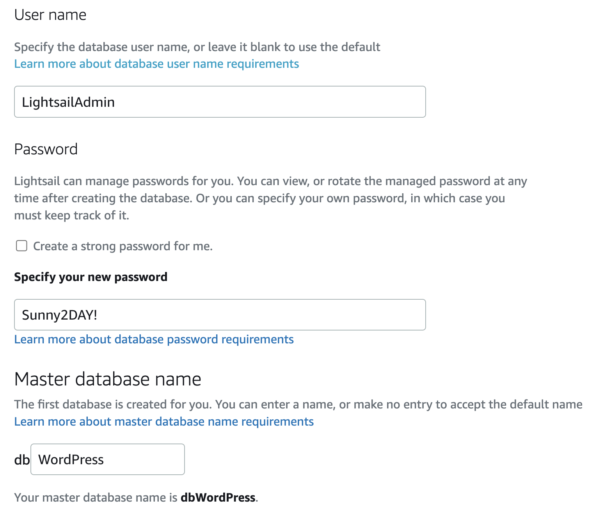

### Choose your database plan

We will choose a High Availability database plan that will automatically fail over in the event of something happening to the primary database.

You may choose to deploy the STANDARD database to save on time during this workshop. If you choose Standard, you will select the $30 database plan in Step 7.

Deploying a STANDARD database will save roughly 10 minutes of waiting/deployment-time during the workshop.

#### 7. select the $60 database plan with 2GB Memory and 2 vCPU.

### Identify your database

We need to give our database instance/resource an identifying name. This instance will have multiple databases running on it so we will also add identifying tags throughout the workshop.

#### 8. Name the database instance 'Workshop-HA-Instance'

Because we can't see the names of the databases running inside of the database instance without logging into the instance, we'll add a tag with the database name. Although we typed 'WordPress' for the database name, Lightsail adds a prefix 'db' so our database that we are creating is actually 'dbWordPress'.

#### 9. Under 'Key-value tags', click Add key-value tag, add:

```
Key = dbname
Value = dbWordPress
```

#### 10. Click Create database

It will take roughly 15 minutes to create the database.

As we wait for the Database instance to initialize, we'll move on to our next step 'Deploy a WordPress instance'

#### 11. Right-click Instances and click 'Open in a new tab' as we'll need to come back to this page later to get the database instance Endpoint URL.

**You did it!**

OK! We've taken the first step towards creating a remote database for all of our applications to use. If something were to happen to the primary database instance, a second is running (invisible to you), that would take over if needed, providing higher availability to the database records. Click Next and we'll move along into deploying WordPress!

# 1. Deploy Wordpress Instance

Select a Blueprint

#### 1. Click the Home button in the top Lightsail banner and click Create instance.

#### 2. Make sure the Instance location is set to the same as the database we just deployed 'Oregon, Zone A (us-west-2a)'.

If it is defaulted to a different location or availability zone, click Change AWS Region and Availability Zone and select the correct values.

Pick your instance image 3. Under "Select a blueprint" click OS Only and choose Ubuntu 20.04 LTS.

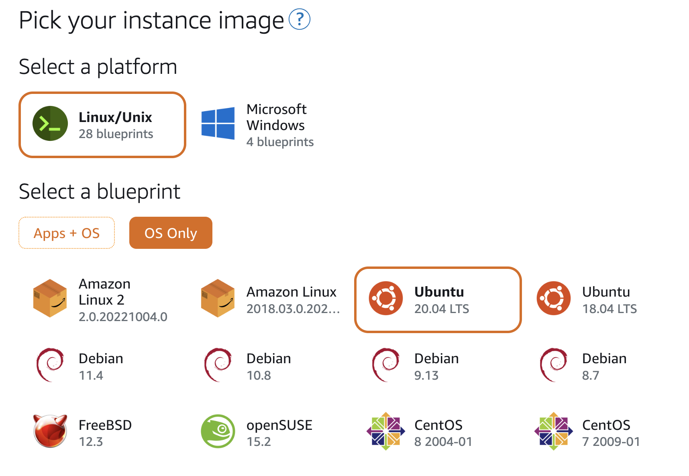

#### 4. Scroll down to 'Choose your instance plan'.

#### 5. Select the '$5 USD' instance with 1GB memory and 1 vCPU.

## Identify your instance

We need to give the instance resource a name.

#### 6.Name your instance 'Workshop-WordPress'.

#### 7.Click Create instance.

**Good Job!**

You've deployed your first instance on Amazon Lightsail. How was that? We could have added tags to our instance, which you will do later on in this workshop, and we also could have used a 'Launch Script' which is a script with commands that run the first time the instance is created and booted up. Here you could add the commands that we will be doing manually in the next step. However, we wanted to give you the full experience of deploying and configuring these workloads. In the future, feel free to check out the Launch Script feature! Go ahead and click Next and let's configure our WordPress instance!

# 2. Configure Ubuntu

## Open SSH Browser

#### 1. Click Home if you are not redirected to the 'Instances' page.

Sometimes copy/paste between your machine and the SSH web browser can mess up the formatting of the data in the clipboard. If you would rather SSH from your laptop, expand the corresponding steps for Mac or Windows below and skip Step 2.

How to SSH from Putty on Windows => Click [HERE](https://lightsail.aws.amazon.com/ls/docs/en_us/articles/lightsail-how-to-set-up-putty-to-connect-using-ssh) to go to the documentation.

How to SSH from Terminal on a Mac => Click [HERE](https://lightsail.aws.amazon.com/ls/docs/en_us/articles/amazon-lightsail-ssh-using-terminal) to go to the documentation.

#### 2. Wait for the instance to be in the 'Running' state, then click the SSH icon next to the name of the instance to open a browser-based SSH session.


#### 3. Run the following commands to install the pre-reqs as well as WordPress and WordPress CLI:

Sometimes Ubuntu can lose the rest of it's clipboard when pasting in a lot of commands. These are broken up at points known to not continue automatically. Copy and Paste each section, hit Enter and move on to the next code block once the commands complete.

```
# Update the package index
sudo apt update

# Install the common package
sudo apt install software-properties-common -y

```

```

# Add the PHP repository to the instance
sudo add-apt-repository ppa:ondrej/php -y

```

```

# Update the package index now that the new repository has been added
sudo apt update

# Install Apache, PHP, mysql client
sudo apt-get install apache2 php8.0 libapache2-mod-php8.0 php8.0-common php8.0-imap php8.0-mbstring php8.0-xmlrpc php8.0-soap php8.0-gd php8.0-xml php8.0-intl php8.0-mysql php8.0-cli php8.0-bcmath php8.0-ldap php8.0-zip php8.0-curl mysql-client-core-8.0 -y

```

```
# Go to the web folder
cd /var/www/html/

# Download the latest version of WordPress
sudo curl -O https://wordpress.org/latest.tar.gz

# Unzip the files
sudo tar xzvf latest.tar.gz

# Delete the zipped download
sudo rm ./latest.tar.gz

# Move all the WordPress files to the root web directory
cd ./wordpress/ && sudo mv ./* ../

# Create the WordPress Config file from the sample
sudo cp /var/www/html/wp-config-sample.php /var/www/html/wp-config.php

# Change the permissions for the directory
sudo chown -R www-data /var/www

# Remove the sample config file
sudo rm /var/www/html/wp-config-sample.php

# Go back up a level and delete index.html
cd ../
sudo rm ./index.html

# Download WP-CLI
sudo curl -O https://raw.githubusercontent.com/wp-cli/builds/gh-pages/phar/wp-cli.phar

# Make it executable
sudo chmod +x wp-cli.phar

# Move it to the bin directory
sudo mv wp-cli.phar /usr/local/bin/wp

# Create the wp-cli config file that points to our WordPress folder
echo "path: /var/www/html" > $HOME/wp-cli.yml

# Enable the GD PHP extension by removing the ';'
sudo sed -i 's/;extension=gd/extension=gd/' /etc/php/8.0/apache2/php.ini

# Restart the apache service
sudo /etc/init.d/apache2 restart

```

Our WordPress instance needs to know where the database is and how to login so that the WordPress files can be installed and created in the MySQL database.

#### 4. We will need to copy the following code block to a text editor so that we can update the URL of our database.

Once the code below is pasted in a text editor, go back to your browser tab on the Lightsail Databases page, click on Workshop-HA-Instance.

```
sudo wp config set DB_USER LightsailAdmin --allow-root
sudo wp config set DB_PASSWORD Sunny2DAY! --allow-root
sudo wp config set DB_NAME dbWordPress --allow-root
```

#### 5. Copy the Database Endpoint URL from the Lightsail Databases page.

#### 6. Replace 'YOUR_DATABASE_ENDPOINT_URL' with the endpoint of your database. It should look something like: 'ls-b29db08eb530807da32b98b49b9504986ece0030.chi6kqvuuhir.us-west-2.rds.amazonaws.com'

**YOU MUST CHANGE THE 'YOUR_DATABASE_ENDPOINT_URL' WITH THE ACTUAL ENDPOINT URL BEFORE EXECUTING THE CODE BELOW.**

```
sudo wp config set DB_HOST YOUR_DATABASE_ENDPOINT_URL --allow-root
```

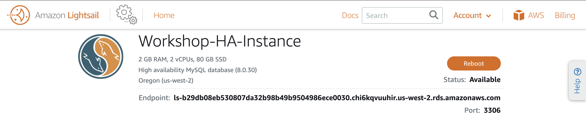

#### 7. Paste your updated command from Step 6 into your SSH session and hit ENTER.

#### 8. Close the SSH window.

**Another Step Done!**

While running all of these commands in an SSH session can seem a little daunting for some, it's good to be able to see what goes into the WordPress instance preparations. There is a WordPress Application Blueprint available in Lightsail that removes all of these steps. However, like the previous page, we wanted to give you the ability to experience all of this first-hand and gain a greater understanding of what happens under the hood on these instances. Click Next and we'll add a static IP!

# 3. Instance Networking

## Give WordPress a Static IP

We want to make sure that the IP address for WordPress does not change if the instance is restarted or updated.

#### 1. Click the Home button and then click Networking.

#### 2. Next, click Static IP.

#### 3. The Static IP location should show 'Oregon, all zones (us-west-2)'. If it does not. Update it to this value.

#### 4. Under 'Attach to an instance', click the dropdown box and select 'Workshop-WordPress'.

#### 5. We need to name our static IP. It may not have the same name as the instance. Clear the default name and type 'Workshop-WordPress-IP'.

#### 6. Click Create.

**That was quick!**

We all like it when things are quick and easy, right? This is a simple step but also an important one to not miss. When configuring an application with a domain name (like example.com) you would point the DNS records for the domain name to the IP address of the instance. This can take anywhere from 1-minute, up to 48-hours to propogate across the internet. Setting the DNS records to a static IP keeps this propogation from having to take place again if you were to deploy a new instance, for example. Simply just re-attach the static IP and you have instant resolution to the web page. Click Next to get your hands dirty configuring WordPress!

# 4. Configure WordPress

## Navigate to your new WordPress site

#### 1. Copy the Public Static IP address and paste it into a new window in your browser.

#### 2. You should now see the installation page for WordPress. This means that it has successfully connected to the remote database and is ready for inputs.

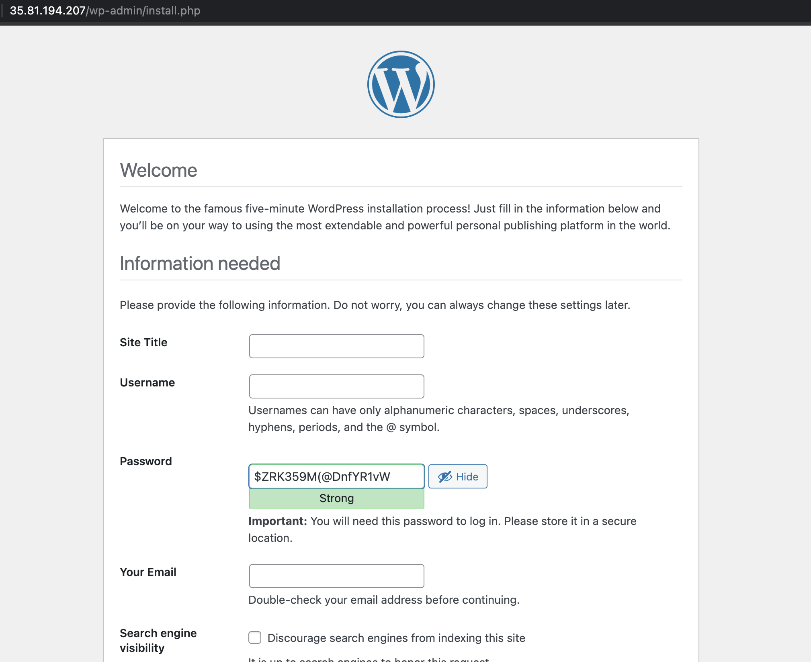

Use the following data to configure WordPress:

```
Site Title: My WorkShop Website
Username: lsadmin
Password: $ZRK359M(@DnfYR1vW
Your Email: lsadmin@example.com
Search Engine Visibility: Checked < With a real site you would leave this unchecked
```

####3. Click Install WordPress

#### 4. WordPress should install successfully. After the Success page comes back, click Log In.


5. use the username and password from Step 2 to login.

There is a lot of cool things we can do with WordPress. If you are new to WordPress and want to learn more, there are links to additional documentation on the Summary pageof this guide. Feel free to change the Theme (Appearance > Themes), add Plugins, or even write a quick blog post and click Publish. You can always come back to this spot in the Workshop if you finish early and spend more time in the software.

**So much to see, so much to do!**

I hope you will learn more about WordPress so you can enjoy the ease of building a website or blog using this tool. There are many different websites and Youtube channels with content on how to customize your site. Click Next when you are ready and we'll head into our E-Commerce section.

# Deploy Prestashop

PrestaShop is an easy-to-use open-source e-commerce platform that allows users to create online shops, as well as integrate them with the payment processors of your choice, WordPress, Accounting software (like Akaunting), and more. This would be a self-hosted alternative to Shopify or Etsy, for example.

## Deploy the Blueprint

#### 1. Click the Home button in the top Lightsail banner which will take you back to the 'Instances' page. Click Create instance.

#### 2. Make sure the Instance location is set to the same as the rest of our resources Oregon, Zone A (us-west-2a).

If it is defaulted to a different location or availability zone, click Change AWS Region and Availability Zone and select the correct values.

#### 3. Scroll down and select PrestaShop as the blueprint of choice.

Choose your instance plan 4. Select the $5 USD isntance with 1GB Memory & 1vCPU.

Identify your instance 5. Name your instance 'Workshop-PrestaShop'. 6. Click Create instance.

**Easy Peasy Lemon Squeezy**

I hope you felt more comfortable deploying a Lightsail Blueprint this time around! You'll be even faster when you deploy the third and final instance! Click Next to add a static IP to your PrestaShop instance.

# Prestashop Networking

Anytime an instance is rebooted, it has the possibility that it will retrieve a new public IP. This is not ideal for our applications as we want consistency and we don't want to update DNS records if we do find that the IP address has changed. This is why we attach static IP's to our instances.

## Set a Static IP

#### 1. Once the instance is 'Running', we'll assign it a Static IP. Click on the name of the instance and then click the Networking tab.

#### 2. under the Public IP address click Create static IP.

#### 3. on the Create Static IP Address page, scroll to the bottom of the page and give the static IP a name.

As before, the name here needs to be unique to all other resources. type PrestaShop-IP and click Create.

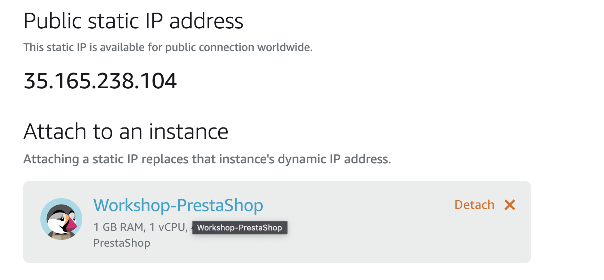

You'll notice that Lightsail not only creates the static IP but also joins it to the resource without you having to click 'attach' like we did in the workflow for WordPress.
Keep track of the new Static IP as we will use it in the next steps.

## Static IP #2 is in the books!

We already talked about the importance of static IP's in the WordPress section. The same still applies here. Let's move on to configuring PrestaShop. Click Next!

# Configure Prestashop

There are a few more steps that need to happen before we can login and configure our e-commerce site.

#### 1. Click the instance name Workshop-PrestaShop, then click Connect using SSH to login to the instance.

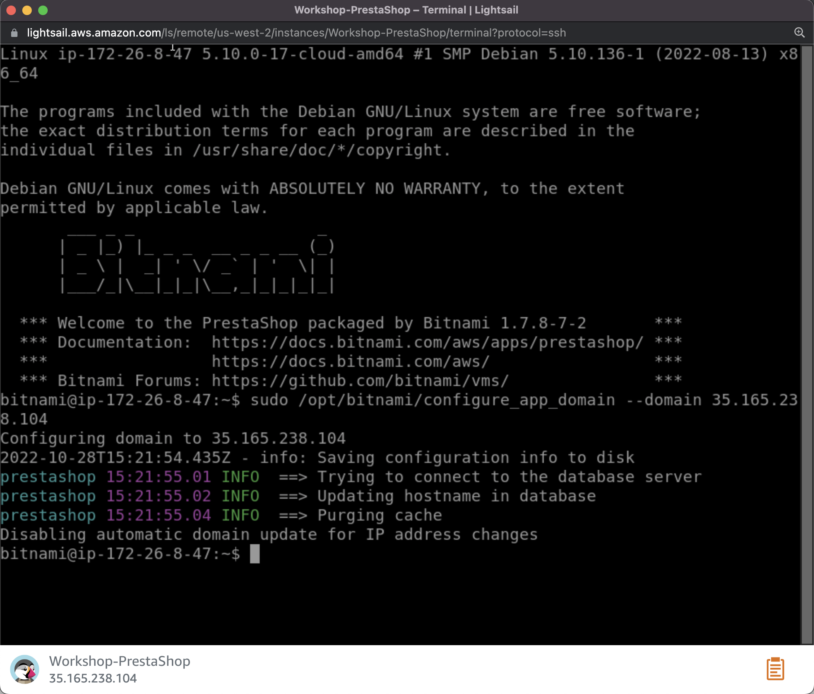

#### 2. Type 'sudo /opt/bitnami/configure_app_domain --domain <your_static_IP>'.

Replace 'your_static_IP' with the static IP address this instance received in the previous steps. Hit Enter.

We are ready to login to our PrestaShop instance for the first time. Now that we've run the initial configuration script, we need to grab the username and password for Prestashop. Because this was deployed using an Application Blueprint, the deployment automatically created login credentials. We will read a file on the instance that stores this information for us.

#### 3. In the SSH console type 'cat ~/bitnami_credentials' and hit enter.

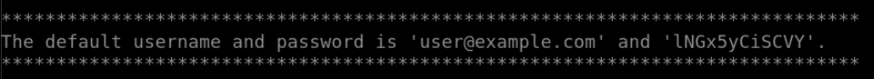

This will return a default username and password. The default username will be 'user@example.com ' and the password will be a random string. Write down your password.

#### 4. In your web browser, type 'http://your_static_ip/administration' and enter your username and password from the previous step.

We are going to change the default username and password to credentials you will remember. 5. In the left navigation pane, scroll down and click Advanced Parameters then click Team.

#### 6. Under Employees click the Pencil icon to the right of the Bitnami User.

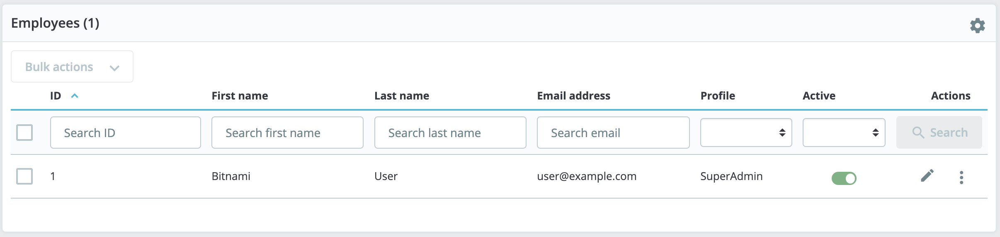

#### 7. Update the values here with your First name, Last name, and email address, and click Change Password (update the password), then click Save

NOTE: If this were a real e-commerce site, we would now configure the domain (or sub domain) to point to the static IP address of this instance, generate an SSL certificate for HTTPS, and turn on HTTPS in PrestaShop. However, we will be skipping these steps because this is a workshop and we do not have a domain name to use right now.

#### 9. In the header of the admin page, right-click View my shop and open in a new tab. This is what your default store looks like.

**Learn More About PrestaShop**

If you would like to configure your store or learn more about how to configure PrestaShop, you can follow this link HERE to PrestaShop's e-learning and training site.

**You've got an e-commerce site!**

This PrestaShop image already has some pre-made products which makes it easier to see what the shop would look like with your own content. Feel free to add some products or make some theme changes here now or come back after you finish the other steps of the Workshop. Let's move on and take care of our finance software instance!

# Deploy Akaunting Instance

We are now moving on to our 3rd and final application, which is the open-source financing application called 'Akaunting'. Akaunting has plugins that tie into WordPress e-commerce as well as PrestaShop. They are premium plugins (fee), so we did not include them in this workshop. Just keep in mind that the software does in fact integrate with other small business tools.

## Deploy the Blueprint

#### 1. Click the Home button in the top Lightsail banner and click Create instance.

#### 2. Make sure the Instance location is set to the same as the rest of our resources Oregon, Zone A (us-west-2a).

If it is defaulted to a different location or availability zone, click Change AWS Region and Availability Zone and select the correct values.

#### 3. Scroll down to 'Select a blueprint' and click on OS Only, then select Ubuntu 20.04 LTS as the blueprint of choice.

Choose your instance plan 4. Select the '$5 USD' instance with 1GB memory and 1 vCPU.

Give the instance the name 'Workshop-Akaunting' then click Create instance.

**You knew the drill!**

4 deploys of either databases or instances already and you're a pro! Easy enough, let's move on to adding the static IP. I bet you can do it by memory already!

# Akaunting Networking

Give your instance a static IP

#### 1. Click on the instance name, then click Networking.

#### 2. Click Create static IP.

#### 3. Scroll down to 'Identify your static IP' and give it a name. Type 'Akaunting-IP'.

#### 4. Click Create.

Just like setting the Static IP for the PrestaShop instance, you do not have additional drop-down's to choose the instance or click 'attach'. Because we are doing this on the instance and not the 'Networking' Lightsail page, we save ourselves a few clicks in the process.

If I had a dollar for every time I set a static IP today...
I'd have $3! Let's learn more about Akaunting and getting it setup. This next section will take a little more focus as it goes a little deeper into configuring Akaunting and running some remote MySQL commands. You ready? Click Next and let's go!!

# Configure Akaunting

## Install Akaunting and required packages

Sometimes copy/paste between your machine and the SSH web browser can mess up the formatting of the data in the clipboard. If you would rather SSH from your laptop, expand the corresponding steps for Mac or Windows below and use the static IP address of the instance rather than following Step 1 below.

How to SSH from Putty on Windows => Click [HERE](https://lightsail.aws.amazon.com/ls/docs/en_us/articles/lightsail-how-to-set-up-putty-to-connect-using-ssh) to go to the documentation.

How to SSH from Terminal on a Mac => Click [HERE](https://lightsail.aws.amazon.com/ls/docs/en_us/articles/amazon-lightsail-ssh-using-terminal) to go to the documentation.

#### 1. Click the instance name, Akaunting, to go back to the instance page. Then click Connect using SSH.

#### 2. Copy and paste the following commands into the SSH window and hit enter.

```

# Update the package lists
sudo apt-get update -y

# Install software to manage independent software vendor sources
sudo apt install software-properties-common -y

```

Once the above commands have finished, copy and paste the next lines of code...

```
# Add the repository for all PHP versions
sudo add-apt-repository ppa:ondrej/php -y

# Install Web server, mySQL client, PHP (and packages), unzip, and curl
sudo apt-get install apache2 mysql-client-core-8.0  php8.0 libapache2-mod-php8.0 php8.0-common php8.0-imap php8.0-mbstring php8.0-xmlrpc php8.0-soap php8.0-gd php8.0-xml php8.0-intl php8.0-mysql php8.0-cli php8.0-bcmath php8.0-ldap php8.0-zip php8.0-curl unzip curl -y

# restart apache just to make sure we're good
sudo systemctl restart apache2

# Download the latest version of Akaunting from their site
curl -O -J -L https://akaunting.com/download.php?version=latest

# Make a directory in our web server folder
sudo mkdir -p /var/www/html/akaunting

# Unpack the files from the downloaded zip
sudo unzip Akaunting_*.zip -d /var/www/html/akaunting/

# Change directory permissions for the software
sudo chown -R www-data:www-data /var/www/html/akaunting/
sudo chmod -R 755 /var/www/html/akaunting/

# Edit the Akaunting configuration file
sudo vi /etc/apache2/sites-available/akaunting.conf

```

Once VI is open, copy and paste the following code into the editor.

Important
The following code will not copy correctly in the browser-based SSH session. You will need to re-adjust the formatting to look the same as it does here.

Update 'your_static_ip' with the static IP of this instance.

```
# Paste the following
<VirtualHost *:80>
ServerAdmin admin@example.com
DocumentRoot /var/www/html/akaunting
ServerName your_static_ip
DirectoryIndex index.html index.php

<Directory /var/www/html/akaunting/>
Options +FollowSymlinks
AllowOverride All
Require all granted
</Directory>

ErrorLog ${APACHE_LOG_DIR}/akaunting_error.log
CustomLog ${APACHE_LOG_DIR}/akaunting_access.log combined
</VirtualHost>

```

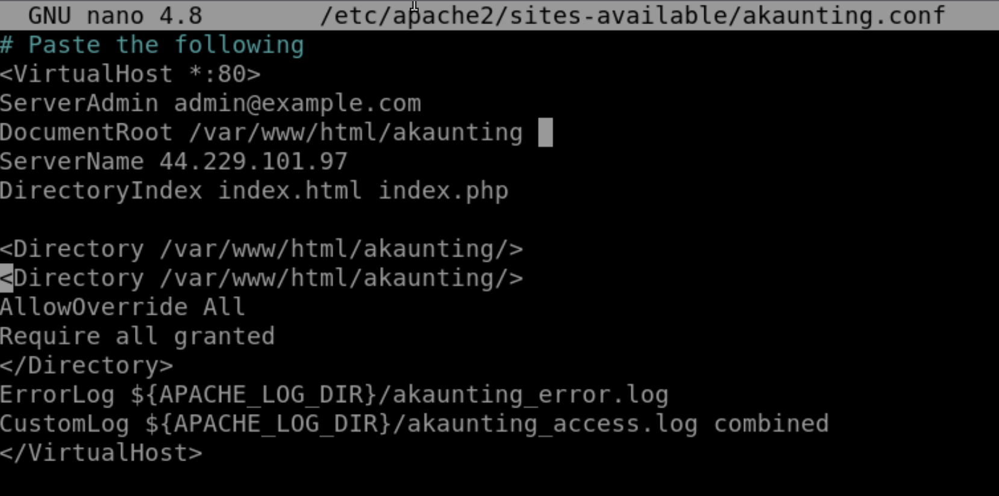

#### 4. Once it looks like the code above hit the Esc button on your keyboard, then type wq! and hit Enter to save the file.

#### 5. Run the following code in the SSH window

```
# Enable Apache2 virtualhost configuration for Akaunting
sudo a2ensite akaunting

# Enable specified module in apache configuration
sudo a2enmod rewrite

# Restart the apache service to make changes live.
sudo systemctl restart apache2

```

**Web PreReq Installation Complete!**

This has successfully configured your Akaunting Instance to host the website (front-end) of the application. Next, we will configure a remote database for the software to use.

# Create a new database on our Lightsail Database Instance for Akaunting

Before we can install Akaunting, we need a database for the data to reside in. Remember, earlier in this workshop we deployed a remote MySQL Lightsail database instance and a WordPress database. We are going to create a 2nd database on the same database instance as the WordPress database to take advantage of utilizing existing resources.

#### 1. paste the following command into your SSH console, (edit the database endpoint URL to match your database endpoint), and hit enter.

```
mysql -u LightsailAdmin -pSunny2DAY! -h YOUR_DATABASE_ENDPOINT

```

This command is logging you into the remote Lightsail Database instance where:

```
-u = MySQL Username
-p = Password (note there is no space between the -p and the beginning of the password)
-h = Host URL. If we used a different port other than the default, we'd have additional parameters to specify.
```

#### 2. Now that we are connected to the remote database instance, we will create a new database for our Akaunting app. type 'CREATE DATABASE akaunting;' and hit enter.

#### 3. We will create a new database user for the akaunting database and give it all privileges. Run the following commands in the SSH session:

```
create user 'accountant'@'localhost' identified by 'Exnte3x!';

grant all privileges on akaunting.* to 'accountant'@'localhost';

flush privileges;

exit;

```

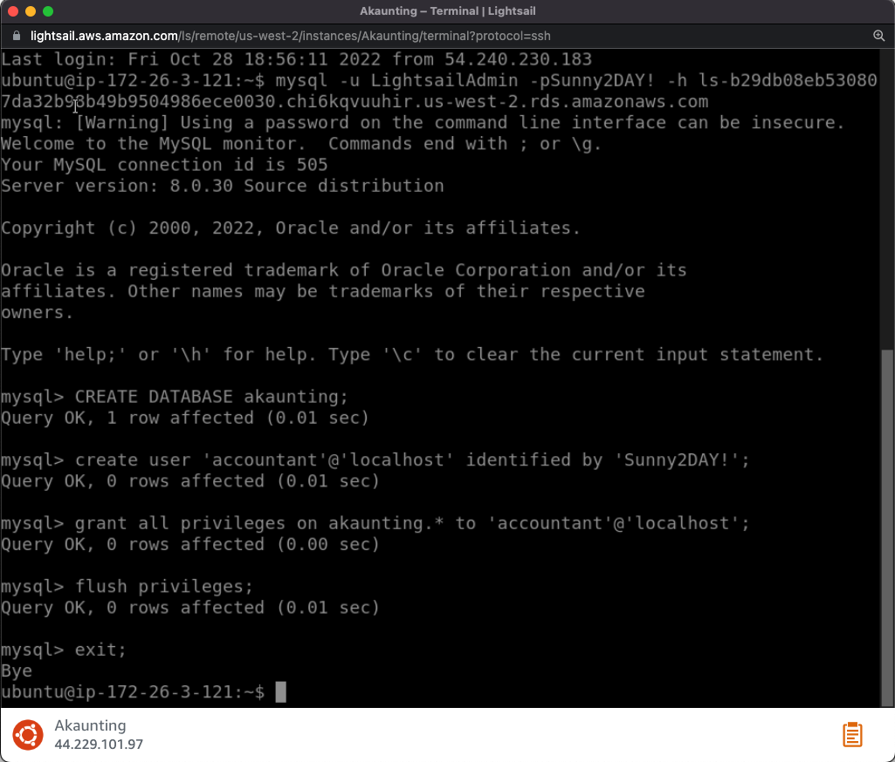

We are now ready to run the installation of the akaunting app.

#### 4. In your browser, navigate to the static IP of your Akaunting instance.

You should now be re-directed to the installation page for Akaunting. If it does not automatically re-direct you, try pasting the static IP into the browser followed by '/install/language'. and hit Enter.

#### 5. Select the language you prefer and click Next.

#### 6. Enter the database credentials we created in steps 1-3 in the corresponding textboxes:

```
Hostname: your_lightsail_database_endpoint
Username: LightsailAdmin
Password: Exnte3x!
Database: akaunting

```

click Next.

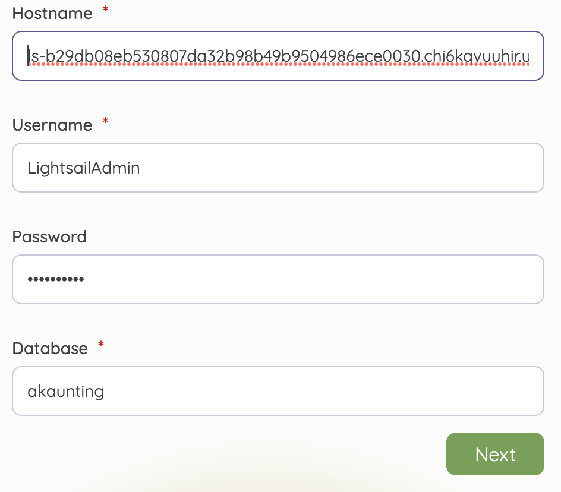

If everything was entered correctly, the 'Next' button will appear to blink white dots as if it is loading. We will let it run for a few minutes.

#### 7. On the next page, use the following data for the Admin values:

```
Company Name: Example Co.
Company email: admin@example.com
Admin Email: admin@example.com
Admin Password: S@ndyBeach3s!
```

Click Next.

#### 8. You can now login and enter business-specific details for your business.

Input your new username and password in the prompts and click Login.

#### 9. On the 'Company' page, click Skip this step.

#### 10. on the 'Currencies' page, click Next.

#### 11. on the 'Taxes' page, click Next.

#### 12. Now the software is ready, click Create your first invoice (Under the astronaut).

#### 13. Click the Dashboard button in the top left of the page.

You've now setup your Akaunting software enough to begin adding invoices, payments, customers, and other items. Feel free to take a few minutes and familiarize yourself with this software. You can also click [HERE](https://akaunting.com/hc/docs/) to visit the Akaunting documentation page to learn more.

Now that we've setup our final application and added a database to the existing Lightsail Database Instance, let's add a tag to the database instance to reflect what is running in it.

#### 14. In the Lightsail console, click Databases.

#### 15. Click on the Database instance name, then click Tags.

#### 16. Click Edit key-only tags and enter 'Akaunting'. Click Save.

**Well Done!**

Although it was only 16 steps, this was the longest section of the workshop! Between remote-mySQL commands, additional Shell commands on Ubuntu to setup Akaunting, and adding tags to the database instance, I think you've gotten a lot of good experience in this section. When you are ready, let's move on to the Next section around securing our applications.

# Secure the Applications

One of the AWS Well-Architected Framework pillars is 'Security'. It is important that we keep our instances, databases, and applications as secure as possible. We have used different passwords for our different applications and databases already, in addition, we want to shrink the attack surface of our applications as small as possible.

An attack surface are points of possible entry or accessible locations that an attacker can try to enter. For each Lightsail instance, we want to close as many ports as possible without disrupting accessibility, to decrease the locations where an attacker could gain access.

## Close SSH Ports

It's good to understand how we work with our Lightsail instances. To communicate with our instances, either through Terminal/Putty SSH or using the in-browser SSH console, we require that port 22 is open. However, once we are done configuring our applications, we should disable port 22 to increase security hardening of our instances. Until we need to login and do more configurations to the instance itself, at which time we can open Port 22.

## Start with WordPress

We'll start first with WordPress.

#### 1. On the Instances tab, click Workshop-WordPress.

#### 2. Click Networking.

#### 3. Scroll down to 'IPv4 Firewall' and click the 'modify' icon on the 'SSH' row.


Here you'll see that you can restrict access to Port 22 several different ways:

a) [Good] Restrict access from the Lightsail browser SSH (users can still access SSH through other tools though).

b) [Better] Restrict to IP address, which allows you to only access the port from specific IP addresses (think of your house, office, etc).

c) [Best] We can remove all access to port 22 (click Cancel then click the Trashcan icon).

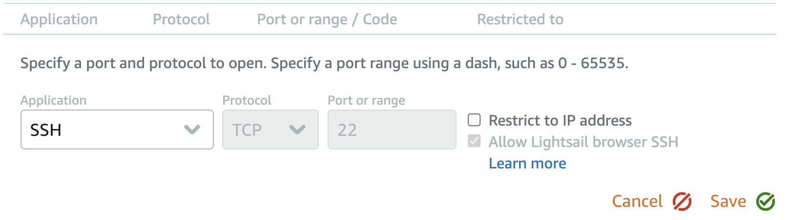

Since we do not need to login to our instance anymore, we will remove all access to port 22.

#### 1. Click Cancel.

#### 2. Click the Trashcan Icon on the SSH row.

#### 3. Scroll down to the 'IPv6 firewall' section.

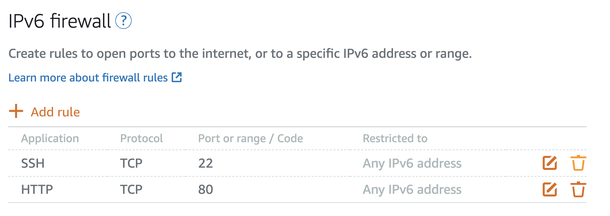

#### 4. Repeat 'Step 2'.

#### 5. Scroll back to the top of the page and click the Connect tab.

You will see that Browser SSH is now disabled (along with any other SSH).

## PrestaShop and Akaunting

We will repeat the same steps for PrestaShop and Akaunting.

#### 6. Repeat Steps 1-5 for both 'PrestaShop' and 'Akaunting' instances.

Note: In a real environment we would be enabling SSL (HTTPS) certificates and pushing all traffic to HTTPS. We would also enable HTTPS (TCP 443) on each of the instances to allow connections through that port.

#### 7. Click Next in this guide once SSH has been disabled on for both IPv4 and IPv6 for all 3 instances.

**Secure is good!**

While strong passwords and firewall rules are important, there are other steps that generally can be taken to secure your instances even more. Some of those include keeping all applications on the instance up-to-date, as well as uninstalling any applications that you are not actually using. Hope you enjoyed this section, let's move on to Snapshots! Click Next.

# Create Snapshots

Continuing with best-practices, once we have our applications the way that we want them, it is wise to perform a snapshot of that instance. This ensures that you have a copy that you can re-deploy quikcly and easily if something happens to your current instance.

### Amazon Lightsail provides two types of snapshots:

A) Manual snapshots: Create a backup of your instance, its system disk, and attached disks. Snapshots occur when you click Create snapshot or invoke the 'CreateInstanceSnapshot' API. CreateInstanceSnapshot [API](https://docs.aws.amazon.com/lightsail/2016-11-28/api-reference/API_CreateInstanceSnapshot.html)

Note: Manual snapshots are not deleted if the instance is deleted. Automatic snapshots ARE deleted. Before doing anything

B) Automatic snapshots: Snapshots that occur every 24 hours at the hour that you choose. Lightsail will store the most recent 7 snapshots.

If you have a site that changes/is updated daily or multiple times a day, we recommend that you use automatic snapshots.

## Create Instance Snapshot

#### 1. Click Home and click on Akaunting.

#### 2. Select Snapshots, Click on the Automated Snapshots toggle switch.

Note: Both automatic and manual snapshots are billed at the same rate of $0.05GB/mo. This is not included in the monthly instance price.

#### 3. Click the I understand checkbox, then click Yes, Enable.

The default snapshot time is 12:00 AM (midnight) we will change the default time in the next step.

#### 4. Click Change snapshot time and choose any time that you want.

#### 5. Click Coordinated Universal Time and select the other timezone.

#### 6. lick Change.

#### 7. Follow the previous Steps 1-6 for the 'Workshop-PrestaShop' instance as well.

#### 8. Click on the 'Workshop-Wordpress' instance. Select Snapshots.

#### 9. Under 'Manual snapshots' click Create snapshot.

Name the snapshot 'Workshop-WordPress-Manual-Snapshot', then click Create.

While waiting for the snapshot to finish successfully, we will create a snapshot of our managed Lightsail Database.

#### 11. Click Home, then click Databases.

#### 12. Click on the name of our database ('Workshop-HA-Instance').

#### 13. Click Snapshots & restore.

Notice that you can only create manual snapshots of your database.

#### 14. Click Create snapshot. Name your snapshot 'Workshop-HA-Instance-Backup'.

#### 15. Click Create. This will also take a few minutes to complete.

You can choose to wait to see that it creates successfully, or you can go back to the WordPress instance and wait for the WordPress instance to finish successfully.

#### 16. Wait for the WordPress snapshot to finish being created.

#### 17. Click Next in the workshop to move onto the next section.

**Snapshots, Get your Snapshots!**

Snapshots are an easy thing to overlook until you realize you need to restore something. Generally, I prefer to create two manual snapshots. 1) When all settings and configurations are set and working (clean install) and 2) Once I have my application live for visitors/customers. More info can be found on Snapshots in a link on the Summary page at the end of this workshop. Let's move on to Migrating to larger instances. Click that Next button!

# Migrate to Larger Instances

As your website or applications gains traction the amount of resources you will need to satisfy the traffic will continue to increase. Lightsail makes it easy to grow your website or application with a few simple clicks of the mouse. In this section, we will increase the resources of our WordPress website to handle more concurrent connections.

To be able to move to a larger instance we will need a manual snapshot of the current instance (which should have been completed in the previous section). If you are not still in the snapshot page, Go to 'Home' > 'Workshop-WordPress' > Snapshots.

#### 1. Click on the 3 vertical dots on the right-side of the snapshot row.

#### 2. Click Create new instance.

You will see the snapshot source and the instance location. We will keep all of these settings the same.

#### 3. We will enable automatic snapshots. click the Enabled Automatic Snapshots checkbox.

#### 4. Under 'Choose a new instance plan' we will increase our instance size from the 1GB/1vCPU instance to the $20 4GB/2vCPU instance. Click $20 USD.

#### 5. Our instance will need a new name under 'Identify your instance', type 'Workshop-WordPress-Medium' to denote the difference between the original size and the new size.

#### 6. click Create instance.

It is currently not possible to change the name of an instance after it has been deployed without creating a snapshot and creating a new instance (and name) from the snapshot.

A new instance will deploy. We now need to attach the static IP from the original WordPress site to the new one.

#### 7. Click on the Workshop-WordPress instance.

#### 8. Click the Networking tab.

#### 9. Under 'PUBLIC IP', click Detach. then click Yes, detach.

#### 10. Click the Home button at the top of the page and click on the new WordPress instance 'Workshop-WordPress-Medium'.

#### 11. Click the Networking tab.

#### 12. Under 'PUBLIC IP', click Attach static IP. Click on the dropdown and select 'Workshop-WordPress-IP', then click Attach.

#### 13. You can now copy the static IP into your browser and attempt to resolve the site.

#### 14. If your WordPress site resolves correctly, and everything looks good we can go ahead and remove the old instance.

#### 15. Click the Home button and click the 3 vertical dots on the right of 'Workshop-WordPress' name.

#### 16. click Delete.

#### 17. This will remove the instance, but it will not remove the manual snapshot we created. We will keep that for now as a backup in case it's needed. Click Yes, delete.

#### 18. You will now be back to having 3 instances.

**Migrations Are Easy!**

Many times, users will develop their site on a small instance and then deploy the final product on an instance with more resources to ensure it can handle the load of visitors and users. Other times, our customers outgrow their initial instances and need a bigger one. I hope this process was easy for you to see how quickly you can get a larger instance up and running as you grow your online presence. Let's head over to the Alarms section and learn more about uptime! Click Next.

# Create Alarms

Alarms are meant to inform the admin if a particular event occurs so that the admin can either adjust the instance or be aware of what is happening. Alarms will give you a heads up if your instance crashes, CPU utilization spikes, requiring either additional instances or a migration to a larger instance as we did in the previous section. In the following steps, you will learn about these alarms and create several alarms for your instances.

Because PrestaShop is where we would theoretically be making our money, let's focus on that instance for now.

#### 1. Click on the Workshop-Prestashop instance name.

#### 2. Then, Click on the Metrics Banner button.

#### 3. Under 'Metric graphs' click the CPU overview button.

These are all of the metrics visible to customers for the instance. the metrics are evaluated every 5 minutes.

#### 4. Click CPU burst capacity (percentage).

#### 5. Scroll down to 'Alarms' and click Add alarm.

We will create two alarms. One when the burst capacity is below 50% and another when it is below 25%.

As burst capacity is a central part of Amazon Lightsail, it's important to understand how instances accrue burst capacity and how it is used. For more reading on the topic, check out this article [HERE](https://lightsail.aws.amazon.com/ls/docs/en_us/articles/amazon-lightsail-viewing-instance-burst-capacity) on the Lightsail website.

#### 6. Keep the option on less than or equal to and change the input to 50 percent. keep the threshold for 2 times within the last 10 minutes.

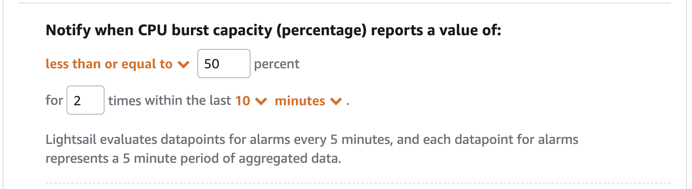

#### 7. Select to be notified by Email.

#### 8. When prompted, click Add contact.

#### 9. Enter a valid email address and click Add contact.

#### 10. You will need to verify your email address. For this workshop we will not be sending any alarms, however, if you were to correctly set up the alarms, you would need to verify your email address within 24 hours.

Click I understand.

#### 11. Expand Advanced settings and read through the options, but leave the value at it's default.

#### 12. Click Create.

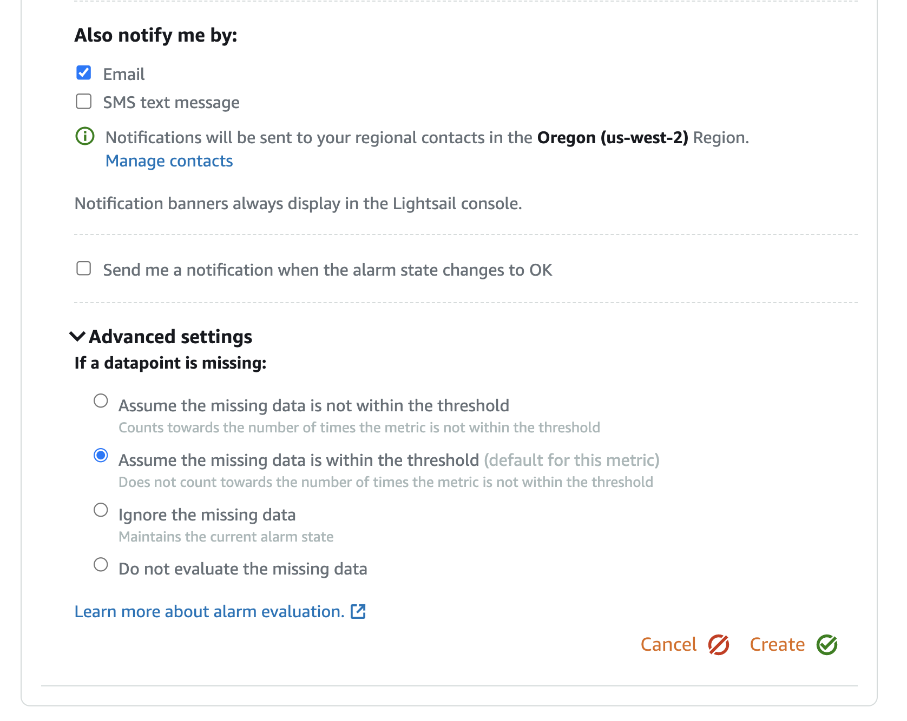

#### 13. You will now see your newly created alarm. Click Add alarm again and we will create the second alarm.

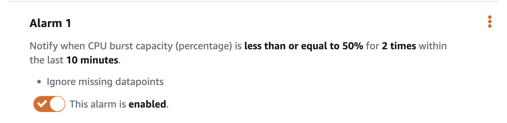

#### 14. Leave all settings now as default, also select Send me a notification when the alarm state changes to OK.

#### 15. Click Create.

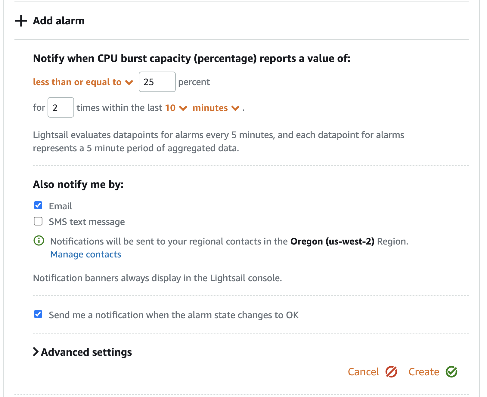

#### 16. If you scroll up to the graph, you will now see two lines, one for each of the alarms, to show the threshold on when they will trigger.

You can use these previous steps to setup additional alarms for any of the instances we've deployed. Being able to identify a problem before it impacts your users is an essential part of the ongoing operations of your business.

**Isn't it... 'Alarming!'**
We've successfully managed to setup alarms for our instance to let us know if we begin to run out of burst capacity on our WordPress instance. Setting up alerts for your instances is an important aspect of maintaining uptime and ensuring that if something does happen to your instance, you can react quickly and add additional resources, create additional instances, or even simply reboot the instance if needed.
