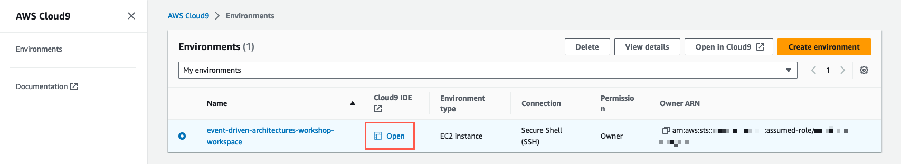
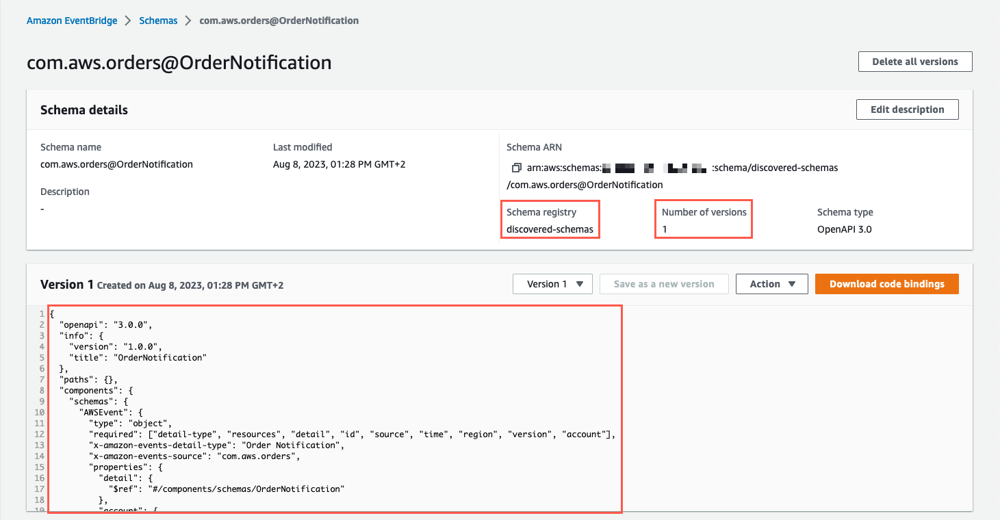
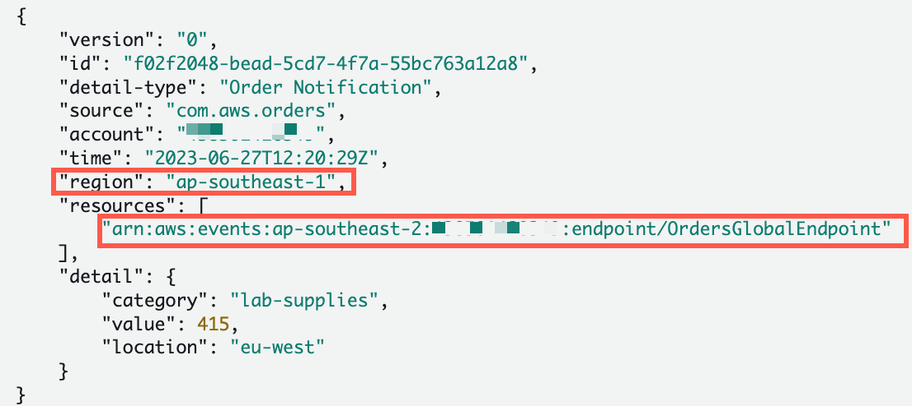

Getting started
To get started, follow these instructions to setup your AWS Account:

Self Hosted

Important
Only complete this [section](https://catalog.workshops.aws/workshops/63320e83-6abc-493d-83d8-f822584fb3cb/en-US/getting-started/self-hosted) if you would like to run this workshop in your own account.

## 1. Launch the AWS CloudFormation template

This workshop can be run inside your own AWS accounts. To enable you to follow the labs, we need to set up and configure a number of AWS services. We have made provisioning these services as simple as possible

By executing these templates, you are taking responsibility for the lifecycle and costs associated with provisioning them. Please follow the tear-down instructions to remove all resources from your AWS account once you have finished the workshop to avoid incurring unexpected costs.

We will leverage AWS CloudFormation which allows us to codify our infrastructure. Select your preferred region to which you will deploy the template. Just click the Launch link to create the stack in your account.

US East (N. Virginia) us-east-1 - [Launch](https://us-east-1.console.aws.amazon.com/cloudformation/home?region=us-east-1#/stacks/quickcreate?stackName=aws-event-driven-architectures-workshop&templateURL=https://aws-event-driven-architecture-workshop-assets.s3.amazonaws.com/master-v2.yaml)

#### 1. Enter a stack name (or just keep the default name)

#### 2. Check the boxes in the Capabilities section

#### 3. Click Create stack


Important
Ensure that you have a Default VPC created in the region you are deploying this template to. If you don't have one the set up will fail. To create a new Default VPC open the Amazon VPC Console, got to Your VPCs and select Create default VPCs from the Actions menu.

# Event-driven with EventBridge


Amazon EventBridge is a serverless event bus service that makes it easy to connect your applications with data from a variety of sources. EventBridge delivers a stream of real-time data from your own applications, Software-as-a-Service (SaaS) applications, and AWS services and routes that data to targets such as AWS Lambda. You can set up routing rules to determine where to send your data to build application architectures that react in real time to all of your data sources.

EventBridge simplifies the process of building event-driven architectures. With EventBridge, your event targets don’t need to be aware of event sources, and vice versa, leading to loosly coupled architectures. EventBridge lets you filter the events before they are sent to the targets, making sure that each target receives only the events they are interested in. Event-driven architectures are loosely coupled and distributed, which improves developer agility as well as application resiliency.

Concepts
Events - An event indicates a change in an environment. This can be an AWS environment, an SaaS partner service or application, or one of your own custom applications or services.

Rules - A rule matches incoming events and routes them to targets for processing. A single rule can route to multiple targets, all of which are processed in parallel. Rules aren't processed in a particular order. This enables different parts of an organization to look for and process the events that are of interest to them. A rule can customize the JSON sent to the target, by passing only certain parts or by overwriting it with a constant.

Targets - A target processes events. Targets can include Amazon EC2 instances, Lambda functions, Kinesis streams, Amazon ECS tasks, Step Functions state machines, Amazon SNS topics, Amazon SQS queues, and built-in targets. A target receives events in JSON format.

Event buses - An event bus receives events. When you create a rule, you associate it with a specific event bus, and the rule is matched only to events received by that event bus. Your account has one default event bus, which receives events from AWS services. You can create custom event buses to receive events from your custom applications. You can also create partner event buses to receive events from SaaS partner applications.

In this module, you will use EventBridge to learn how to create an event bus, route events to targets using rules, and use scheduling expressions to create recurring events.

# First event bus and targets


In this module, you will create a custom EventBridge event bus, Orders, and an EventBridge rule, OrderDevRule, which matches all events sent to the Orders event bus and sends the events to a CloudWatch Logs log group, /aws/events/orders. See the diagram above:

The technique of logging all events to CloudWatch Logs is useful when implementing EventBridge rules.

## Step 1: Create a custom event bus

#### 1. Open the [AWS Management Console for EventBridge](https://us-west-2.console.aws.amazon.com/events/home?region=us-west-2#/) in a new tab or window, so you can keep this step-by-step guide open.

#### 2. On the EventBridge homepage, under Events, select Event buses from the left navigation.

#### 3. Click Create event bus.

#### 4. Name the event bus Orders.

#### 5. Leave Event archive and Schema discovery disabled, Resource-based policy blank.

#### 6. Click Create.

## Step 2: Set up Amazon CloudWatch target (for development work)

A simple way to test and get rapid feedback for the rules you create for your event bus is to use Amazon CloudWatch as a target. We will create a rule for the Orders bus that will act as a "catch-all" for every event passed to the bus, irrespective of source.

**All events warning**

When All events is selected as the event source, EventBridge will send every event that comes to this event bus to this rule. This may result in an extremely high number of target invocations and incur additional costs. In addition, it is possible to create rules that lead to infinite loops, where a rule is triggered repeatedly. To prevent this, we recommend you write rules so that the triggered actions do not re-trigger the same rule. In this workshop we will scope all events coming from the source com.aws.orders

#### 1. From the left-hand menu, select Rules.

#### 2. From the Event bus dropdown, select the Orders event bus

#### 3. Click Create rule

#### 4. Define rule detail:

- Add OrdersDevRule as the Name of the rule
- Add Catchall rule for development purposes for Description
- Select Rule with an event pattern for the Rule type

#### 5. In the next step, Build event pattern

- under Event source, choose Other
- Under Event pattern, further down the screen, enter the following pattern to catch all events from com.aws.orders:

```
{
   "source": ["com.aws.orders"]
}

```

- Select next.

Take this opportunity to familiarize yourself with some the options available for AWS services, there are many examples of pre-defined patterns that are used for service events. You'll be creating your own custom event patterns in the next section.

#### 6. Select your rule target:

- From the Target dropdown, select CloudWatch log group
- Name your log group /aws/events/orders


#### 7. Skip through the configure tags section, review your rule configuration and click Create.

## Step 3: Test your dev rule

#### 1. Select the Event buses in the left pane and select Send events to test the newly created event rule.

#### 2. Make sure that the custom event is populated with the following:

- Event Bus selected to Orders
- Source should be com.aws.orders
- In the Detail Type add Order Notification
- JSON payload for the Event detail should be:

```
{
   "category": "lab-supplies",
   "value": 415,
   "location": "eu-west"
}

```

#### 3. Click Send.

#### 4. Open the AWS Management Console for CloudWatch in a new tab or window, so you can keep this step-by-step guide open.

#### 5. Choose Log groups in the left navigation and select the /aws/events/orders log group.

#### 6. Select the Log stream.

#### 7. Toggle the log event to verify that you received the event.

## Step 4: Review event structure

Take note of the event structure and data! A sample event is provided below for your reference.

In the following sections, you will use event data to implement EventBridge custom rules to route events. Due to the OrdersDevRule that you created in this section, all events to the Orders event bus will be sent to CloudWatch Logs, which you can use to view sample data in order to implement and troubleshoot rules matching logic.

```
{
    "version": "0",
    "id": "c04cc8c1-283c-425e-8cf6-878bbc67a628",
    "detail-type": "Order Notification",
    "source": "com.aws.orders",
    "account": "111111111111",
    "time": "2020-02-20T23:10:29Z",
    "region": "us-west-2",
    "resources": [],
    "detail": {
        "category": "lab-supplies",
        "value": 415,
        "location": "eu-west"
    }
}
```

## Next steps

OK, now that we have our first target configured, let's configure some more targets for our Orders event bus. In the next section, Working with EventBridge Rules, you will look more closely at how to use the event pattern matching and integration with other services.

# Working with EventBridge rules


Rules match incoming events and routes them to targets for processing. A single rule can route to multiple targets, all of which are processed in parallel. Rules aren't processed in a particular order. A rule can customize the JSON sent to the target, by passing only certain parts or by overwriting it with a constant. EventBridge supports 28+ AWS service targets!

In this module, you will walk through the steps to create an Orders event bus rule to match an event with a com.aws.orders source and to send the event to an Amazon API Gateway endpoint, invoke a AWS Step Function, and send events to an Amazon Simple Notification Service (Amazon SNS) topic.

The event bus targets (API Gateway endpoint, AWS Step Functions state machine, and Amazon SNS topic) have been provisioned for you. The goal is for you to write event bus rules to match events and verify delivery to the appropriate target.

## Rule matching basics

Events in Amazon EventBridge are represented as JSON objects and have the following envelope signature:

```
{
  "version": "0",
  "id": "6a7e8feb-b491-4cf7-a9f1-bf3703467718",
  "detail-type": "EC2 Instance State-change Notification",
  "source": "aws.ec2",
  "account": "111111111111",
  "time": "2017-12-22T18:43:48Z",
  "region": "us-west-1",
  "resources": [
    "arn:aws:ec2:us-west-1:123456789012:instance/ i-1234567890abcdef0"
  ],
  "detail": {
    "instance-id": " i-1234567890abcdef0",
    "state": "terminated"
  }
}
```

Rules use event patterns to select events and route them to targets. A pattern either matches an event or it doesn't. Event patterns are represented as JSON objects with a structure that is similar to that of events. For example, the following event pattern allows you to subscribe to only events from Amazon EC2.

```
{
  "source": [ "aws.ec2" ]
}
```

The pattern simply quotes the fields you want to match and provides the values you are looking for.

The sample event above, like most events, has a nested structure. Suppose you want to process all instance-termination events. Create an event pattern like the following.

```
{
  "source": [ "aws.ec2" ],
  "detail-type": [ "EC2 Instance State-change Notification" ],
  "detail": {
    "state": [ "terminated" ]
  }
}
```

It is important to remember the following about event pattern matching:

- For a pattern to match an event, the event must contain all the field names listed in the pattern. The field names must appear in the event with the same nesting structure.
- Other fields of the event not mentioned in the pattern are ignored; effectively, there is a "_" : "_" wildcard for fields not mentioned.
- The matching is exact (character-by-character), without case-folding or any other string normalization.
- The values being matched follow JSON rules: Strings enclosed in quotes, numbers, and the unquoted keywords true, false, and null.
- Number matching is at the string representation level. For example, 300, 300.0, and 3.0e2 are not considered equal.

For more information on pattern matching, refer to the [Events and Event Patterns in EventBridge](https://docs.aws.amazon.com/eventbridge/latest/userguide/eb-events.html) documentation.

# API Destination Challenge

**Challenge goal**

Process all events for source com.aws.orders via an Amazon EventBridge API Destination. In this use case we are demonstrating how you might integrate EventBridge with third party public API endpoints using an outbound webhook with Basic Auth configured.

## Step 1: Identify the API URL

Open the [AWS Management Console for CloudFormation](https://console.aws.amazon.com/cloudformation/home#) . You can find the API URL for this challenge in the Outputs of the CloudFormation Stack with a name containing ApiUrl.

## Step 2: Configure the EventBridge API Destination with basic auth security

#### 1. Open the AWS Management Console for EventBridge in a new tab or window, so you can keep this step-by-step guide open.

#### 2. On the EventBridge homepage, select API destinations from the left navigation.

#### 3. On the API destinations page, select Create API destination.

#### 4. On the Create API destination page

- Enter api-destination as the Name
- Enter the API URL identified in Step 1 as the API destination endpoint
- Select POST as the HTTP method
- Select Create a new connection for the Connection
- Enter basic-auth-connection as the Connection name
- Select Basic (Username/Password) as the Authorization type
- Enter myUsername as the Username
- Enter myPassword as the Password

#### 5. Click Create

## Step 3: Configure an EventBridge rule to target the EventBridge API Destination

#### 1. From the left-hand menu, select Rules.

#### 2. From the Event bus dropdown, select the Orders event bus.

#### 3. Click Create rule

#### 4. On the Define rule detail page

- Enter OrdersEventsRule as the Name of the rule
- Enter Send com.aws.orders source events to API Destination for Description

#### 5. Under Build event pattern

- Choose Other for your Event source
- Copy and paste the following into the Event pattern, and select Next to specify your target:

```
{
    "source": [
        "com.aws.orders"
    ]
}
```


Take a moment and study the event pattern that you pasted. The event pattern allows you to subscribe to only events that has a source from com.aws.orders.

#### 6. Select your rule target:

- Select EventBridge API destination as the target type.
- Select api-destination from the list of existing API destinations

#### 7. Click Next and finish walking through the rest of the walk-through to create the rule.

## Step 4: Send test Orders event

Below is sample data to test your rule. If you don't remember how to use Send events function to send an event, please refer to the previous section.

Using the Send events function, send the following Order Notification events from the source com.aws.orders:

```
{ "category": "lab-supplies", "value": 415, "location": "us-east" }
```

## Step 5: Verify API Destination

If the event sent to the Orders event bus matches the pattern in your rule, then the event will be sent to an API Gateway REST API endpoint.

#### 1. Open the AWS Management Console for CloudWatch Log Groups in a new tab or window, so you can keep this step-by-step guide open.

#### 2. Select the Log group with an API-Gateway-Execution-Logs prefix.

#### 3. Select the Log stream.

#### 4. Toggle the log event to verify the basic authorization was successful and the API responds with a 200 status.

**Congratulations!** You have successfully created your first custom event. We will now present additional challenges for you to complete. A description of the goal, sample data, and verification steps have been provided, but it is up to you to write the correct event pattern. Remember, use CloudWatch Logs to troubleshoot your rule implementation, if you are not able to verify your rule.

# Step Functions Challenge

**Challenge goal**

Process only orders from locations in the EU (eu-west or eu-east) using a AWS Step Functions target (OrderProcessing). In this use case, we are demonstrating how a Step Function execution can be triggered to process orders as they are published by the Orders bus.

## Step 1: Implement an EventBridge rule to target Step Functions

Use the EventBridge Console to:

#### 1. Add a rule to the Orders event bus with the name EUOrdersRule

#### 2. Define an event pattern to match events with a detail location in eu-west or eu-east

#### 3. Target the OrderProcessing Step Functions state machine

Here is a sample event to reference when writing the event pattern:

```
{
    "version": "0",
    "id": "6e6b1f6d-48f8-5dff-c2d2-a6f22c2e0086",
    "detail-type": "Order Notification",
    "source": "com.aws.orders",
    "account": "111111111111",
    "time": "2020-02-23T15:35:41Z",
    "region": "us-east-1",
    "resources": [],
    "detail": {
        "category": "office-supplies",
        "value": 300,
        "location": "eu-west"
    }
}
```

## Step 2: Send test EU Orders events

Using the Send events function, send the following Order Notification events from the source com.aws.orders:

```
{ "category": "office-supplies", "value": 300, "location": "eu-west" }
```

```
{ "category": "tech-supplies", "value": 3000, "location": "eu-east" }
```

## Step 3: Verify Step Functions workflow execution

If the event sent to the Orders event bus matches the pattern in your rule, then the event will be sent to the OrderProcessing Step Functions state machine for execution.

#### 1. Open the AWS Management Console for Step Functions in a new tab or window, so you can keep this step-by-step guide open.

#### 2. On the Step Functions homepage, open the left hand navigation and select State machines.

#### 3. Enter OrderProcessing in the Search for state machines box and verify the state machine execution has succeeded.

The Step Functions state machine will publish an OrderProcessed event back to the Orders event bus, using a new Service Integration for EventBridge which provides a simpler solution for producing events during a workflow execution. We will make use of this event later in the workshop. If you would like to see more detail on the workflow execution, select OrderProcessing from the list of state machines, and then select the workflow execution from the list.

Congratulations! You have successfully completed the Step Functions Challenge.

**Extra credit**

Implement an event pattern using [Prefix Matching](https://docs.aws.amazon.com/eventbridge/latest/userguide/eb-event-patterns-content-based-filtering.html#filtering-prefix-matching) that matches events with a location the begins with eu-. Do not modify the Step Function target and verify backwards compatibility by reusing the sample data above. Modify the test data to use a location, eu-south, to verify that additional EU locations trigger execution of the Step Functions state machine.

**Extra credit**

Implement an event pattern using [Prefix Matching](https://docs.aws.amazon.com/eventbridge/latest/userguide/eb-event-patterns-content-based-filtering.html#filtering-prefix-matching) and [Numeric Matching](https://docs.aws.amazon.com/eventbridge/latest/userguide/eb-event-patterns-content-based-filtering.html#filtering-numeric-matching) that matches events with a location the begins with eu- AND an Order value greater than 1000. Do not modify the Step Function target and verify backwards compatibility by reusing the sample data above.

## SNS Challenge

**Challenge goal**

Process only orders from US locations (us-west or us-east) that are lab-supplies using a Amazon SNS target (Orders). Similar to the previous use case, but using SNS.

## Step 1: Implement an EventBridge rule to target SNS

Use the EventBridge Console to:

#### 1. Add a rule to the Orders event bus with the name USLabSupplyRule

#### 2. With an event pattern to match events with a detail location in us-west or us-east, and a detail category with lab-supplies.

#### 3. Target the Orders SNS topic

Here is a sample event to reference:

```
{
    "version": "0",
    "id": "6e6b1f6d-48f8-5dff-c2d2-a6f22c2e0086",
    "detail-type": "Order Notification",
    "source": "com.aws.orders",
    "account": "111111111111",
    "time": "2020-02-23T15:35:41Z",
    "region": "us-east-1",
    "resources": [],
    "detail": {
        "category": "lab-supplies",
        "value": 300,
        "location": "us-east"
    }
}
```

## Step 2: Send test US Orders events

One of the following events should match the event rule pattern and one should not. Use CloudWatch Logs to verify events that were successfully sent to EventBridge but were not delivered to the target.

Using the Send events function, send the following Order Notification events from the source com.aws.orders:

```
{ "category": "lab-supplies", "value": 415, "location": "us-east" }
```

```
{ "category": "office-supplies", "value": 1050, "location": "us-west", "signature": [ "John Doe" ] }
```

## Step 3: Verify SNS topic

If the event sent to the Orders event bus matches the pattern in your rule, then the event will be sent to the Orders SQS Queue (via Orders SNS Topic).

#### 1. Open the AWS Management Console for SQS in a new tab or window, so you can keep this step-by-step guide open.

#### 2. On the SQS homepage, select the Orders queue.

#### 3. Select the Send and receive messages button.

#### 4. Select Poll for Messages and verify the first message was delivered and the second was not.

#### 5. To clean up, select the event, select the Delete button, and select the Delete button again on the Delete Messages confirmation dialog.

**Congratulations!** You have successfully completed the SNS Challenge.
**Extra credit**

Implement an event pattern using Exists Matching that matches events which do NOT require a signature (ie. signature does not exists). Do not modify the SNS target and verify backwards compatibility by reusing the sample data above.

# Scheduling expressions for rules

You can create rules that self-trigger on an automated schedule in EventBridge Scheduler using cron or rate expressions. You can specify the time zone, and the minimum precision for schedules is 1 minute.

EventBridge Scheduler supports cron expressions and rate expressions. Rate expressions are simpler to define but don't offer the fine-grained schedule control that cron expressions support. For example, with a cron expression, you can define a rule that triggers at a specified time on a certain day of each week or month. In contrast, rate expressions trigger a rule at a regular rate, such as once every hour or once every day. You can also choose a flexible time window that allows Scheduler to invoke your schedule within the time window you specify.

Let's give it a try!

## Step 1: Create a schedule in EventBridge Scheduler

#### 1. Open the [AWS Management Console for EventBridge Scheduler](https://console.aws.amazon.com/scheduler/home) in a new tab or window, so you can keep this step-by-step guide open.

#### 2. Click the Create schedule button.

#### 3. On the Create schedule page:

- Add OrdersProcessing as the Name of the schedule
- Add Runs processing of orders every minute Monday to Friday for Description
- Leave default for Schedule group

#### 4. In the Schedule Pattern section of the page:

- Select Recurrent schedule.
- Select Cron-based schedule for Schedule type
- Add \* _ ? _ MON-FRI \* in the Cron expression. This will schedule a message to be delivered every minute, Monday through Friday.
- Select Off for Flexible time window

#### 5. Leave the Timeframe section with its default values

#### 6. Click Next

#### 7. We are going to send messages to the previously created Orders event bus on a schedule. On the Target details page:

- Select Templated Targets
- Select Amazon EventBridge PutEvents


#### 8. On the Target details page:

- Select Orders event bus
- Enter scheduled-event for Detail-type
- Enter com.aws.orders for Source
- Enter the following as a message body we will be sending to the event bus:

```
{ "category": "lab-supplies", "value": 500, "location": "us-east" }
```

#### 9. Click Next


#### 10. You can optionally send the failed messages to a dead-letter queue as well. We will not be doing it for this lab, but it's good to be aware of this option.

#### 11. In order to send events to the target EventBridge Scheduler needs a corresponding execution role. Select Create new role for this schedule under Permissions.

#### 12. Click Next and then finish creating the schedule clicking Create schedule on the next screen.

## Step 2: Verify scheduled message delivery

Wait 2-3 minutes and check the results. Every minute a new message should arrive to the Orders event bus, which should already have an OrdersDevRule set up to send all the events to the aws/events/orders CloudWatch Log group.

#### 1. Open the AWS Management Console for CloudWatch in a new tab or window.

#### 2. Choose Log groups in the left navigation and select the /aws/events/orders log group.

#### 3. Observe the Log streams - a new one should be created every minute.

## Step 3: Change the end date of the schedule

#### 1. Go back to the list of schedules AWS Management Console for EventBridge Scheduler and click on your schedule.

#### 2. Click Edit.

#### 3. Scroll back to the Timeframe section and set End date and time to 1-2 minutes after your current time.

#### 4. Click Next through the next several screens and then finally Save schedule.

#### 5. Check again you aws/event/orders CloudWatch Log Group after that end time to make sure that the events have stopped coming.

**Congratulations!** You have just completed your first schedule for an Amazon EventBridge Scheduler. Next, we are going to explore how to create EventBridge partner event sources.

# Working with SaaS partners


Amazon EventBridge enables customers to build event-driven applications that subscribe to events from any participating software-as-a-service (SaaS) product without needing to write undifferentiated connection code. SaaS providers can enhance and extend their platform by publishing their events to EventBridge. They can rely on EventBridge to manage the routing of those events to customers in a reliable and secure manner. This capability enables customers to react to events emitted by SaaS applications as easily and reliably as they react to events originating from other AWS services. The events can then be sent to AWS services such as AWS Lambda, Amazon SQS, Amazon SNS, or Amazon Kinesis Data Firehose.

## Introducing the Amazon EventBridge SaaS Integration Playground

[Wild Rydes](https://wildrydes.com/) has teamed up with AWS to create the Amazon EventBridge SaaS Integration Playground. Here you can test out how an EventBridge SaaS event source works before you actually create one with one of our [growing list of integrated SaaS partners](https://docs.aws.amazon.com/eventbridge/latest/userguide/eb-saas.html#eb-supported-integrations) .

The EventBridge SaaS Integration Playground creates a real "wildrydes.com" partner event sources in your account, just like you would with any one of our partners. In this section we will walk through how to set up this partner event source, create a partner event bus, and send test events from the EventBridge SaaS Integration Playground.

# Creating partner event sources

## 1. Connect your AWS account with Amazon Cognito

Amazon EventBridge SaaS Integration Playground is secured by an Amazon Cognito User Pool. Here are three options getting you started quickly

#### 1. To access and configure the EventBridge SaaS Integration Playground, open the AWS CloudFormation Console and open the outputs tab for the workshop stack. Open the WildRydesSaasPlaygroundConfigurationUrl hyperlink to pre-load your application security configuration (please note, the values for the user and identity pool for the application are also available on the Resources tab).

Once the Amazon EventBridge SaaS Integration Playground website is open, click on the Configure Cognito User Pool button. This will open a modal dialogue box with the Cognito User pool you have the User Pool information configured.

Complete the configuration of your account by entering the user name and password for the Cognito User Pool.

You are ready to go! Now, lets add our Playground Partner Event Source.

## 2. Create an event source in your specified region

Once you have successfully logged into your account, it's time to create a partner event source in your account. Creating a partner event source at this stage only establishes a connection between the Amazon EventBridge SaaS Integration Playground and your account. You cannot consume events until you have associated the event source in your account with an event bus that you create. We will complete this step in the next section.

Note Partner event sources that you create through the Amazon EventBridge SaaS Integration Playground are only valid for 3 days. You can only create one event source per region. To change region, you need to delete the event source first.

#### 1. Make sure your account number is visible in the AWS Account ID field. If not you may need to log back into your account as described in the previous step.

#### 2. Select a region in which you would like to create the partner event source and click Create event source button.

#### 3. If you have created the event source successfully you should see "Event source created"

## 3. Associate the partner event source with an event bus

Our next step is to associate the partner event source with and event bus, so we can begin to process messages from the Amazon EventBridge SaaS Integration Playground.

#### 1. Open the Amazon EventBridge console and navigate to Partner event sources.

#### 2. Select the wildrydes.com event source you just created in the Amazon EventBridge SaaS Integration Playground website. Note, at this stage, the Status is Pending and there is no event bus associated with this partner event source.

#### 3. Click Associate with an event bus

#### 4. On the Associate with event bus screen, click Associate to create a new event bus. Leave the Resource policy blank to accept the default resource policy.

You should now see the newly created event bus associated with your partner event source and the Status of Active

## 4. Create a rule for the partner event source event bus

In order to test the partner event source, you first need to create a rule on your event bus. Create a rule, with a target of your choice.

CloudWatch logs makes it easy to visualise your event and test your integrations manually. If you need a reminder of how to set this up, revisit the sections we completed earlier - Section 2.1 First event bus and targets if you need to refresh your memory on how to do this.

## 5. Send partner events

#### 1. Open the Amazon EventBridge SaaS Integration Playground again.

#### 2. Scroll dow to section "4. Send test partner events"

#### 3. Select the AWS EventBridge partners to send to your partner event bus. You can choose to send a single event, or send a stream of events (30 events, 1 event every second, for 30 seconds).

#### 4. Verify that the events have reached your Cloudwatch log group you set in the target. If you have configured everything correctly you should see a log entry like this

**Congratulations!** You have created your first Amazon EventBridge partner integration! That was easy! Now try out some of the other partner event sources and see what else you can build.

# Using the schema registry


Our business grows and we received a new feature request from our stakeholders. They want to send every new order information to the Third-Party service that will be used to forecast a demand for different products. It will help us with requesting additional stock in advance and keeping up with a demand.

The deadline for this feature is very strict and it must be implemented as fast as possible with limited development resources. To reduce development time, we will use EventBridge Schema Registry and Schema Discovery features. We already have custom Order events getting published to our EventBridge custom bus. We will enable Schema Discovery to automatically get schema for this event and we will generate code bindings that we will use to implement our Lambda business logic.

Doing all these steps manually is a time-consuming process and often require multiple iterations to get everything working without issues. Instead we can generate strongly typed Code Bindings for Java, Python and Typescript programming languages and use them in our code right away. Schema Discovery will also detect changes to event schema and automatically generate new schema versions.

## Schema registry

The EventBridge schema registry stores event schema in a registry that other developers can easily search and access in your organization, so you don’t have to find events and their structure manually. The registry also allows you to generate code bindings for programming languages such as Java, Python, or TypeScript directly in your IDE so that the event can be used as an object in your code. By turning on schema discovery for an event bus, the schemas of events are automatically discovered and added to the registry, removing the need to create a schema for an event manually. Schemas for all AWS services are automatically visible in your schema registry, and the schemas for integrated SaaS applications are visible when you turn on schema discovery for the SaaS partner event bus. Learn more in this blog post .

## Schema discovery

Schema discovery automates the process of finding schemas and adding them to your registry. When schema discovery is enabled for an EventBridge event bus, the schema of each event sent to the bus is automatically added to the registry. If the schema of an event changes, schema discovery automatically creates a new version in the registry. Once a schema is added to the registry, you can generate a code binding for the schema, either in the EventBridge console or directly in your IDE.

## Code bindings

Once a schema is added to the registry, you can download a code binding. This allows you to represent the event as a strongly typed object in your code, and take advantage of IDE features such as validation and auto-complete. Code bindings are available for Java, Python, or TypeScript programming languages. You can download bindings from the AWS Management Console, or directly from your IDE with the AWS Toolkit plugin for IntelliJ and VS Code.

If you use the [AWS Serverless Application Model (SAM)](https://aws.amazon.com/ru/serverless/sam/) , you can now use the interactive sam init command to generate a serverless application with a schema as a trigger. This automatically adds a class file for the schema to your code, and generates a handler function that serializes the trigger event into an object. This makes it quicker to build serverless event-driven applications.

# Enabling schema discovery

Before we can generate Code Bindings and use them as a part of our software development process, we need to enable Schema Discovery on our Orders event bus. It will allow us to automatically discover schemas for events published to this bus.

**Requirements for the module**

If you do not have Orders event bus created as a part of previous implementation, please complete First event bus and targets module.

## Step 1: Enable schema discovery

To enable Schema Discovery please follow next steps:

#### 1. Open the [AWS Management Console for EventBridge](https://console.aws.amazon.com/events/home) in a new tab or window, so you can keep this step-by-step guide open.

#### 2. On the EventBridge homepage, open the left-hand navigation:

#### 3. From the left-hand menu, select Event buses.

#### 4. Click on Orders event bus:

#### 5. Click on Start discovery button at the top right corner:

#### 6. Return back to the Event buses page and check that Schema discovery is enabled for Orders event bus:

#### 7. We enabled Schema discovery for our bus and now schema will be automatically generated for all custom events published to our Orders event bus. Schema discovery will also detect changes to existing custom event schema and will create new versions for these events.

## Next steps

We successfully enabled Schema Discovery for our Orders event bus. In the next section we will create Cloud9 that we will use for Code Bindings generation and for the implementation of our business logic.

# Events and Schema Discovery

We enabled Schema Discovery on our Orders event bus. Let's publish a test event and learn how to work with Discovered Schema Registry.

## Step 1: Open AWS Cloud9

We are going to use AWS Cloud9 for our software development tasks. Cloud9 is a cloud-based integrated development environment (IDE) that lets you write, run, and debug your code with just a browser. It includes a code editor, debugger, and terminal.

A Cloud9 environment has already been created for you. Let's open it:

#### 1. Open the AWS Management Console for Cloud9 in a new tab or window.

#### 2. On the Cloud9 homepage, open the left-hand navigation:

#### 3. From the left-hand menu, select Your environments.

#### 4. Open the event-driven-architectures-workshop-workspace IDE



## Step 2: Publishing of test events and Schema Registry

Please follow next steps to publish test Order Notification event:

#### 1. Create a new folder called Events. Right mouse click on your root folder and from drop-down menu select New Folder

#### 2. Within Events folder create a new file with a name OrderNotification_v1.json:

#### 3. Double-click on OrderNotification_v1.json file to open a new editor window, copy our test event content into it and save the file:

```
[
  {
    "EventBusName": "Orders",
    "Source": "com.aws.orders",
    "Detail": "{ \"category\": \"lab-supplies\", \"value\": 415, \"location\": \"eu-west\" }",
    "DetailType": "Order Notification"
  }
]
```

**Congratulations!**

We created our test event that we will use for Schema Discovery. Let’s publish our event and generate Code Bindings for it.

#### 1. In our terminal window lets navigate to our test events folder by running the next command:

```
cd Events
```

#### 2. To publish our test event we need to run next AWS CLI command:

```
aws events put-events --entries file://OrderNotification_v1.json
```

#### 3. After event is published we should see a response with EventId:

```
{
   "FailedEntryCount": 0,
   "Entries": [
      {
            "EventId": "97ab4670-939e-8fa9-d187-b1178f75fc46"
      }
   ]
}
```

#### 4. Open the [AWS Management Console for EventBridge](https://us-east-1.console.aws.amazon.com/events/home?region=us-east-1#) .

#### 5. From the left-hand menu, select Schemas and click on Discovered schema registry tab. You will see a schema for Order Notification event that we published earlier:


If you do not see a schema for Order Notification event, try to publish it several more times.

6. If you click on the event schema, you can see additional details, such as Number of versions, Schema definition and Schema Registry it belongs to. You can also download, delete and export specific schema version and generate Code Bindings for Java 8+, Python 3.6+ and TypeScript 3+:



## Next steps

We learned how to create test events, publish them using AWS CLI and how to find Discovered Events in Schema Registry. In the next section we will learn how to author Lambda function from scratch, generate Code Bindings for Order Notification event and will use them in our Python code.

# Using code bindings

In this step we will create a Lambda function and deploy it using AWS SAM. We will consume the Order Notification event, run some business logic and see how easy is to add new functionality using Schema Discovery and AWS SAM CLI.

## Step 4: Generate code bindings

Please follow next steps to create a new Lambda function:

#### 1. In you Cloud9 environment please navigate to the root folder of your environment by running the next command:

```
cd ../environment
```

#### 2. We will run a series of commands using AWS SAM CLI to create our sample Lambda function. We will start with sam init:

```
sam init
```

#### 3. Select AWS Quick Start Templates to generate a sample Lambda project:

```
Which template source would you like to use?
     1 - AWS Quick Start Templates
     2 - Custom Template Location
Choice: 1
```

#### 4. Select Infrastructure event management as the Quick Start application template:

```
Choose an AWS Quick Start application template
      1 - Hello World Example
      2 - Data processing
      3 - Hello World Example with Powertools for AWS Lambda
      4 - Multi-step workflow
      5 - Scheduled task
      6 - Standalone function
      7 - Serverless API
      8 - Infrastructure event management
      9 - Lambda Response Streaming
      10 - Serverless Connector Hello World Example
      11 - Multi-step workflow with Connectors
      12 - GraphQLApi Hello World Example
      13 - Full Stack
      14 - Lambda EFS example
      15 - Hello World Example With Powertools for AWS Lambda
      16 - DynamoDB Example
      17 - Machine Learning
Template: 8
```

#### 5. Select python 3.11 as the runtime to use:

```
Which runtime would you like to use?
     1 - go1.x
     2 - go (provided.al2)
     3 - java17
     4 - java11
     5 - java8.al2
     6 - java8
     7 - python3.9
     8 - python3.8
     9 - python3.7
     10 - python3.11
     11 - python3.10
Runtime: 10
```

#### 6. We are going to consume our previously discovered Order Notification event, so please select EventBridge App from scratch (100+ Event Schemas) as the starter template:

```
Select your starter template
      1 - EventBridge Hello World
      2 - EventBridge App from scratch (100+ Event Schemas)
Template: 2
```

#### 7. We do not need X-Ray in this application, so answer N to the next question:

```
Would you like to enable X-Ray tracing on the function(s) in your application?  [y/N]: N
```

#### 8. We do not need CloudWatch Application Insights in this application, so answer N to the next question:

```
Would you like to enable monitoring using CloudWatch Application Insights?
For more info, please view https://docs.aws.amazon.com/AmazonCloudWatch/latest/monitoring/cloudwatch-application-insights.html [y/N]: N
```

#### 9. Please use forecast-service as the Project Name:

```
Project name [sam-app]: forecast-service
```

#### 10. We will use default AWS profile and our event AWS region, so answer Y to the next question:

```
Do you want to use the default AWS profile [default] and region [us-east-1]? [Y/n]: Y
```

#### 11. We want to use the newly discovered schema in our project, so please select discovered-schemas as our Schema registry:

```
Which Schema Registry would you like to use?
      1 - aws.events
      2 - discovered-schemas
Schema Registry: 2
```

#### 12. If you have only one discovered schema, the AWS SAM CLI will automatically use it and will generate a sample Lambda project for you. If you have more than one discovered schema, please select com.aws.orders@Order Notification schema from the list:

```
Which Schema would you like to use?
      1 - com.aws.orders@OrderNotification
      2 - com.aws.orders@OrderShipped
Event Schemas: 1
```

#### 13. You should get a new folder forecast-service in your Cloud9 environment. It contains sample event that can be used for testing in events folder, hello_world_function folder with our sample Lambda and template.yaml file with AWS SAM definition for our project:


**Code Bindings for custom events**

If you want to get additional Code Bindings for your code, you can manually download them from AWS Console website or generate them using AWS CLI.

AWS CLI example:

#### 1. First you need to publish code bindings for the programming language of you choice by running put-code-binding command. In this example we are publishing Order Notification event code bindings for Python:

```
aws schemas put-code-binding --registry-name discovered-schemas --schema-name com.aws.orders@OrderNotification --language Python36
```

#### 2. When code bindings are published, we can download them using get-code-binding-source command. In this example we are downloading code bindings for Order Notification event:

```
aws schemas get-code-binding-source --registry-name discovered-schemas --schema-name com.aws.orders@OrderNotification --language Python36 OrderNotification_v1.zip

```

#### 3. You can later extract the downloaded zip archive by running unzip command on your Linux environment:

```
unzip OrderNotification_v1.zip -d OrderNotification_v1
```

## Next steps

We successfully generated Lambda project to consume our Order Notification event. In the next module we will modify our sample Lambda code and update our AWS SAM yaml template with a new business logic.

# Using SAM

We need to modify our sample Lambda project and add some business logic for our new service.

## Step 5: New service implementation

Let's make several updates to our Lambda project:

#### 1. Find template.yaml file in your forecast-service folder and open it in the editor. What you can see on the screen is a simple AWS SAM template that defines our Lambda function. Using AWS SAM template we can change our function configuration, permissions and event sources:


#### 2. Find commented line that starts with #EventBusName: your-event-bus-name, uncomment it and provide Orders as desired event bus name. If we keep our template as is, the EventBridge rule that our Lambda listen to will be created on default event bus, but it is not what we want:


#### 3. We need to add DynamoDB table to store event details for our forecast service. Please add following statement to the template.yaml file after our Lambda function definition. It is important to keep proper indentation within AWS SAM template:

```
# DynamoDB Orders table definition
OrderDetailsTable:
  Type: AWS::DynamoDB::Table
  Properties:
    TableName: OrderDetails
    BillingMode: PAY_PER_REQUEST
    AttributeDefinitions:
      - AttributeName: orderId
        AttributeType: S
    KeySchema:
      - AttributeName: orderId
        KeyType: HASH
```

#### 4. Let's also provide additional permissions to our Lambda function. Our business logic will store event details in DynamoDB table. We will also publish a new event when Order Notification event is successfully processed and data is available for Third-Party service. Please add next Lambda policy details to our AWS SAM template:

```
      Policies:
      - DynamoDBWritePolicy:
            TableName: !Ref OrderDetailsTable
      - EventBridgePutEventsPolicy:
            EventBusName: Orders
```


Here is a complete version of template.yaml with all updates applied. Please use it as a reference.

```
AWSTemplateFormatVersion: "2010-09-09"
Transform: AWS::Serverless-2016-10-31
Description: >
  forecast-service

  Sample SAM Template for forecast-service

# More info about Globals: https://github.com/awslabs/serverless-application-model/blob/master/docs/globals.rst
Globals:
  Function:
    Timeout: 3

Resources:
  HelloWorldFunction:
    Type: AWS::Serverless::Function # More info about Function Resource: https://github.com/awslabs/serverless-application-model/blob/master/versions/2016-10-31.md#awsserverlessfunction
    Properties:
      CodeUri: hello_world_function
      Handler: hello_world/app.lambda_handler
      Runtime: python3.7
      Architectures:
        - x86_64
      Events:
        HelloWorld:
          Type: CloudWatchEvent # More info about CloudWatchEvent Event Source: https://github.com/awslabs/serverless-application-model/blob/master/versions/2016-10-31.md#cloudwatchevent
          Properties:
            EventBusName: Orders #Uncomment this if your events are not on the 'default' event bus
            Pattern:
              source:
                - com.aws.orders
              detail-type:
                - Order Notification
      Policies:
        - DynamoDBWritePolicy:
            TableName: !Ref OrderDetailsTable
        - EventBridgePutEventsPolicy:
            EventBusName: Orders

  # DynamoDB Orders table definition
  OrderDetailsTable:
    Type: AWS::DynamoDB::Table
    Properties:
      TableName: OrderDetails
      BillingMode: PAY_PER_REQUEST
      AttributeDefinitions:
        - AttributeName: orderId
          AttributeType: S
      KeySchema:
        - AttributeName: orderId
          KeyType: HASH

Outputs:
  # ServerlessRestApi is an implicit API created out of Events key under Serverless::Function
  # Find out more about other implicit resources you can reference within SAM
  # https://github.com/awslabs/serverless-application-model/blob/master/docs/internals/generated_resources.rst#api
  HelloWorldFunction:
    Description: "Hello World Lambda Function ARN"
    Value: !GetAtt HelloWorldFunction.Arn
  HelloWorldFunctionIamRole:
    Description: "Implicit IAM Role created for Hello World function"
    Value: !GetAtt HelloWorldFunctionRole.Arn
```

#### 5. Now we need to update our Lambda function code and implement our business logic. Let's add required Python libraries imports and initialize DynamoDB and EventBridge clients from AWS SDK. Find app.py file in your forecast-service/hello_world_function/hello_world folder and open it in the editor. We need to add next code block before Lambda handler definition - def lambda_handler(event, context): line:

```

# AWS SDK(boto3) and other libraries imports
import boto3
import json
import uuid
import datetime

# DynamoDB client
dynamodb = boto3.resource('dynamodb')
orderDetailsTable = dynamodb.Table('OrderDetails')

# EventBridge client
eventBridgeClient = boto3.client('events')

```


6. We also need to add a business logic to our Lambda handler. Please replace #Execute business logic line with next code block:

```

    # Print Order Notification event details
    print(detail)

    # New order Id
    orderId = str(uuid.uuid4())

    # Save Order Notification details into DynamoDB table
    response = orderDetailsTable.put_item(
       Item={
             'orderId': orderId,
             'category': detail.category,
             'location': detail.location,
             'value': str(detail.value)
       }
    )
    print(response)

    # Publish Order Processed event
    response = eventBridgeClient.put_events(
       Entries=[
             {
                'Time': datetime.datetime.utcnow(),
                'Source': 'com.aws.forecast',
                'DetailType': 'Order Processed',
                'Detail': json.dumps({'orderId': orderId}),
                'EventBusName': 'Orders'
             }
       ]
    )
    print(response)

```


Here is a complete version of app.py with all updates applied. Please use it as a reference.

```
from schema.com_aws_orders.ordernotification import Marshaller
from schema.com_aws_orders.ordernotification import AWSEvent
from schema.com_aws_orders.ordernotification import OrderNotification

# AWS SDK(boto3) and other libraries imports
import boto3
import json
import uuid
import datetime

# DynamoDB client
dynamodb = boto3.resource('dynamodb')
orderDetailsTable = dynamodb.Table('OrderDetails')

# EventBridge client
eventBridgeClient = boto3.client('events')

def lambda_handler(event, context):
   """Sample Lambda function reacting to EventBridge events

   Parameters
   ----------
   event: dict, required
      EventBridge Events Format

      Event doc: https://docs.aws.amazon.com/eventbridge/latest/userguide/event-types.html

   context: object, required
      Lambda Context runtime methods and attributes

      Context doc: https://docs.aws.amazon.com/lambda/latest/dg/python-context-object.html

   Returns
   ------
      The same input event file
   """

   #Deserialize event into strongly typed object
   awsEvent:AWSEvent = Marshaller.unmarshall(event, AWSEvent)
   detail:OrderNotification = awsEvent.detail

   # Print Order Notification event details
   print(detail)

   # New order Id
   orderId = str(uuid.uuid4())

   # Save Order Notification details into DynamoDB table
   response = orderDetailsTable.put_item(
      Item={
            'orderId': orderId,
            'category': detail.category,
            'location': detail.location,
            'value': str(detail.value)
      }
   )
   print(response)

   # Publish Order Processed event
   response = eventBridgeClient.put_events(
      Entries=[
            {
               'Time': datetime.datetime.utcnow(),
               'Source': 'com.aws.forecast',
               'DetailType': 'Order Processed',
               'Detail': json.dumps({'orderId': orderId}),
               'EventBusName': 'Orders'
            }
      ]
   )
   print(response)

   #Make updates to event payload, if desired
   awsEvent.detail_type = "HelloWorldFunction updated event of " + awsEvent.detail_type;

   #Return event for further processing
   return Marshaller.marshall(awsEvent)

```

#### 7. In you Cloud9 environment terminal window please navigate into forecast-service folder by running the next command:

```
cd forecast-service
```

#### 8. Let's deploy our Lambda project. We are going to use AWS SAM CLI deploy command. We will use -g flag that will allow us to save our deployment configuration in samconfig.toml file and use it for future deployments:

```
sam deploy -g
```

#### 9. Please use:

- forecast-service as a Stack Name.
- specify your event AWS Region or press Enter to accept default value.
- set 'n' for changes confirmation. If you specify y, AWS SAM CLI will ask for confimation before depoying you stack into AWS cloud.
- set 'y' to allow AWS CLI create IAM roles as a part of deployment process.
- set 'y' to disable rollback option.
- set 'y' to save your choices into configuration file.
- click Enter to use default 'samconfig.toml' name for AWS SAM configuration file.
- click Enter to use default AWS SAM configuration environment.

#### 10. It will take several minutes to create Lambda function, EventBridge rule and DynamoDB table that we defined in our AWS SAM template. You can monitor progress from your Cloud9 terminal window. AWS SAM CLI will show you a list of resources that will be created and the creation process details.


#### 11. When deployment is completed, you will see a message from the SAM CLI

**Congratulations!**

We successfully deployed our new service to AWS cloud and now we can test that it is working as expected.

## Next steps

We learned how to create Lambda function from scratch, define AWS resources using AWS SAM template and deploy them using AWS SAM CLI. In the next section we will learn how to test our new service and look at invocation results.

# Lambda testing

We need to modify our sample Lambda project and add some business logic for our new service.

## Step 6: New service testing

Let's test our new service:

#### 1. To test our business logic, we need to publish Order Notification event. To do it, we need to get back to our test event folder and publish it using AWS CLI or you can also use Send events function. To publish a test event using AWS CLI please run next commands in your terminal window:

```
cd ../
```

```
cd Events
```

```
aws events put-events --entries file://OrderNotification_v1.json
```

#### 2. Open the [AWS Management Console for Lambda](https://eu-north-1.console.aws.amazon.com/lambda/home?region=eu-north-1#) , select Applications from left-hand menu and click on forecast-service:

#### 3. From the list of Resources at the bottom, click on HelloWorldFunction:

#### 4. Click on Monitor tab and on View logs in CloudWatch button:

#### 5. In the list of our Lambda function log streams click on the top item:

#### 6. In the log you can see our Lambda function invocation details. We sent to log Order Notification event details and invocation results for DynamoDB and EventBridge. As we can see both new business logic steps completed successfully:


#### 7. Let's also check that we have got our Order Notification event details stored in DynamoDB table. Open the [AWS Management Console for DynamoDB](https://eu-north-1.console.aws.amazon.com/dynamodbv2/home?region=eu-north-1) , select Tables from left-hand menu and click on OrderDetails:

#### 8. Click on View items button in the top right corner:

#### 9. You can see a list of items stored in our DynamoDB table. Click on the top item in the list:

#### 10. We can see all attributes that we stored in DynamoDB. This view might be really useful when you have a large number of attributes:


**Congratulations!**

We validated that our business logic is working as expected. We also learned how to access Lambda function logs and how to review items in DynamoDB table.

## Summary

As you can see, it does not take a lot of effort to implement new functionality using Lambda functions and Event-Driven Architectures. Each event that you publish to your event bus is a potential extension point for a new functionality. You can add additional processing or remove it without a need for an event publisher modification.

EventBridge Schema Registry and Schema Discovery are great tools that can save significant amount of time for your development teams. They can help you to implement new functionality faster, with less cost and faster time to market.

# Archive and Replay

In event-driven architectures, it can be useful for services to access past events. This has previously required manual logging and archiving, and creating a mechanism to parse files and put events back on the event bus. This can be complex, since you may not have access to the applications that are publishing the events.

With the [archive and replay](https://docs.aws.amazon.com/eventbridge/latest/userguide/eb-archive.html) feature, EventBridge can record any events processed by any type of event bus. Replay stores these recorded events in archives. You can choose to record all events, or filter events to be archived by using the same event pattern matching logic used in rules.

Event replay can be useful for a number of different use-cases:

- Testing code fixes: after fixing bugs in microservices, being able to replay historical events provides a way to test the behavior of the code change.

- Testing new features: using historical production data from event archives, you can measure the performance of new features under load.

- Hydrating development or test environments: you can replay event archives to hydrate the state of test and development environments. This helps provide a more realistic state that approximates production.

In this module, you will use EventBridge archive and replay feature to learn how to create event archives for an event bus, and then how to replay events.

You will walk through the steps to create an archive for Orders custom EventBus to match an event with a com.aws.orders source. You will then replay historical order events to a new SQS queue being used by a new team to build additional functionality for the product.

# Creating event archives


Let's first enable archive on Orders EventBus to archive all the order related events. Once the archive is set up, You will then be able to replay historical order events to a new SQS queue which will be used by a new team to build additional functionality for the product.

The new system being build by the team is not ready to be tested yet, but as long as we are able to replay historic order events to their SQS queue which they have already created, team will be very happy.

So let's get you started with setup of archive on Orders EventBus!!

Make sure you have completed the First event bus and targets module before beginning this module. Instruction can be found [here](https://catalog.workshops.aws/workshops/63320e83-6abc-493d-83d8-f822584fb3cb/en-US/eventbridge/simple-bus)

## Step 1: Create an event archive

#### 1. To Create an event archive for the Orders event bus, navigate to the [EventBridge console](https://eu-north-1.console.aws.amazon.com/events/home?region=eu-north-1#/) and select Archives from the left-hand submenu. Choose the Create Archive button.

#### 2. On archive details page enter details as below:

- Enter OrderEventArchive for Name and provide an optional description, Archive for Orders.
- Select the Orders bus from the dropdown as Source.
- Enter the number of days to retain the events. After the number of days specified, EventBridge deletes the events from the archive. You can use 30.
- Choose Next.

#### 3. In the Filter events page, you can provide an event pattern to archive a subset of events. Since the team is interested only in orders event for now, you will define a pattern. Choose Filtering events by event pattern matching.

- Select JSON editor to create a pattern manually.
- You can copy the pattern below and then paste it into the JSON editor.


```
{
    "source": [
        "com.aws.orders"
    ]
}
```

#### 4. (Optionally), You can also validate the filter rule by testing it against a custom order event. Click Test event pattern and test sample order event provided below:

```
{
    "version": "0",
    "id": "cb2d8499-426d-944a-334e-b11f8cb18f2a",
    "detail-type": "Order Notification",
    "source": "com.aws.orders",
    "account": "111111111111",
    "time": "2021-10-28T09:59:54Z",
    "region": "eu-west-1",
    "resources": [],
    "detail": {
        "category": "lab-supplies",
        "value": 415,
        "location": "eu-west"
    }
}
```

#### 5. Choose Create archive. In the Archives page, you can see the new archive waiting to receive events.

## Step 2: Send order events to confirm archiving

Now that you have events archive configured for Orders EventBus, you should validate that events are successfully sent to the archive.

#### 1. Select the created OrderEventArchive to open the details page. Over time, as more events are sent to the EventBus, the archive maintains statistics about the number and size of events stored. Currently, there are no events captured.

#### 2. Now you will send few order events using the native Send events functionality to validate if it's captured in the archive as well.

Make sure that the Event Sender is populated with the following:

- Event Bus selected to Orders
- Source should be com.aws.orders
- In the Detail Type add Order Notification
- JSON payload for the Event detail should be:

```
    {
      "category": "office-supplies",
      "value": 1200,
      "location": "eu-west"
    }
```

#### 1. Click Send. You may choose to publish few more sample Order events.

#### 2. To confirm that events are successfully sent to the archive, Navigate to OrderEventArchive [details page](https://eu-north-1.console.aws.amazon.com/events/home?region=eu-north-1#/archives) . You should see Event count and Size in bytes as non-zero depending upon how many events you sent.

**Note:** It might take few minutes before the updated count is visible on the details page.

**Congratulations!** You have successfully configured archive to capture Order events on Orders EventBus.

Wondering how to create archive via AWS Cloudformation?

You can also create archives using [AWS CloudFormation](https://aws.amazon.com/ru/cloudformation/) . The following example creates an archive that filters for a subset of events with a retention period of 30 days:

```
Type: AWS::Events::Archive
Properties:
  Description: Archive for Orders.
  EventPattern:
    source:
      - "com.aws.orders"
  RetentionDays: 30
  SourceArn: arn:aws:events:<region>:<account>:event-bus/OrderEventArchive
```

Curious to learn more what happens under the hood when an archive is created?

Each time you create an archive, this automatically generates a rule on the event bus. This is called a managed rule, which is created, updated, and deleted by the EventBridge service automatically. This rule does not count towards the default 300 rules per event bus [service quota](https://docs.aws.amazon.com/eventbridge/latest/userguide/eb-quota.html) .
When you open a managed rule, the configuration is read-only.


This configuration shows an event pattern that is applied to all incoming events, including those that may be replayed from archives. The event pattern excludes events containing a replay-name attribute, which prevents replayed events from being archived multiple times.

## Next steps

Let's head over to configure a new rule to push events to new SQS queue (already created by the team). You will then replay the order events to process all the archived events onto the newly created rule.

# Replay the order events


You have already created an archive now and team is also ready with a SQS queue called OrdersReplayQueue where they expect the order events to be. In this module, you will:

#### 1. Create an EventBridge rule to target SQS Queue.

#### 2. Replay events from archive onto the created rule.

#### 3. Validate if replayed order events are visible in the SQS queue.

## Step 1: Create an EventBridge rule to target SQS Queue

Refer [Working with EventBridge rules](https://catalog.workshops.aws/workshops/63320e83-6abc-493d-83d8-f822584fb3cb/en-US/eventbridge/rules) module of this workshop to learn more about EventBridge rules
Use the EventBridge Console to:

#### 1. Add a rule to the Orders event bus with the name OrdersReplayRule.

#### 2. With an event pattern to match order events and replay-name attribute present.

#### 3. Ensure that you have selected Orders from the Select event bus panel.

#### 4. Target the OrdersReplayQueue SQS Queue.

Sample event pattern

```
{
  "replay-name": [{
    "exists": true
  }],
  "source": ["com.aws.orders"]
}
```

In this example, a replayed archive will trigger different rule for replayed events only together with source as com.aws.orders. You are making use of the replay-name attribute in your rule to add this advanced routing functionality. By creating a rule that filters for the presence of the replay-name attribute, it ignores all events that are not replays.


## Step 2: Replay events from archive onto the created rule

#### 1. Navigate to the [EventBridge console](https://eu-north-1.console.aws.amazon.com/events/home?region=eu-north-1#/) and select Replays from the left-hand submenu. Choose the Start new replay button.

#### 2. On the Start new replay page:

- Enter OrdersReplay for Name and provide an optional description, Replay archived orders.
- Select a source bus from the dropdown. This must match the source bus for the event archive. In your case, this will be Orders
- For Specify rule(s),Choose Specify rules, and then select the rule OrdersReplayRule.
- Under Replay time frame, specify the Date, Time, and Time zone for the Start time and the End time. Only events that occurred between the Start time and End time are replayed.

#### 3. The Replays page shows the new replay in Starting status. When the events from the archived are replayed, the status of the replay is Completed.

## Step 3: Validate if replayed order events are visible in the SQS queue

#### 1. Navigate to SQS console and select OrdersReplayQueue.

#### 2. Click Send and receive messages on top right corner of details page.

#### 3. In the Receive messages panel, Click Poll for messages. After polling is finished, You should see messages in the queue which are replayed archive order events.

**Congratulations!** You have successfully replayed all the archived order events onto Orders EventBus and eventually to OrdersReplayQueue which can now be used by the new team.

# Global endpoints

[Global endpoints](https://docs.aws.amazon.com/eventbridge/latest/userguide/eb-global-endpoints.html) provide a simpler and more reliable way for you to improve the availability and reliability of event-driven applications. The feature allows you to fail over event ingestion automatically to a secondary Region during service disruptions, without the need for manual interventon.

Global endpoints also provide optional managed event replication, simplifying your event bus configuration and reducing the risk of event loss during any service disruption. You also have the flexibility to configure failover criteria using [Amazon CloudWatch Alarms](https://docs.aws.amazon.com/AmazonCloudWatch/latest/monitoring/cloudwatch-and-eventbridge.html) (through Amazon Route 53 health checks) to determine when to failover and when to route events back to the primary Region.

Global Endpoints can be useful for a number of different use-cases:

Simplify multi-region HA: building highly available applications with limited downtime.

Managed replication: minimize data loss during service discruptions by enabling multi-region replication.

Simplify disaster recovery: reduce operational burden with automatic failover and recovery capability.

# Setting up a global endpoint


To configure a Global endpoint, define two event buses — one in the primary Region (this is the same Region you configure the endpoint in) and one in a secondary Region. To ensure that events are routed correctly, the event bus in the secondary Region must have the same name, in the same account, as the primary event bus. See the diagram above:

**Requirements for the module**

If you do not have Orders event bus created as a part of previous implementation, please complete First event bus and targets module.

## Step 1: Create two event buses in different Regions with the same name

Repeat the steps 1 and 2 from First event bus and targets module to create an Orders event bus and a corresponding rule for CloudWatch in the secondry Region of choice.

## Step 2: Create the global endpoint in your primary Region

#### 1. Open the Amazon [EventBridge console](https://eu-north-1.console.aws.amazon.com/events/home?region=eu-north-1#/) in the Region where you want to create the global endpoint.

#### 2. On the EventBridge homepage, under Events, select Global endpoints from the left navigation.

#### 3. Click Create endpoint.

#### 4. In the Endpoint details panel, name your global endpoint OrdersGlobalEndpoint.

#### 5. In the Primary and secondrey Region event bus details panel, select the Orders event bus in the primary Region and select the secondry Region used when creating the secondary event bus previously.

## Step 3: Create the Route 53 health check for triggering failover and recovery

In this step you will create [Route 53](https://aws.amazon.com/ru/route53/) LatencyFailuresHealthCheck health check and CloudWatch alarm in your account. EventBridge provides a template with recommended defaults for a CloudWatch alarm that is triggered when the average latency exceeds 30 seconds for 5 minutes.

#### 1. In the Failover and recovery panel, choose New health check. This opens [AWS CloudFormation](https://aws.amazon.com/ru/cloudformation/) console.

#### 2. Click Create Stack. This will create the LatencyFailuresHealthCheck health check and CloudWatch alarm in your account.

#### 3. Once the CloudFormation stack is deployed, return to the [EventBridge console](https://eu-north-1.console.aws.amazon.com/events/home?region=eu-north-1#/) and refresh the dropdown list of health checks.

#### 4. Select the physical ID of the health check you created.

## Step 4: Enable Event replication and complete global endpoint setup

#### 1. In the Event replication - optional panel, ensure that event replication is enabled, and create the endpoint.

#### 2. Click Create.

#### 3. Once the endpoint is created, it appears in the console. The global endpoint entry contains the EndpointId, which you must specify in PutEvents API calls to publish events to the endpoint.

## Next steps

OK, now that we have our first globl endpoint configured, let's show you how to publish events to OrdersGlobalEndpoint. In the next section, Using PutEvents API, you will publish test events from AWS CLI and AWS SDK.

# Using PutEvents API

In this section, you will use PutEvents API to publish test events to OrdersGlobalEndpoint from AWS CLI and AWS SDK.

**Requirements for the module**

If you do not have Cloud9 environment configured as a part of previous implementation, please complete Events and Schema Discovery module.

## Method 1: Use the PutEvents API in AWS CLI to publish Order Notification event

#### 1. Open the AWS Management Console for Cloud9 in a new tab or window.

#### 2. Open the event-driven-architectures-workshop-workspace IDE

#### 3. In your terminal window lets navigate to your test events folder by running the next command:

```
cd Events
```

#### 4. To publish our test event you need to run next AWS CLI command after replacing vyrolxj4hu.zhd with your endpoint id from the previous section:

```
   # replace vyrolxj4hu.zhd
aws events put-events --entries file://OrderNotification_v1.json --endpoint-id vyrolxj4hu.zhd
```

#### 5. After event is published we should see a response with EventId:

```
{
   "FailedEntryCount": 0,
   "Entries": [
      {
            "EventId": "97ab4670-939e-8fa9-d187-b1178f75fc46"
      }
   ]
}
```

#### 6. Open the [CloudWatch](https://eu-north-1.console.aws.amazon.com/cloudwatch/home?region=eu-north-1#home:) in a new tab or window, select your primary region, and choose Log groups in the left navigation and select the /aws/events/orders log group.

#### 7. Open the [CloudWatch](https://eu-north-1.console.aws.amazon.com/cloudwatch/home?region=eu-north-1#home:) in a new tab or window, select your secondry region, and choose Log groups in the left navigation and select the /aws/events/orders log group.

#### 8. Review and compare published Order Notification event in both primary Region and secondry Region and observe that

- Events routed via global endpoints have identical resource fields, which contain the Amazon Resource Name (ARN) of the global endpoint that routed the event to the event bus.
- Region field shows the origin of the event. The event in the secondary Region is ap-southeast-2, showing the source of the event was the event bus in the primary Region.

**Order Notification event in the primary Region (ap-southeast-2):**


**Order Notification event in the secondry Region (ap-southeast-1):**


The two preceding events are identical except for the id. Event IDs can change across API calls so correlating events across Regions requires you to have an immutable, unique identifier. Consumers should also be designed with idempotency in mind. If you are replicating events, or replaying them from archives, this ensures that there are no side effects from duplicate processing.

## Method 2: Use the PutEvents API in AWS SDK to publish Order Notification event

To use global endpoints in your applications, you must update your current PutEvents API call. All [AWS SDKs](https://docs.aws.amazon.com/sdkref/latest/guide/overview.html) have been updated to include an optional EndpointId parameter that you must set when publishing events to a global endpoint. Even though you are no longer putting events directly on the event bus, the EventBusName must be defined to validate the endpoint configuration.

PutEvents SDK support for global endpoints requires the AWS Common Runtime (CRT) library, which is available for multiple programming languages, including Python, Node.js, and Java:

- [https://github.com/awslabs/aws-crt-nodejs ](https://github.com/awslabs/aws-crt-nodejs)

This example shows how to send an event to a order endpoint using the [JavaScript SDK](https://docs.aws.amazon.com/AWSJavaScriptSDK/latest/AWS/EventBridge.html) :

```
import { PutEventsCommand, EventBridgeClient } from "@aws-sdk/client-eventbridge";

export const ebClient = new EventBridgeClient();

// Set the parameters.
export const params = {
    EndpointId: "vyrolxj4hu.zhd",
    Entries: [
        {
            Detail: "{ \"category\": \"lab-supplies\", \"value\": 1012, \"location\": \"ap-southeast-2\" }",
            Source: "com.aws.orders",
            DetailType: "Order Notification",
            EventBusName: "Orders"
      },
    ],
};

export const run = async () => {
 try {
     const data = await ebClient.send(new PutEventsCommand(params));
     console.log("Success, event sent; requestID:", data);
     return data; // For unit tests.
 } catch (err) {
     console.log("Error", err);
 }

};

run();
```

## Next steps

OK, now that we have successfully published events to OrdersGlobalEndpoint. In the next section, Testing failover, you will test your global endopint for failure using Route 53 APIs.

# Testing failover


Testing global endpoint failure over is accomplished by inverting the Route 53 health check. This can be accomplished using any of the Route 53 APIs.

#### 1. Using the console, open the [Route 53](https://aws.amazon.com/ru/route53/) health checks landing page.

#### 2. Select the LatencyFailuresHealthCheck associated with your global endpoint, Click Edit Health Check.

#### 3. Check Invert health check status and save to update the health check.

#### 4. Within a few minutes, the health check changes state from Healthy to Unhealthy.

#### 5. Publish test events and you will see events flowing to the Orders event bus in the second region.

#### 6. Open the [CloudWatch](https://eu-north-1.console.aws.amazon.com/cloudwatch/home?region=eu-north-1) in a new tab or window, select your primary region, and choose Log groups in the left navigation and select the /aws/events/orders log group.

#### 7. Open the [CloudWatch](https://eu-north-1.console.aws.amazon.com/cloudwatch/home?region=eu-north-1) in a new tab or window, select your secondry region, and choose Log groups in the left navigation and select the /aws/events/orders log group.

#### 8. Review and compare published Order Notification event in both primary Region and secondry Region and observe that:

- Due to the failover, events are routed to the secondary Region and replicated to the primary Region.
- Inspecting these events, you would expect to see ap-southeast-1 as the source Region.

**Order Notification event in the secondry Region (ap-southeast-1):**


**Order Notification event in the primary Region (ap-southeast-2):**



The two preceding events are identical except for the id. Event IDs can change across API calls so correlating events across Regions requires you to have an immutable, unique identifier. Consumers should also be designed with idempotency in mind. If you are replicating events, or replaying them from archives, this ensures that there are no side effects from duplicate processing.

**Congratulations!** You have successfully created and tested your first global endpoint.

# Event-driven with Lambda

When a function is invoked asynchronously, Lambda sends the event to an internal queue. A separate process reads events from the queue and executes your Lambda function.

A common event-driven architectural pattern is to use a queue or message bus for communication. This helps with resilience and scalability. Lambda asynchronous invocations can put an event or message on Amazon Simple Notification Service (SNS), Amazon Simple Queue Service (SQS), or Amazon EventBridge for further processing.

With Destinations, you can route asynchronous function results as an execution record to a destination resource without writing additional code. An execution record contains details about the request and response in JSON format including version, timestamp, request context, request payload, response context, and response payload. For each execution status such as Success or Failure you can choose one of four destinations: another Lambda function, SNS, SQS, or EventBridge.

# AWS Lambda destinations


**Module information**

This module extends the AWS Step Functions challenge you completed in Working with EventBridge rules. If you haven't completed this, do so now. The Inventory function and the Inventory event bus have already been create for you.

## Step 1: Configure the Inventory event bus

Configure the Inventory event bus as a successful Lambda Destination on InventoryFunction Lambda function

#### 1. Open the [AWS Management Console for Lambda](https://eu-north-1.console.aws.amazon.com/lambda/home?region=eu-north-1#/functions) in a new tab or window, so you can keep this step-by-step guide open.

#### 2. Select Functions in the left navigation.

#### 3. Enter InventoryFunction in the Lambda function filter. And select the function name filter when it shows up.

#### 4. Select the Lambda function from the list of functions.

#### 5. In the Lambda function Designer, choose Add destination.

#### 6. In the Add destination dialogue box:

- For Condition, select On success.
- For Destination type, select EventBridge event bus.
- For Destination, select Inventory.

#### 7. Choose Save.

The Lambda function must have permissions through its IAM Execution Policy to access the success and failure Destinations. For simplicity, the function's IAM Execution Policy has been configured with access to EventBridge and SQS (see below).

```
{
    "Version": "2012-10-17",
    "Statement": [
        {
            "Effect": "Allow",
            "Action": [
                "events:PutEvents"
            ],
            "Resource": "*"
        },
        {
            "Effect": "Allow",
            "Action": [
                "sqs:SendMessage"
            ],
            "Resource": "*"
        }
    ]
}
```

The On success Destination is displayed.

## Step 2: Create the "Order Processed" rule for the Inventory function

The Inventory function subscribes to events that signal the processing of the order has been completed successfully. The OrderProcessed event is published by the Step Function you created in the AWS Step Functions challenge.

#### 1. Create a rule on the Orders event bus called OrderProcessingRule

#### 2. Add a description: Handles orders successfully processed by the Order Processing state machine

#### 3. Define a rule pattern

```
{
    "source": [
        "com.aws.orders"
    ],
    "detail-type": [
        "Order Processed"
    ]
}
```

#### 4. Configure the rule target to point to the Inventory function.

## Step 3: Testing the end-to-end functionality

To test the end-to-end functionality, you will publish a message to the Orders EventBridge event bus with an EU location. This will trigger the following sequence of event-driven actions:

#### 1. The message containing an EU location triggers the rule on the Orders event bus, which you created in the previous module, to route the message to the OrderProcessing StepFunctions workflow.

#### 2. The OrderProcessing StepFunctions workflow processes the order and publishes an event to the Orders event bus.

#### 3. The OrderProcessingRule that you just created on the Orders event bus routes the event to the Inventory function.

#### 4. On successful execution, the InventoryFunction function sends an event to the Inventory event bus through the On success Lambda destination.

#### 5. The InventoryDevRule rule on the Inventory event bus logs the event to the /aws/events/inventory CloudWatch Logs log group.

## Let's test it!

#### 1. In Event buses, select the Orders bus and click on Send events.

#### 2. Make sure that the Send Events function is populated with the following:

- Event bus selected to Orders
- Event source should be com.aws.orders
- In the Detail type add Order Processed
- JSON payload for the Event detail should be:

```
{
  "category": "office-supplies",
  "value": 1200,
  "location": "eu-west",
  "OrderDetails": "completed"
}
```

#### 3. Click Send.

#### 4. Open the [AWS Management Console for CloudWatch](https://eu-north-1.console.aws.amazon.com/cloudwatch/home?region=eu-north-1#home:) in a new tab or window, so you can keep this step-by-step guide open.

#### 5. Choose Log groups in the left navigation.

#### 6. Enter /aws/events/inventory in the Log Group Filter and choose /aws/events/inventory log group.

#### 7. In the list of Log Streams, choose the Log Stream.

#### 8. Expand the Log Stream record to verify success and explore the event schema.

**Congratulations!** You have successfully used Lambda Destinations to send a message to the Inventory EventBridge event bus, following message processing through EventBridge, Step Functions, and SNS.

# Error handling


As you've seen in previous modules, error handling is crucial to a well operated event-driven architecture. Lambda offers two mechanisms for handling function execution failure: Dead Letter Queues (DLQ) and Lambda Destinations.

Dead Letter Queues have been available since 2016 and are a great way to handle asynchronous failure situations. Destinations provide more useful capabilities by passing additional function execution information, including code exception stack traces, to more destination services.

Destinations and DLQs can be used together and at the same time although Destinations should be considered a more preferred solution. If both Destinations and DLQ are used for Failure notifications, function invoke errors are sent to both DLQ and Destinations targets.

In this module, you will update the InventoryFunction function with an addition On failure Destination to a SQS queue. First, let's take a closer look at the Lambda function code to see how to force errors within the execution in order to test this functionality.

```
import json
import logging

logger = logging.getLogger()
logger.setLevel(logging.INFO)

FORCE_ERROR_ATTRIBUTE_KEY = 'force-error'

def lambda_handler(event, context):
  logger.info('{}'.format(event))
  event_detail = event['detail']
  order_detail = event_detail['OrderDetails']

  if (FORCE_ERROR_ATTRIBUTE_KEY in order_detail and order_detail[FORCE_ERROR_ATTRIBUTE_KEY]):
    error_message = 'FAILED! (force-error == true)'
    logger.error(error_message)
    raise Exception(error_message)

  return event_detail
```

As you can see, the Lambda function processes the EventBridge event and parses the serialized JSON in the Message property of the event. If the message contains a property called force-error and the value is true, then function execution fails when an Exception is raised.

First, you will create the Lambda Destination to handle the failed execution and then verify error handling using the Event Generator for EventBridge.

## Step 1: Configure failure destination on InventoryFunction

#### 1. Open the AWS Management Console for Lambda in a new tab or window, so you can keep this step-by-step guide open.

#### 2. Open the InventoryFunction.

#### 3. In the Lambda function Designer, choose Add destination.

#### 4. In the Add destination dialogue box:

- For Condition, leave On failure selected.
- For Destination type, select SQS queue.
- For Destination, select InventoryFunctionDLQ.

#### 5. Choose Save.

The Lambda function must have permissions through its IAM Execution Policy to access the success and failure Destinations. For simplicity, the function's IAM Execution Policy has been configured with access to EventBridge and SQS.

The On failure Destination is displayed.

## Step 2: Testing the end-to-end functionality

To test the end-to-end functionality, you will publish a message to the Orders event bus with an EU location. This will trigger the following sequence of event-driven actions:

#### 1. The message containing an EU location triggers the rule on the Orders event bus, which you created in the previous module, to route the message to the OrderProcessing StepFunctions workflow.

#### 2. The OrderProcessing StepFunctions workflow processes the order and publishes an event to the Orders event bus.

#### 3. The OrderProcessingRule that you just created on the Orders event bus routes the event to the Inventory function.

#### 4. On failed execution, the InventoryFunction Lambda function sends a message to the InventoryFunctionDLQ SQS queue through the On failure Lambda destination.

### Let's test it!

#### 1. In Event buses, select the Orders bus and click on the Send events button.

#### 2. Make sure that the Event Sender function is populated with the following:

- Event Bus selected to Orders
- Source should be com.aws.orders
- In the Detail Type add Order Processed
- JSON payload for the Detail Template should be (note force-error is added):

```
{
  "category": "office-supplies",
  "value": 300,
  "location": "eu-west",
  "OrderDetails": {
    "force-error": true
  }
}
```

#### 3. Click Send.

#### 4. Open the AWS Management Console for SQS in a new tab or window, so you can keep this step-by-step guide open.

#### 5. On the SQS page, enter InventoryFunctionDLQ in the Filter.

#### 6. Note the InventoryFunctionDLQ SQS queue has 1 message available.

**Congratulations!** You have successfully used Lambda Destinations handle Lambda function execution failure.

## Event-driven with SNS

In addition to Amazon EventBridge, event-driven applications can also be developed using Amazon Simple Notification Service (SNS). Amazon SNS is recommended when you want to build an application that reacts to high throughput or low latency messages published by other applications or microservices (as Amazon SNS provides nearly unlimited throughput), or for applications that need very high fan-out (thousands or millions of endpoints). Messages are unstructured and can be in any format.

In this module you will start to build on a simple pub/sub implementation using Amazon SNS as our publishing service and Amazon SQS as a subscriber (you will use the queue to validate message delivery). We will build on this architectural style over the course of the module, and introduce more features that allow us to take advantage of message filtering and dead-letter queues for subscribers.

# Simple pub/sub


In this module, you will start by building a simple pub/sub implementation. An Amazon SNS topic will be used to publish events to an Amazon SQS queue subscriber. This will allow you to easily verify the successful delivery of your messages.

An Amazon SNS topic is a logical access point that acts as a communication channel. A topic lets you group multiple endpoints (such as AWS Lambda, Amazon SQS, HTTP/S, or an email address).

To broadcast the messages of a message-producer system (for example, an e-commerce website) working with multiple other services that require these messages (for example, checkout and fulfilment systems), you can create a topic for your producer system.

## Step 1: Create the Orders SQS queue

Create an Amazon SQS queue, also called Orders, to durably store Order messages.

#### 1. Open the AWS Management Console for SQS in a new tab or window, so you can keep this step-by-step guide open.

#### 2. If you have not created an Amazon SQS queue before, you will see the Simple Queue Service homepage. Choose Get Started Now, otherwise, click Create queue at the top of your queue list.

#### 3. Enter a queue name OrdersQueue

#### 4. Select Standard Queue for the type of queue you want to configure.

#### 5. Choose Create queue

#### 6. The OrdersQueue queue is created and selected in the queue list.

## Step 2: Subscribe the OrdersQueue SQS queue to the OrdersQueue SNS topic

To receive messages published to a topic, you must subscribe an endpoint to the topic. In this case, we will subscribe the SQS queue that you created in the previous step as the endpoint. When you subscribe an endpoint to a topic, the endpoint begins to receive messages published to the associated topic.

#### 1. From the list of queues, choose the OrdersQueue queue to which to subscribe the Orders Amazon SNS topic.

#### 2. From Queue Actions, select Subscribe Queue to SNS Topic.

The Subscribe to Amazon SNS topic screen is displayed.

#### 3. From the Specify an Amazon SNS topic drop-down list, select the Orders topic to which to subscribe the OrdersQueue queue, and then choose Save.

#### 4. Verify that the OrdersQueue SQS queue is successfully subscribed to the Orders and is displayed in SNS Subscriptions tab.

The queue is subscribed to the topic. Note that the Access policy tab displays the SQS Policy that was added, allowing access for the Orders SNS topic to send messages to the OrdersQueue SQS queue.

## Step 3: Publish a test message using the Publish Message functionality

To verify the result of the subscription, you will use the Publish Message functionaliy to publish to the topic and then view the message that the topic sends to the queue.

#### 1. Select Topics in the left pane of the Amazon SNS service, select Orders topics from the list of Topics and click on Publish message.

#### 2. Enter Test message in the Message body

#### 3. Choose Publish message to publish the message to the Orders SNS topic.

## Step 4: Verify message delivery

#### 1. Open the [AWS Management Console for SQS](https://eu-north-1.console.aws.amazon.com/sqs/v3/home?region=eu-north-1#/) in a new tab or window, so you can keep this step-by-step guide open.

#### 2. From the list of queues, choose the OrdersQueue queue. Note the OrdersQueue queue now shows the value 1 in the Messages Available column in the list. This means the Orders SNS topic has successfully sent the message to the queue.

Next, let's view the message in the queue.

#### 3. select Send and receive messages.

#### 4. On details screen, choose Poll for messages.

Amazon SQS begins to poll the messages in the queue. The dialog box displays a message from the queue. A progress bar at the bottom of the dialog box displays the status of the message's visibility timeout.

The following example shows the ID, Sent, Size and Receive Count columns.

When the progress bar is filled in, the [visibility timeout](https://docs.aws.amazon.com/AWSSimpleQueueService/latest/SQSDeveloperGuide/sqs-visibility-timeout.html) expires and the message becomes visible to consumers.

#### 5. Before the visibility timeout expires, select the message that you want to delete and then choose Delete 1 Message.

#### 6. In the Delete Messages dialog box, confirm that the message you want to delete is checked and choose Yes, Delete Checked Messages.

#### 7. The selected message is deleted.

**Congratulations!** You have successfully published a message to an SNS topic and verified that it was sent to the SQS queue subscription. In the next section, you will review how to apply message filtering to route messages to subscription endpoints.

# Message filtering

## What is Amazon SNS message filtering?


By default, an Amazon SNS topic subscriber receives every message published to the topic. To receive a subset of the messages, a subscriber must assign a filter policy to the topic subscription.

A filter policy is a JSON object containing properties that define which messages the subscriber receives. Amazon SNS supports policies that act on the message attributes or on the message body.

When you publish a message to a topic, Amazon SNS compares the message properties with the properties in the filter policy for each of the topic's subscriptions. If any of the properties match, Amazon SNS sends the message to the subscriber. Otherwise, Amazon SNS skips the subscriber without sending the message.

You can simplify your use of Amazon SNS by consolidating your message filtering criteria into your topic subscriptions. This allows you to offload the message filtering logic from subscribers and the message routing logic from publishers, eliminating the need to filter messages by creating a separate topic for each condition. You can use a single topic, differentiating your messages using attributes. Each subscriber receives and processes only the messages accepted by its filter policy.

## Filtering by message attributes

In this section, you will create a new SQS queue for EU Orders, and create a subscription to the Orders SNS topic with a filter policy to route each message to the EU Orders SQS queue. To indicate EU Orders, you will assign an attribute, location, with a value eu-west to the message.

First, create a new SQS queue for EU Orders.

## Step 1: Create the Orders-EU SQS queue

Create an Amazon SQS queue, called Orders-EU, to durably store EU Order messages.

#### 1. Open the AWS Management Console for SQS in a new tab or window, so you can keep this step-by-step guide open.

#### 2. Choose Create queue at the top of your queue list.

#### 3. Enter a queue name Orders-EU

#### 4. Select Standard Queue for the type of queue you want to configure.

#### 5. Choose Create queue

## Step 2: Subscribe the Orders-EU SQS queue to the Orders SNS topic

#### 1. On details screen, select Subscribe to Amazon SNS topic.

#### 2. From the Choose a Topic drop-down list, select the Orders topic to which to subscribe the Orders-EU queue, and then choose Subscribe.

#### 3. Verify that the Orders-EU SQS queue is successfully subscribed to the Orders SNS Topic.

The queue is subscribed to the topic.

## Step 3: Create EUOrdersAttributes subscription filter policy

#### 1. Open the [AWS Management Console for SNS](https://eu-north-1.console.aws.amazon.com/sns/v3/home?region=eu-north-1#/topics) in a new tab or window, so you can keep this step-by-step guide open.

#### 2. From the list of topics, choose the Orders topic.

#### 3. In the Subscriptions search box, enter Orders-EU to find the Orders-EU SQS queue subscription.

#### 4. Select the Orders-EU subscription and then choose Edit.

#### 5. On the Edit subscription page, expand the Subscription filter policy section.

#### 6. Select Message Attrbiutes, then in the JSON editor field, paste the following filter policy into the JSON editor. Remember to use the Copy to clipboard icon in the upper-right corner.

```
{
"location": ["eu-west"]
}
```

#### 7. Choose Save changes.

Amazon SNS applies your filter policy to the subscription.

## Filtering by message body

Now you will learn how to filter messages based on their body. You will create a new SQS queue for book orders, and create a subscription to the Orders SNS topic with a filter policy to route each message to the BookOrders SQS queue. To indicate book orders, you will have an attribute with the value "category": "books" in the body of the message (please note that the message must be a valid JSON message for content filtering to work).

First, create a new SQS queue for book orders.

## Step 1: Create the BookOrders SQS queue

Create an Amazon SQS queue, called BookOrders, to durably store book orders messages.

#### 1. Open the (AWS Management Console for SQS)[https://eu-north-1.console.aws.amazon.com/sqs/v3/home?region=eu-north-1#/] in a new tab or window, so you can keep this step-by-step guide open.

#### 2. Choose Create queue at the top of your queue list.

#### 3. Enter a queue name BookOrders

#### 4. Select Standard Queue for the type of queue you want to configure.

#### 5. Choose Create queue

## Step 2: Subscribe the BookOrders SQS queue to the Orders SNS topic

#### 1. On details screen, select Subscribe to Amazon SNS topic.

#### 2. From the Choose a Topic drop-down list, select the Orders topic to which to subscribe the BooksOrders queue, and then choose Save.

#### 3. Verify that the BookOrders SQS queue is successfully subscribed to the Orders SNS Topic.

The queue is subscribed to the topic.

## Step 3: Create BookOrdersBody subscription filter policy

#### 1. Open the AWS Management Console for SNS in a new tab or window, so you can keep this step-by-step guide open.

#### 2. From the list of topics, choose the Orders topic.

#### 3. In the Subscriptions search box, enter BookOrders to find the BookOrders SQS queue subscription.

#### 4. Select the BookOrders subscription and then choose Edit.

#### 5. On the Edit subscription page, expand the Subscription filter policy section.

#### 6. Select Message Body option and in the JSON editor field paste the following filter policy into the JSON editor. Remember to use the Copy to clipboard icon in the upper-right corner.

```
{
"category": ["books"]
}
```

#### 7. Choose Save changes.

Amazon SNS applies your filter policy to the subscription.

## (Recap)


You have configured one SNS Topic, Orders, and three SQS queue subscriptions, OrdersQueue, Orders-EU and BookOrders:

#### 1. The OrdersQueue subscription does not have a filter policy, so the OrdersQueue SQS queue will receive all messages sent to the Orders SNS topic.

#### 2. The Orders-EU subscription has a filter policy, so the Orders-EU SQS queue will only receive messages with a message attribute, location, with a value of eu-west.

Next, using the Publish message functionality, you will generate test messages and verify their delivery to the appropriate queues.

## Testing

Test the system behaviour by publishing different messages to the Orders SNS topic as described below.

### Message 1: No message attributes, plain text body

#### 1. Choose Publish message to publish a test message to the Orders SNS topic.

### Message 2: Non-matching message attributes, plain text body

#### 1. For the attribute Type, select String. For the attribute Name, enter location. For the attribute Value, enter us-west.

#### 2. Choose Publish message to publish the message to the Orders SNS topic.

### Message 3: Matching message attributes, plain text body

#### 1. For the attribute Type, leave the selection as String. For the attribute Name, enter location. For the attribute Value, enter eu-west.

#### 2. Choose Publish message to publish the message to the Orders SNS topic.

### Message 4: No message attributes, JSON text body with a non-matching category.

#### 1. Do not add any attributes (delete any existing attributes) and enter the following JSON for the message body:

```
{
   "category": "groceries",
   "value": 555
}
```

#### 2. Choose Publish message to publish the message to the Orders SNS topic.

### Message 5: No message attributes, JSON text body with a matching "books" category.

#### 1. Do not add any attributes (delete any existing attributes) and enter the following JSON for the message body:

```
{
"category": "books",
"value": 70
}
```

#### 2. Choose Publish message to publish the message to the Orders SNS topic.

## Verify message delivery

#### 1. Open the AWS Management Console for SQS in a new tab or window, so you can keep this step-by-step guide open.

#### 2. Note that the Orders queue shows 5 messages delivered, the Orders-EU queue only shows 1 message delivered and the BookOrders queue shows 1 message.

This is because only Message 3 had the matching message attribute key and value (location = eu-west) to satisfy the EUOrdersAttributes subscription filter and only Message 5 had the matching message category key and value (category = books) to satisfy the BookOrdersBody subscription filter.

## Cleanup

Cleanup the messages by purging the Orders, BookOrders and Orders-EU SQS queues.

#### 1. From the queue list, select the Orders-EU queue and from Actions, select Purge.

#### 2. The Purge Queue dialog box is displayed. All messages are purged from the queue.

#### 3. Choose OK.

#### 4. Repeat the step 1 and 2 for BookOrders and Orders queues as well.

**Congratulations!** You have successfully used subscription filters to route messages published to an SNS topic subscription and verified that it was sent to the correct SQS queue. In the next section, you will review several more advanced monitoring examples.

# Advanced message filtering

In the previous section, you explored basic message filtering using string comparisons and demonstrated the SNS routing behavior using various message attribute configurations to verify message delivery. Next, you will expand on basic message filtering using additional comparison techniques.

In this section, you will use numeric comparisons to route extra large Orders (quantity is 100 or greater).

## Step 1: Create the Orders-XL SQS queue

Create an Amazon SQS queue, called Orders-XL, to durably store XL Order messages.

#### 1. Open the AWS Management Console for SQS in a new tab or window, so you can keep this step-by-step guide open.

#### 2. Choose Create New Queue at the top of your queue list.

#### 3. Enter a queue name Orders-XL

#### 4. Select Standard Queue for the type of queue you want to configure.

#### 5. Choose Create queue

#### 6. The Orders-XL queue is created.

## Step 2: Subscribe the Orders-XL SQS queue to the Orders SNS topic

#### 1. From the list of queues, choose the Orders-XL queue to which to subscribe the Orders Amazon SNS topic.

#### 2. From Queue Actions, select Subscribe Queue to SNS Topic.

#### 3. From the Choose a Topic drop-down list, select the Orders topic to which to subscribe the Orders-XL queue, and then choose Subscribe.

#### 4. Verify that the Orders-XL SQS queue is successfully subscriber to the Orders SNS Topic and choose OK.

The queue is subscribed to the topic.

## Step 3: Create Orders-XL subscription filter policy

#### 1. Open the [AWS Management Console for SNS](https://eu-north-1.console.aws.amazon.com/sns/v3/home?region=eu-north-1#/topics) in a new tab or window, so you can keep this step-by-step guide open.

#### 2. From the list of topics, choose the Orders topic.

#### 3. In the search box, enter Orders-XL to find the Orders-XL SQS queue subscription.

#### 4. Select the Orders-XL subscription and then choose Edit.

#### 5. On the Edit subscription page, expand the Subscription filter policy section.

#### 6. Select Message Attrbiutes, then in the JSON editor field, paste the following filter policy into the JSON editor. In the JSON editor field, paste the following filter policy into the JSON editor.

```
{
  "quantity": [
    {
      "numeric": [">=", 100]
    }
  ]
}
```

#### 7. Choose Save changes.

Amazon SNS applies your filter policy to the subscription.

In this section, you will combine an EU string prefix comparison with the XL numeric comparison to route extra large, EU Orders using an AND comparison.

## Step 4: Create the Orders-XL-EU SQS queue

Create an Amazon SQS queue, called Orders-XL-EU, to durably store XL EU Order messages.

#### 1. Open the [AWS Management Console for SQS](https://eu-north-1.console.aws.amazon.com/sqs/v3/home?region=eu-north-1#/) in a new tab or window, so you can keep this step-by-step guide open.

#### 2. Choose Create New Queue at the top of your queue list.

#### 3. Enter a queue name Orders-XL-EU

#### 4. Select Standard Queue for the type of queue you want to configure.

#### 5. Choose Create queue

#### 6. The Orders-XL-EU queue is created.

## Step 5: Subscribe the Orders-XL-EU SQS queue to the Orders SNS Topic

#### 1. From the list of queues, choose the Orders-XL-EU queue to which to subscribe the Orders Amazon SNS topic.

#### 2. From Queue Actions, select Subscribe Queue to SNS Topic.

#### 3. From the Choose a Topic drop-down list, select the Orders topic to which to subscribe the Orders-XL-EU queue, and then choose Subscribe.

#### 4. Verify that the Orders-XL-EU SQS queue is successfully subscribed to the Orders SNS Topic.

The queue is subscribed to the topic.

## Step 6: Create Orders-XL-EU subscription filter policy

#### 1. Open the [AWS Management Console for SNS](https://eu-north-1.console.aws.amazon.com/sns/v3/home?region=eu-north-1#/topics) in a new tab or window, so you can keep this step-by-step guide open.

#### 2. From the list of topics, choose the Orders topic.

#### 3. In the search box, enter Orders-XL-EU to find the Orders-XL-EU SQS queue subscription.

#### 4. Select the Orders-XL-EU subscription and then choose Edit.

#### 5. On the Edit subscription page, expand the Subscription filter policy section.

#### 6. In the JSON editor field, paste the following filter policy into the JSON editor.

```
{
  "location": [{ "prefix": "eu" }],
  "quantity": [
    {
      "numeric": [">=", 100]
    }
  ]
}
```

#### 7. Choose Save changes.

Amazon SNS applies your filter policy to the subscription.

## Step 7: Publish test messages using the Publish message function

#### 1. Select the Topics in the left pane of the Amazon SNS service.

#### 2. Select Orders topic from the list of Topics

#### 3. Click on Publish message

### Message 1: Non-matching numeric message attributes

#### 1. Choose Add attribute.

#### 2. For the Message attribute, select type Number. For the attribute Name, enter quantity. For the attribute Value, enter 50.

#### 3. Choose Publish message to publish the message to the Orders SNS topic.

### Message 2: Matching numeric message attributes

#### 1. For the quantity attribute, enter 100.

#### 2. Choose Publish message to publish the message to the Orders SNS topic.

### Message 3: Matching AND comparison message attributes

#### 1. Choose Add attribute.

#### 2. For the attribute Type, select as String. For the attribute Name, enter location. For the attribute Value, enter eu-west.

#### 3. Choose Publish message to publish the message to the Orders SNS topic.

## Step 8: Verify message delivery

#### 1. Open the AWS Management Console for SQS in a new tab or window, so you can keep this step-by-step guide open.

#### 2. Observe the list of Messages Available for the queues.

- The OrdersQueue queue shows 3 messages delivered, because the Orders subscription has no filter policy.
- The Orders-EU queue shows 1 message delivered, because one message was published with location = eu-west.
- The Orders-XL queue shows 2 messages delivered, because two messages were published with quantity = 100.
- The Orders-XL-EU queue shows 1 message delivered, because one message was published with quantity = 100 AND location = eu-west.

## Step 9: Clean up

Clean up the messages by purging the OrdersQueue, Order-EU, Order-XL, and Order-XL-EU SQS queues.

**Congratulations!** You have successfully used subscription filters to route messages published to an SNS topic subscription and verified that it was sent to the correct SQS queue. In the next section, you will review how to handle errors sending messages from topics to subscribers.

# Error handling

## Durable pub/sub with Amazon SNS DLQs

On November 15, 2019 we [announced support for Dead-Letter Queues (DLQ) for Amazon SNS](https://aws.amazon.com/ru/about-aws/whats-new/2019/11/amazon-sns-adds-support-for-dead-letter-queues-dlq/) .

In publish/subscribe messaging, a DLQ is a queue to which messages published to a topic can be sent, in case those messages cannot be delivered to a subscribed endpoint. With Amazon SNS DLQ support your application will be far more durable and resilient to message delivery failures, across your entire processing stream. For more information see [Designing durable serverless apps with DLQs for Amazon SNS, Amazon SQS, AWS Lambda](https://aws.amazon.com/ru/blogs/compute/designing-durable-serverless-apps-with-dlqs-for-amazon-sns-amazon-sqs-aws-lambda/)

## Why do message deliveries fail?

In general, message delivery fails when Amazon SNS can't access a subscribed endpoint due to a client-side or server-side error. When Amazon SNS receives a client-side error, or continues to receive a server-side error for a message beyond the number of retries specified by the corresponding retry policy, Amazon SNS discards the message—unless a dead-letter queue is attached to the subscription.

### Client-side errors

Client-side errors can happen when Amazon SNS has stale subscription metadata. These errors commonly occur when an owner deletes the endpoint (for example, a Lambda function subscribed to an Amazon SNS topic) or when an owner changes the policy attached to the subscribed endpoint in a way that prevents Amazon SNS from delivering messages to the endpoint. Amazon SNS doesn't retry the message delivery that fails as a result of a client-side error.

### Server-side errors

Server-side errors can happen when the system responsible for the subscribed endpoint becomes unavailable or returns an exception that indicates that it can't process a valid request from Amazon SNS. When server-side errors occur, Amazon SNS retries the failed deliveries using either a linear or exponential backoff function. For server-side errors caused by AWS managed endpoints backed by Amazon SQS or AWS Lambda, Amazon SNS retries delivery up to 100,015 times, over 23 days.


## Client-side error handling

Let's look at how you can handle Client-Side errors by configuring a DLQ to a new SQS subscription. In this section, you will create a Dead Letter Queue to capture errors when the Orders SNS topic sends messages to subscribers. You will subscribe an existing Lambda function to the Orders topic and verify that messages are successful sent from the SNS topic to the Lambda function subscription. Following successful verification, you will delete the Lambda function

## Step 1: Note the Orders SNS topic ARN

#### 1. Open the [AWS Management Console for SNS](https://eu-north-1.console.aws.amazon.com/sns/v3/home?region=eu-north-1#/topics) in a new tab or window, so you can keep this step-by-step guide open.

#### 2. From the list of topics, choose the Orders topic.

#### 3. Note the Orders SNS topic ARN. Leave this window open or copy the value, which will be used in the next step.

## Step 2: Create the SQS OrdersTopicDLQ Dead Letter Queue

Create an Amazon SQS queue, called OrdersTopicDLQ, to act as the Dead Letter Queue for messages that the Orders SNS topic is unable deliver to subscriptions configured with the DLQ.

#### 1. Open the [AWS Management Console for SQS](https://eu-north-1.console.aws.amazon.com/sqs/v3/home?region=eu-north-1#/) in a new tab or window, so you can keep this step-by-step guide open.

#### 2. Choose Create New Queue at the top of your queue list.

#### 3. Enter a queue name OrdersTopicDLQ

#### 4. Select Standard Queue for the type of queue you want to configure.

#### 5. Choose Create queue

#### 6. The OrdersTopicDLQ queue is created and selected in the queue list.

## Step 3: Add permissions to the SQS OrdersTopicDLQ Dead Letter Queue

The Orders SNS topic needs permission to send messages to the OrdersTopicDLQ SQS queue. This was handled automatically in the previous sections when the SQS queue was subscribed to the SNS topic, but in this case you need to add the permission manually.

#### 1. From queue details page, navigate to Access policy tab.

#### 2. Click Edit button and on the details page, append below policy statement to already existing one. Replace SNS_ARN with ARN of Order SNS topic. Replace OrdersTopicDLQ_ARN with OrdersTopicDLQ ARN. Click Save button post that.

```
{
  "Sid": "topic-subscription-sns",
  "Effect": "Allow",
  "Principal": {
    "AWS": "*"
  },
  "Action": "SQS:SendMessage",
  "Resource": "OrdersTopicDLQ_ARN",
  "Condition": {
    "ArnLike": {
      "aws:SourceArn": "SNS_ARN"
    }
  }
 }
```

## Step 4: Subscribe the DodgyFunction Lambda function to the Orders topic

#### 1. Open the [AWS Management Console for Lambda](https://eu-north-1.console.aws.amazon.com/lambda/home?region=eu-north-1#/functions) in a new tab or window, so you can keep this step-by-step guide open.

#### 2. Enter DodgyFunction in the Lambda function filter.

#### 3. Select the Lambda function from the list of functions.

#### 4. In the Lambda function Designer, select Add trigger.

#### 5. Enter SNS in the Lambda function Trigger filter and select the SNS trigger.

#### 6. Choose the X to clear the SNS topic search box.

#### 7. Select Orders from the SNS topic list.

#### 8. Verify the Orders SNS topic is selected in the SNS topic list and the Enable trigger checkbox is selected. Choose Add.

The SNS trigger is displayed.

## Step 5: Verify Lambda subscription functionality using the Publish Message functionality

#### 1. Select Topics in the left pane of the Amazon SNS service, select Orders topics from the list of Topics and click on Publish message.

#### 2. Enter Test message in the Message body

#### 3. Choose Publish message to publish the message to the Orders SNS topic.

#### 4. Open the [AWS Management Console for Lambda](https://eu-north-1.console.aws.amazon.com/lambda/home?region=eu-north-1#/functions) in a new tab or window, so you can keep this step-by-step guide open.

#### 5. Enter DodgyFunction in the Lambda function filter.

#### 6. Select the Lambda function from the list of functions.

#### 7. On the Lambda function detail page, choose the Monitoring tab and note that the Lambda function was invoked successfully one time. If the CloudWatch metrics do not display the successful Lambda invocation, you may need to refresh graphs.

## Step 6: Note the OrdersTopicDLQ SQS queue ARN

#### 1. Open the [AWS Management Console for SQS](https://eu-north-1.console.aws.amazon.com/sqs/v3/home?region=eu-north-1#/) in a new tab or window, so you can keep this step-by-step guide open.

#### 2. Enter OrdersTopicDLQ in the queue Filter box, select OrdersTopicDLQ from the list of queues, and note the value of ARN in the queue Detail tab. Leave this window open or copy the value, which will be used in the next step.

## Step 7: Configure the OrdersTopicDLQ Dead Letter Queue on DodgyFunction Lambda function subscription

#### 1. Open the [AWS Management Console for SNS](https://eu-north-1.console.aws.amazon.com/sns/v3/home?region=eu-north-1#/topics) in a new tab or window, so you can keep this step-by-step guide open.

#### 2. From the list of topics, choose the Orders topic.

#### 3. In the search box, enter DodgyFunction to find the DodgyFunction Lambda function subscription.

#### 4. Select the DodgyFunction subscription and then choose Edit.

#### 5. On the Edit subscription page, expand the Redrive policy (dead-letter queue) section.

#### 6. Click on the Redrive policy (dead-letter queue) toggle button, select the OrdersTopicDLQ ARN from Step 6 in the Dead-letter queue field, and choose Save changes.

#### 7. Choose the Redrive policy (dead-letter queue) tab and the Redrive policy will be displayed.

## Step 8: Delete the DodgyFunction Lambda function

#### 1. Open the [AWS Management Console for Lambda](https://eu-north-1.console.aws.amazon.com/lambda/home?region=eu-north-1#/functions) in a new tab or window, so you can keep this step-by-step guide open.

#### 2. Enter DodgyFunction in the Lambda function filter.

#### 3. Select the Lambda function from the list of functions.

#### 4. From Actions, select Delete.

#### 5. In the confirmation dialog box, choose Delete.

## Step 9: Verify OrdersTopicDLQ Dead Letter Queue functionality using the Publish Message functionality

#### 1. Select Topics in the left pane of the Amazon SNS service, select Orders topics from the list of Topics and click on Publish message.

#### 2. Enter Test message in the Message body

#### 3. Choose Publish message to publish the message to the Orders SNS topic.

#### 4. Open the [AWS Management Console for SQS](https://eu-north-1.console.aws.amazon.com/sqs/v3/home?region=eu-north-1#/) in a new tab or window, so you can keep this step-by-step guide open.

#### 5. Observe the list of Messages Available for the Orders and OrdersTopicDLQ queues.

- The Orders queue shows 2 messages delivered, because the Orders subscription has no dead-letter queue and received both messages published from the Publish message functionality.
- The OrdersTopicDLQ queue shows 1 message delivered, because the DodgyFunction subscription has a dead-letter queue and received the failed message delivery after the Lambda function was deleted.

## Step 10: Clean up Messages

Clean up the messages by purging the Order and OrdersTopicDLQ SQS queues.

**Congratulations!** You have successfully used dead-letter queues on SNS subscriptions to handle Client-Side errors.

# Workshop cleanup

**Only complete this section if you are Self Hosting this workshop.** If you are running this workshop at an AWS hosted event, such as re:Invent, Loft, Immersion Day, or any other event hosted by an AWS employee, you skip this section, as we will clean up everything for you.

## Delete the Forecast Service

If you created the Forecast Service application in the EventBridge Schema Registry module, follow the next steps. If not, you can move on to the next section.

#### 1. Open the [AWS Management Console for Cloud9](https://eu-north-1.console.aws.amazon.com/cloud9/home/product?region=eu-north-1#) in a new tab or window.

#### 2. Open the event-driven-architectures-workshop-workspace IDE

#### 3. In the terminal, navigate to the forecast-service folder containing the template.yaml file for the application. Ensure the directory also contains the samconfig.toml file with the configuration of your SAM deployment.

#### 4. delete the SAM application using the following command:

```
sam delete --stack-name forecast-service
```

Agree to the prompts to delete objects and template


#### 5. Done, now delete the workshop CloudFormation Stack

## Delete the workshop CloudFormation stack

Once you have deleted the Serverless application in the previous step (if required), delete the CloudFormation Stack for the workshop. This will remove all resource created for the workshop from your account.

#### 1. Select the Master stack for the AWS Event-driven Architectures Workshop (turning nested view off makes this easier)

#### 2. Click the Delete button to delete the stack
