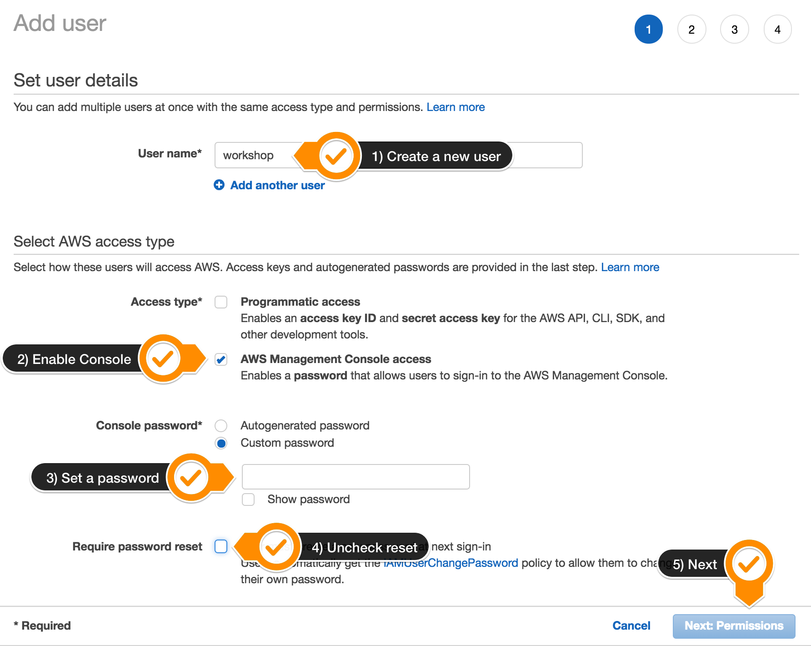
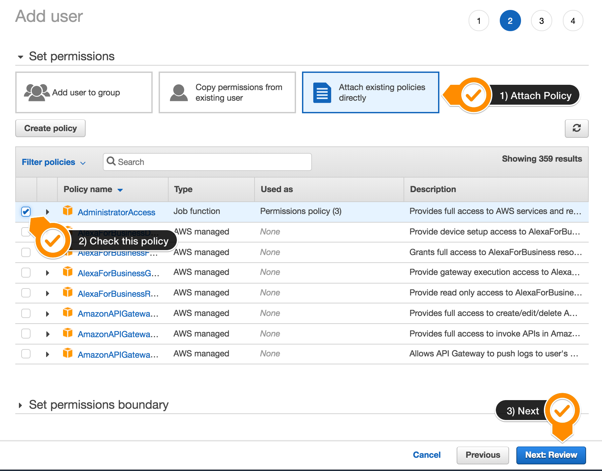
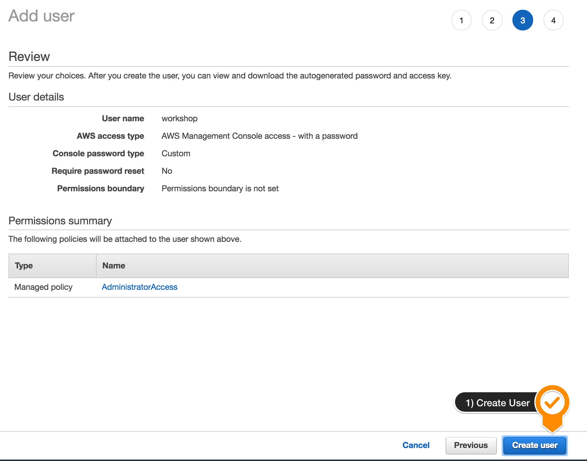
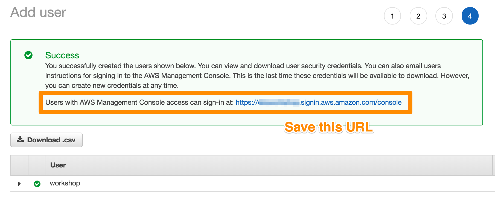
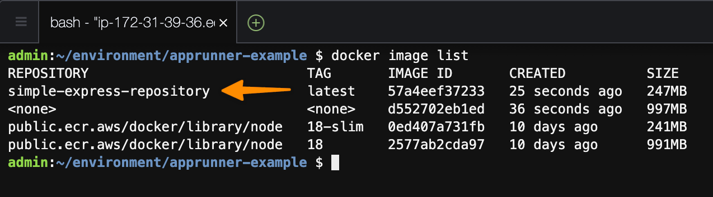
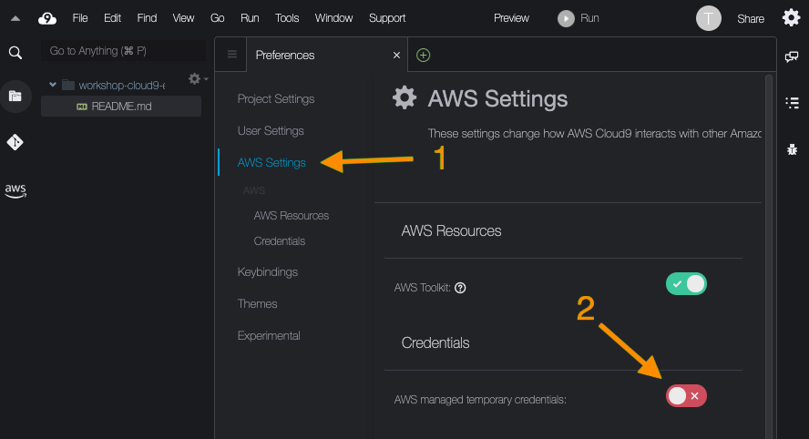
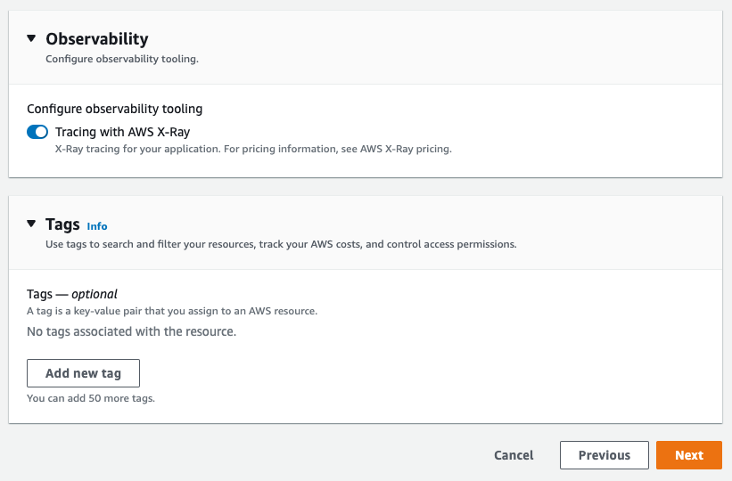
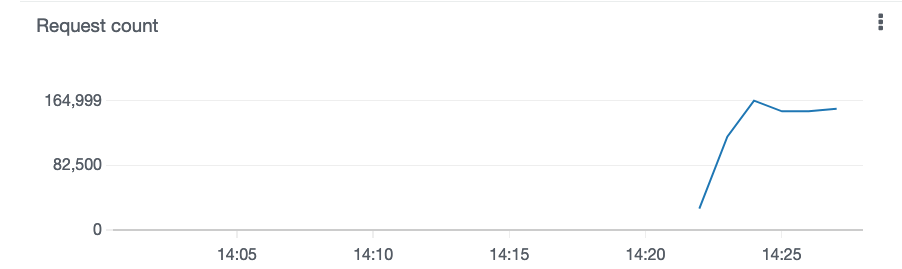
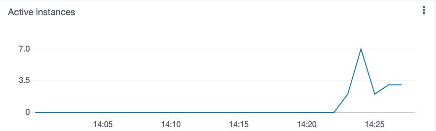
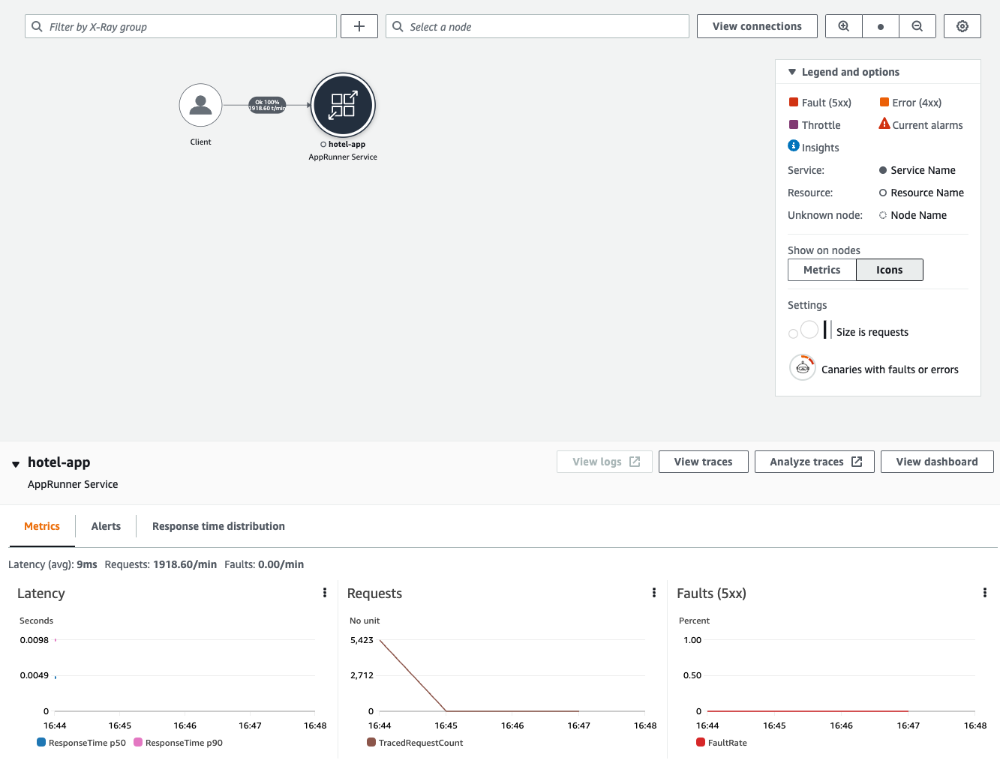

# Deploy Node.js using AWS App Runner for web applications at scale

**Important**

Only use these instructions if you are doing the workshop on your own.

#### 1. Once you have an AWS account ensure you are following the remaining workshop steps as an IAM user with administrator access to the AWS account. Only use an IAM User if you cannot use a role with sufficient permissions. Carefully manage these credentials and delete them as soon as you are finished with the workshop. [Create a new IAM user to use for the workshop](https://us-east-1.console.aws.amazon.com/iam/home?region=us-east-1#/users/create)

#### 2. Enter the user details:



#### 3. Attach the AdministratorAccess IAM Policy:



#### 4. Click to create the new user:



#### 5. Take note of the login URL and save:



# Your first deployment

In this chapter we will walk through the various paths to get an application deployed to AWS App Runner.

The first section requires no Dockerfile and will walk through getting an application deployed directly from code hosted on GitHub in a few simple steps.

Next, we will look at how to deploy an application from a container image hosted on Amazon ECR.

Finally, we will explore using AWS Copilot to rapidly deploy an application with AWS App Runner and Amazon DynamoDB.

Let’s get started!

# Deploying a Code-Based App Runner Service

For our first example we are going to create a simple Node.js web server which will serve a simple webpage. The runtime we select to run our web server will be Node.js.

Our web server will have the following components:

- index.js - core application code for a simple Node.js web server
- package.json - a Node Package Manager file for Node.js that describes the library dependencies used in the build step of the application

We will build our application to install the library dependencies our web server needs - in this case, the [Express](https://expressjs.com/) library.

In order to build our application, we are going to tell AWS App Runner to run npm build on the code, which will install the Express library as specified our in package.json file.

Proceed to the next section to get started where we will be creating a new repository on GitHub which will be run using AWS App Runner.

# Setting up Github repository

Let’s get started by creating a new private repository on [GitHub](https://github.com/new).

Enter simple-express-app as your Repository name, and select “Private” to limit access to your repository.

Click on “Create repository” at the bottom to finalize creation. See the example below.

Next, we are going to create our two files in GitHub - start by selecting “creating a new file” within our new repository.

Enter a file name of index.js, and then paste in the following code:

```
const express = require('express');
const app = express();
const port = 3000;

app.get('/', (req, res) => {
  res.send('Hello World!');
});

app.listen(port, () => {
  console.log(`Example app listening at http://localhost:${port}`);
});

```

Select “Commit new file” in order to save this new file into your repository.

Next, we will create a package.json file in order to define our library dependencies. From your repository, click the "Add file" drop down menu in the top right in between "Go to file" and "Code" buttons, and then select “Create new file”.

Paste the following code into the new file which you will name “package.json”

```
{
  "name": "apprunner_example",
  "version": "1.0.0",
  "description": "",
  "main": "index.js",
  "dependencies": {
    "express": "^4.17.1"
  },
  "devDependencies": {},
  "author": "",
  "license": "ISC"
}
```

Select “Commit new file” in order to add this second file. Make sure you are committing directly to "main" so the changes take effect. See the example below.

We now have our GitHub repository prepared with a Node.js web service.

Let's proceed to the next section where we use this repository to create an AWS App Runner service.

# Create the service

Use the following deep [link](https://us-east-1.console.aws.amazon.com/apprunner/home?region=us-east-1#/create) to open AWS App Runner and begin your App Runner Service creation.

On the first screen, "Source and Deployment", select the repository type as "Source code repository" and then click "Add new" to create a new connection between AWS App Runner and your GitHub Account.

This will open a new window where you will be prompted to enter a connection name. You can give it any name you want, for this workshop our example will use app-runner-workshop as the name.

_Note: This workshop assumes you do not have any prior connections from AWS to GitHub. If you do, you may select your existing GitHub app from the drop down menu._

After providing a name click "Install another" in the bottom right hand corner. See the example below for reference.

You will be guided to GitHub where you can select the GitHub account where you want to install the AWS Connector for GitHub.

Select the desired GitHub account - in most cases this will be your own GitHub account name.

If prompted confirm your password or use your security key to authenticate.

On the next screen you will be prompted to select if you want the AWS Connector to have access to "All repositories" or "Only select repositories".

Choose the selective option and search for the repository you created earlier (for us, "simple-express-app".) Select it and click "Install" in the bottom left hand corner.

You will automatically be redirected back to the AWS "Create a new Connection" window where you will now see your selected GitHub account listed in the drop down menu for "GitHub app".

Click Next in the bottom right hand corner.

The window will close and you will automatically be directed back to the App Runner "Source and Deployment" screen.

You should now see the name of your connection (such as "app-runner-workshop") listed, as well as simple-express-app listed under "Repository", and main listed under "Branch".

Scroll down the screen and under "Deployment settings" select "Automatic".

Click Next in the bottom right hand corner.

On the next screen you can leave "Configure all settings here" selected.

Under "Runtime", choose Nodejs 16 from the drop down menu.

Under "Build command" type the following:

```
npm install
```

Under "Start command" type the following:

```
node index.js
```

Under "Port" type the following:

```
3000
```

Click Next in the bottom right hand corner.

In this step we will give our new service a name such as simple-express-app. Leave the rest of these settings as defaults.

Select Next in the bottom right hand corner to continue.

On the final page, review the information you have entered and click Create & Deploy in the bottom right hand corner.

App Runner will now begin to deploy the simple-express-app service from your configured GitHub Account.

The deployment will take up to 10 minutes to complete. The page should automatically refresh.

Once the deployment has completed you should see "Running" in the top left hand corner of Service overview, under "Status". You can then view the Service you deployed by clicking the link under "Default domain".

_Tip: You can also verify the App Runner Service is running by looking at the Event log. Look for [AppRunner] Service Status is set to RUNNING.in the event log output._

Congratulations! You have just deployed a simple web service using App Runner!

# Change the code

In this section we will introduce a change to app and see how AWS App Runner automatically identifies the change to our code, then builds and deploys the new version.

Go to your GitHub repository that you setup earlier, locate the index.js file that you created, and click the edit button to open the in-browser editor:

On line 6, change the string the application sends when it receives a request.

For example instead of:

```
res.send('Hello World!');
```

Change to:

```
res.send('Hello App Runner!');
```

Now scroll down to the bottom and click the "Commit changes" button to save your changes.

Shortly after committing the changes to your repository AWS App Runner will see that there is a new commit in the GitHub repository. When a commit is detected, AWS App Runner will automatically start building and deploying the new code.

Because we configured automatic deployments in our Deployment settings, the App Runner Service will build and deploy for every new commit in GitHub.

Go to the Services list in the AWS App Runner console and click into your service, or use this deep link for quick access. You should see an "In progress" deployment under Deployment Logs

When the status of your service changes from "Operation in progress" to "Running" you can have a look at your changes by opening the App Runner Service URL again.

_Tip: You may have to refresh the service URL page for the changes to show up._

Congratulations! You just made a change to your code and App Runner automatically deployed the change on your behalf!

# Deploying a Container-Based App Runner Service

### Prerequisites:

This section of the workshop assumes you are using the Cloud9 development environment which comes with Docker preinstalled.

You should run all commands for the remainder of this workshop inside of the Cloud9 terminal.

Find the Cloud9 environment by navigating to [AWS Cloud9 in the Management Console](https://eu-north-1.console.aws.amazon.com/cloud9/home/create?region=eu-north-1#)

If you are using your own development machine, you will need to have Docker installed. Follow the instructions here to install [Docker](https://docs.docker.com/get-docker/):

_Tip: If you are choosing to run this workshop on your own, you may also configure your own Cloud9 development environment using this [deep link](https://eu-north-1.console.aws.amazon.com/cloud9/home/create?region=eu-north-1#) which comes with all the necessary tools (including Docker) pre-installed._

Double check the region you are deploying Cloud9 in to make sure it matches the region you are using for App Runner.

Let's create a new directory to use for this part of the workshop. You can do so easily by using the following commands:

```
mkdir ~/environment/apprunner-example
cd ~/environment/apprunner-example
touch index.js package.json Dockerfile
```

Open each newly created empty file and copy/paste in the following code to the corresponding files:

index.js

```
const express = require('express');
const app = express();
const port = 3000;

app.get('/', (req, res) => {
  res.send('Hello World!');
});

app.listen(port, () => {
  console.log(`Example app listening at http://localhost:${port}`);
});
```

package.json

```
{
  "name": "apprunner_example",
  "version": "1.0.0",
  "description": "",
  "main": "index.js",
  "dependencies": {
    "express": "^4.17.1"
  },
  "devDependencies": {},
  "author": "",
  "license": "ISC"
}
```

Dockerfile

```
FROM public.ecr.aws/docker/library/node:18 AS build
WORKDIR /srv
ADD package.json ./
RUN npm install

FROM public.ecr.aws/docker/library/node:18-slim
RUN apt-get update && apt-get install -y \
  curl \
  --no-install-recommends \
  && rm -rf /var/lib/apt/lists/* && apt-get clean
COPY --from=build /srv .
ADD . .
EXPOSE 3000
CMD ["node", "index.js"]
```

There are a few things going on here in this Dockerfile. Let's break it down.

First you will see the FROM keyword. This keyword says that we are starting from an existing base image. In this case we are using two different prebuilt images as starting points:

- public.ecr.aws/docker/library/node:18

This is a full developer environment Node.js image that includes NPM and a compiler for building any native code bindings in modules.

- public.ecr.aws/docker/library/node:18-slim

This is a Node.js image that is stripped down to just the Node runtime. You use this for shipping to production because you don't need the full NPM package manager and compiler tooling in production.

These two container images are built and maintained by the Node.js Docker team so they are regularly updated with the latest Node.js patches. The images are pulled down off the official mirror on AWS Elastic Container Registry.

The Dockerfile has two stages; this is referred to as a "multistage" Dockerfile. Each stage starts from a base image, and then supplies commands to run on top of that base image.

The reason we recommend using a multistage Dockerfile is often what we need at build is not the same as what we need at runtime. It is a best practice to make your containers as small as possible and only include what you need the final runtime image. The smaller the image, the smaller the attack service, the faster creation time, and the more portable your application becomes.

Let's break down each stage.

The first stage grabs the package.json file from the development environment, and adds it into the full Node.js base image. Then it runs the npm install command in the directory /srv. The result of this stage is a node_modules folder at /srv/node_modules inside of an image named build.

The second stage starts from the slimmed down version of the Node distribution. This is going to be a production image so it installs any security updates to the operating system and then cleans up after itself. Then it copies in the node_modules folder from the first stage, and copies in my application code off of the development environment. Finally it defines a port for the application and the command to run when you are ready to start this image.

# Setting up Amazon Elastic Container Registry (ECR)

In order to deploy a Dockerfile based Service on AWS App Runner the container image must be built and then pushed to a container registry. Amazon Elastic Container Registry (ECR) is the registry we will use today. An ECR repository will store the container image so AWS App Runner can pull it down and run it.

Start by visiting the [Amazon ECR](https://eu-north-1.console.aws.amazon.com/ecr/create-repository?region=eu-north-1) console using the deep link button to create your ECR repository. Select the same region you have been using for the workshop.

_Note: Make sure you are creating your ECR in the correct region (the same region you have been using for the workshop)_

Enter simple-express-repository as your Repository name, and select “Private” in order to control access to your ECR repository. Leave all options as default and click on “Create repository” in order to finalize creation.

After the ECR repository is created, click the button to “View push commands” and copy the login command.

Paste the copied commands into your terminal inside of the Cloud9 development environment. When copying commands, make sure your regions match as applicable.

The login command will look something like this:

```
aws ecr get-login-password --region us-east-1 | docker login --username AWS --password-stdin <your account id>.dkr.ecr.us-east-1.amazonaws.com
```

Now you are ready to build the container image.

From within your Cloud9 terminal use the following commands to navigate to the apprunner-example folder and build the container image.

```
cd ~/environment/apprunner-example
docker build -t simple-express-repository .
```

You can verify that the image by using the following command to list your locally available docker images:

```
docker image list
```



Once the image is built, it is time to push it to your newly created ECR repository. Be sure to substitute {region name} in the command below for the region you are using, for instance us-east-2.

Run export REGION={region name}

To do so, run the following commands:

```
export AWS_ACCOUNT_ID=$(aws sts get-caller-identity --query "Account" --output text)

docker tag simple-express-repository:latest ${AWS_ACCOUNT_ID}.dkr.ecr.${REGION}.amazonaws.com/simple-express-repository:latest

docker push ${AWS_ACCOUNT_ID}.dkr.ecr.${REGION}.amazonaws.com/simple-express-repository:latest
```

Now if you open up the [Amazon ECR console](https://eu-north-1.console.aws.amazon.com/ecr/home?region=eu-north-1) and click on the repository you created, you will see an image of roughly 81 MB in size is now hosted in the repository.

Go ahead and click the Copy URI button as we will use this URI in the next step.

# Create the service

Once your role is created with access to [Amazon ECR](https://us-east-1.console.aws.amazon.com/apprunner/home?region=us-east-1#/create), return to the App Runner console to create a Service that uses this container image.

Select “Container registry” from repository type, and “Amazon ECR” for provider.

Under Container image URI, enter the container image URI that you uploaded in the previous step.

It should look something like: AWS_ACCOUNT_ID.dkr.ecr.REGION.amazonaws.com/simple-express-repository:latest

_Tip: You can also click "Browse" to select your desired Image repository and Image tag_

Under Deployment settings, select "Automatic" again, and select the radio button "Create new service role".

Proceed to the next screen where you can specify the application specific settings:

Name your service - for example: simple-express-docker

Under "Port", enter 3000

You can leave all other default settings alone.

Click Next in the bottom right hand corner to proceed.

The final page is where you can review your configurations, if everything looks good, click “Create & deploy” in the bottom right hand corner.

Wait for your service to be deployed. You can click on your newly created service and follow the URL to access your containerized App Runner service.

Congratulations! You just deployed a containerized application to AWS App Runner!

# Change the code

In this section, we will introduce a change to the app, rebuild the container with the new change, push a new version of the container image to ECR, and observe how AWS App Runner automatically rolls out the change. Let's get started!

Locate the index.js file that you created earlier inside of the apprunner-example folder and change line 6. This is the string that the application sends when it receives a request.

For example instead of:

```
res.send('Hello World!');
```

Change to:

```
res.send('Hello App Runner from inside a container!');
```

Save the file.

Next, we need to rebuild the container with the change and re-push the new image using the same commands as earlier:

```
docker build -t simple-express-repository .

docker tag simple-express-repository:latest ${AWS_ACCOUNT_ID}.dkr.ecr.${REGION}.amazonaws.com/simple-express-repository:latest

docker push ${AWS_ACCOUNT_ID}.dkr.ecr.${REGION}.amazonaws.com/simple-express-repository:latest
```

Shortly after pushing the changes to your ECR repository, AWS App Runner will see that there is a change to the image.

Go to the Services list in the AWS App Runner console and click into your Service. You will see an "In progress" deployment under "Deployment Logs".

When the status of your service changes from "Operation in progress" to "Running", you can have a look at your changes by opening your App Runner service's URL again.

_Note: You may have to refresh the page of your service's URL to see the changes._

Congratulations, you just made a change to your code, rebuilt and pushed your container image to ECR, and App Runner automatically deployed the change on your behalf!

# Deploying with AWS Copilot

[AWS Copilot ](https://aws.amazon.com/ru/containers/copilot/) is a developer friendly tool to make it easier for you to build your application out of known working patterns.

AWS Copilot CLI supports deploying applications on AWS App Runner.

In this module we will use AWS Copilot CLI to deploy a small "hit counter" application that tracks visits in a DynamoDB table.

Let's get started!

# Install AWS Copilot

For this part of the workshop, we will be using an automatically-created IAM role that is attached to the Cloud9 development environment rather than the default Cloud9 temporary credentials.

To ensure temporary credentials is disabled, click on the settings button in the upper right corner:

Select "AWS Settings" and ensure that the "AWS managed temporary credentials" settings is off (red).



In the terminal you can now run the command to install the latest version of AWS Copilot, and verify that it runs:

```
cd ~/environment
curl -Lo copilot https://github.com/aws/copilot-cli/releases/latest/download/copilot-linux
chmod +x copilot
sudo mv copilot /usr/local/bin/copilot
copilot --help
```

At this point you should also open up the [AWS Copilot docs](https://aws.github.io/copilot-cli/) in another browser tab. You may find the command references helpful to refer to as you go through the rest of the instructions.

# Prepare the application

In this segment, you will implement a small hit counter application that uses the AWS SDK to increment a counter in Amazon DynamoDB each time a request arrives.

The application will be deployed as a containerized service in AWS App Runner.

To create a new directory to use for this part of the workshop, use the following commands:

```
mkdir ~/environment/apprunner-copilot-example
cd ~/environment/apprunner-copilot-example
touch Dockerfile index.js package.json
```

Open each newly created empty file and copy/paste in the following code to the corresponding files:

_Note: Be sure to open the newly created empty files in the ~/environment/apprunner-copilot-example directory_

Dockerfile:

```
FROM public.ecr.aws/docker/library/node:18 AS build
WORKDIR /srv
ADD package.json .
RUN npm install

FROM public.ecr.aws/docker/library/node:18-slim
COPY --from=build /srv .
ADD . .
EXPOSE 80
CMD ["node", "index.js"]
```

index.js:

```
var aws = require('aws-sdk');
const express = require('express');
const app = express();
const table = process.env.HITS_NAME;
const PORT = 80; // The port to listen on

const dynamodb = new aws.DynamoDB.DocumentClient();

if (!table) {
  console.error('Warning: The HITS_NAME environment variable needs to be set with the name of a DynamoDB table');
}

const os = require('os');
const hostname = os.hostname();

app.get('*', function (req, res) {
  if (!table) {
    console.error('Error: The HITS_NAME environment variable needs to be set with the name of a DynamoDB table');
    return res.send('Error: The HITS_NAME environment variable needs to be set with the name of a DynamoDB table');
  }

  dynamodb.update({
    TableName: table,
    Key: {
      counter: 'global',
    },
    UpdateExpression: 'SET hitCount = if_not_exists(hitCount, :zero) + :value',
    ExpressionAttributeValues: {
      ':zero': 0,
      ':value': 1,
    },
    ReturnValues: 'ALL_NEW'
  }, function (err, results) {
    if (err) {
      return res.send(err);
    } else {
      var hitCount = results.Attributes.hitCount;
      res.send(`There have been ${hitCount} hits. (${hostname})`);
    }
  });
});

app.listen(PORT, () => console.log(`Listening on port ${PORT}!`));

// This causes the process to respond to "docker stop" faster
process.on('SIGTERM', function () {
  console.log('Received SIGTERM, shutting down');
  app.close();
});
```

package.json:

```
{
  "name": "name",
  "version": "1.0.0",
  "description": "Simple microservice that counts hits",
  "main": "index.js",
  "scripts": {
    "test": "echo \"Error: no test specified\" && exit 1",
    "start": "node index.js"
  },
  "author": "",
  "license": "MIT",
  "dependencies": {
    "express": "4.17.1",
    "aws-sdk": "2.814.0"
  }
}
```

Be sure to save all three (3) files.

# Deploy an App Runner Application with AWS Copilot CLI

## Set up the application

#### 1. Create application using Copilot by typing the following into your terminal:

```
copilot app init
```

When prompted, give the application a name like hit-counter-app and press Enter to begin setting up the application.

#### 2. Define a service using Copilot by typing the following into your terminal:

```
copilot svc init
```

When prompted, choose Request-Driven Web Service to setup an App Runner service.

Enter a service name like hit-counter-service

Copilot will auto discover your Dockerfile to use with your hit-counter application, so you can just press Enter:

To proceed, select "Environment" at the next prompt.

#### 3. Define a database table to store counters in using Copilot by typing the following into your terminal:

```
copilot storage init
```

Choose DynamoDB from the list of storage types:

When prompted, enter the following details:

- Table Name: hits
- Table partition key: counter
- Partition key datatype: string
- Sort key: No

#### 4. Create and deploy the environment using Copilot by typing the following into your terminal:

```
copilot env init
```

When prompted, enter test as the name of the environment. Choose the profile default credentials.

Finally, deploy the storage and the app into the environment using Copilot by typing the following into your terminal!

```
copilot deploy
```

Copilot will automatically build your container image, push it, and then deploy the built application to AWS App Runner.

The first deployment will take a couple minutes while everything is setup.

#### 6. Check out the results

When the deployment finishes, Copilot will give you a URL for your application:

Try sending some requests by accessing that URL in your browser or by sending a request on the command line with:

```
curl <your application url here>
```

## Learn how it works

#### 1. Look at the local manifest files in the copilot folder. This YAML file define what is going to be deployed. You can read more about the manifest format for AWS App Runner services in the [AWS Copilot docs](https://aws.github.io/copilot-cli/docs/manifest/rd-web-service/):

#### 2. Open up the [AWS CloudFormation console](https://us-east-1.console.aws.amazon.com/cloudformation/home?region=us-east-1#/stacks?filteringText=&filteringStatus=active&viewNested=true):

AWS Copilot generates all these templates on your behalf, and manages them for you, but you can open them up and look at the template contents to see how it works.

## Interact with the running application using AWS Copilot

#### 1. copilot svc status

#### 2. copilot svc logs

#### 3. Modify the application manifest and copilot deploy again

#### 4. Try exporting the application with copilot svc package

Congratulations! You just deployed a containerized app to AWS App Runner using AWS Copilot!

# Operating your application on AWS App Runner

Once you have learned the basics of deploying an application on AWS App Runner it is time to test out some more advanced operational concepts. In this section you will learn about:

- Networking using Private VPC Access on App Runner
- Autoscaling with AWS App Runner
- Observability for AWS App Runner Services

# VPC Access on App Runner

By default, your AWS App Runner Service can send messages to public endpoints. This includes your own solutions, other AWS services, and any other public website or web service. Your application can even send messages to public endpoints of applications that run in a public VPC from [Amazon Virtual Private Cloud](https://docs.aws.amazon.com/vpc/latest/userguide/what-is-amazon-vpc.html) (Amazon VPC). If you don't configure a VPC when you launch your environment App Runner uses a default VPC which is public.

You can choose to launch your environment in a custom VPC to customize networking and security settings for outgoing traffic. You can enable your AWS App Runner service to access applications that run in a private VPC from [Amazon Virtual Private Cloud](https://docs.aws.amazon.com/vpc/latest/userguide/what-is-amazon-vpc.html) (Amazon VPC). After you do this, your application can connect with and send messages to other applications that are hosted in an Amazon Virtual Private Cloud (Amazon VPC). Examples are an Amazon RDS database, Amazon ElastiCache, and other private services that are hosted in a private VPC.

## VPC Connector

You can associate your service with a VPC by creating a VPC Connector from the App Runner console. To create a VPC Connector, specify the VPC, one or more subnets, and optionally one or more security groups. After you configure a VPC Connector, you can use it with one or more App Runner Services.

The VPC connectors in App Runner are based on AWS Hyperplane ENIs, the internal Amazon network function virtualization system behind other AWS services and resources.

These include [Network Load Balancer](https://docs.aws.amazon.com/elasticloadbalancing/latest/network/introduction.html) , [NAT Gateway](https://docs.aws.amazon.com/vpc/latest/userguide/vpc-nat-gateway.html) , and [AWS PrivateLink](https://aws.amazon.com/ru/privatelink/) . The AWS Hyperplane technology provides high throughput and low latency network function virtualization capabilities.

With Hyperplane ENIs, a higher degree of sharing can be achieved than the regular ENIs. Hyperplane ENIs are tied to a combination of one or more subnets and security groups. As the Hyperplane ENI is shared, fewer ENIs are required for each service, even as you scale up the number of tasks required to handle the request load. You can also choose to reference the same VPC Connector across multiple App Runner services, the underlying Hyperplane ENIs are shared across these services. This results in more efficient utilization of the IP space in your VPC.

# Fork and Clone the App Runner Hotel Repo

For this example, we will be using the AppRunner Hotel application located here: https://github.com/aws-samples/apprunner-hotel-app .

When you go to the repository you will see "fork" in the upper right corner. Select your username to fork to. You will now have a fork of the App Runner Hotel app you can use for this segment.

Once you have forked the AppRunner Hotel repo, you will want to clone it to your Cloud9 development environment. You can do so with the following commands:

```
cd ~/environment
git clone https://github.com/[github-handle-here]/apprunner-hotel-app
```

_Note: Be sure to replace github-handle-here with your own GitHub username._

## Application Brief

AppRunner Hotel is a Web Application created to help the development of AppRunner’s VPC Access. The application stores hotel rooms information in a private MySQL/Aurora database on Amazon RDS. Room information can be retrieved and updated using HTTP(S) GET and POST requests to the app (curl commands are detailed later in the doc). The RDS database is only accessible from within the VPC (unless you want to independently test the DB setup, in which case you can enable public access to the DB). If the App Runner app succeeds in displaying/updating rooms information from the DB, it validates that VPC access is working as expected. Once the app is live, you must use the create button to create the database table and the app will begin to function.

Let's get started!

# Deploying the Infrastructure

## Infrastructure Overview

For this application to work, you will need to have the following infrastructure:

- [Network] A VPC
- [Network] Two Public Subnets (in 2 arbitrary AZs)
- [Network] Six Private Subnets (in all 6 IAD AZs)
- [Network] An Internet Gateway (with routes to it from the public subnets)
- [Network] A NAT Gateway (with routes to it from the private subnets)
- [Network] A Security Group for the AppRunner service (allows egress traffic to the RDS database security group)
- [Network] A Security Group for the RDS database (allows ingress traffic from the AppRunner service security group)
- [Network] A Security Group for the Secrets Manager rotation Lambda to connect to RDS
- [RDS] A private RDS Aurora database
- [RDS] Store username/password in Secrets Manager with rotation enabled
- [AppRunner] ECR Access Role (if using a public ECR image, you don't need this role, but creating it anyway)
- [AppRunner] SLR stand-in role (our public SLR policy hasn't been updated yet, so using this manually created role as a stand-in)
- [AppRunner] VPC Connector between AppRunner service and RDS database

## Infrastructure as Code

Lucky for us, there is a [CloudFormation Template](https://aws.amazon.com/ru/cloudformation/) we can use in the repo we just forked. The template is located right in the root of the repo and is named infra.yaml.

There are two ways you can deploy this infrastructure. Choose one of the options below:

#### 1. Through the AWS CLI via your Cloud9 Environment

```
cd ~/environment/apprunner-hotel-app

aws cloudformation deploy --template-file infra.yaml --stack-name app-runner-hotel --capabilities CAPABILITY_NAMED_IAM CAPABILITY_AUTO_EXPAND
```

The deployment will begin and you will receive a confirmation when the deployment completes.

#### 2. Through the AWS CloudFormation Console

[Click here to save the Infra Cloudformation Template to your local system ](https://static.us-east-1.prod.workshops.aws/public/db06ede2-1a46-4bd2-8554-b7113e2e5ebe/assets/infra.yaml)

From within the AWS Console, navigate to the [CloudFormation Service](https://us-east-1.console.aws.amazon.com/cloudformation/home?region=us-east-1#/stacks/create/template):

From there, ensure Template is ready is selected and under "Specify template", select Upload a template file. And select the infra.yml file you just saved to your computer.

Click Next in the bottom right hand corner.

For stack name enter: app-runner-hotel

Click Next in the bottom right hand corner.

On this next page titled "Configure stack options" leave everything at the default settings and click Next.

On the final page, review the information looks correct and check all the boxes under "Capabilities and transforms" at the bottom of the page.

Click Create stack in the bottom right hand corner.

The required infrastructure will begin deploying. This will take about 8-10 minutes to complete.

_Tip: You can click on the Stack info tab and use the refresh button to check the status. When the deployment has completed, you will see "CREATE_COMPLETE" under status._

From your Cloud9 instance, run the following command after the deployment has completed:

```
aws secretsmanager list-secrets --output json --query 'SecretList[0].Name' --output text
```

You should see output similar to AuroraDBSecret-XXXXXXXXXXXXX. Save the output in a safe space. You will need this value shortly.

Once you have deployed the required infrastructure and captured the output from the list-secrets query proceed to the next part of the workshop.

# Create the App Runner Hotel Service

Now that we have our pre-requisite infrastructure in place, we are ready to deploy our Hotel App to AppRunner.

To begin, return to the [App Runner](https://us-east-1.console.aws.amazon.com/apprunner/home?region=us-east-1#/create) console to create a new service:

If you recall at the beginning of this workshop we created a GitHub connection to App Runner, but we only authorized repository access to the simple-express-app repo. We need to add the newly forked apprunner-hotel-app repo as well.

In a separate tab, navigate to [GitHub Applications Installations](https://github.com/settings/installations):

From there, locate the "AWS Connector for GitHub" and click "Configure".

You may have to authenticate again, and if prompted, enter your password or use your security key.

On the next screen, click select repositories again, and this time search for your forked repo, apprunner-hotel-app. Select it and click save.

You will be redirected back to a screen and may see a message saying, "Request has expired, please try again." Ignore this and close the page.

Back at the App Runner Create a Service Page, under, "Source and Deployment", select the repository type as "Source code repository". From there, click the previously created connection app-runner-workshop and use the refresh button under repository to scan for your newly added app-runner-hotel repository.

You should now see the name of your connection (I.E. app-runner-workshop) listed, as well as apprunner-hotel-app listed under "Repository", and main listed under "Branch".

Scroll down the screen and under "Deployment settings" select "Automatic".

Click Next in the bottom right hand corner.

On the next screen you can leave "Configure all settings here" selected.

Under "Runtime", choose Nodejs 16 from the drop down menu.

Under "Build command" type the following:

```
npm install
```

Under "Start command" type the following:

```
npm start
```

Leave "Port" unchanged.

Click Next in the bottom right hand corner.

On the next screen, you will want to name your service. For this workshop you can use the name "apprunner-hotel-app".

Under environment variables, you will have to add the following environment variable:

key: secret

value: Use-the-value-you-previously-saved-in-a-safe-place

You can leave the default configuration under "Auto Scaling" and "Health check".

Under "Security" you will want to select the AppRunnerHotelAppRole-{region} from the drop down.

Under Networking, select "Custom VPC", and select AppRunnerHotelApp-RDS-Connector from the drop down.

Under "Observability" you will want to toggle "Tracing with AWS X-Ray" to the on position.



Click Next in the bottom right hand corner.

On the final page, review the information you have entered, and click Create & Deploy in the bottom right hand corner.

_App Runner will now begin to deploy the hotel app service using the infrastructure you provisioned in the previous step._

_Tip: The deployment will take up to 10 minutes to complete. The page should automatically refresh. Once the deployment has completed, you should see "Running" in the top right hand corner under "Status". Below is an example:_

You may also see the service you deployed by clicking the link under "Default domain".

You did it! You successfully deployed App Runner with a custom VPC environment to securely communicate across subnets.

# Autoscaling on AWS App Runner

Every AWS App Runner service comes with autoscaling out of the box. In this section we will learn how to configure this autoscaling, test it out, and observe the results. Open up one of the services that you deployed earlier, either the code based service, or the container based service.

## Find the Autoscaling settings

In the AWS App Runner console click on the service, select the "Configuration" tab and scroll down to view the default autoscaling settings:

A few things to note here:

- By default App Runner will send up to 100 concurrent requests to a single App Runner service instance. If concurrent traffic rises too high, then App Runner will automatically add new instances to distribute the traffic across.
- By default the service will scale all the way down to one instance, and all the way up to 25 instances.
  You can select the "Edit" button at the top of the section to adjust these scaling behaviors.

Let's test out this scaling now.

## Install hey

hey is a tiny program for sending load to a web server. We can plug in the URL of an AWS App Runner service and generate enough load to force it to scale up.

You can find the install instructions on [Github](https://github.com/rakyll/hey):

Or run the following instructions to install hey in your Cloud9 environment:

```
curl https://hey-release.s3.us-east-2.amazonaws.com/hey_linux_amd64 -o hey
chmod +x hey
sudo mv hey /usr/bin/hey
```

## Run the load test

The following hey command maintains 200 concurrent HTTP requests for a 5 minute period. Find the URL of your service in the App Runner console.

```
hey -c 200 -z 5m https://xxxxxxxxxx.region.awsapprunner.com/
```

- -c 200 - Send up to 200 concurrent requests
- -z 5m - Send requests for 3 minutes
- https://xxxxxxxxxx.region.awsapprunner.com/ - The URL to send requests to

Once you press enter the program will start sending requests to your App Runner service.

## Check the service metrics.

Open the Metrics tab of your App Runner service, while hey is still running. The metric resolution is one minute, so you will need to wait a minute or two for any metrics to show up on this screen.

Two graphs to look out for are the "request count" graph and the "active instances" count.

The request count graph shows how many requests per minute the service handled:



The active instances graph shows how many copies of the service spun up to handle that traffic.



Feel free to explore the metrics UI by clicking on the three dots next to a metric field and select “Enlarge” to view the metric in a larger window, or click “View in metrics” to explore the metrics in the Cloudwatch console.

## Ending the test

Make sure the hey command terminated in your terminal, cancel it with Ctrl+C if it is still running.

In the metrics tab of our App Runner service, the request count and the number of active instances should decrease in the next couple of minutes.

From the summary we can see that the service handled 2308 requests per second, and the response time histogram shows that response times stayed low for most requests. There were a few outliers as the service scaled out.

You can try running an extended load test to see how response time stabilizes even further as the service operates at a steady state without needing to scale out on the fly.

# Observability with AWS X-Ray and Cloud Watch

[AWS X-Ray](https://aws.amazon.com/ru/xray/) is a distributed tracing service that helps you trace the lifecycle of a transaction as it flows through your application code, from incoming request, to downstream API calls, to returning a response to clients.

We already configured AWS X-Ray in the previous segment when we created our App Runner Hotel Service.

We can now see this tracing in action!

Open up the [X-Ray service](https://us-east-1.console.aws.amazon.com/cloudwatch/home?region=us-east-1#xray:service-map/map) map to see traces that have been collected.

You should see something like this on the service map:



Congratulations! You now have configured observability for your App Runner service using AWS X-Ray and Cloud Watch!

Learn how it works: manual X-Ray Configuration (Reference Only)

## Setup X-Ray instrumentation

The first step is to modify one of your deployed applications to have X-Ray integration enabled. This can be done on either a code based service or a container based service.

First we need to add the some SDK packages to the application. We will be using the Amazon Distro for OpenTelemetry to implement the tracing in the application code. OpenTelemetry is an open standard for gathering metrics and traces. The Amazon distribution extends OpenTelemetry with AWS specific capabilities including the ability to send traces to AWS X-Ray.

#### 1. You will find a package.json file in our cloned repo. It should look similar to the following:

```
 {
   "name": "apprunner_example",
   "version": "1.0.0",
   "description": "",
   "main": "index.js",
   "dependencies": {
     "express": "^4.17.1",
     "@opentelemetry/api": "1.2.0",
     "@opentelemetry/auto-instrumentations-node": "0.32.0",
     "@opentelemetry/sdk-trace-node": "1.6.0",
     "@opentelemetry/exporter-trace-otlp-http": "0.32.0",
     "@opentelemetry/exporter-trace-otlp-grpc": "0.32.0",
     "@opentelemetry/id-generator-aws-xray": "1.1.0",
     "@opentelemetry/propagator-aws-xray": "1.1.0"
   },
   "devDependencies": {},
   "author": "",
   "license": "ISC"
 }
```

_Note: Take note of the @opentelemtry packages we declared as dependencies._

#### 1. Next, you will find a create-a-tracer.js file also in our Apprunner Hotel App repo. This file defines the tracing setup. This file hosts all our tracing settings, and defines which types of application specific instrumentation we want to setup:

```
'use strict'

 // OTel JS - API
 const { trace } = require('@opentelemetry/api');

 // OTel JS - Core
 const { NodeTracerProvider } = require('@opentelemetry/sdk-trace-node');
 const { SimpleSpanProcessor } = require('@opentelemetry/sdk-trace-base');

 // OTel JS - Core - Exporters
 const { CollectorTraceExporter } = require('@opentelemetry/exporter-collector-grpc');

 // OTel JS - Core - Instrumentations
 const { HttpInstrumentation } = require('@opentelemetry/instrumentation-http');
 const { MySQLInstrumentation } = require('@opentelemetry/instrumentation-mysql');
 const { AwsInstrumentation } = require('opentelemetry-instrumentation-aws-sdk');
 const { Resource } = require('@opentelemetry/resources');
 const { SemanticResourceAttributes } = require('@opentelemetry/semantic-conventions')

 // OTel JS - Contrib - AWS X-Ray
 const { AWSXRayIdGenerator } = require('@opentelemetry/id-generator-aws-xray');
 const { AWSXRayPropagator } = require('@opentelemetry/propagator-aws-xray');


 const tracerProvider = new NodeTracerProvider({
   resource: Resource.default().merge(new Resource({
     [SemanticResourceAttributes.SERVICE_NAME]: "hotel-app"
   })),
   idGenerator: new AWSXRayIdGenerator(),
   instrumentations: [
     new HttpInstrumentation(),
     new MySQLInstrumentation(),
     new AwsInstrumentation({
       suppressInternalInstrumentation: true
     }),
   ]
 });

 // Expects Collector at env variable `OTEL_EXPORTER_OTLP_ENDPOINT`, otherwise, http://localhost:4317
 tracerProvider.addSpanProcessor(new SimpleSpanProcessor(new CollectorTraceExporter()));

 tracerProvider.register({
   propagator: new AWSXRayPropagator()
 });

 module.exports = trace.getTracer("AppRunner-V2N-Demo");
```

#### 2. Let's take a closer look at lines 25 - 37. This is where we are connecting the tracer definition to our hotel app.

const tracerProvider = new NodeTracerProvider({
resource: Resource.default().merge(new Resource({
[SemanticResourceAttributes.SERVICE_NAME]: "hotel-app"
})),
idGenerator: new AWSXRayIdGenerator(),
instrumentations: [
new HttpInstrumentation(),
new MySQLInstrumentation(),
new AwsInstrumentation({
suppressInternalInstrumentation: true
}),
]
});

## Enable X-Ray in the AWS App Runner settings

Next we need to change the configuration of the App Runner service itself to start collecting the traces from OpenTelemetry and dispatching them to X-Ray.

This can be done at the command line from your Cloud9 terminal:

#### 1. Install the latest version of AWS CLI:

```
curl "https://awscli.amazonaws.com/awscli-exe-linux-x86_64.zip" -o "awscliv2.zip"
unzip awscliv2.zip
sudo ./aws/install
sudo ln -s /usr/local/bin/aws /usr/bin/aws
```

#### 2. Create a configuration for observability:

```
aws apprunner create-observability-configuration \
  --region $AWS_REGION \
  --observability-configuration-name X-Ray-Config \
  --trace-configuration Vendor=AWSXRAY
```

#### 3. Look in the output for the value of ObservabilityConfigurationArn. It should look something like this:

```
save arn:aws:apprunner:us-east-1:<account id>:observabilityconfiguration/X-Ray-Config/1/29e1f9d9db9747ce89522d9713316985
```

We also need to get the Service ARN from the service details page. It should look something like this:

```
arn:aws:apprunner:us-east-1:<account id>:service/node-express/8c8251901ecc449d84577a500708cd12
```

Now we update the service to use this observability configuration:

```
aws apprunner update-service \
  --region $AWS_REGION \
  --service-arn <YOUR SERVICE ARN> \
  --network-configuration EgressConfiguration={EgressType=DEFAULT} \
  --observability-configuration ObservabilityEnabled=true,ObservabilityConfigurationArn=<YOUR CONFIG ARN>
```

This will cause a deployment to

Also we need to modify the service's instance role to give App Runner permission to actually write data to X-Ray on our behalf.

#### 1. Open the list of IAM roles in the [IAM console](https://us-east-1.console.aws.amazon.com/iamv2/home?region=us-east-1#/roles).

Click "Create Role" to open the role creation flow.

#### 2. For step one, select "Custom trust policy", and enter the following trust policy document:

```
{
  "Version": "2012-10-17",
  "Statement": [
    {
      "Effect": "Allow",
      "Principal": {
        "Service": "tasks.apprunner.amazonaws.com"
      },
      "Action": "sts:AssumeRole"
    }
  ]
}
```

This defines that the IAM role that we are creating can be used by AWS App Runner on your behalf.

Click next to move on.

#### 3. Now we need to add permissions to the role. Enter xray into the search box. Attach the AWSXRayDaemonWriteAccess to the role. This is a predefined role that gives any bearer of the role the ability to write data to AWS X-Ray on your behalf.

Click "Next" to move on to finalizing the role.

#### 4. Give the role a name, for example MyAppRunnerXray and click "Create" at the bottom of the page.

#### 5. Now open up your service in the AWS App Runner console.

Scroll down to service settings on the App Runner service and click "Edit".

#### 6. Under the "Security" section select the instance role that you just created, then click "Save Changes" at the bottom.

At this point AWS X-Ray is enabled on the service, and App Runner has the ability to actually communicate traces to AWS X-Ray on behalf of your application.

## Redeploy the service

Last but not least we need to deploy the service to deploy the trace instrumentation code changes.

Follow the instructions that are appropriate for your service configuration.

Code based service

If you are using a code based service create and push a new commit to your Github repository with:

```
git add .
git commit -m "Adding X-Ray tracing"
git push
```

AWS App Runner will automatically see your new commit and redeploy.

Container based service

If you are using a container based service build a new container image and push it to your Elastic Container Registry repository:

```
docker build -t simple-express-repository .
docker tag simple-express-repository:latest AWS_ACCOUNT_ID.dkr.ecr.REGION.amazonaws.com/simple-express-repository:latest
docker push AWS_ACCOUNT_ID.dkr.ecr.REGION.amazonaws.com/simple-express-repository:latest
```

AWS App Runner will automatically see your new image version and redeploy.

## View the results

To ensure that there is data to view run the hey load test from the previous autoscaling module:

```
hey -c 200 -z 5m <YOUR APP URL>
```

# Clean up

Whew! We have learned a lot today. There are so many AWS services we deployed and skills we learned.

It's time to clean up now and we wrote a script to help with this.

\*Note: Please only clean up the resources if you and your teammates are done with ALL resources in this workshop environment.

- There are two ways to clean up the resources you created today:

1. If you participated in the workshop at an AWS guided event, and wish to use a clean up script, follow these instructions

Create a new file from within your Cloud9 environment. I.E. touch ~/environment/cleanup.sh. Copy the code from below into the newly created file and save it:

```
#!/bin/bash

cleanupCopilot() {
    cd ~/environment/apprunner-copilot-example
    copilot app delete
}

cleanupAppRunner() {
    getServiceArn=$(aws apprunner list-services --query 'ServiceSummaryList[*].ServiceArn' --output text)

    for arn in $getServiceArn
    do
        if [[ $arn =~ "simple-express" || $arn =~ "apprunner-hotel-app" ]];
        then
            aws apprunner delete-service --service-arn $arn >/dev/null && echo "$arn deleted"
        else
            echo "$arn untouched"
        fi
    done
}

cleanupInfra() {
    aws cloudformation delete-stack --stack-name app-runner-hotel
}

cleanupECR() {
    aws ecr delete-repository --repository-name simple-express-repository --force >/dev/null && echo "$repo deleted"
}

cleanupCloudwatch() {
    getLogGroupName=$(aws logs describe-log-groups --query 'logGroups[*].logGroupName' --output text)

    for logs in $getLogGroupName
    do
        if [[ $getLogGroupName =~ "/aws/apprunner/simple-express" || "/aws/apprunner/apprunner-hotel-app" || "/aws/apprunner/hit-counter-app-test-hit-counter-service" ]];
        then
            aws logs delete-log-group --log-group-name $logs >/dev/null && echo "$logs deleted"
        else
            echo "$logs untouched"
        fi
    done
}

cleanupCopilot
cleanupAppRunner
cleanupInfra
cleanupECR
cleanupCloudwatch
```

To run the file, use the following commands:

```
cd ~/environment
chmod +x ~/environment/cleanup.sh
./cleanup.sh
```

2. If you participated in the workshop on your own, or prefer to manually delete your created resources, follow these instructions

Stop all running services by click the "Actions" menu and selecting "Delete":

This will stop all charges for the service itself.

## Amazon ECR

You will also need to delete the image that was stored in Amazon ECR, to avoid storage charges. Select the repository and then click "Delete" to remove the repository.

_Tip: If you created more than one repository, you will have to perform the above steps for each individual repo._

## AWS Copilot

To clean up our AWS Copilot app, run the following commands from within your development environment:

```
cd ~/environment/apprunner-copilot-example
copilot app delete
copilot svc delete --name hit-counter-service
```

## AWS CloudFormation

We provisioned infrastructure as part of this workshop under the Networking: VPC segment. To clean up the infrastructure created from the infra.yaml used run the following commands:

```
aws cloudformation delete-stack --stack-name app-runner-hotel
```

## AWS CloudWatch

You may also still have application logs stored in [AWS CloudWatch](https://us-east-1.console.aws.amazon.com/cloudwatch/home?region=us-east-1#logsV2:log-groups). So if you are using your own AWS account and want to be sure to avoid all storage charges go to the AWS CloudWatch log groups and be sure to delete any log groups here as well:
