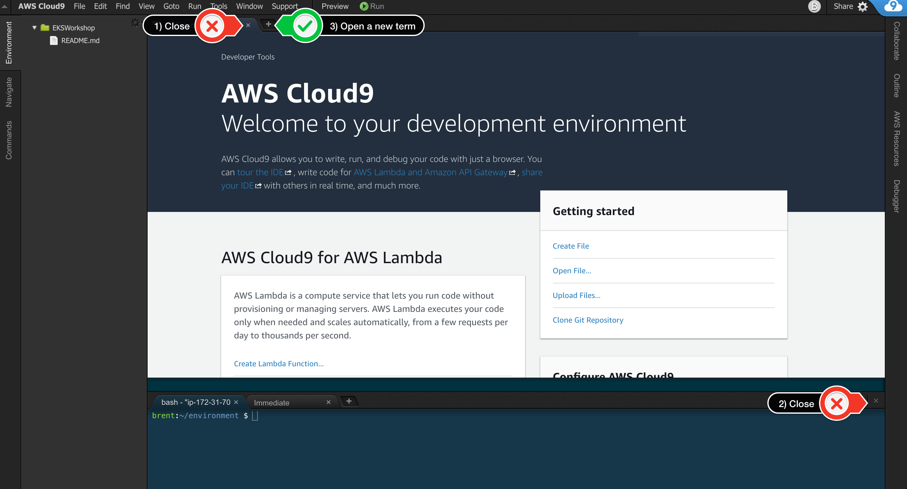
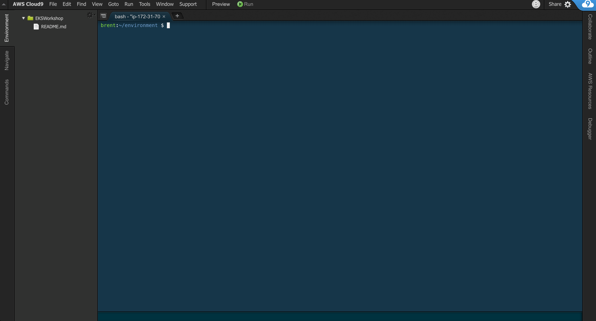

# Amplify Photo Sharing Workshop

This workshop is intended for software developers with some experience building web applications to learn how to build a full stack cloud application with React, GraphQL, & [Amplify](https://docs.amplify.aws/) . Everything we'll build during the workshop is eligible for AWS's free-tier pricing, however to ensure you don't incur any unexpected costs, be sure to follow the instructions in the cleanup section and remove all the resources you've created.

An understanding of software development and prior experience with the React framework are recommended but not required. Allow around two hours to get through all of the content, and slightly longer if you want to tackle the Extra Credit section!

# Your Cloud 9 Workspace (optional)

AWS Cloud9 is a cloud-based integrated development environment (IDE) that lets you write, run, and debug your code with just a browser. It includes a code editor, debugger, and terminal. Cloud9 comes prepackaged with essential tools for popular programming languages, including JavaScript, Python, PHP, and more, so you don't need to install files or configure your development machine to start new projects.

The Cloud9 workspace should be built by an IAM user with Administrator privileges, not the root account user. Please ensure you are logged in as an IAM user, not the root account user.

Ad blockers, JavaScript disablers, and tracking blockers should be disabled for the cloud9 domain, otherwise connecting to the workspace might be impacted.

## Create a new environment

Choose the correct Tab to configure AWS Cloud for your event.

#### 1. Go to the Cloud9 web console

#### 2. Select Create environment

#### 3. Name it workshop, and go to the Next step

#### 4. Select Create a new instance for environment (EC2) and pick t2.medium via "other" dropdown list.

#### 5. Select Amazon Linux as the platform

#### 6. Leave all of the environment settings as they are, and go to the Next step

#### 7. Click Create environment

## Clean up the layout

You can customize the layout by closing the welcome tab and lower work area, and opening a new terminal tab in the main work area:



Your workspace should now look like this:



If you like this theme, you can choose it yourself by selecting View / Themes / Solarized / Solarized Dark in the Cloud9 workspace menu.

If you like this theme, you can choose it yourself by selecting Solarized Dark from the Editor Themes.

## Increase the size of your Cloud9 Workspace's storage

Your Cloud9 instance comes with a 10GiB EBS volume attached. Sometimes, this can be not quite enough, so we're going to increase the size of the volume to 20GiB.

From the terminal, you can create the file with the following command:

```
touch resize.sh
```

You should now see your new file in the file explorer on the left hand side of the Cloud9 interface. Open this file, and add the following shell script code.

```
#!/bin/bash

# Specify the desired volume size in GiB as a command line argument. If not specified, default to 20 GiB.
SIZE=${1:-20}

# Get the ID of the environment host Amazon EC2 instance.
INSTANCEID=$(curl http://169.254.169.254/latest/meta-data/instance-id)
REGION=$(curl -s http://169.254.169.254/latest/meta-data/placement/availability-zone | sed 's/\(.*\)[a-z]/\1/')

# Get the ID of the Amazon EBS volume associated with the instance.
VOLUMEID=$(aws ec2 describe-instances \
  --instance-id $INSTANCEID \
  --query "Reservations[0].Instances[0].BlockDeviceMappings[0].Ebs.VolumeId" \
  --output text \
  --region $REGION)

# Resize the EBS volume.
aws ec2 modify-volume --volume-id $VOLUMEID --size $SIZE

# Wait for the resize to finish.
while [ \
  "$(aws ec2 describe-volumes-modifications \
    --volume-id $VOLUMEID \
    --filters Name=modification-state,Values="optimizing","completed" \
    --query "length(VolumesModifications)"\
    --output text)" != "1" ]; do
sleep 1
done

#Check if we're on an NVMe filesystem
if [[ -e "/dev/xvda" && $(readlink -f /dev/xvda) = "/dev/xvda" ]]
then
  # Rewrite the partition table so that the partition takes up all the space that it can.
  sudo growpart /dev/xvda 1

  # Expand the size of the file system.
  # Check if we're on AL2
  STR=$(cat /etc/os-release)
  SUB="VERSION_ID=\"2\""
  if [[ "$STR" == *"$SUB"* ]]
  then
    sudo xfs_growfs -d /
  else
    sudo resize2fs /dev/xvda1
  fi

else
  # Rewrite the partition table so that the partition takes up all the space that it can.
  sudo growpart /dev/nvme0n1 1

  # Expand the size of the file system.
  # Check if we're on AL2
  STR=$(cat /etc/os-release)
  SUB="VERSION_ID=\"2\""
  if [[ "$STR" == *"$SUB"* ]]
  then
    sudo xfs_growfs -d /
  else
    sudo resize2fs /dev/nvme0n1p1
  fi
fi
```

To make your script executable, go back to the terminal pane and run the following command.

```
chmod 755 resize.sh
```

Then to run the script and increase your EBS disk size to 20GiB, run the following.

```
./resize.sh 20
```

You should see some output from the script indicating that the volume has been resized.

## Create React App

To get started, we first need to create a new React project using the [Create React App CLI](https://github.com/facebook/create-react-app) .

```
npx create-react-app postagram
```

Now change into the new app directory and install NPM packages for AWS Amplify, AWS Amplify UI React, react-router-dom, emotion, and uuid

```
cd postagram
npm install aws-amplify @emotion/css uuid react-router-dom@5 @aws-amplify/ui-react
```

# Configure Amplify

## Installing the CLI

Next, we'll install the AWS Amplify CLI:

```
npm install -g @aws-amplify/cli
```

Now we need to configure the CLI with our credentials.

If you'd like to see a video walkthrough of this configuration process, click [here](https://www.youtube.com/watch?v=fWbM5DLh25U&ab_channel=NaderDabit) .

```
amplify configure
- Specify the AWS Region: us-east-1 || us-west-2 || eu-central-1
- Specify the username of the new IAM user: amplify-cli-user
  > In the AWS Console, click Next: Permissions, Next: Tags, Next: Review, & Create User to create the new IAM user. Then return to the command line & press Enter.
- Enter the access key of the newly created user:
  ? accessKeyId: (<YOUR_ACCESS_KEY_ID>)
  ? secretAccessKey: (<YOUR_SECRET_ACCESS_KEY>)
- Profile Name: amplify-cli-user
```

## Initializing A New Project

```
amplify init

? Enter a name for the project: postagram

> The following configuration will be applied:
> Project information
> | Name: postagram
> | Environment: dev
> | Default editor: Visual Studio Code
> | App type: javascript
> | Javascript framework: react
> | Source Directory Path: src
> | Distribution Directory Path: build
> | Build Command: npm run-script build
> | Start Command: npm run-script start

? Initialize the project with the above configuration? (Y/n): Y

Using default provider awscloudformation
? Select the authentication method you want to use: AWS access keys
? accessKeyId: (<YOUR_ACCESS_KEY_ID>)
? secretAccessKey: (<YOUR_SECRET_ACCESS_KEY>)
? region: (<REGION>)
Adding backend environment dev to AWS Amplify app: xxxxxxxxxxxxx
```

The Amplify CLI has initialized a new project, and you will see a new folder: amplify, as well as a new file called aws-exports.js in the src directory. These files contain your project configuration.

To view the status of the amplify project at any time, you can run the Amplify status command:

```
amplify status

    Current Environment: dev

┌──────────┬───────────────┬───────────┬─────────────────┐
│ Category │ Resource name │ Operation │ Provider plugin │
└──────────┴───────────────┴───────────┴─────────────────┘
```

To launch a new browser window and view the Amplify project in the Amplify console at any time, run the console command:

```
amplify console
```

# Adding a GraphQL API

To add a GraphQL API, we can use the following command:

```
amplify add api

? Select from one of the below mentioned services: (Use arrow keys)
❯ GraphQL
REST

? Here is the GraphQL API that we will create. Select a setting to edit or continue (Use arrow keys)
Name: postagram
Authorization modes: API key (default, expiration time: 7 days from now)
Conflict detection (required for DataStore): Disabled

? Continue

? Choose a schema template: (Use arrow keys)
❯ Single object with fields (e.g., “Todo” with ID, name, description)
One-to-many relationship (e.g., “Blogs” with “Posts” and “Comments”)
Blank Schema

? Do you want to edit the schema now? (Y/n): Y
```

The CLI should open this GraphQL schema in your text editor or IDE. If it doesnt, click on the link provided in the console to see this file

**amplify/backend/api/postagram/schema.graphql**

Update the schema to the following:

```
input AMPLIFY {
  globalAuthRule: AuthRule = { allow: public }
}

type Post @model {
  id: ID!
  name: String!
  location: String!
  description: String!
  image: String
}
```

After saving the schema, go back to the CLI and press enter. If Amplify was unable to launch your code editor from the CLI, and you navigated to the schema.graphql file and edited it, you'll need to manually incorporate that schma change by running the following.

```
amplify build
```

# Deploying the API

## Deploying the API

To deploy the API, run the push command:

```
amplify push

# Amplify will fetch updates to the backend from the cloud and compile your schema from the file you just edited.

    Current Environment: dev

┌──────────┬───────────────┬───────────┬───────────────────┐
│ Category │ Resource name │ Operation │ Provider plugin │
├──────────┼───────────────┼───────────┼───────────────────┤
│ Api │ postagram │ Create │ awscloudformation │
└──────────┴───────────────┴───────────┴───────────────────┘

? Are you sure you want to continue? (Y/n): Y
? Do you want to generate code for your newly created GraphQL API (Y/n): Y
? Choose the code generation language target (Use arrow keys)
❯ javascript
typescript
flow
? Enter the file name pattern of graphql queries, mutations and subscriptions (src/graphql/**/\*.js): src/graphql/**/\*.js
? Do you want to generate/update all possible GraphQL operations - queries, mutations and subscriptions (Y/n): Y
? Enter maximum statement depth [increase from default if your schema is deeply nested] (2): 2
```

Alternately, you can run amplify push -y to answer Yes to all questions.

Now the API is live and you can start interacting with it!

## Testing the API

To test it out we can use the GraphiQL editor in the AppSync dashboard. To open the AppSync dashboard, run the following command:

```
amplify console api
? Select from one of the below mentioned services: (Use arrow keys)
❯ GraphQL
REST
```

Alternatively, you can just navigate to the AppSync dashboard in the AWS console and search for your postagram-dev application.

In the AppSync dashboard, click on Queries to open the GraphiQL editor. In the editor, create a new post with the following mutation:

```
mutation createPost {
  createPost(
    input: {
      name: "My first post"
      location: "New York"
      description: "Best burgers in NYC - Jackson Hole"
    }
  ) {
    id
    name
    location
    description
  }
}
```

Then, query for the posts:

```
query listPosts {
  listPosts {
    items {
      id
      name
      location
      description
    }
  }
}
```

# Using GraphQL with React

Now, our API is created & we can test it out in our app!

The first thing we need to do is to configure our React application to be aware of our Amplify project. We can do this by referencing the auto-generated aws-exports.js file that is now in our src folder.

To configure the app, open src/index.js and add the following code below the last import:

```
import { Amplify } from "aws-amplify";
import config from "./aws-exports";
Amplify.configure(config);
```

Now, our app is ready to start using our AWS services.

## Interacting with the GraphQL API from our client application - Querying for data

Now that the GraphQL API is running we can begin interacting with it. The first thing we'll do is perform a query to fetch data from our API.

To do so, we need to:

- define the query
- execute the query
- store the returned data in our app state
- list the items in our UI

The main thing to notice in this component is the API call. Take a look at this piece of code:

```
/* Call API.graphql, passing in the query that we'd like to execute. */
const postData = await API.graphql({ query: listPosts });
```

### src/App.js

Update your src/App.js file with the following code, which incorporates the snippet above - calling the GraphQL API

```
// src/App.js
import React, { useState, useEffect } from "react";

// import API from Amplify library
import { API } from "aws-amplify";

// import query definition
import { listPosts } from "./graphql/queries";

export default function App() {
  const [posts, setPosts] = useState([]);
  useEffect(() => {
    fetchPosts();
  }, []);
  async function fetchPosts() {
    try {
      const postData = await API.graphql({ query: listPosts });
      setPosts(postData.data.listPosts.items);
    } catch (err) {
      console.log({ err });
    }
  }
  return (
    <div>
      <h1>Hello World</h1>
      {posts.map((post) => (
        <div key={post.id}>
          <h3>{post.name}</h3>
          <p>{post.location}</p>
          <p>{post.description}</p>
        </div>
      ))}
    </div>
  );
}
```

In the above code we are using API.graphql to call the GraphQL API, and then taking the result from that API call and storing the data in our state. This should be the list of posts you created via the GraphiQL editor.

Next, test the app - in the terminal type:

```
npm start
```

make sure you are in folder ~/environment/postagram

If you're in Cloud9, click on _Preview -> Preiew Running Application _ to see your new React app. If you're running locally, open the URL proided by NPM in a browser.

# Adding Authentication

Next, let's update the app to add authentication.

To add the authentication service, we can use the following command:

```
amplify add auth

Using service: Cognito, provided by: awscloudformation

The current configured provider is Amazon Cognito.

? Do you want to use the default authentication and security configuration? (Use arrow keys)
❯ Default configuration
Default configuration with Social Provider (Federation)
Manual configuration
I want to learn more.

? How do you want users to be able to sign in? (Use arrow keys)
❯ Username
Email
Phone Number
Email or Phone Number
I want to learn more.

? Do you want to configure advanced settings? (Use arrow keys)
❯ No, I am done.
Yes, I want to make some additional changes.
```

To deploy the authentication service, you can run the push command:

```
amplify push

    Current Environment: dev

┌──────────┬───────────────────┬───────────┬───────────────────┐
│ Category │ Resource name │ Operation │ Provider plugin │
├──────────┼───────────────────┼───────────┼───────────────────┤
│ Auth │ postagram8917ba15 │ Create │ awscloudformation │
├──────────┼───────────────────┼───────────┼───────────────────┤
│ Api │ postagram │ No Change │ awscloudformation │
└──────────┴───────────────────┴───────────┴───────────────────┘

? Are you sure you want to continue? Yes
```

When this step completes you will have authentication services set up in Amazon Cognito. To see more information, you can run the console command:

```
amplify console auth

Using service: Cognito, provided by: awscloudformation
? Which console
❯ User Pool
Identity Pool
Both
```

# Authentication in React

## Using the withAuthenticator component

To add authentication in the React app, we'll go into src/App.js and first import the withAuthenticator HOC (Higher Order Component) from @aws-amplify/ui-react:

```
// src/App.js, import the withAuthenticator component and associated CSS
import { withAuthenticator } from "@aws-amplify/ui-react";
import "@aws-amplify/ui-react/styles.css";
```

Next, we'll wrap our default export (the App component) with the withAuthenticator HOC:

```
function App() {
  /* existing code here, no changes */
}

/* src/App.js, change the default export to this: */
export default withAuthenticator(App);
```

Next test it out in the browser:

```
npm start
```

Now we can run the app and see that an Authentication flow has been added in front of our App component. This flow gives users the ability to sign up and sign in.

Click "Sign Up" and follow the prompts to create an account. Be sure to use a real email address! Once you submit your user information, check your email for a confirmation email to complete the sign up.

Now that you have the authentication service created, you can view it any time in the console by running the following command - select User Pool:

```
amplify console auth

Using service: Cognito, provided by: awscloudformation
? Which console
❯ User Pool
Identity Pool
Both
```

## Adding a sign out button

You can also easily add a preconfigured UI component for signing out. First, modify the App function signature.

```
function App({ signOut, user }) {
  ...
```

Then to add the button, add the following at the end of the <div> in the returned JSX in src/App.js.

```
<div>
  <h1>Hello World</h1>
  ...
  <button onClick={signOut}>Sign out</button>
</div>
```

## Styling the UI components

Next, let's update the UI component styling by setting styles for the :root pseudoclass.

To do so, open src/index.css and add the following styling:

```
:root {
  --amplify-primary-color: #006eff;
  --amplify-primary-tint: #005ed9;
  --amplify-primary-shade: #005ed9;
}
```

To learn more about theming the Amplify React UI components, check out the documentation [here](https://ui.docs.amplify.aws/)

## Accessing User Data

We can access the user's info now that they are signed in by calling Auth.currentAuthenticatedUser() in useEffect. Add the following code to src/App.js in the appropriate places

```
//Add an import to use the API and Auth components from aws-amplify
import { API, Auth } from "aws-amplify";

//modify the useEffect() function to include the checkUser() function call
useEffect(() => {
  fetchPosts();
  checkUser(); // new function call
});

//define the checkUser function after the existing fetchPosts() function
async function checkUser() {
  const user = await Auth.currentAuthenticatedUser();
  console.log("user:", user);
  console.log("user attributes: ", user.attributes);
}
```

After saving these changes and reloading, you should see user information logged in the Developer Tools console of your browser.

# Image Storage with Amazon S3

To add image storage, we'll use Amazon S3, which can be configured and created via the Amplify CLI:

```
amplify add storage

? Select from one of the below mentioned services: (Use arrow keys)
❯ Content (Images, audio, video, etc.)
NoSQL Database

? Provide a friendly name for your resource that will be used to label this category in the project: › images

? Provide bucket name: › postagramxxxxxxxxxxxxxxxxxxxxxxxxxxxxxxx <use_the_default>

? Who should have access: … (Use arrow keys or type to filter)
Auth users only
❯ Auth and guest users

? What kind of access do you want for Authenticated users? … (Use arrow keys or type to filter)
✔ create/update
✔ read
✔ delete
(Use <space> to select, <ctrl + a> to toggle all)

? What kind of access do you want for Guest users? … (Use arrow keys or type to filter)
create/update
✔ read
delete
(Use <space> to select, <ctrl + a> to toggle all)

? Do you want to add a Lambda Trigger for your S3 Bucket? N
```

To deploy the service, run the following command:

```
amplify push
```

To save items to S3, we use the Storage API. The Storage API works like this.

### Saving an item

```
const file = e.target.files[0];
await Storage.put(file.name, file);
```

### Retrieving an item

```
const image = await Storage.get("my-image-key.jpg");
```

Now we can start saving images to S3 and we can continue building the Photo Sharing Travel app.

# Photo Sharing App

# App Setup

## Creating the folder structure for our app

Next, create the following files in the src directory:

- Button.js
- CreatePost.js
- Header.js
- Post.js
- Posts.js

touch src/Button.js src/CreatePost.js src/Header.js src/Post.js src/Posts.js

Next, we'll go one by one and update these files with our new code.

### Button.js

Here, we will create a button that we'll be reusing across the app:

```
import React from "react";
import { css } from "@emotion/css";

export default function Button({ title, onClick, type = "action" }) {
  return (
    <button className={buttonStyle(type)} onClick={onClick}>
      {title}
    </button>
  );
}

const buttonStyle = (type) => css`
  background-color: ${type === "action" ? "black" : "red"};
  height: 40px;
  width: 160px;
  font-weight: 600;
  font-size: 16px;
  color: white;
  outline: none;
  border: none;
  margin-top: 5px;
  cursor: pointer;
  \:hover {
    background-color: #363636;
  }
`;
```

### Header.js

Add the following code in Header.js

```
import React from "react";
import { css } from "@emotion/css";
import { Link } from "react-router-dom";

export default function Header() {
  return (
    <div className={headerContainer}>
      <h1 className={headerStyle}>Postagram</h1>
      <Link to="/" className={linkStyle}>
        All Posts
      </Link>
    </div>
  );
}

const headerContainer = css`
  padding-top: 20px;
`;

const headerStyle = css`
  font-size: 40px;
  margin-top: 0px;
`;

const linkStyle = css`
  color: black;
  font-weight: bold;
  text-decoration: none;
  margin-right: 10px;
  \:hover {
    color: #058aff;
  }
`;
```

# Displaying Posts

### Posts.js

The next thing we'll do is create the Posts component to render a list of posts, this will go in the main view of the app. The only data from the post that will be rendered in this view is the post name and post image.

The posts array will be passed in as a prop to the Posts component.

Paste the code below into the src/Posts.js file:

```
// Posts.js

import React from 'react'
import { css } from '@emotion/css';
import { Link } from 'react-router-dom';

export default function Posts({
  posts = []
}) {
  return (
    <>
      <h1>Posts</h1>
      {
        posts.map(post => (
          <Link to={`/post/${post.id}`} className={linkStyle} key={post.id}>
            <div key={post.id} className={postContainer}>
              <h1 className={postTitleStyle}>{post.name}</h1>
              
            </div>
          </Link>
        ))
      }
    </>
  )
}

const postTitleStyle = css`
  margin: 15px 0px;
  color: #0070f3;
`

const linkStyle = css`
  text-decoration: none;
`

const postContainer = css`
  border-radius: 10px;
  padding: 1px 20px;
  border: 1px solid #ddd;
  margin-bottom: 20px;
  \:hover {
    border-color: #0070f3;
  }
`

const imageStyle = css`
  width: 100%;
  max-width: 400px;
`
```

# Creating New Posts

## CreatePost.js

The next component we'll create is CreatePost. This component is a form which will be displayed to the user as an overlay or a modal. In it, the user will be able to toggle the overlay to show and hide it, and also be able to create a new post.

The props this component will receive are the following:

#### 1. updateOverlayVisibility - This function will toggle the overlay to show/hide it

#### 2. updatePosts - This function will allow us to update the main posts array

#### 3. posts - The posts coming back from our API

This component has a lot going on, so before we dive into the code, let's walk through what is happening.

#### 1. We create some initial state using the useState hook. This state is created using the initialState object.

#### 2. The onChangeText handler sets the name, description, and location fields of the post

#### 3. The onChangeImage handler allows the user to upload an image and saves it to state. It also creates a unique image name.

#### 4. The save function does the following:

- First checks to ensure that all of the form fields are populated
- Next it updates the saving state to true to show a saving indicator
- We then create a unique ID for the post using the uuid library
- Using the form state and the uuid, we create a post object that will be sent to the API
- Next, we upload the image to S3 using Storage.put, passing in the image name and the file
- Once the image upload is successful, we create the post in our GraphQL API
- Finally, we update the local state, close the popup, and update the local posts array with the new post

Paste the code below into the src/CreatePost.js file:

```
// CreatePost.js

import React, { useState } from 'react';
import { css } from '@emotion/css';
import Button from './Button';
import { v4 as uuid } from 'uuid';
import { Storage, API, Auth } from 'aws-amplify';
import { createPost } from './graphql/mutations';

/* Initial state to hold form input, saving state */
const initialState = {
  name: '',
  description: '',
  image: {},
  file: '',
  location: '',
  saving: false
};

export default function CreatePost({
  updateOverlayVisibility, updatePosts, posts
}) {

  /* 1. Create local state with useState hook */
  const [formState, updateFormState] = useState(initialState)

  /* 2. onChangeText handler updates the form state when a user types into a form field */
  function onChangeText(e) {
    e.persist();
    updateFormState(currentState => ({ ...currentState, [e.target.name]: e.target.value }));
  }

  /* 3. onChangeFile handler will be fired when a user uploads a file  */
  function onChangeFile(e) {
    e.persist();
    if (! e.target.files[0]) return;
    const fileExtPosition = e.target.files[0].name.search(/.png|.jpg|.gif/i);
    const firstHalf = e.target.files[0].name.slice(0, fileExtPosition);
    const secondHalf = e.target.files[0].name.slice(fileExtPosition);
    const fileName = firstHalf + "_" + uuid() + secondHalf;
    console.log(fileName);
    const image = { fileInfo: e.target.files[0], name: fileName};
    updateFormState(currentState => ({ ...currentState, file: URL.createObjectURL(e.target.files[0]), image }))
  }

  /* 4. Save the post  */
  async function save() {
    try {
      const { name, description, location, image } = formState;
      if (!name || !description || !location || !image.name) return;
      updateFormState(currentState => ({ ...currentState, saving: true }));
      const postId = uuid();
      const postInfo = { name, description, location, image: formState.image.name, id: postId };

      await Storage.put(formState.image.name, formState.image.fileInfo);
      await API.graphql({
        query: createPost, variables: { input: postInfo }
      });
      updatePosts([...posts, { ...postInfo, image: formState.file }]);
      updateFormState(currentState => ({ ...currentState, saving: false }));
      updateOverlayVisibility(false);
    } catch (err) {
      console.log('error: ', err);
    }
  }

  return (
    <div className={containerStyle}>
      <input
        placeholder="Post name"
        name="name"
        className={inputStyle}
        onChange={onChangeText}
      />
      <input
        placeholder="Location"
        name="location"
        className={inputStyle}
        onChange={onChangeText}
      />
      <input
        placeholder="Description"
        name="description"
        className={inputStyle}
        onChange={onChangeText}
      />
      <input
        type="file"
        onChange={onChangeFile}
      />
      { formState.file &&  }
      <Button title="Create New Post" onClick={save} />
      <Button type="cancel" title="Cancel" onClick={() => updateOverlayVisibility(false)} />
      { formState.saving && <p className={savingMessageStyle}>Saving post...</p> }
    </div>
  )
}

const inputStyle = css`
  margin-bottom: 10px;
  outline: none;
  padding: 7px;
  border: 1px solid #ddd;
  font-size: 16px;
  border-radius: 4px;
`

const imageStyle = css`
  height: 120px;
  margin: 10px 0px;
  object-fit: contain;
`

const containerStyle = css`
  display: flex;
  flex-direction: column;
  width: 400px;
  height: 420px;
  position: fixed;
  left: 0;
  border-radius: 4px;
  top: 0;
  margin-left: calc(50vw - 220px);
  margin-top: calc(50vh - 230px);
  background-color: white;
  border: 1px solid #ddd;
  box-shadow: rgba(0, 0, 0, 0.25) 0px 0.125rem 0.25rem;
  padding: 20px;
`

const savingMessageStyle = css`
  margin-bottom: 0px;
`
```

# Fetching Posts via the GraphQL API

## Post.js

The next component that we'll build is the Post component.

In this component, we will be reading the post id from the router parameters. We'll then use this post id to make an API call to the GraphQL API to fetch the post details.

Paste the code below into the src/Post.js file:

```
// Post.js

import React, { useState, useEffect } from 'react'
import { css } from '@emotion/css';
import { useParams } from 'react-router-dom';
import { API, Storage } from 'aws-amplify';
import { getPost } from './graphql/queries';

export default function Post() {
  const [loading, updateLoading] = useState(true);
  const [post, updatePost] = useState(null);
  const { id } = useParams()
  useEffect(() => {
    fetchPost()
  }, [])
  async function fetchPost() {
    try {
      const postData = await API.graphql({
        query: getPost, variables: { id }
      });
      const currentPost = postData.data.getPost
      const image = await Storage.get(currentPost.image);

      currentPost.image = image;
      updatePost(currentPost);
      updateLoading(false);
    } catch (err) {
      console.log('error: ', err)
    }
  }
  if (loading) return <h3>Loading...</h3>
  console.log('post: ', post)
  return (
    <>
      <h1 className={titleStyle}>{post.name}</h1>
      <h3 className={locationStyle}>{post.location}</h3>
      <p>{post.description}</p>
      
    </>
  )
}

const titleStyle = css`
  margin-bottom: 7px;
`

const locationStyle = css`
  color: #0070f3;
  margin: 0;
`

const imageStyle = css`
  max-width: 500px;
  @media (max-width: 500px) {
    width: 100%;
  }
`
```

# React Router

Next we need to create the router in App.js. Our app will have two main routes:

#### 1. A home route - /. This route will render a list of posts from our API

#### 2. A post details route - /post/\:id. This route will render a single post and details about that post.

Using React Router, we can read the Post ID from the route, and then fetch the post associated with it. This is a common pattern in many apps as it makes the link shareable.

Another way to do this would be to have some global state management set up and then set the post ID in the global state. The main drawback of this approach is that the URL cannot be shared.

Other than routing, the main functionality happening in this component is a call to fetch posts from our GraphQL API.

Paste the code below into the src/App.js file:

```
//App.js

import React, { useState, useEffect } from "react";
import {
  HashRouter,
  Switch,
  Route
} from "react-router-dom";
import { withAuthenticator } from '@aws-amplify/ui-react';
import { css } from '@emotion/css';
import { API, Storage, Auth } from 'aws-amplify';
import '@aws-amplify/ui-react/styles.css';
import { listPosts } from './graphql/queries';

import Posts from './Posts';
import Post from './Post';
import Header from './Header';
import CreatePost from './CreatePost';
import Button from './Button';

function Router({user, signOut}) {

  /* create a couple of pieces of initial state */
  const [showOverlay, updateOverlayVisibility] = useState(false);
  const [posts, updatePosts] = useState([]);

  /* fetch posts when component loads */
  useEffect(() => {
      fetchPosts();
  }, []);

  async function fetchPosts() {

    /* query the API, ask for 100 items */
    let postData = await API.graphql({ query: listPosts, variables: { limit: 100 }});
    let postsArray = postData.data.listPosts.items;

    /* map over the image keys in the posts array, get signed image URLs for each image */
    postsArray = await Promise.all(postsArray.map(async post => {
      const imageKey = await Storage.get(post.image);
      post.image = imageKey;
      return post;
    }));

    /* update the posts array in the local state */
    setPostState(postsArray);
  }

  async function setPostState(postsArray) {
    updatePosts(postsArray);
  }

  return (
    <>
      <HashRouter>
          <div className={contentStyle}>
            <Header />
            <hr className={dividerStyle} />
            <Button title="New Post" onClick={() => updateOverlayVisibility(true)} />
            <Switch>
              <Route exact path="/" >
                <Posts posts={posts} />
              </Route>
              <Route path="/post/:id" >
                <Post />
              </Route>
            </Switch>
          </div>
          <button onClick={signOut}>Sign out</button>
        </HashRouter>
        { showOverlay && (
          <CreatePost
            updateOverlayVisibility={updateOverlayVisibility}
            updatePosts={setPostState}
            posts={posts}
          />
        )}
    </>
  );
}

const dividerStyle = css`
  margin-top: 15px;
`

const contentStyle = css`
  min-height: calc(100vh - 45px);
  padding: 0px 40px;
`

export default withAuthenticator(Router);
```

# Try it Out!

## Deleting the existing data

Now the app is ready to test out, but before we do let's delete the existing data in the database. To do so, follow these steps:

#### 1. Open the Amplify Console

```
amplify console
```

#### 2. Click on API, then click on PostTable under the Data sources tab.

#### 3. Click on the Items tab.

#### 4. Select the items in the database and delete them by choosing Delete from the Actions button.

## Testing the app

Now we can try everything out. To start the app, run the start command:

```
npm start
```

Your Postagram App should open in a new browser tab. If it doesn't, you should be able to access it at the url http://localhost:3000/#/

# Adding Authorization to the GraphQL API

You can update the AppSync API to enable multiple authorization modes.

In this example, we will update the API to use the both Cognito and API Key to enable a combination of public and private access. This will also enable us to implement authorization for the API.

To enable multiple authorization modes, reconfigure the API:

```
amplify update api

? Select from one of the below mentioned services: (Use arrow keys)
❯ GraphQL
REST

? Select a setting to edit (Use arrow keys)
❯ Authorization modes
Enable conflict detection (required for DataStore)

? Choose the default authorization type for the API (Use arrow keys)
❯ API key
Amazon Cognito User Pool
IAM
OpenID Connect
Lambda

? Enter a description for the API key: public
? After how many days from now the API key should expire (1-365): 365 <or_your_preferred_expiration>
? Configure additional auth types? Y

? Choose the additional authorization types you want to configure for the API (Press <space> to select, <a> to toggle all, <i> to invert selection)
❯◯ Amazon Cognito User Pool
◯ IAM
◯ OpenID Connect
◯ Lambda
```

Now, update the GraphQL schema to the following:

**amplify/backend/api/postagram/schema.graphql**

```
type Post
  @model
  @auth(
    rules: [
      { allow: owner }
      { allow: public, operations: [read] }
      { allow: private, operations: [read] }
    ]
  ) {
  id: ID!
  name: String!
  location: String!
  description: String!
  image: String
  owner: String
}
```

Deploy the changes:

```
amplify push -y
```

Now, you will have two types of API access:

#### 1. Private (Cognito) - to create a post, a user must be signed in. Once they have created a post, they can update and delete their own post. They can also read all posts.

#### 2. Public (API key) - Any user, regardless if they are signed in, can query for posts or a single post.

Using this combination, you can easily query for just a single user's posts or for all posts.

To make this secondary private API call from the client, the authorization type needs to be specified in the query or mutation:

```
const postData = await API.graphql({
  mutation: createPost,
  authMode: "AMAZON_COGNITO_USER_POOLS",
  variables: {
    input: postInfo,
  },
});
```

## Adding a new route to view only your own posts

Next we will update the app to create a new route for viewing only the posts that we've created.

To do so, first open CreatePost.js and update the save mutation with the following to specify the authmode and set the owner of the post in the local state:

```
async function save() {
  try {
    const { name, description, location, image } = formState;
    if (!name || !description || !location || !image.name) return;
    updateFormState((currentState) => ({ ...currentState, saving: true }));
    const postId = uuid();
    const postInfo = {
      name,
      description,
      location,
      image: formState.image.name,
      id: postId,
    };

    await Storage.put(formState.image.name, formState.image.fileInfo);
    await API.graphql({
      query: createPost,
      variables: { input: postInfo },
      authMode: "AMAZON_COGNITO_USER_POOLS",
    }); // updated
    const { username } = await Auth.currentAuthenticatedUser(); // new
    updatePosts([
      ...posts,
      { ...postInfo, image: formState.file, owner: username },
    ]); // updated
    updateFormState((currentState) => ({ ...currentState, saving: false }));
    updateOverlayVisibility(false);
  } catch (err) {
    console.log("error: ", err);
  }
}
```

Next, open App.js.

Create a new piece of state to hold your own posts named myPosts:

```
const [myPosts, updateMyPosts] = useState([]);
```

Next, in the setPostState method, update myPosts with posts from the signed in user:

```
async function setPostState(postsArray) {
  const user = await Auth.currentAuthenticatedUser();
  const myPostData = postsArray.filter((p) => p.owner === user.username);
  updateMyPosts(myPostData);
  updatePosts(postsArray);
}
```

Now, add a new route to show your posts:

```
<Route exact path="/myposts">
  <Posts posts={myPosts} />
</Route>
```

Finally, open Header.js and add a link to the new route:

```
<Link to="/myposts" className={linkStyle}>
  My Posts
</Link>
```

Next, test it out:

```
npm start
```

# Hosting

The Amplify Console is a hosting service with continuous integration and deployment.

The first thing we need to do is [create a new GitHub repo](https://github.com/new) for this project. Once we've created the repo, we'll copy the URL for the project to the clipboard & initialize git in our local project:

```
git init

git remote add origin git@github.com\:username/project-name.git

git add .

git commit -m 'initial commit'

git push origin main
```

Next we'll visit the Amplify Console for the app we've already deployed:

```
amplify console
```

In the Frontend Environments section, under Connect a frontend web app choose GitHub then then click on Connect branch.

Next, under "Frontend environments", authorize Github as the repository service.

Next, we'll choose the new repository & branch for the project we just created & click Next.

In the next screen, we'll create a new role & use this role to allow the Amplify Console to deploy these resources & click Next.

Finally, we can click Save and Deploy to deploy our application!

Now, we can push updates to Main to update our application.

# Extra Credit - Additional Resources

# Relationships

What if we wanted to create a relationship between the Post and another type.

In this example, we add a new Comment type and create a relationship using the @hasMany directive. Doing this will enable a one to many relationship between Post and Comment types.

Paste the code below into the amplify/backend/api/Postagram/schema.graphql file:

```
# schema.graphql

type Post
  @model
  @auth(
    rules: [
      { allow: owner }
      { allow: public, operations: [read] }
      { allow: private, operations: [read] }
    ]
  ) {
  id: ID!
  name: String!
  location: String!
  description: String!
  image: String
  owner: String
  comments: [Comment] @hasMany
}

type Comment
  @model
  @auth(
    rules: [
      { allow: owner }
      { allow: public, operations: [read] }
      { allow: private, operations: [read] }
    ]
  ) {
  id: ID
  message: String
  owner: String
}
```

Now, we can create relationships between posts and comments. Let's test this out with the following operations:

```
mutation createPost {
  createPost(
    input: {
      id: "test-id-post-1"
      name: "Post 1"
      location: "Jamaica"
      description: "Great vacation"
    }
  ) {
    id
    name
    description
  }
}

mutation createComment {
  createComment(
    input: { postCommentsId: "test-id-post-1", message: "Great post!" }
  ) {
    id
    message
  }
}

query listPosts {
  listPosts {
    items {
      id
      name
      description
      location
      comments {
        items {
          message
          owner
        }
      }
    }
  }
}
```

If you'd like to read more about the @auth directive, check out the documentation [here](https://docs.amplify.aws/javascript/tools/cli-legacy/auth-directive/#auth)

# Local Mocking

To mock the API, database, and storage locally, you can run the mock command:

```
amplify mock

Mock Storage endpoint is running at http://localhost:20005

GraphQL schema compiled successfully.

Edit your schema at /workspace/postagram/amplify/backend/api/postagram/schema.graphql or place .graphql files in a directory at /workspace/postagram/amplify/backend/api/postagram/schema

Creating table PostTable locally

Running GraphQL codegen

✔ Generated GraphQL operations successfully and saved at src/graphql

AppSync Mock endpoint is running at http://192.168.0.2:20002
```

You should see output similar to the above. If you open the AppSync Mock endpoint URL in your browser, it will load the GraphiQL editor, where you can run queries and mutations against the mock datastore.

# Cleaning Up

## Removing Services

If at any time, or at the end of this workshop, you would like to delete a service from your project & your account, you can do this by running the amplify remove command:

```
amplify remove auth

amplify push
```

If you are unsure of what services you have enabled at any time, you can run the amplify status command:

```
amplify status

Current Environment: dev

| Category | Resource name     | Operation | Provider plugin   |
| -------- | ----------------- | --------- | ----------------- |
| Api      | postagram         | No Change | awscloudformation |
| Auth     | postagramabcdefab | No Change | awscloudformation |
| Storage  | images            | No Change | awscloudformation |

GraphQL endpoint: https://xxxxxxxxxxxxxxxxxxxxxxxxxx.appsync-api.us-east-1.amazonaws.com/graphql
GraphQL API KEY: xxx-xxxxxxxxxxxxxxxxxxxxxxxxxx
```

amplify status will give you the list of resources that are currently enabled in your app.

## Deleting the Amplify project and all services

If you'd like to delete the entire project and all of the resources associated with it, you can run the delete command:

```
amplify delete
```

# Removing Cloud 9

## Removing Services

If you have created a Cloud9 instance for building this workshop you can either stop the instance or remove it entirely

## Stopping the Cloud9 Instance.

If you followed the setup intructions for Cloud9 that are contained at the start of this workshop then your Cloud9 instance will stop automatically after 30 mins of not being used.

## Deleting the Cloud9 Instance

If you want to delete the cloud 9 instance you have created. Simply navigate to the AWS Web console -> select AWS Cloud9 from the service list -> select the Cloud9 instance you have created - -> select delete in the top menu bar.
