# Amazon Aurora PostgreSQL

# Introduction

In this workshop you will become familiar with multiple Aurora PostgreSQL features. This is a Level 100/200 workshop, which means that you do not have to be an expert to follow along. This workshop will not cover any advanced topics.

### Focus

The focus of this workshop is on the application designers and developers and DBAs, who are interested in using Amazon Aurora for their applications. Workshop does not cover the database administration practices.

### Workshop learning objectives:

- Aurora DB - Network security
- Creating an Aurora DB Cluster
- Setting up pgAdmin to connect with Aurora PostgreSQL
- Aurora Reader Scaling & High Availability
- Aurora DB Cluster events
- Managing the database logs
- PostgreSQL logs management
- Using Parameter Groups
- Monitoring a Aurora DB Cluster
- Learn about Global Databases
- Serverless v2

### CLI versus Console

The hands-on exercise in this workshop gives you the choice of using either the CLI or AWS console. In fact you may even mix the use of CLI & Console. We encourage you to use the AWS CLI as it will give you better insights into the working of various features. For each command you will find the link to the documentation for that command - to gain better understand of AWS CLI RDS commands, do spend some time reading through the documentation.

### Self paced in your own account

If you are using your own account, then you can follow the instructions in this guide to follow along at your own pace. Please keep in mind the services used in the labs will cost you $, and you will be responsible for keeping the resource usage low. Shutdown the Database instances and Bastion Host when not in use !!!

Currently this workshop is supported in only the following regions:

- us-east-1 (N. Virginia)
- us-east-2 (Ohio)
- us-west-1 (N. California)
- us_west-2 (Oregon)

# Lab-1 : Setup Lab Environment

## Learning objective

Network security of the Aurora DB Cluster
DB instances are placed in private subnets
Security groups allow incoming connections from restricted subnets

## Overview

In this lab, we will setup the lab environment. You will be creating a Key pair and then we will use CloudFormation to setup the following components:

- VPC with public & private subnets
- A Security Group that will be used for protecting the DB instances
- A Security Group for Bastion host; allows incoming to port 3389 (RDP)
- A DB Subnet Group that will have only the private subnets
- A Windows Bastion host with common utilities (pgAdmin, pgBench, psql, ...)

PS: Aurora cluster will be launched in next step

Overview
In this lab, we will setup the lab environment. You will be creating a Key pair and then we will use CloudFormation to setup the following components:

VPC with public & private subnets
A Security Group that will be used for protecting the DB instances
A Security Group for Bastion host; allows incoming to port 3389 (RDP)
A DB Subnet Group that will have only the private subnets
A Windows Bastion host with common utilities (pgAdmin, pgBench, psql, ...)
PS: Aurora cluster will be launched in next step


By the end of this lab we will be in a position to launch our Aurora PostgreSQL cluster and connect to it from the Bastion Host. The Bastion host will be provisioned in a public subnet with a Dynamic IP address

## 1. Open the EC2 Console

- Just type Ec2 in search box and click on link

## 2. Open the key pair option

- On left navigation panel click on Key pair
- Click on the button Create key pair

## 3. Create Key pair

- Set key name = apgworkshop-dev
- Click on button Create key pair
- The key pair will be downloaded to your machine

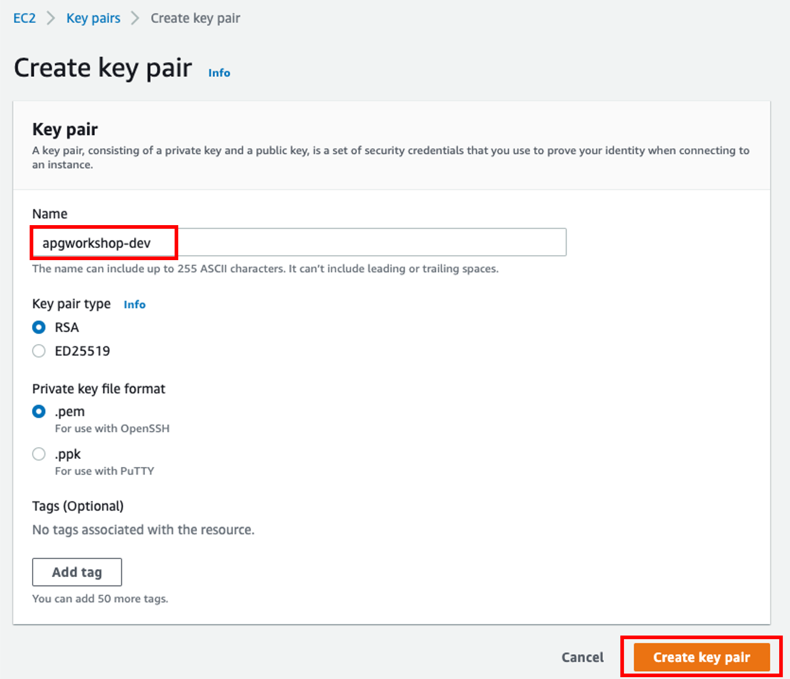

# 2.Create CloudFormation stack

## 1. Copy the CloudFormation template to clipboard

- Click on the copy icon in top-right corner

```
---
## Primary region
## Creates the VPC for DB Cluster
## This sample code is made available under the MIT-0 license. See the LICENSE file.

AWSTemplateFormatVersion: 2010-09-09
Description: Creates the VPC for creating Aurora cluster

## Parameters
Parameters:
  KeyName:
      Description: Name of an existing EC2 KeyPair to enable RDP access to the instance
      Type: AWS::EC2::KeyPair::KeyName
      ConstraintDescription: must be the name of an existing EC2 KeyPair.
  InstanceType:
    Description: Instance family for the test instance
    Default: m5.large
    Type: String
    AllowedValues:
      - "t3.small"
      - "t3.medium"
      - "m5.large"
      - "m5.xlarge"
      - "m5.2xlarge"
      - "m5.4xlarge"

## Mappings
Mappings:
  NetworkSettings:
    global:
      vpcCidr: 10.0.0.0/16

  RegionMap: # 20 Regions
    us-east-1: # Virginia
      # "EC2AMI" : "ami-0859692ff348b85a1"
      "EC2AMI" : "ami-036ba9b22dc9c13c9"
    us-east-2: # Ohio
      # "EC2AMI" : "ami-0a046adda8c78a21b"
      "EC2AMI" : "ami-0a046adda8c78a21b"
    us-west-1: # California
      # "EC2AMI" : "ami-071925b332131ab21"
      "EC2AMI" : "ami-0f3010a24f345da2a"
    us-west-2: # Oregon
      # "EC2AMI" : "ami-0ab4b5882969dac51"
      "EC2AMI" : "ami-0f9b88130f805e645"
## Resources
Resources:
## The VPC
  AuroraClusterVPC:
    Type: AWS::EC2::VPC
    Properties:
      EnableDnsSupport: true
      EnableDnsHostnames: true
      InstanceTenancy: default
      CidrBlock: !FindInMap [ NetworkSettings, global, vpcCidr ]
      Tags:
        - Key: Name
          Value:  apgworkshop-dev-vpc

## Create an IGW & attach it to the VPC
  InternetGateway:
    Type: AWS::EC2::InternetGateway
    DependsOn: AuroraClusterVPC
    Properties:
      Tags:
        - Key: Name
          Value: apgworkshop-dev-igw
  attachIGW:
    Type: AWS::EC2::VPCGatewayAttachment
    DependsOn: InternetGateway
    Properties:
      VpcId: !Ref AuroraClusterVPC
      InternetGatewayId: !Ref InternetGateway

  PublicSubnetA:
    Type: AWS::EC2::Subnet
    Properties:
      VpcId: !Ref AuroraClusterVPC
      CidrBlock: !Select [ 0, !Cidr [ !GetAtt AuroraClusterVPC.CidrBlock, 4, 8 ]]
      AvailabilityZone: !Select [ 0, !GetAZs ]    # Get the first AZ in the list
      MapPublicIpOnLaunch: true
      Tags:
      - Key: Name
        Value: apgworkshop-dev-PublicA
  PublicSubnetB:
    Type: AWS::EC2::Subnet
    Properties:
      VpcId: !Ref AuroraClusterVPC
      CidrBlock: !Select [ 1, !Cidr [ !GetAtt AuroraClusterVPC.CidrBlock, 4, 8 ]]
      AvailabilityZone: !Select [ 1, !GetAZs ]
      MapPublicIpOnLaunch: true
      Tags:
      - Key: Name
        Value: apgworkshop-dev-PublicB

  PrivateSubnetA:
    Type: AWS::EC2::Subnet
    Properties:
      VpcId: !Ref AuroraClusterVPC
      #CidrBlock: !FindInMap [ NetworkSettings, global, PrivateSubnetACidr ]
      CidrBlock: !Select [ 2, !Cidr [ !GetAtt AuroraClusterVPC.CidrBlock, 4, 8 ]]
      AvailabilityZone: !Select [ 0, !GetAZs ]    # Get the first AZ in the list
      Tags:
      - Key: Name
        Value: apgworkshop-dev-PrivateA

  PrivateSubnetB:
    Type: AWS::EC2::Subnet
    Properties:
      VpcId: !Ref AuroraClusterVPC
      #CidrBlock: !FindInMap [ NetworkSettings, global, PrivateSubnetBCidr ]
      CidrBlock: !Select [ 3, !Cidr [ !GetAtt AuroraClusterVPC.CidrBlock, 4, 8 ]]
      AvailabilityZone: !Select [ 1, !GetAZs ]    # Get the second AZ in the list
      Tags:
      - Key: Name
        Value: apgworkshop-dev-PrivateB


# Here is a private route table:
  PrivateRouteTable:
    Type: AWS::EC2::RouteTable
    Properties:
      VpcId: !Ref AuroraClusterVPC
      Tags:
      - Key: Name
        Value: apgworkshop-dev-private-rtb
  PrivateRoute1:            # Private route table can access web via NAT (created below)
    Type: AWS::EC2::Route
    Properties:
      RouteTableId: !Ref PrivateRouteTable
      DestinationCidrBlock: 0.0.0.0/0
      # Route traffic through the NAT Gateway:
      NatGatewayId: !Ref NATGateway

  PrivateSubnetARouteTableAssociation:
    Type: AWS::EC2::SubnetRouteTableAssociation
    Properties:
      SubnetId: !Ref PrivateSubnetA
      RouteTableId: !Ref PrivateRouteTable
  PrivateSubnetBRouteTableAssociation:
    Type: AWS::EC2::SubnetRouteTableAssociation
    Properties:
      SubnetId: !Ref PrivateSubnetB
      RouteTableId: !Ref PrivateRouteTable


# Some route tables for our subnets:
  PublicRouteTable:
    Type: AWS::EC2::RouteTable
    Properties:
      VpcId: !Ref AuroraClusterVPC
      Tags:
      - Key: Name
        Value: apgworkshop-dev-public-rtb
  PublicRouteToIGW:   # Public route table has direct routing to IGW:
    Type: AWS::EC2::Route
    DependsOn: attachIGW
    Properties:
      RouteTableId: !Ref PublicRouteTable
      DestinationCidrBlock: 0.0.0.0/0
      GatewayId: !Ref InternetGateway
# Attach the public subnets to public route tables,
  # and attach the private subnets to private route tables:
  PublicSubnetARouteTableAssociation:
    Type: AWS::EC2::SubnetRouteTableAssociation
    Properties:
      SubnetId: !Ref PublicSubnetA
      RouteTableId: !Ref PublicRouteTable
  PublicSubnetBRouteTableAssociation:
    Type: AWS::EC2::SubnetRouteTableAssociation
    Properties:
      SubnetId: !Ref PublicSubnetB
      RouteTableId: !Ref PublicRouteTable

# A NAT Gateway:
  NATGateway:
    Type: AWS::EC2::NatGateway
    Properties:
      AllocationId: !GetAtt ElasticIPAddress.AllocationId
      SubnetId: !Ref PublicSubnetA
      Tags:
      - Key: Name
        Value: apgworkshop-dev-natgw
  ElasticIPAddress:
    Type: AWS::EC2::EIP
    DependsOn: AuroraClusterVPC
    Properties:
      Domain: vpc

  RDSSecurityGroupCluster:
    Type: AWS::EC2::SecurityGroup
    Properties:
      VpcId: !Ref AuroraClusterVPC
      GroupName: apgworkshop-dev-internal
      GroupDescription: RDS cluster firewall
      Tags:
        - Key: Name
          Value: apgworkshop-dev-rdsa-internal
      SecurityGroupIngress:
        - IpProtocol: tcp
          FromPort: 5432
          ToPort: 5432
          CidrIp: !Select [ 0, !Cidr [ !GetAtt AuroraClusterVPC.CidrBlock, 4, 8 ]]
          Description: Allows hosts in public subnet A to connect with the cluster
        - IpProtocol: tcp
          FromPort: 5432
          ToPort: 5432
          CidrIp: !Select [ 1, !Cidr [ !GetAtt AuroraClusterVPC.CidrBlock, 4, 8 ]]
          Description: Allows hosts in public subnet B to connect with the cluster

# Bastion host security group
  HostSecurityGroup:
    Type: AWS::EC2::SecurityGroup
    Properties:
      GroupDescription: Open Port 22 for ssh
      VpcId: !Ref AuroraClusterVPC
      SecurityGroupIngress:
        - IpProtocol: tcp
          FromPort: "3389"
          ToPort: "3389"
          CidrIp: 255.255.255.255/0
  # Bastion host role
  BastionHostRoleWindows:
    Type: AWS::IAM::Role
    Properties:
      RoleName: !Sub apgworkshop-dev-bastion-${AWS::Region}
      AssumeRolePolicyDocument:
        Version: 2012-10-17
        Statement:
          - Effect: Allow
            Action:
              - sts:AssumeRole
            Principal:
              Service:
                - ec2.amazonaws.com
      ManagedPolicyArns:
        - arn:aws:iam::aws:policy/AdministratorAccess

  # Bastion host profile
  BastionHostInstanceProfile:
    Type: "AWS::IAM::InstanceProfile"
    DependsOn: BastionHostRoleWindows
    Properties:
      Path: "/"
      Roles:
        - !Ref BastionHostRoleWindows


  # Bastion host EC2 instance
  BastionEC2Instance:
    Type: AWS::EC2::Instance
    DependsOn: HostSecurityGroup
    Properties:
      InstanceType: !Ref InstanceType
      ImageId:
        Fn::FindInMap:
          - RegionMap
          - !Ref AWS::Region
          - EC2AMI
      SecurityGroupIds:
        - !Ref HostSecurityGroup
      SubnetId: !Ref PublicSubnetA
      IamInstanceProfile: !Ref BastionHostInstanceProfile
      Tags:
        - Key: Name
          Value: "apgworkshop-dev Bastion Host Instance"
      # KeyName: !Ref KeyName
      KeyName: !Ref KeyName

  DBSubnetGroup:
      Type: AWS::RDS::DBSubnetGroup
      Description: Subnet group
      Properties:
        DBSubnetGroupDescription: apgworkshop-db-subnet-group
        DBSubnetGroupName: apgworkshop-db-subnet-group
        SubnetIds: [!Ref PrivateSubnetA, !Ref PrivateSubnetB]
        Tags:
          - Key: Name
            Value: Subnet group with ONLY private subnets


  EnhancedMonitoringRole:
    Type: AWS::IAM::Role
    Properties:
      RoleName: !Sub apgworkshop-dev-monitor-${AWS::Region}
      AssumeRolePolicyDocument:
        Version: 2012-10-17
        Statement:
          - Effect: Allow
            Action:
              - sts:AssumeRole
            Principal:
              Service:
                - monitoring.rds.amazonaws.com
      ManagedPolicyArns:
        - arn:aws:iam::aws:policy/service-role/AmazonRDSEnhancedMonitoringRole
## Outputs
Outputs:
  AuroraClusterVPC:
    Description: ImmDays Lab VPC
    Value: !Ref AuroraClusterVPC
    Export:
        Name: !Sub "${AWS::Region}-${AWS::StackName}-AuroraClusterVPC"
  PublicSubnetCidrA:
    Description: PublicSubnetA CIDR for LAB
    Value: !Select [ 0, !Cidr [ !GetAtt AuroraClusterVPC.CidrBlock, 4, 8 ]]
    Export:
        Name: !Sub "${AWS::Region}-${AWS::StackName}-PublicSubnetACidr"
  PublicSubnetCidrB:
    Description: PublicSubnetB CIDR for LAB
    Value: !Select [ 1, !Cidr [ !GetAtt AuroraClusterVPC.CidrBlock, 4, 8 ]]
    Export:
        Name: !Sub "${AWS::Region}-${AWS::StackName}-PublicSubnetBCidr"
  PublicSubnetA:
    Description: PublicSubnetA for LAB
    Value: !Ref PublicSubnetA
    Export:
        Name: !Sub "${AWS::Region}-${AWS::StackName}-PublicSubnetA"
  PublicSubnetB:
    Description: PublicSubnetB for LAB
    Value: !Ref PublicSubnetB
    Export:
        Name: !Sub "${AWS::Region}-${AWS::StackName}-PublicSubnetB"
  PrivateSubnetA:
    Description: PrivateSubnetA for LAB
    Value: !Ref PrivateSubnetA
    Export:
        Name: !Sub "${AWS::Region}-${AWS::StackName}-PrivateSubnetA"
  PrivateSubnetB:
    Description: PrivateSubnetB for LAB
    Value: !Ref PrivateSubnetB
    Export:
        Name: !Sub "${AWS::Region}-${AWS::StackName}-PrivateSubnetB"
  PrivateSubnets:
    Description: 'VPCs Subnets private'
    Value: !Join [',', [!Ref PrivateSubnetA, !Ref PrivateSubnetB]]
    Export:
      Name: !Sub '${AWS::StackName}-SubnetsPrivate'
  DBSecurityGroupCluster:
    Description: This is the Security group to be used for the DB cluster
    Value: !Ref RDSSecurityGroupCluster
    Export:
        Name: !Sub "${AWS::Region}-${AWS::StackName}-SecurityGroupDBCluster"
  SourceEC2PublicDNS:
    Description: Public DNS enpoint for the EC2 instance
    Value:
      Fn::GetAtt:
      - BastionEC2Instance
      - PublicDnsName
  EnhancedMonitoringRole:
    Description: Role used for enhanced monitoring
    Value: !GetAtt EnhancedMonitoringRole.Arn
```

## 2. Open the CloudFormation Console

- Type CloudFormation in the service search box
- Click on CloudFormation

## 3. Create the CloudFormation stack

- Click on the button Create Stack

## 4. Setup CloudFormation template

- Select Create template in Designer
- Click on Create template in designer

## 5. Paste the YML in designer

- Select template on bottom left
- Select YAML as the format
- Paste the YML that you copied earlier
- Click on the upload icon on top-left

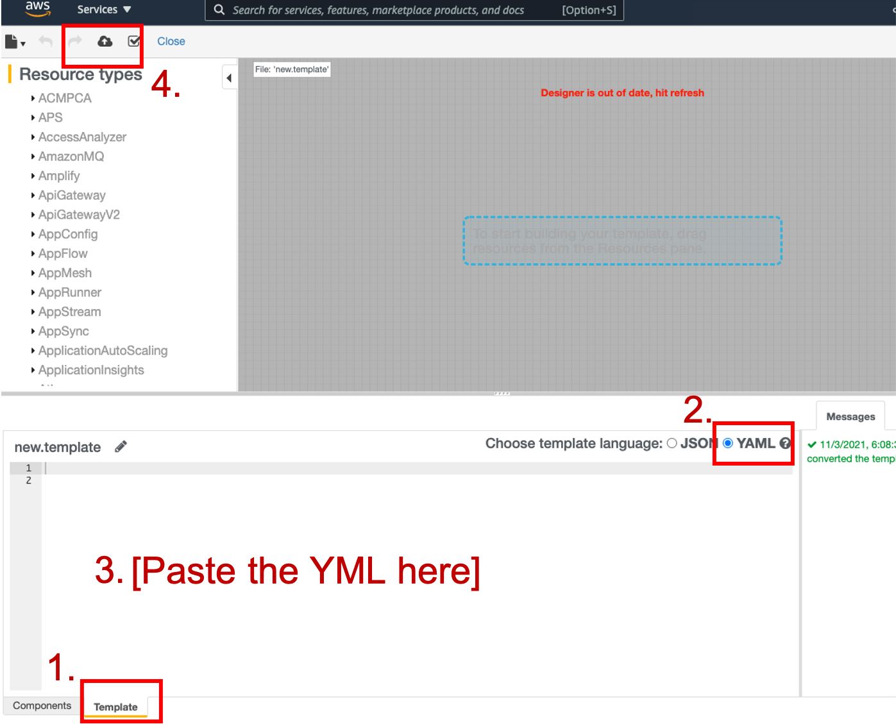

## 6. Click on next

- Click on the Next button

## 7. Set the name & select key pair

- Set the name = apgworkshop-dev
- Select the key pair you created earlier
- Click on the button next a couple of times
- Click on the button Create stack

## 8. Wait for the stack creation to complete

- Stack creation may take a couple of minutes

# 3.Update Host Security Group

Note: The Security Group used for the Bastion Host does NOT allow access from any public IP address. We need to update the security group for it to allow access from your desktop.

## 1. Open the Bastion Host Security Group

- Open the CloudFormation stack for the lab
- Click the tab for Resources
- Search for the HostSecurityGroup
- Click on the security group - opens up in a new browser tab

## 2. Edit the inbound rule in the security group

** Click on the tab Inbound rules
** Click on the Edit Inbound rules

## 3. Update the inbound IP address

- Confirm the inbount rule is for RDP
- Click on Source and select My IP
- Click on the Save rules

# 4. RDP Client : Test Bastion Host

**Security Group Inbound for RDP**

The default Security Group used for the Bastion Host does NOT allow open access from any public IP address. Make sure to follow the previous step otherwise you will NOT be able to connect to the host machine using RDP client.

## 1. Open the Bastion Host / EC2 console

** Click on the CloudFormation stack
** Click on the tab for Resources

## 2. Connect to the Bastion Host

** Select the instance
** Click the button Connect

## 3. Download remote desktop file & get Administrator password for Windows

- Click on the tab RDP Client
- Download the remote desktop file
- Click on Get the password

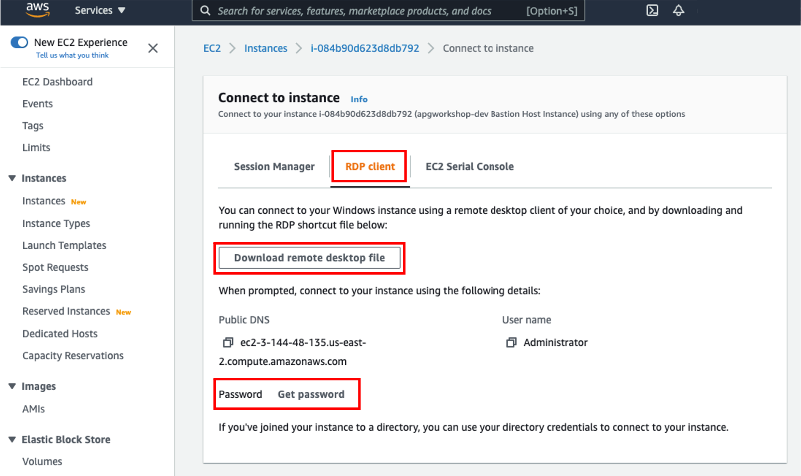

## 4. Decrypt the password

- Select the key file you downloaded earlier by clicking on the browse button (Check the Downloads folder)
- Click on the Decrypt password button
- Save the password in a notepad as you will need it for logging onto the host

## 5. Logon to the Windows Bastion Host

- ASSUMPTION: You have RDP client app
- Double click on the downloaded RDP Client file
- Provide the password (copied earlier)
- Make sure that there is no error and you are able to see the remote desktop

# 4. SSM Browser RDP Client : Test Bastion Host

**Security Group Inbound for RDP**

The default Security Group used for the Bastion Host does NOT allow open access from any public IP address. Make sure to follow the previous step otherwise you will NOT be able to connect to the host machine using RDP client.

**Reconnecting to EC2/Windows**

Keep the SSM Console open in a separate tab as you may need to recreate connection later, as the session expires after 60 minutes of inactivity.

In this step, you will connect to the Windows/EC2 host using the SSM Gui Client (RDP via browser).

## 1. Open the AWS Systems Manager console

- Open AWS console using the link in lab book
- Type SSM in search box and select Systems Manager

## 2. Open Fleet Manager in SSM console

- Click on Fleet Manager in the left navigation pane.

## 3. Start the RDP session

- Select the instance
- Click the button Node Action
- Select Connect with Remote Desktop

## 4. Provide the credentials

- Select the Key pair
- Check Browse your local ....
- Click on browse and select the Key file you downloaded earlier
- Click on Connect

You should see the desktop !!!

# Lab-2 : Setup Aurora PostgreSQL DB Cluster

### Overview

In this part we will be launching an Aurora PostgreSQL DB cluster. At the end of this lab we will have 1 DB instances in the cluster, as depicted in the illustration below.

You have the option of creating the Aurora cluster using the AWS CLI or by using the RDS console. Pick a method that you are interested in learning.

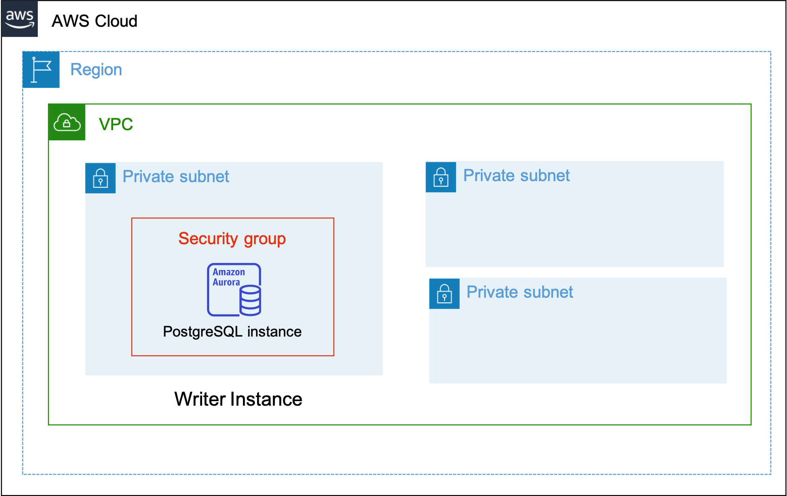

# **VIA AWS CLI**

## **Create DB cluster using the AWS CLI**

### Note: All commands to be run in PowerShell

Creation of the Aurora DB cluster is a two step process. In step-1, the Aurora cluster is created and in step-2 an instance is added to the cluster.

## 1. Get the Security Group to be used for the instance

- This command extracts the DB Security group identifier for the DB cluster instances.
- This security group allows access to DB instances on port 5432 from the public sunets
- We will use the Security Group identifier in the next command

```
$env:CF_STACK = aws cloudformation list-stacks `
--query 'StackSummaries[?contains(StackName, `apgworkshop-dev`) == `true`].StackName' `
--output text

echo $env:CF_STACK
```

```
aws  cloudformation describe-stacks `
--stack-name $env:CF_STACK  `
--output  text  `
--query 'Stacks[0].Outputs[?OutputKey==`DBSecurityGroupCluster`].OutputValue'
```

## 2. Create the Aurora PostgreSQL Database Cluster

This will create the Aurora cluster without any instances. You will not be able to add an instance to it using the RDS console, so in next step we will add an instance to the cluster.

```
aws rds create-db-cluster `
    --db-cluster-identifier apgworkshop-dev `
    --engine  aurora-postgresql  `
    --engine-version 13.7 `
    --master-username   postgres `
    --master-user-password  postgres123 `
    --db-subnet-group-name apgworkshop-db-subnet-group `
    --vpc-security-group-ids <<Replace this>>
```

Wait for the DB cluster to become available. You may use command below or check status of cluster creation in the RDS Console.

```
aws rds describe-db-clusters `
    --db-cluster-identifier    apgworkshop-dev `
    --query 'DBClusters[0].Status'
```

## 3. Create the Database Instance

At this time the cluster has a Storage Volume but no compute resources. In this step you will add a provisioned DB instance. In real setup, you will select the size of the DB instance based on your workload requirements.

```
aws rds create-db-instance `
    --db-instance-identifier apgworkshop-dev-instance-1 `
    --db-cluster-identifier apgworkshop-dev `
    --engine aurora-postgresql `
    --db-instance-class db.r5.large
```

Wait for the instance to become available.

```
aws rds describe-db-instances `
    --db-instance-identifier    apgworkshop-dev-instance-1 `
    --query 'DBInstances[0].DBInstanceStatus'
```

# **VIA RDS Console**

## **Create using the Console**

## 1. Switch to the RDS console

- Switch to RDS console by typing rds in the search box

## 2. Click on create database

## 3. Select Aurora PostgreSQL

- Select the standard create option
- Select Amazon Aurora
- Select PosgreSQL-compatible
- Change the version to 13.7

## 4. Use the DevTest template, Default DB and setup credentials

- Select template Dev/Test
- Set the name to apgworkshop-dev
- Set master user name to postgres
- Set master user password to postgres123

## 5. Select the DB instance class

- Do not create a Replica

## 6. Setup the network connectivity & security for the instance

#### 1. Select the VPC created for the workshop apgworkshop-dev

#### 2. Select subnet group created for workshop

#### 3. Mark database as publicly inaccessible

#### 4. Remove default Security Group and select the apgworkshop-dev-internal security group that was created by the CloudFormation template

## 7. Create the database

- Click on the button Create database
- Creation will take a couple of minutes

## 8. Wait for the cluster creation to complete

- Once the status changes to Available, your DB cluster is ready
- Creation will take a couple of minutes

# 1.Setup pgAdmin Tool

## 1. Use RDP client to connect with the Windows Bastion Host

- Refer to Lab-1 for the instructions

## 2. Launch the PgAdmin tool

PgAdmin is a graphical tool that allows administration of PostrgreSQL databases. In this step we will launch the PgAdmin tool.

- On the Bastion host click on the Windows start button
- Select the PgAdmin Application
- First time launch of pgAdmin requires the user to provide the password
- Set the password for pgAdmin = password

## 3. On pgAdmin Click on Add Server

- Objective of this step is to connect pgAdmin with Aurora DB Cluster

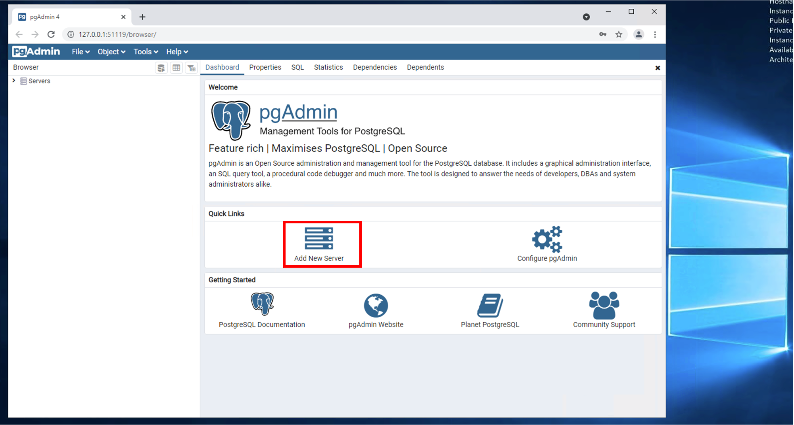

## 4. Get the Aurora DB Cluster endpoint

**VIA AWS CLI**

- Open PowerShell on Windows host
- Run the command & copy the cluster endpoint to clipboard

```
aws rds describe-db-clusters  `
      --db-cluster-identifier apgworkshop-dev `
      --query 'DBClusters[0].Endpoint' `
      --output text
```

** VIA RDS Console**

- Open the RDS console (on your local machine)
- Select the DB cluster
- Copy the Writer endpoint to the clipboard by clicking on the icon left of the endpoint
  PS: You may need to wait for sometime if your cluster is still getting created

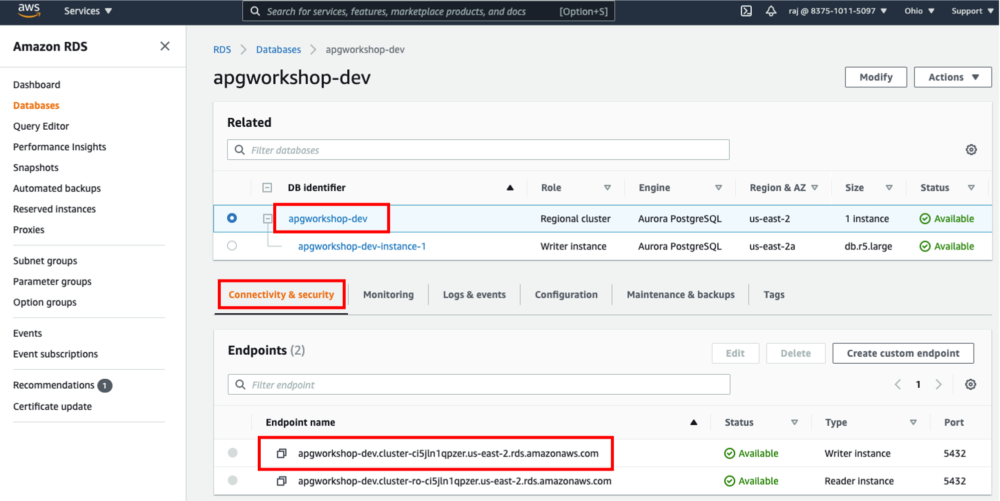

## 5. Give the server name and click on Connection tab

- Set the Name to Aurora PG Cluster
- Click on the connection tab
- Paste the endpoint address copied from the RDS console
- Set the user & password information
- Check the Save password otherwise you will be prompted for password

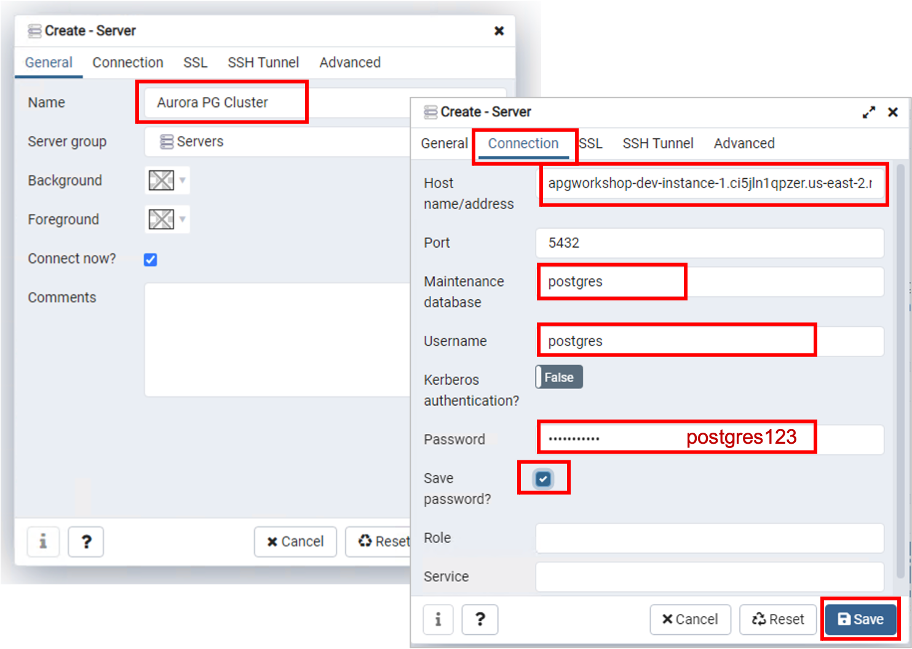

# 2.Test the DB Cluster

PS: You may need to wait for sometime if your cluster status is NOT Available

In this part of the exercise we will execute SQL statments against the test database on our Aurora cluster. First we will create the test database testdb that we will use throughout the workshop and then we will execute SQL statements against the database.

## 1. Create the database : testdb

- In pgAdmin expand Aurora PG Cluster
- Right click on Databases and select Create >> Database
- Provide the database name testdb and click on save

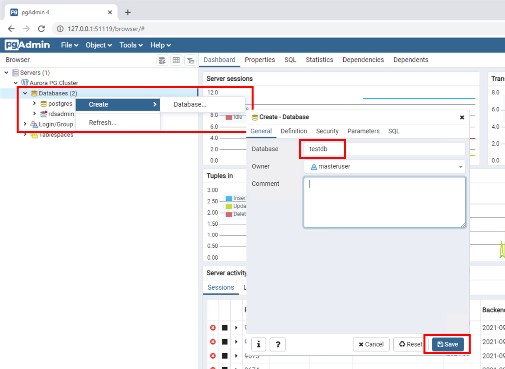

## 2. Launch the pgAdmin query tool

We will execute SQL statements against the database on our Aurora PG Cluster

- Right click on the database testdb
- Select the option Query Tool...

## 3. Create a test table

- Copy and paste the SQL below to the query tool
- Click on the execute button (triangle) on top right

```
DROP TABLE  IF EXISTS usertable;
CREATE TABLE usertable (id  integer, fname  varchar(40))
```

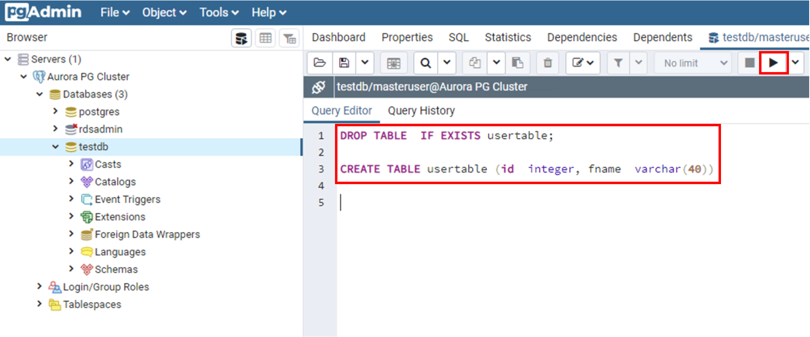

You should receive the result indicating successful creation of the table.

## 4. Execute a few SQL INSERT statements

- Replace the SQL in query tool with the SQL below
- Click on the execute button (triangle) on top right

```
INSERT INTO usertable  VALUES(100, 'John');
INSERT INTO usertable  VALUES(101, 'Alexa');
INSERT INTO usertable  VALUES(102, 'Anil');
```

## 5. Execute SELECT against the table

- Replace the SQL in query tool with the SQL below
- Click on the execute button (triangle) on top right

```
SELECT * FROM usertable  ;
```

## 6. Explore pgAdmin tool

As a application architect/developer you will be using pgAdmin so we suggest that if you are new to pgAdmin, explore the various features and capabilities available on it. In this workshop we will be using limited number of these features.

# Lab-4 : Add a Reader instance

### **Learning objective**

- Horizontal scaling of Aurora DB cluster
- Learn the behavior of Reader Endpoint using pgAdmin
- Both the Writer & Reader instances allow connections from Bastion Host (checkout the Security group)

### Overview

In this section you will add a Read Replica to your Auroa Database cluster. The Read Replica in Aurora cluster is a target for failover, so to test it out we will carry out a failover.

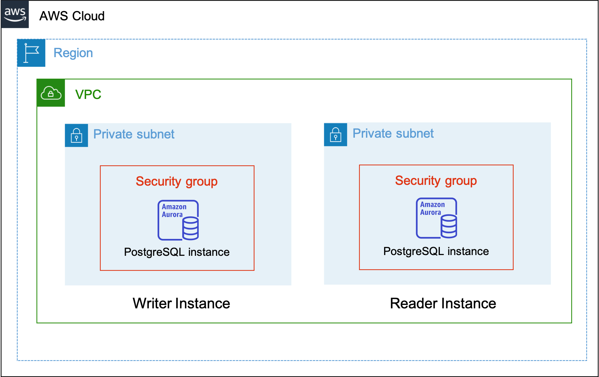

# 1.Add a Reader instance

## Overview

You already have 1 instance in the DB cluster. At the end of this partyou will have 2 instances in the cluster.


**VIA AWS CLI**

## 1. Create an additional database instance

```
aws rds create-db-instance `
    --db-instance-identifier apgworkshop-dev-instance-2 `
    --db-cluster-identifier apgworkshop-dev `
    --engine aurora-postgresql `
    --db-instance-class db.r5.large
```

## 2. Wait for the Reader to become available

- It may take a few minutes for the instance provisioning
- Check the staus in RDS Console

**VIA RDS Console**

## 1. Open the RDS console

- Select the Aurora DB Cluster
- Click on the Action menu
- Select Add reader

## 2. Setup instance identity and confirm instance class

- Set the name to apgworkshop-dev-instance-2
- You may select an instance of a different class than instance 1
- Set the instance class to db.r5.large

## 3. Do not change the defaults

- Click on Add Reader button on the bottom right

## 4. Wait for the Reader to become available

- It may take a few minutes for the instance provisioning
- You may proceed to the next step

# 2.Connect to Reader

Objective is to add the Reader Endpoint to the pgAdmin. Once we have done that we will be able to run SQL queries against the reader endpoint.

## 1. Open up pgAdmin and select Add Server

8 On pgAdmin right click on Servers
8 Select Create
8 Select Server...

## 2. Copy the Reader Endpoint information from RDS console

**VIA AWS CLI**

- Open PowerShell on Windows host
- Run the command & copy the cluster endpoint to clipboard

```
aws rds describe-db-clusters  `
      --db-cluster-identifier apgworkshop-dev `
      --query 'DBClusters[0].ReaderEndpoint' `
      --output text
```

**VIA RDS Console**

- Open the RDS console
- Select the Aurora DB Cluster
- Copy the Reader Endpoint to the clipboard

## 3. Setup the server information

- Set the name to Aurora PG Cluster - Reader
- Click on the connection tab
- Paste the endpoint in Host
- Provide the credentials
- Check the box Save password
- Click on Save button

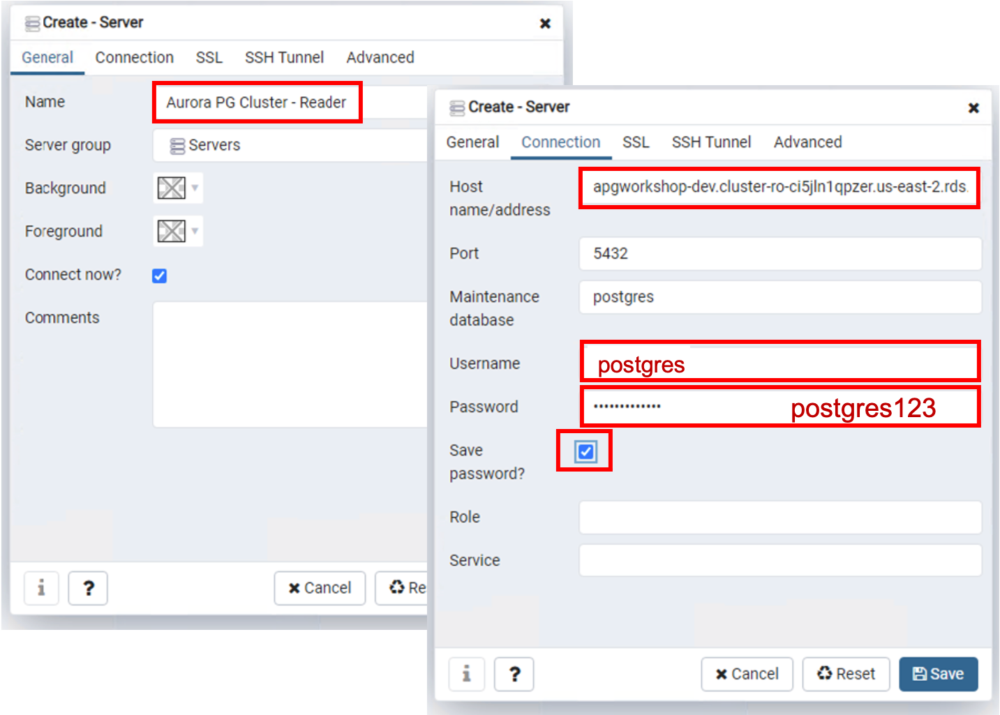

## 4. Run SQL against the Reader endpoint

- Expand the Server for Reader endpoint in left panel
- Right click on the testdb database - we created this database earlier
- Select Query Tool...

## 5. Execute SQL Select against the database

- Paste the SQL in query tool with the SQL below
- Run the query by clicking on the triangle on top right of query tool window
- This query will be successful

```
SELECT * FROM usertable  ;
```

## 6. Execute SQL Insert against the database

- Replace the SQL and execute
- This query will FAIL as reader endpoint does not allow Write to database !!!

**Known issue**
Insert sometimes succeed!!! if the DNS cache for Reader Endpoint is still pointing to primary. Wait for some time and try again. You may need to kill & start the PgAdmin tool!!

```
INSERT INTO usertable  VALUES(100, 'Justin');
```

Error you will receive:

```
ERROR:  cannot execute INSERT in a read-only transaction
SQL state: 25006
```

# Cleanup tasks

We will use the read replica we created in this lab for the next lab on failover.

**Do NOT Delete Replica**
If you intend to carry out the Lab-5 Events and Failover as the reader is needed for that exercise.

```
aws rds delete-db-instance   `
    --db-instance-identifier    apgworkshop-dev-instance-2
```

# Lab-5 : Events & failover

**Needs 2 instances**

This lab assumes that you have 2 instances in your Aurora cluster. If you deleted the read replica in the last lab then please recreate it using instructions in previous lab.

### Overview

In the last lab you added a Read Replica to your Auroa Database cluster. The Read Replica in Aurora cluster is a target for failover, so to test it out we will carry out a failover. But before we do that, we will setup a Aurora Event subscription for Failover Events. With the subscription in place, we will be receiving email(s) whenever there will be a failover event on the cluster.

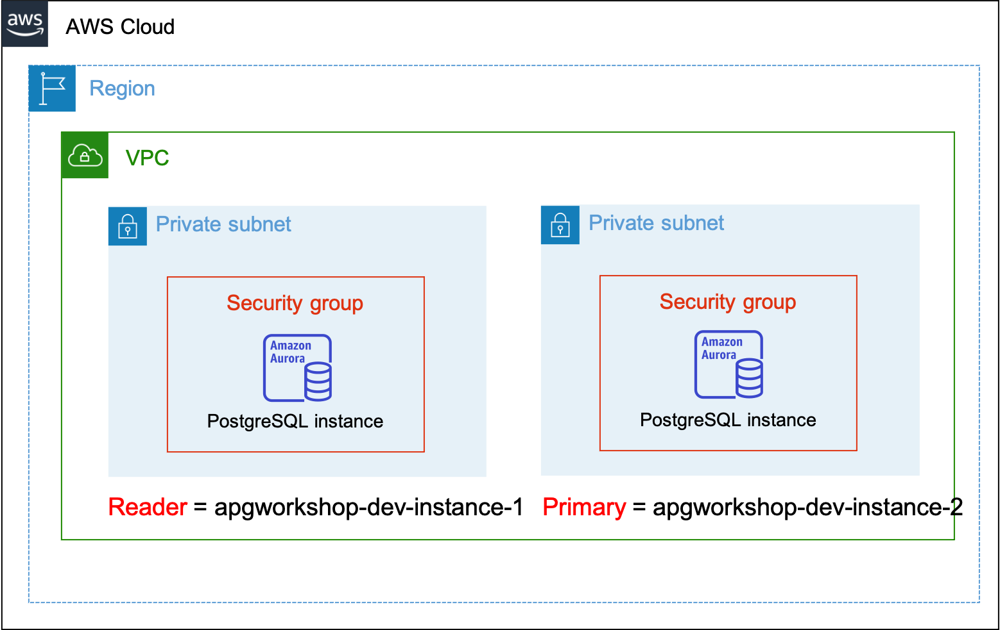

# 1.Setup Event Alarm

RDS/Aurora emits events when something happens on the cluster or DB instances. These events are published to an SNS topics. Subscribers the SNS topics may receive these events across multiple channels such as email, SMS, etc. By the end of this part, we will have:

- A new SNS topic to which RDS will publish the events
- An email subscription to the SNS topic
- RDS event subsciption will be setup with a filter to publish ONLY failover events to the topic

**VIA AWS CLI**

The process for setting up the RDS event subscription involves 3 steps:

## 1. Setup an SNS topic

The command below will create an SNS topic and show the ARN for the topic. You will need the ARN for the topic in the next step.

```
aws sns create-topic `
    --name    apgworkshop-dev-events
```

In case you miss the ARN for the topic, you can retrieve it with the command.

```
aws sns list-topics
```

## 2. Publish RDS Failover events to the topic

```
aws rds create-event-subscription   `
    --subscription-name  apgworkshop-dev-subscription `
    --event-categories "failover"  `
    --source-type  db-cluster   `
    --source-ids   apgworkshop-dev  `
    --sns-topic-arn   <<Copy-Paste ARN from previous cmd>>
```

## 3. Setup email subscription to the SNS topic

```
aws sns subscribe `
      --protocol email   `
      --notification-endpoint   <<Your email address>>   `
      --topic-arn  <<Topic ARN>>
```

## 4. Confirm the subscription email

- Go to your email inbox and look for an email from AWS
- Open email and click on Confirm subscription
- It will open up a browser with a message Subscription confirmed!

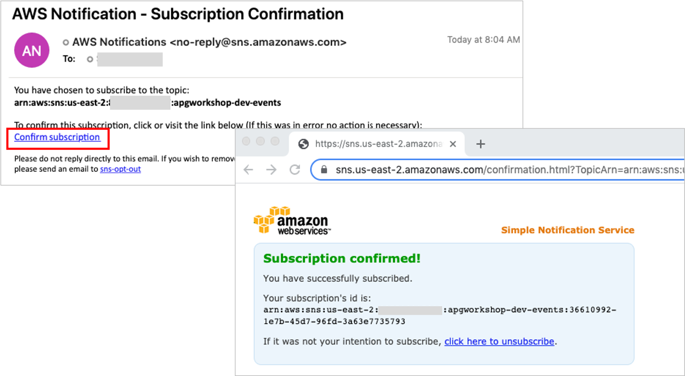

**VIA AWS RDS Console**

## 1. Create event subscription

- Open the RDS console
- Click on Event subscriptions in left hand panel
- Click on the button Create event subscription

## 2. Subscription configuration

Setup the event alarm configuration.

- Name = apgworkshop-dev-subscription

### Target

- Send notifications to = apgworkshop-dev-events
- Provide your email address

### Source

- Select Type = Clusters
- Click on Specific Cluster = Select apgworkshop-dev
- Click on Sepecific event categories = Select failover
- Click on the button Create

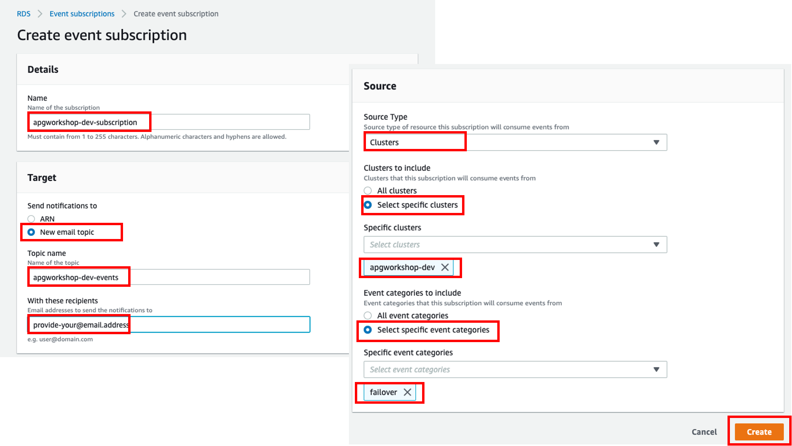

## 3. Confirm the subscription email

- Go to your email inbox and look for an email from AWS
- Open email and click on Confirm subscription
- It will open up a browser with a message Subscription confirmed!


# 2.Initiate DB failover

- Reader instance is a failover target
- In the current state of the cluster (Writer Instance = instance-1 Reader Instance = instance-2)
- A planned failover can be carried out any time by the users. It may intiated from the console or using the CLI
- After the failover the roles will switch between instance-1 & instance-2
- An unplanned failure of Writer instance will lead to an automatic failover
- In this exercise we will carry out a planned failover. You may use either the CLI or the console.

**VIA AWS CLI**

## 1. Initiate the failover

```
aws rds failover-db-cluster   `
    --db-cluster-identifier     apgworkshop-dev
```

## 2. Check your email for Failover notification

- You should receive 2 emails within a couple of minutes
- Email-1 is for the Failover started event
- Email-2 is for the Failover completed event
- Review the email messages
- Check out the timestamps - failover takes ~1 minute to complete

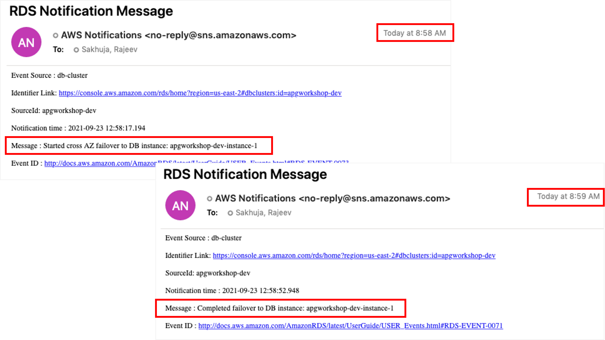

## 3. Open up the PG Admin tool

- You will be using pgAdmin for executing queries
- First select the Reader endpoint as shown below

## 4. Execute SQL statements against the Reader

- Replace the SQL in query tool with the SQL below & execute
- You will get an error !!! as expected.

```
INSERT INTO usertable  VALUES(103, 'Jack');
```

- Now try the SELECT statement below; it should work

```
SELECT * FROM usertable;
```

## 5. Execute SQL INSERT statements against the Writer

- Connect to the Writer endpoint in pgAdmin tool
- Execute the insert statements below - this time it will be successful !!!

```
INSERT INTO usertable  VALUES(103, 'Jack');
INSERT INTO usertable  VALUES(104, 'Emily');
INSERT INTO usertable  VALUES(105, 'Jai');
```

**VIA AWS RDS Console**

## 1. Carry out a planned failover

- Open the RDS console
- Select the DB instance
- Click on the Action drop down and select Failover
- Confirm on the prompt by clicking the button Failover
- Failover will take under a minute !!!

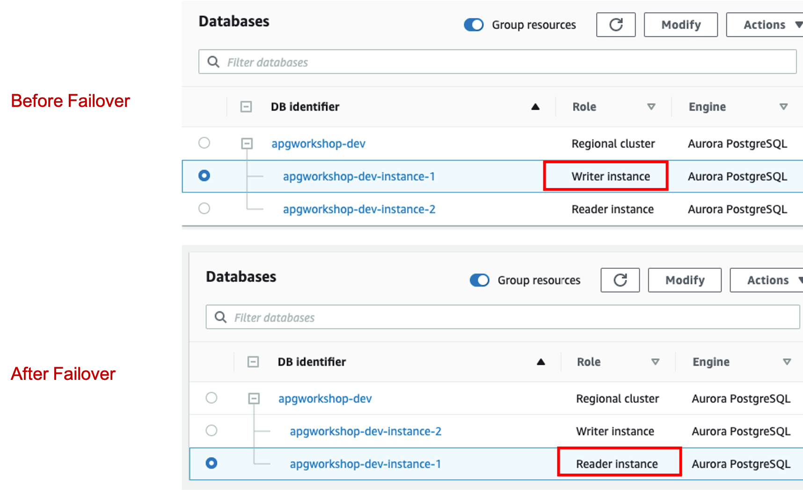

## 2. Check your email for Failover notification

- You should receive 2 emails within a couple of minutes
- Email-1 is for the Failover started event
- Email-2 is for the Failover completed event\* Review the email messages
- Check out the timestamps - failover takes ~1 minute to complete


## 3. Open up the PG Admin tool

- You will be using pgAdmin for executing queries
- First select the Reader endpoint as shown below

## 4. Execute SQL statements against the Reader

- Replace the SQL in query tool with the SQL below & execute
- You will get an error !!! as expected.

```
INSERT INTO usertable  VALUES(103, 'Jack');
```

- Now try the SELECT statement below; it should work

```
SELECT * FROM usertable;
```

## 5. Execute SQL INSERT statements against the Writer

- Connect to the Writer endpoint in pgAdmin tool
- Execute the insert statements below - this time it will be successful !!!

```
INSERT INTO usertable  VALUES(103, 'Jack');
INSERT INTO usertable  VALUES(104, 'Emily');
INSERT INTO usertable  VALUES(105, 'Jai');
```

# Cleanup tasks

We need to cleanup the Subscriber and the topic.

**VIA AWS CLI**

## 1. Delete the second instance

**Do NOT Delete Replica**

If you would like to experiment with the reader. Instructions for instance deletion also also covered in the final list of cleanup tasks.

```
aws rds delete-db-instance   `
    --db-instance-identifier    apgworkshop-dev-instance-2
```

## 2. Delete the RDS event subscription

```
aws rds delete-event-subscription `
    --subscription-name      apgworkshop-dev-subscription
```

## 3. Delete email subscriptions

```
aws sns list-subscriptions   `
       --query 'Subscriptions[?Protocol==`email`]'
```

```
aws   sns unsubscribe   `
      --subscription-arn    <<Subscription ARN>>
```

## 4. Delete the SNS topic

Get the ARN for the topic

```
aws sns list-topics
```

```
aws sns delete-topic    `
    --topic-arn  <<Copy-Paste Topic ARN>>
```

**VIA AWS RDS Console**

## 1. Delete the second instance

Note
You skip this step if you would like to experiment with the reader. Instructions for instance deletion also covered in the final list of cleanup tasks.

- In RDS console select the instance
- In action menu select Delete
- Check Do not create snapshot and confirm deletion

## 2. Open event subscriptions on RDS console

- Open the RDS console
- Click on Event subscriptions in left hand panel
- Select the event subscription apgworkshop-dev-subscription
- Click on the button Delete
- Confirm the deletion by clicking on the button Delete

## 3. Open the Simple Notification Service (SNS) console

- In the service search box type sns
- Select the Simple Notification Service

## 4. Delete the topic

- Click on left nav option Topics
- Select the topic apgworkshop-dev-events
- Click on the button Delete
- In the confirmation box type delete me and click on button Delete

# Lab-6 : Aurora Postgres Logs

Overview
Open source PostgreSQL writes log files to the local file system. These logs provide insights to the operations of the Postgres database engine. Since Aurora is a managed service without host access, users access log files via defined APIs.

Developers and DBA can control what gets logged into the log files. Important thing to keep in mind is that these log files get rotated on a periodic basis. In order to retain the log files for a longer period of time, one must consider either downloading these files to S3 or publish them to CloudWatch.

Customer controls logging and configuration of log files by way of configuration parameters in the custom parameter group that is attached to the Aurora instance.

RDS/Aurora makes the PostgreSQL logs available by way of:

- RDS Console
- Amazon CloudWatch (once published)

# 1.Checkout the PostgreSQL Logs

## 1. Execute SQL queries

- By default only errored queries are logged
- Open up pgAdmin
- Right click on the testdb and select Query Tool

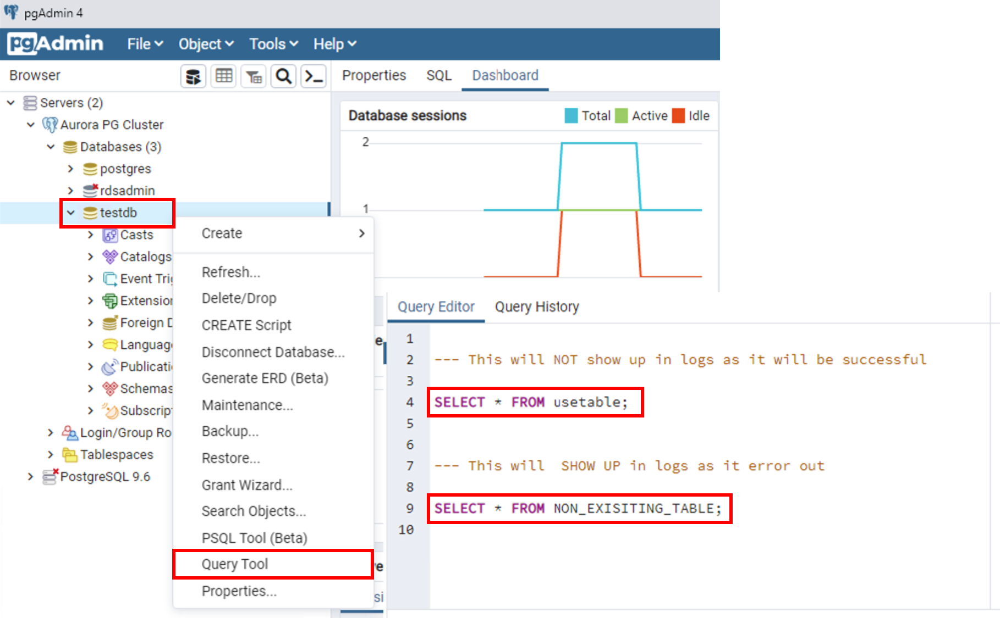

- Try a query that will be successful. Copy paste query below and execute it. Refresh the Postgres log you have opened in the RDS console (you may need to reopen the latest log file!!!). You wont see any new log message.

```
SELECT * FROM usertable  ;
```

- Try a query that will fail. Copy paste query below and execute it. Refresh the Postgres log you have opened in the RDS console (you may need to reopen the latest log file!!!). You will see new log message related to query failure.

```
SELECT * FROM NON_EXISTING_TABLE  ;
```

**VIA AWS CLI**

To view the content of the log file, you need to download it to local machine. The downloaded file can then be opened in a text editor or log tools for analysis.

## 2. Get the list of log files on a specific date

```
aws rds describe-db-log-files `
    --db-instance-identifier apgworkshop-dev-instance-1   `
    --output   text  `
    --filename-contains <<Replace with today's date YYYY-MM-DD>>
```

## 3. Download the latest log file

- Check the console for Primary/Writer instance and replace the instance name if needed.

```
 aws rds download-db-log-file-portion   `
   --db-instance-identifier apgworkshop-dev-instance-1 `
   --log-file-name <<Replace with file name> `
   > postgresql-log-file.txt
```

## 4. Open log file in Visual Studio Code

This will open the log file in Visual Studio code

```
code   postgresql-log-file.txt
```

## 5. Replace \n with Ctrl+Return

- In Visual Studio Code press Ctrl-F
- Click on down caret - type \n in find box
- In replace box press Ctrl+Return
- Click on replace all button
- You should find the SQL statement with errors

**VIA AWS RDS Console**

## 1. Open the RDS console

- Select the Writer Instance in the cluster
- Scroll down to find the section titled Logs
- Select the latest log file. You may click on the Inverted Triangle to change the log list ordering
- Click on the View to see the content of the file

## 3. Refresh the logs content

- Close the log file you opened earlier
- Refresh and View the latest log file again
- You will see message only for SQL statements that errored

# 2.Watch & Download Logs

When you are watching the log file, it will automatically be updated. Think of it as the UNIX tail command for automatic update of the logs in a shell window. The log data is refreshed every 5 seconds.

## 1. Ensure you have the Writer instance selected

- We will run the queries against Writer endpoint

## 2. Select log file for Watch

- Close the log file view (if its open)
- Click on the refresh button
- Select the latest log file (use triangle to reorder the listing if needed)
- Click on the Watch button

## 3. Execute SQL queries & Observe logs

- In pgAdmin click on the server for Writer Endpoint
- Right click on testdb and select Query tool...
- Execute SQL with errors
- The logs in RDS console will show you the error messages in near real time; refresh every 5 seconds!!

```
SELECT * FROM NON_EXISTING_TABLE  ;
```

## 4. Download the log file to local file system

- Close the log file
- Click on the Download button
- You may open/analyze the file on your machine

# 3.Publish logs to CloudWatch

Postgres Log files are writen to the instance's local file storage. Periodically the log files are removed; the frequency depends on the configuration and volume of data being pushed to the log files. If you would like to retain the logs for longer period of time then consider using the CloudWatch logs.

**VIA AWS CLI**

Modify the Aurora DB cluster to enable export of PostgreSQL logs to CloudWatch.

```
aws rds modify-db-cluster `
    --db-cluster-identifier  apgworkshop-dev `
    --cloudwatch-logs-export-configuration EnableLogTypes=postgresql `
    --apply-immediately
```

**VIA AWS RDS Console**

## 1. In RDS console modify the Writer instance

- Select the Writer instance
- Click on the button Modify
- Your Writer instance may be different than one shown in the illustration below

## 2. Enable logs export to CloudWatch

- Scroll down to the section on Monitoring
- Enable the option for Log exports
- Scroll down and click on the button Continue

## 3. Review changes & Apply Immediately

- Review the change
- Select Apply Immediately
- Click on Modify DB Instance

Check logs in console

## 1. Open CloudWatch console

- In the search box type CloudWatch
- Right click on CloudWatch and select Open Link in new tab
- Navigate to the new browser tab

## 2. Explore the Logs in CloudWatch

- Click on the Logs Group in left navigation panel
- Select the log group /aws/rds/cluster/apgworkshop-dev/postgresql
- Opens up a screen with list of instances
- Select the Writer Instance
- Explore the logs
- Follow next step to generate new log messages

## 3. Execute failure queries against the Writer Endpoint

- Remember that by default only the queries that fail will be captured in the logs
- Try a query that will fail. Copy paste query below and execute it. Refresh the Postgres log you have opened in the RDS console (you may need to reopen the latest log file!!!). You will see new log message related to query failure.

```
SELECT * FROM NON_EXISTING_TABLE  ;
```

- Check out errored queries in CloudWatch !!!

## 4. Checkout the Latest logs in CloudWatch

- Go to the CloudWatch logs tab
- Click on 30m so we see messages only from last 30 minutes
- Click on Refresh if needed
- Check out the failure message !!!

# Lab-7 : Parameter Groups

Overview
Database cluster configuration is managed by way of Parameter groups. In this lab, you will create a custom parameter group and configure the parameters for controlling the logging behavior. This custom parameter group will be applied to the DB instances and the modified behavior will be tested.

# 1.Setup Custom Group

In order to change the RDS/Aurora cluster configuration, users have to create a custom DB parameter group that is then applied to the cluster or/and instances in the cluster. In this part of the exercise we will create a custom parameter group. We will then modify logging configuration in the cluster parameter group to log:

- All connections
- All disconnections
- All SQL statements (irrespective of whether it failed or succeeded)

**Note:**

This setup will lead to a large volume of messages in the log file. It is suggested that you do not log all statements/connections/disconnection in production environment as it can degrade the DB server performance.

**VIA AWS CLI**

## 1. Get the DB cluster version

```
aws rds describe-db-clusters   `
     --db-cluster-identifier apgworkshop-dev `
     --query 'DBClusters[0].EngineVersion'
```

## 2. Create the custom parameter group

- The Cluster Parameter Group Family name is created as = aurora-postgresqlMajor Engine version e.g., for engine version 13.7 the name of the family = aurora-postgresql13

```
aws rds create-db-parameter-group  `
   --db-parameter-group-name  apgworkshop-dev-db-custom-group `
   --description "DB parameter group created from CLI" `
   --db-parameter-group-family  aurora-postgresql13
```

## 3. Modify the parameter group

In this step we will modify the DB parameters:

- log_statement = all
- log_disconnections= 1
- log_connections= 1

```
aws rds modify-db-parameter-group  `
    --db-parameter-group-name   apgworkshop-dev-db-custom-group  `
    --parameters "ParameterName=log_statement, ParameterValue='all',ApplyMethod=immediate"

aws rds modify-db-parameter-group  `
    --db-parameter-group-name   apgworkshop-dev-db-custom-group  `
    --parameters "ParameterName=log_disconnections, ParameterValue=1,ApplyMethod=immediate"

aws rds modify-db-parameter-group  `
    --db-parameter-group-name   apgworkshop-dev-db-custom-group  `
    --parameters "ParameterName=log_connections,ParameterValue=1,ApplyMethod=immediate"
```

**VIA AWS RDS Console**

## 1. Create the parameter group

- Click on the Parameter Groups in the left navigation panel
- Click on the button Create parameter group

## 2. Setup the parameter group

**NOTE: Select the Parameter Group Family depending on the version of your cluster**

- Select parameter group family = e.g., aurora-postgresql13
- Select the Group Type = DB Parameter Group
- Set the Group Name = apgworkshop-dev-db-custom-group
- Click on the Create button

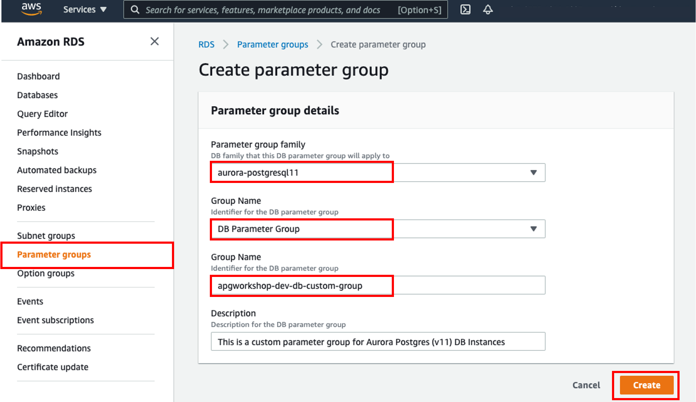

## 3. Edit the custom parameter group

A newly created custom parameter group has all the parameter values set to the engine default values. In order to change the configuration, you need to open the Custom parameter group and modify the value of the parameters. In this exercise we will change the following parameters.

- log_statement = all
- log_disconnections= 1
- log_connections= 1

### Open the custom parameter group for modification

- Click on the parameter group
- Click on the button Modify

## 4. Modify the parameters

- Use the search box to find the parameter names
- Edit the value of each of the parameters
- Once done click on the button continue

### Parameters

- log_statement = all
- log_disconnections= 1
- log_connections= 1

## 5. Review and apply changes

- Ensure all modified parameters are correct
- Use button for Previous for changing values of the parameter
- If everything looks good then click on the button Apply Changes

# 2.Modify Instance DB Group

By default the DB instances are configured to use the default parameter group. Changes to the configuration requires a custom DB parameter group to be attached to the DB instance.

**VIA AWS CLI**

## 1. Modify instance to use the custom DB parameter group

- Switch the DB Parameter Group for instance-1.

```
aws rds modify-db-instance `
    --db-instance-identifier  apgworkshop-dev-instance-1 `
    --db-parameter-group-name  apgworkshop-dev-db-custom-group   `
    --apply-immediately
```

**Instance modify error**

If you deleted the instance-2 earlier, then running the next command will throw an error. You may ignore the error.

```
aws rds modify-db-instance `
    --db-instance-identifier  apgworkshop-dev-instance-2 `
    --db-parameter-group-name  apgworkshop-dev-db-custom-group   `
    --apply-immediately
```

## 2. Check the status of instance modification

Wait for the status to become available.

```
aws rds describe-db-instances `
    --db-instance-identifier apgworkshop-dev-instance-1  `
    --query 'DBInstances[0].DBInstanceStatus'

aws rds describe-db-instances `
    --db-instance-identifier apgworkshop-dev-instance-1  `
    --query 'DBInstances[0].DBParameterGroups'
```

```
aws rds describe-db-instances `
    --db-instance-identifier apgworkshop-dev-instance-2  `
    --query 'DBInstances[0].DBInstanceStatus'

aws rds describe-db-instances `
    --db-instance-identifier apgworkshop-dev-instance-2  `
    --query 'DBInstances[0].DBParameterGroups'
```

## 3. Initiate a reboot

```
aws rds reboot-db-instance  `
   --db-instance-identifier apgworkshop-dev-instance-1
```

```
aws rds reboot-db-instance  `
   --db-instance-identifier apgworkshop-dev-instance-2
```

## 4. Wait for the instance to become available.

It would take under a minute for the instance to become available.

```
aws rds describe-db-instances `
    --db-instance-identifier apgworkshop-dev-instance-1  `
    --query 'DBInstances[0].DBInstanceStatus'

aws rds describe-db-instances `
    --db-instance-identifier apgworkshop-dev-instance-1  `
    --query 'DBInstances[0].DBParameterGroups'
```

```
aws rds describe-db-instances `
    --db-instance-identifier apgworkshop-dev-instance-2  `
    --query 'DBInstances[0].DBInstanceStatus'

aws rds describe-db-instances `
    --db-instance-identifier apgworkshop-dev-instance-2  `
    --query 'DBInstances[0].DBParameterGroups'
```

# 3.Test DB Group Changes

To test out the changes we have made, we will carry out the following actions against the database and observe the log messages.

- Database connect
- Database disconnect
- SQL Queries To carry out all of these actions we will use pgAdmin Logs may be observed in the RDS console | CloudWatch | AWS CLI.

## 1. Execute any SQL while watching the Log

- In the RDS console select the latest log for Watch or open up the CloudWatch logs as discussed in previous exercise
- Carry out the following action on pgAdmin and see the log messages in the RDS console log view
- All queries will be logged irrespective of their status


## 2. Disconnect and Connect from the Database

- Parameter change will lead to the logging of all connections and disconnections
- To disconnect open pgAdmin and right click on the testdb and select Disconnect Database
- You should see a message in the log view
- To connect back just click on testdb and you should see a message indicating a connection to DB

## 3. Check out the logs for the SQL | Disconnect | Connect messages

Refer to instructions in Lab-6 : Aurora PostgreSQL Logs on how to check/search the logs

# Lab-8 : Aurora Monitoring tools

### Overview

Without proper montoring the Database owners carry the risk of unexpected failures. In this lab you will learn about the various choices you have on Aurora from monitoring perspective. You will generate some load and check out the load metrics on the RDS console and in Performance insights.

# 1.CloudWatch Metrics in RDS Console

In this part of the exercise we will generate load against the Writer instance and then checkout the CloudWatch metrics in the RDS console.

- Make sure instance-1 is the writer
- If instance-2 is Writer, then failover using the instructions in Lab-5

## 1. Get the Writer Endpoint for Cluster

**VIA AWS CLI**

Open a Windows Powershell and run the CLI command to get the endpoint.

```
$env:DBENDP = aws rds describe-db-clusters  `
      --db-cluster-identifier apgworkshop-dev `
      --query 'DBClusters[0].Endpoint' `
      --output text

echo $env:DBENDP
```

**VIA AWS RDS Console**

- Go to RDS console, select the DB cluster
- Copy the Writer Endpoint to clipboard
- Refer to Lab-2 for instructions

Copy paste the command in Windows PowerShell

```
$env:DBENDP = "<<YOUR-Endpoint>>"
```

- Replace the YOUR-Endpoint with the Writer Endpoint
- Endpoint must be in double quotes

## 2. Generate the load on DB

- Copy and paste the command below in windows PowerShell
- Provide the password

```
pgbench -i --fillfactor=90 --scale=500 -h $env:DBENDP -U postgres  testdb
```

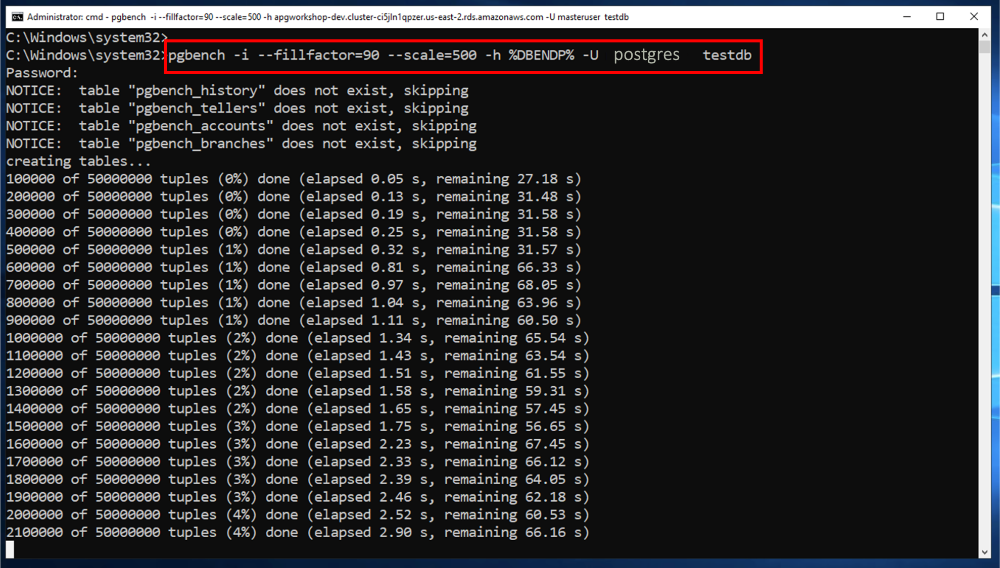

## 3. Check out the performance metrics in RDS console

NOTE: It may take 60 seconds before you see the Cloudwatch metrics start to reflect the workload

- Open the RDS console
- Select the Writer instance
- Click on the tab for Monitoring
- Explore the available metrics
- Click on the graphs and zoom out to specific time windows
- These same metrics is available via CloudWatch

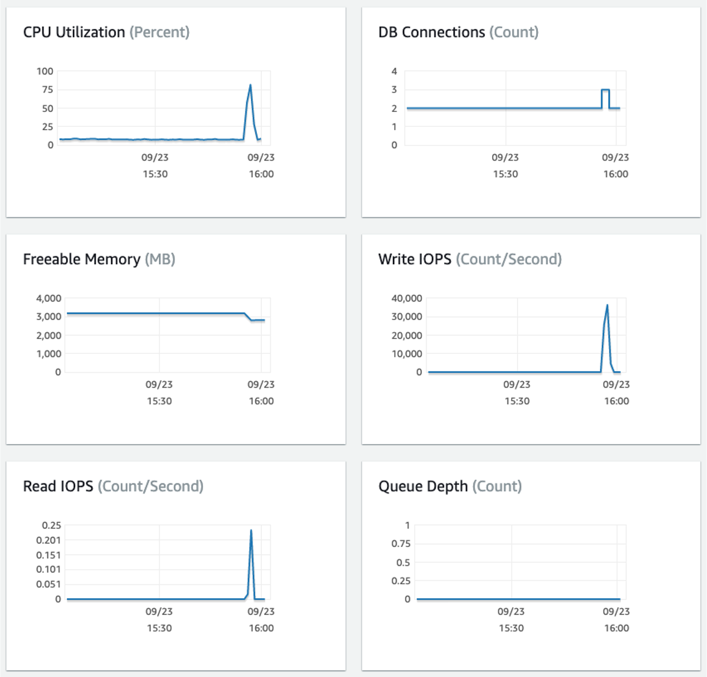

# 2.Check Enhanced Metrics

The enhanced metrics for the DB cluster instances is already enabled. The metrics is available in the console. In this part of the lab you will check out the enhanced metrics. To make things interesting we will generate a heavy load against the database Writer instance.

## 1. Verify & enable Enhanced Metrics

**VIA AWS CLI**

Note:
The instructions here are only for \*instance-1 feel free to make changes to instance-2 as well by replacing the instance identifier in the commands.

Check if instance is enabled for Enhanced Monitoring - A null value returned from the command indicates that Enhanced Monitoring is not enabled.

- A value > 0 indicates the monitoring interval in seconds.

```
aws rds describe-db-instances `
    --db-instance-identifier   apgworkshop-dev-instance-1  `
    --query 'DBInstances[0].MonitoringInterval'
```

- A null value indicates that Enhanced Monitoring is not enabled

```
aws rds describe-db-instances `
    --db-instance-identifier   apgworkshop-dev-instance-1  `
    --query 'DBInstances[0].MonitoringRoleArn'
```

- To enable enhanced monitoring we need a Monitoring Role ARN, which has already been created by the CloudFormation template.

```
$env:CF_STACK = aws cloudformation list-stacks `
--query 'StackSummaries[?contains(StackName, `apgworkshop-dev`) == `true`].StackName' `
--output text

echo $env:CF_STACK
```

```
aws  cloudformation describe-stacks `
--stack-name $env:CF_STACK `
--output   text  `
--query 'Stacks[0].Outputs[?OutputKey==`EnhancedMonitoringRole`].OutputValue'
```

Modify the instance to enable endhanced monitoring

```
aws rds modify-db-instance `
    --db-instance-identifier   apgworkshop-dev-instance-1   `
    --monitoring-interval    60   `
    --monitoring-role-arn   <<Replace with Role ARN>>
```

Wait for the configuration to be completed & instance to become available

```
aws rds describe-db-instances `
    --db-instance-identifier apgworkshop-dev-instance-1  `
    --query 'DBInstances[0].DBInstanceStatus'
```

**VIA AWS RDS Console**

By default Enhanced Monitoring is enabled on the instances created from the RDS console.

If you created the DB instances using the AWS CLI then follow the instructions under "AWS CLI" tab to enable Enhanced Monitoring on the instances.

## 2. Start the load on DB cluster

- Copy the command below and paste it in the windows PowerShell
- This is the same shell where you have already set the variable DBENDP
- Provide the password for your DB cluster postgres123

```
 pgbench -h $env:DBENDP -U postgres  -P 5 --time=300 --client=50  testdb
```

## 3. Checkout the enhanced metrics in the console

- Select your DB cluster
- Click on the tab Monitoring
- Click on the drop down Monitoring
- Select Enhanced Monitoring

## 4. Review enhanced metrics

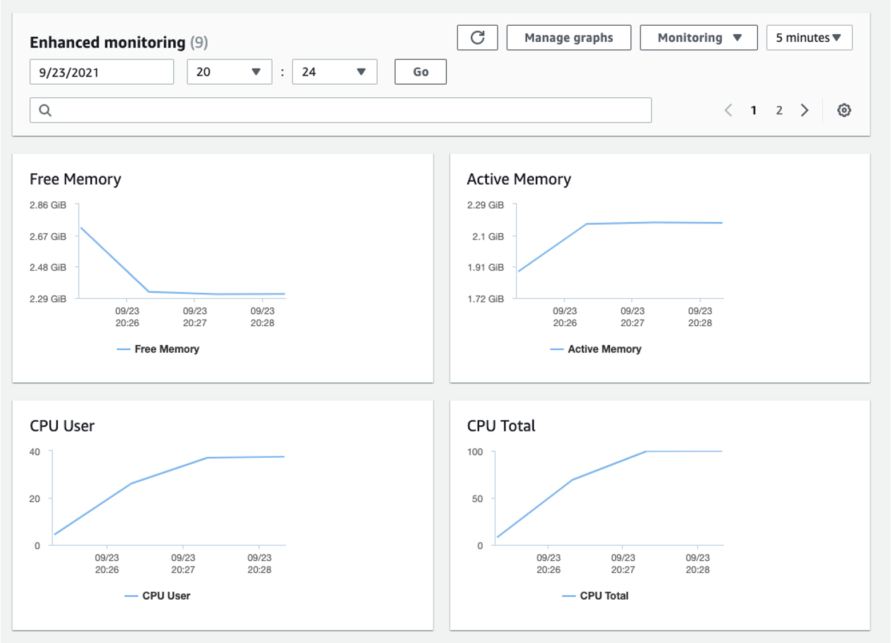

## 5. Checkout the OS processes

- Click on th edrop down Monitoring
- Select OS Processes

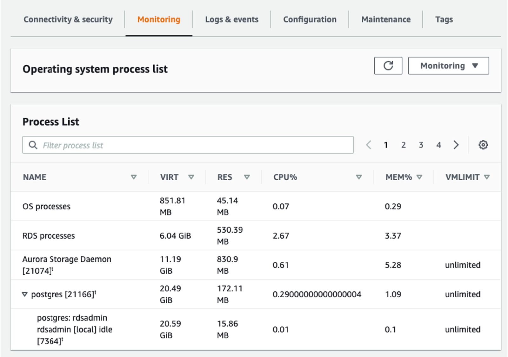

# 3.Performance Insights

The [Performance insights](https://aws.amazon.com/ru/rds/performance-insights/) capability provides visibility into the performance of your database instance. If you are new to Performance Insights, we suggest that you watch the video before proceeding with the lab.

## 1. Verify & enable Performance Insights

**VIA AWS CLI**

Note:
The instructions here are only for \*instance-1 feel free to make changes to instance-2 as well by replacing the instance identifier in the commands.

Check if Performance Insights is already enabled on the instance.

```
aws rds describe-db-instances `
    --db-instance-identifier   apgworkshop-dev-instance-1  `
    --query 'DBInstances[0].PerformanceInsightsEnabled'
```

Modify the instance to enable endhanced monitoring

```
aws rds modify-db-instance `
    --db-instance-identifier   apgworkshop-dev-instance-1   `
    --enable-performance-insights
```

**VIA AWS RDS Console**

If you used the RDS console then the Performance Insights may already be enabled for your instance.

Use the instructions under the "AWS CLI" tab to verify and enable the Performance insight on instance(s)

## 2. Open Performance Insights

- Select the Writer instance for your DB Cluster
- Click on Performance Insights in left navigation panel

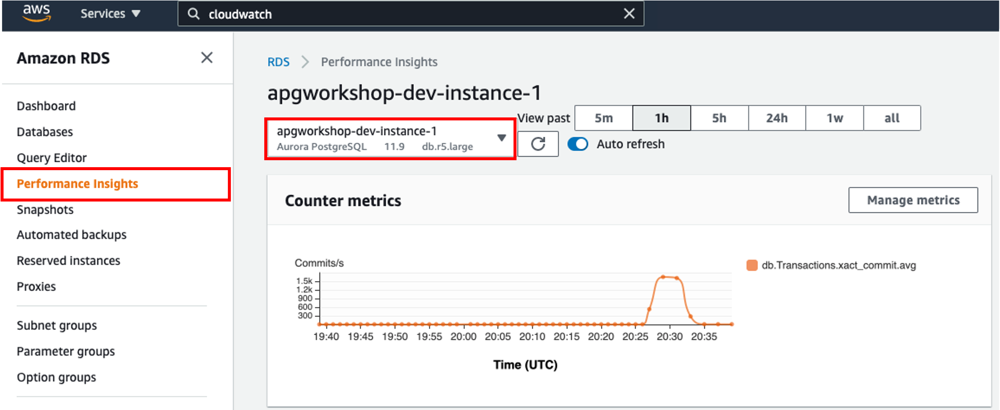

## 3. Checkout the Average Active Sessions during the load

- In the following graph IO XactSync is the cause of Waits

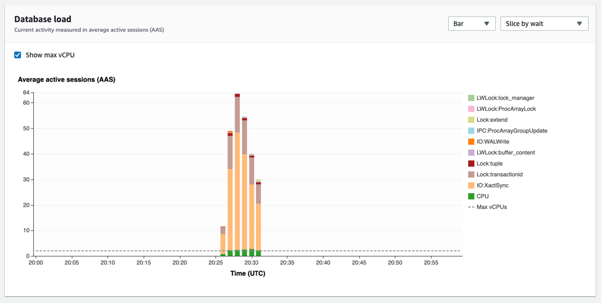

## 4. Checkout the top SQL

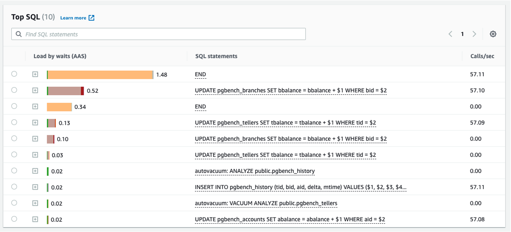

# Lab-9 : Cloning a Aurora DB Cluster

### Overview

Aurora Cloning capability allows database users to create new standalone Aurora clusters that share the underlying Aurora Volume Storage.

Changes made on the clone does not impact the original DB cluster in any way. In this lab, you will be creating a clone of the existing Aurora DB Cluster.

In this lab we will create a Aurora cluster using cloning. To test out the working of the cluster, we will use the pgAdmin tool to make data changes to original & clone cluster. After the creation of the clone, our infrastructure will look like the setup below.

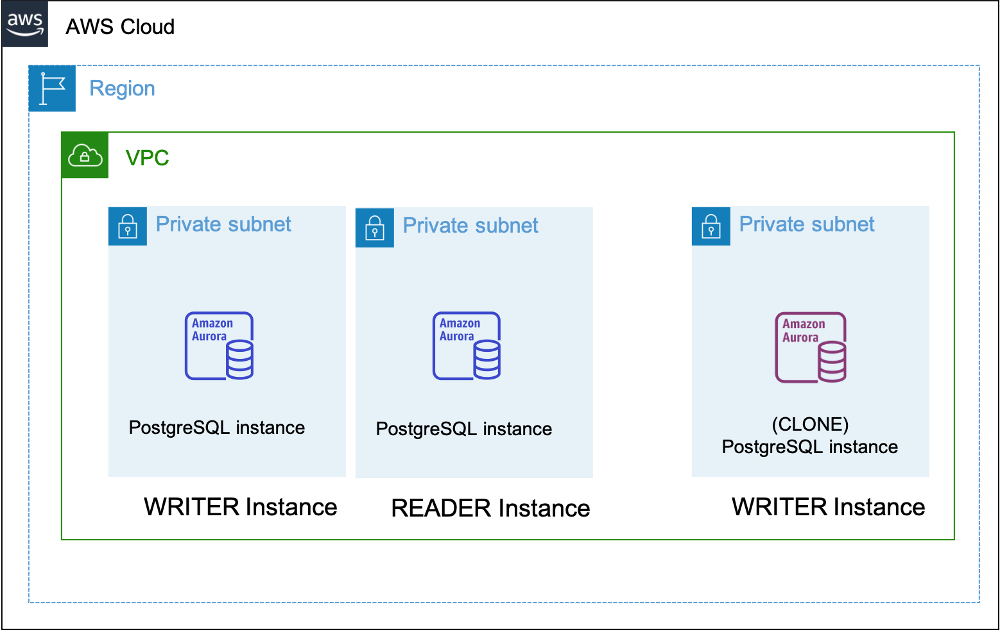

# 1.Create Aurora Clone

## 1. Create the clone

**VIA AWS CLI**

Creation of clone using CLI involves multiple steps. First you have to restore a cluster from an existing cluster and then add instance(s) to the cluster. This command will just create the cluster with Aurora volume of the existing source cluster.

```
aws rds restore-db-cluster-to-point-in-time `
    --source-db-cluster-identifier   apgworkshop-dev `
    --db-cluster-identifier    apgworkshop-dev-clone `
    --restore-type   copy-on-write  `
    --use-latest-restorable-time
```

Create a Database Instance in the cloned cluster

```
aws rds create-db-instance `
    --db-instance-identifier apgworkshop-dev-clone-instance-1 `
    --db-cluster-identifier apgworkshop-dev-clone `
    --engine aurora-postgresql `
    --db-instance-class db.r5.large
```

Check instances status. Wait till the status become available.

```
aws rds describe-db-instances `
    --db-instance-identifier    apgworkshop-dev-clone-instance-1 `
    --query 'DBInstances[0].DBInstanceStatus'
```

You may also check the status of the cluster.

```
aws rds describe-db-clusters `
    --db-cluster-identifier    apgworkshop-dev-clone `
    --query 'DBClusters[0].Status'
```

**VIA AWS RDS Console**

In this part of the exercise we will use the RDS console to create the cluster.

- Open the RDS console
- Select the Aurora cluster
- Click on Action menu and select Create clone
- Set the name of the cloned cluster to apgworkshop-dev-clone
- Scroll down and click on Create clone button
- Wait for the clone to get created

## 2. Launch the pgAdmin tool on Bastion host

- Open session to the Bastion host
- Launch pgAdmin
- Select the PgAdmin Application

## 3. Setup the connection to clone on pgAdmin

- Objective of this step is to connect pgAdmin with Cloned Aurora DB Cluster

## 4. Get the Writer endpoint for the Cloned Cluster

**VIA AWS CLI**

```
aws rds describe-db-clusters  `
      --db-cluster-identifier apgworkshop-dev-clone `
      --query 'DBClusters[0].Endpoint' `
      --output text
```

**VIA AWS RDS Console**

- Open the RDS console (on your local machine)
- Select the Cloned Aurora DB cluster
- Copy the Writer endpoint to the clipboard by clicking on the icon left of the endpoint PS: You may need to wait for sometime if your Clone is still getting created

## 5. Give the server name and click on Connection tab

- Set the Name to Aurora PG Cluster - Clone
- Click on the connection tab
- Paste the endpoint address copied from the RDS console
- Set the user & password information
- Check the Save password otherwise you will be prompted for password

## 6. Run a Query against the Clone

- Right click on the testdb under the Aurora PG Cluster - Clone and select Query Tool
- Copy/Paste the query and run it
- Note the count of rows - it should be the same as the number of rows in the original database cluster. As an optional step you may check the count in original cluster as well.

```
SELECT count(*) FROM usertable  ;
```

- The count of rows will be the same in the Original as well as the cloned database cluster as the two share the underlying storage & no change has been made to either database cluster at this time.

# 2.Test out the Clone DB

To test out the clone. We will INSERT some data in the Clone DB Cluster and then check the Original Database Cluster to see if the data changes are reflected in it.

## 1. Open the pgAdmin query tool for the clod testdb

Open the Query tool for the testdb in cloned cluster

## 2. INSERT some data in clone

- Copy/Paste the INSERT statements in Query tool
- Execute the query by clicking on the triangle on top-right.

```
INSERT INTO usertable  VALUES(100, 'Nick');
INSERT INTO usertable  VALUES(101, 'Raj');
INSERT INTO usertable  VALUES(102, 'Mary');
```

- Run the following query to get the count of rows

```
SELECT count(*) FROM usertable  ;
```

## 3. Check count of rows in original DB cluster

- Run the following query to get the count of rows

```
SELECT count(*) FROM usertable  ;
```

- This time you will see a different count of sows in Orginal & Cloned DB instance. And that tells us that changes to Clone doesn't impact the original cluster and vice versa !!!

# 3.Delete the Cloned DB Cluster

**VIA AWS CLI**

Deletion of Cluster using CLI involves multiple steps.

## 1. Delete all instances in the cluster

- Adjust the name of the instance in following command
- Run this command multiple times to delete all instances

```
aws rds delete-db-instance   `
    --db-instance-identifier    apgworkshop-dev-clone-instance-1
```

Check the status of instance; wait for the instances to be deleted. Once the instance is deleted this command will throw an error indicating that instance is not found (its OK).

```
aws rds describe-db-instances `
    --db-instance-identifier    apgworkshop-dev-clone-instance-1 `
    --query 'DBInstances[0].DBInstanceStatus'
```

## 2. Delete the cluster itself

Once all DB instances in the cluster are deleted, you may delete the Aurora cloned cluster itself.

```
aws rds delete-db-cluster  `
    --db-cluster-identifier    apgworkshop-dev-clone `
    --skip-final-snapshot
```

Check the cluster status. Wait for it to be deleted. Once the cluster is deleted this command will throw an error indicating that instance is not found (its OK).

```
aws rds describe-db-clusters `
    --db-cluster-identifier    apgworkshop-dev-clone `
    --query 'DBClusters[0].Status'
```

**VIA AWS RDS Console**

## 1. Delete the clone

We will use the RDS console to delete the clone.

- Open the RDS console
- Select the DB instance for Aurora cluster Clone
- Click on Action menu and select Delete
- Uncheck - Create final snapshot?
- Check - I acknowledge that upon ....
- Type - delete me in confirmation box and hit the Delete button

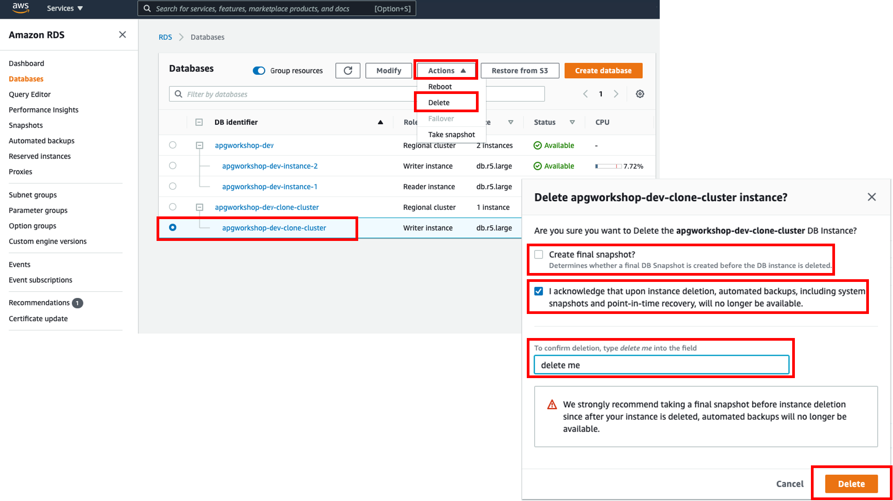

## 2. Confirm the status

- Reload the RDS DB Dashboard
- Confirm the status of the cloned cluster is Deleting
- The cluster deletion process may take a few minutes but you may proceed to the next step

# Lab-10 : Backup & Restore

Overview
Recap of Aurora backups:

- Aurora backs up your cluster volume automatically
- Aurora backup is continuous & incremental but a daily snapshot gets created automatically
- Retention period for the daily snapshot may be configured between 1-35 days
- New Aurora DB cluster may be created by restoring the snapshot

# 1.Checkout automatic Backups

Aurora backs up the data continuously and incrementally. Aurora creates a daily backup during the backup window. The retention period for the Daily backup may be set between 1 & 35 days. A cluster may be created with the available daily backup.

In this lab, you will set the start time of the automatic backup window for your cluster to be approximately 5 minutes in the future. Then you will observe the daily automatic backup being created. Note: in Aurora, the storage layer is continuously backing up changed data, so the ‘daily’ backup is really more of a metadata, organizational operation to create a single daily snapshot that can be copied, shared, etc.

## 1. Check the current UTC time

Get the current UTC time, so we can use it for setting up the backup window for the Aurora test cluster.

- Open up Google.com in browser and type Current UTC Time
- Add 5 minutes to the current UTC time. So based on the image below, the backup window for the test cluster will be 8:22 PM

## 2. Modify automatic backup window for Aurora cluster

In this part of the exercise we will modify the cluster's automatic backup window.

- Open the RDS console
- Select the Aurora cluster
- Click on the Modify button

## 3. Update the backup window

- Scroll down to the section on Additional configuration.
- Update the backup window to a later time
- Click on the button Continue

**NOTE: Please give enough time for the DB cluster modifications to complete. If needed repeat step#1**

## 4. Apply the change immediately

- Validate the Backup window value. It should be 5 minutes in future !!
- Select Apply Immediately
- Click on the Modify button

## 5. Checkout the automatic backup

- Wait for the backup window time
- On RDS Console - left navigation panel select Snapshots
- Select the tab System
- If you do not see a backup wait for a minute or so and refresh
- You would see the automatically generated backup\*

# 2.Create manual Snapshot

A manual snapshot allows you to create a backup that you can retain beyond the automatic backup retention period. It can also allow you to have a snapshot (that can be copied, shared, etc) as of that specific moment in time.

**VIA AWS CLI**

## 1. Create the manual snapshot

```
aws rds create-db-cluster-snapshot `
    --db-cluster-snapshot-identifier   apgworkshop-dev-manual-snapshot  `
    --db-cluster-identifier    apgworkshop-dev
```

## 2. Wait for the status of the snapshot to change

Checkout the Status and PercentageProgress in the output.

```
aws rds describe-db-cluster-snapshots `
    --db-cluster-snapshot-identifier   apgworkshop-dev-manual-snapshot
```

**VIA AWS RDS Console**

## 1. Create the manual snapshot

In this part of the exercise we will use the RDS console to create a manual snapshot of our test cluster.

- Open the RDS console
- Select one of the instance
- Click on Action menu and select Take Snapshot
- Set the name of the snapshot to apgworkshop-dev-manual-snapshot
- Scroll down and click on Take snapshot button

## 2. Wait for the status of the snapshot to change

- Open the snapshot console (redirected automatically from Create snapshot)
- Wait for the status to change from Creating to Available
- It may take a few minutes

## 3. Checkout the details of the snapshot

- Click on the snapshot to see the details

# 3.Create a cluster from snapshot

Note:

Creation of the cluster from snapshot takes considerably longer than the creation of a clone. The time taken for snapshot restoration depends on the size of the snapshot.

**VIA AWS CLI**

Note:
The steps for restoration are Similar to the steps used for creating a clone.

## 1. Restore the snapshot

Restoration of a snapshot leads to the creation of a new cluster

```
aws rds  restore-db-cluster-from-snapshot  `
   --snapshot-identifier   apgworkshop-dev-manual-snapshot   `
   --db-cluster-identifier   apgworkshop-dev-restored  `
   --engine aurora-postgresql
```

You may also check the status of the cluster. Wait for it to become available

## 2. Create the Database instances in restored cluster

Create a Database Instance in the cloned cluster

```
aws rds create-db-instance `
    --db-instance-identifier apgworkshop-dev-restored-instance-1 `
    --db-cluster-identifier apgworkshop-dev-restored `
    --engine aurora-postgresql `
    --db-instance-class db.r5.large
```

Check instances status. Wait till the status become available.

```
aws rds describe-db-instances `
    --db-instance-identifier    apgworkshop-dev-restored-instance-1 `
    --query 'DBInstances[0].DBInstanceStatus'
```

**VIA AWS RDS Console**

## 1. Restore the snapshot

Restoration of a snapshot leads to the creation of a new cluster

- Open the RDS console
- Select Snapshots option in left navigation panel
- Select the manual snapshot you created earlier
- Click on Action menu and select Restore snapshot

## 2. Provide the name for the instance

- Set the DB Instance Identifier to apgworkshop-dev-restored
- Do not change the values for other fields
- Scroll down and click on the button Restore DB cluster

Note:

- Steps below are optional if you would like to connect to restored cluster
- Cluster restoration may take a few minutes

## 3. Get the writer endpoint for the restored cluster

- Use the endpoint information to setup server on pgAdmin

**VIA AWS CLI**

Get the cluster endpoint for the restored cluster, once its available.

```
aws rds describe-db-clusters  `
      --db-cluster-identifier apgworkshop-dev-restored `
      --query 'DBClusters[0].Endpoint' `
      --output text
```

**VIA AWS RDS Console**

In the RDS Console, select the restored cluster and copy the cluster endpoint.

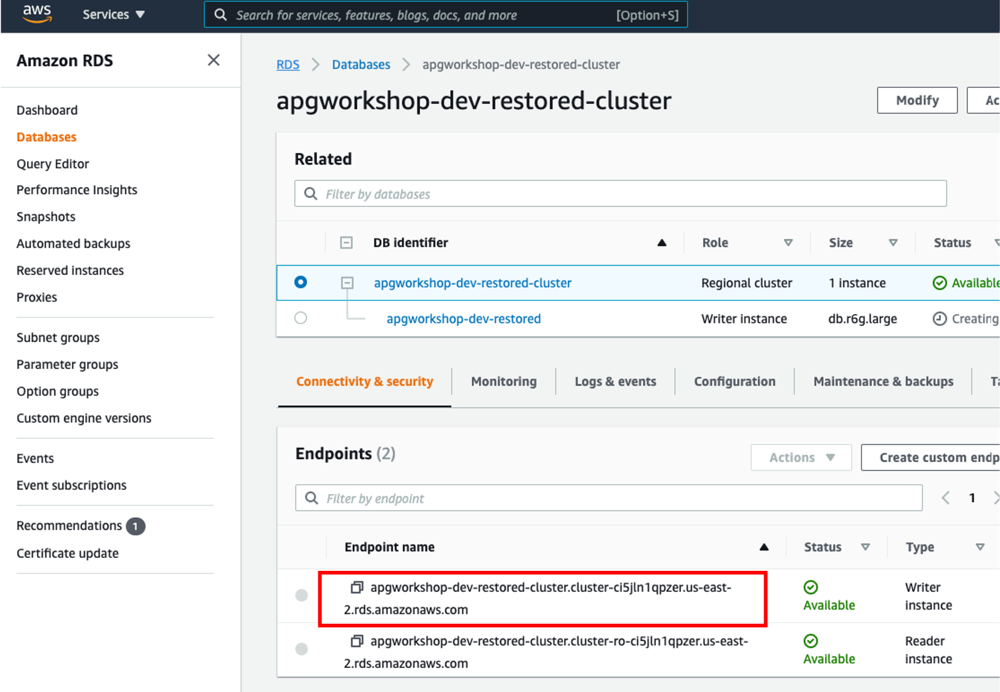

## 4. Add restored cluster to pgAdmin

- Open pgAdmin
- Right Click on Server select Create >> Server
- Set the name to Aurora PG Cluster - Restored
- Click on Connection tab
- Paste the Writer Endpoint in host/name
- Set the password to postgres123
- Check the box for Save password
- Click on the button Save

## 5. Open query tool in pgAdmin for the Restored Cluster

- Expand the server Aurora PG Cluster - Restored
- Expand the databases
- Right click on the database testdb
- Select the Query Tool

## 6. Run some SQL statements to checkut the data in restored cluster

- Copy the select statement to the query tool
- Execute query by clicking on execute button on top right
- This SQL will get the existing data from the usertable

```
SELECT * FROM usertable  ;
```

# 4.Delete the Restored DB Cluster

**VIA AWS CLI**

Deletion of Cluster using CLI involves multiple steps.

## 1. Delete all instances in the cluster

Adjust the name of the instance in following command
Run this command multiple times to delete all instances

```
aws rds delete-db-instance   `
    --db-instance-identifier    apgworkshop-dev-restored-instance-1
```

Check the status of instance; wait for the instances to be deleted. Once the instance is deleted this command will throw an error indicating that instance is not found (its OK).

```
aws rds describe-db-instances `
    --db-instance-identifier    apgworkshop-dev-restored-instance-1 `
    --query 'DBInstances[0].DBInstanceStatus'
```

## 2. Delete the cluster itself

Once all DB instances in the cluster are deleted, you may delete the Aurora cloned cluster itself.

```
aws rds delete-db-cluster  `
    --db-cluster-identifier    apgworkshop-dev-restored `
    --skip-final-snapshot
```

Check the cluster status. Wait for it to be deleted. Once the cluster is deleted this command will throw an error indicating that instance is not found (its OK).

```
aws rds describe-db-clusters `
    --db-cluster-identifier    apgworkshop-dev-restored `
    --query 'DBClusters[0].Status'
```

**VIA AWS RDS Console**

## 1. Delete the restored cluster

- Open the RDS console
- Select the DB instance for Aurora Restored Cluster
- Click on Action menu and select Delete
- Uncheck - Create final snapshot?
- Check - I acknowledge that upon ....
- Type - delete me in confirmation box and hit the Delete button

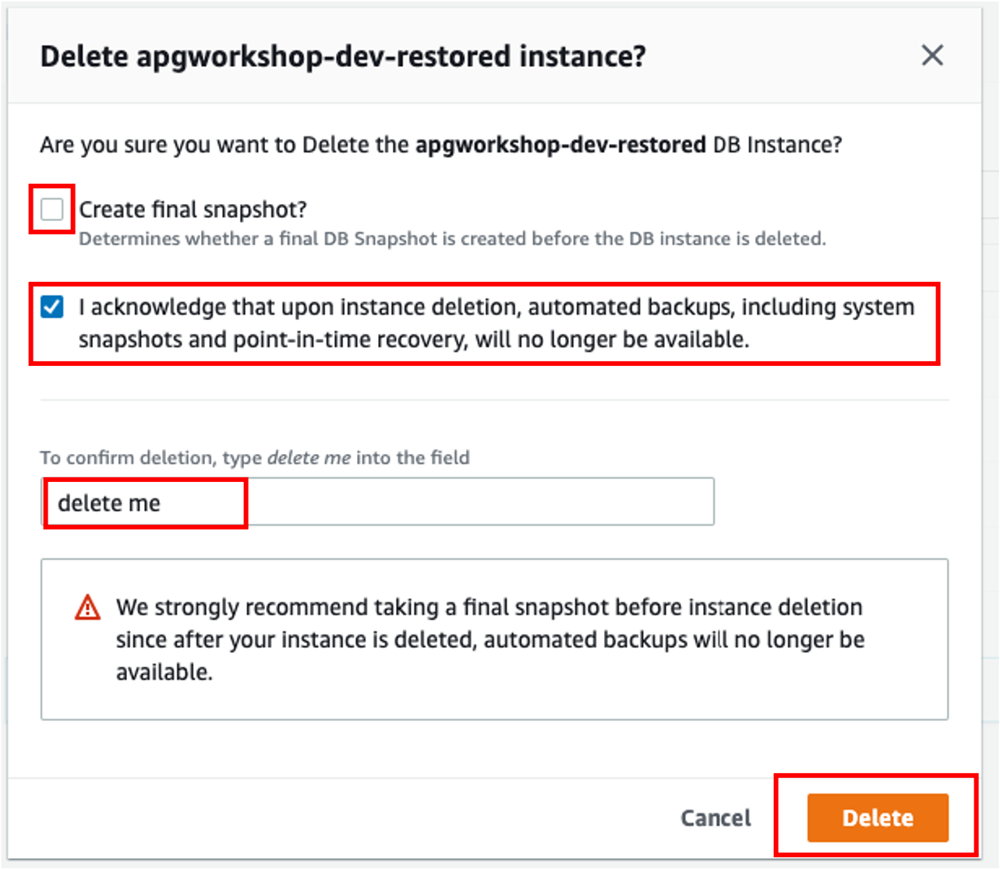

## 2. Confirm the status

- Reload the RDS DB Dashboard
- Confirm the status of the cloned cluster is Deleting
- The cluster deletion process may take a few minutes

# 5.Point in time Recovery

Aurora allows you to restore a DB Cluster to a specific point in time. The restored cluster is a new DB Cluster. Restored DB clusters are automatically associated with the default DB cluster and DB parameter groups. However, you can apply custom parameter groups by specifying them during a restore. Restoration point in time should be within the backup retention period.

## 1. Launch the pgAdmin query tool

We will execute SQL statements against the database on our Aurora PG Cluster

- Right click on the database testdb
- Select the option Query Tool...

## 2. Create a test table

- Copy and paste the SQL below to the query tool
- Click on the execute button (triangle) on top right

```
DROP TABLE  IF EXISTS new_usertable;
CREATE TABLE new_usertable (id  integer, fname  varchar(40))
```

You should receive the result indicating successful creation of the table.

```
NOTICE:  table "new_usertable" does not exist, skipping
CREATE TABLE

Query returned successfully in 117 msec.
```

## 3. Execute a few SQL INSERT statements

- Replace the SQL in query tool with the SQL below
- Click on the execute button (triangle) on top right

```
INSERT INTO new_usertable  VALUES(100, 'Amy');
INSERT INTO new_usertable  VALUES(101, 'William');
INSERT INTO new_usertable  VALUES(102, 'Jino');
```

## 4. Create new cluster by way of PITR

- Open RDS Console
- Select the Aurora cluster
- Click on the drop down box Action
- Select the option Restore to point in time

## 5. Set the restore time & name of the restored instance

- Check the latest restorable time - this the point to which we may restore the cluster
- Select the Custom date and time
- Set the time to before you executed the DDL for creating the new table new_usertable
- Set the DB instance identifier to apgworkshop-dev-pitr-restored
- Click on the button Restore to a point in time
- Cluster creation may take a few minutes

## 6. Copy Writer Endpoint for the restored cluster to clipboard

- Select the Restored Aurora cluster in RDS console
- Copy the writer endpoint to clipboard

## 7. Add restored cluster to pgAdmin

- Open pgAdmin
- Right Click on Server select Create >> Server
- Set the name to Aurora PG Cluster - PITR
- Click on Connection tab
- Paste the Writer Endpoint in host/name
- Set the password to postgres123
- Check the box for Save password
- Click on the button Save

## 8. Open query tool in pgAdmin for the Restored Cluster

- Expand the server Aurora PG Cluster - PITR
- Expand the databases
- Right click on the database testdb
- Select the Query Tool

## 9. Check if new table is available on restored cluster

- Copy the select statement to the query tool
- Execute query by clicking on execute button on top right
- This SQL should be successful

```
SELECT * FROM usertable  ;
```

- Now repeat the steps for the new_usertable with following SELECT query
- This query will FAIL !!!

```
SELECT * FROM new_usertable  ;
```

## 10. Cleanup steps

- On RDS console select the restored cluster instance
- Click on drop down for Actions and select Delete
- Uncheck the checkbox for Create final snapshot
- Check the boc I acknowledge ...
- Confirm deletion by typing delete me
- Click on the button Delete

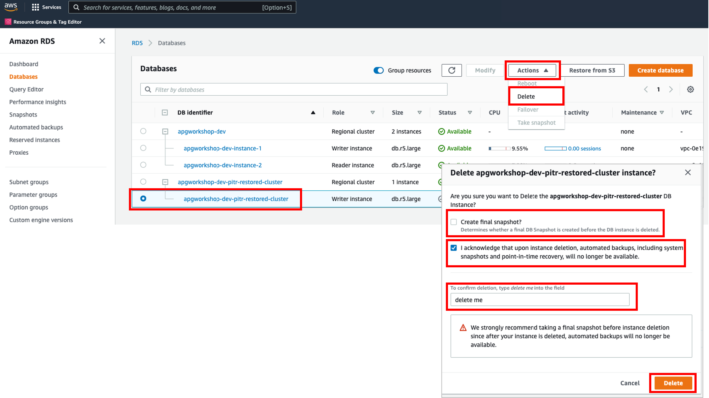

# Lab-11 : Setup Global DB

## **NOTE: IF YOU ARE Using AWS Event Engine account provided by AWS team:**

- Make sure to select the secondary region = us-east-1
- Attempt to use any other region will fail !!

## **NOTE: IF YOU ARE Using your personal/work AWS account**

- Lab will work in your Personal or Work account as long as you have permissions to create resources in the desired secondary region.

### Global DB?

Amazon Aurora Global Database is designed for globally distributed applications, allowing a single Amazon Aurora database to span multiple AWS Regions. It replicates your data with no impact on database performance, enables fast local reads with low latency in each Region, and provides disaster recovery from Region-wide outages.

### Overview

In this section you will create a a global cluster by using the existing cluster as the source. Here are the steps you will carry out:

- Select the Second region in which Aurora Global DB is supported
- Use ClodFormation template to setup VPC, Subnet Group, Bastion Host in the second region
- Create a Global cluster with existing apgworkshop-dev as the source cluster
- Add a second cluster to the global DB
- Install PostgreSQL tools on Bastion Host in second region & test out the working of Global DB
- Run load test and observe the Replication Lag in secondary region
- Carry out failover and failback
  The illustration here depicts the end state architecture. Region #1 has the original Aurora DB cluster that we have been using. We will add a second region to setup our global DB cluster.

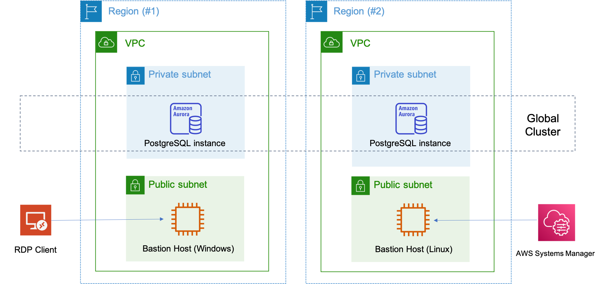

# 1.Setup VPC, Bastion ...

In order to setup a cluster in the secondary region, we need ti have a VPC. Also to connect with the cluster in the secondary region we need an bastion host (EC2) in the secondary region. We will use a CloudFormation template to set up these & other resources.

## 1. Decide on a secondary region & check availablity of Global DB

**Secondary Region**

If you are attending an AWS hosted event then ask your AWS team on which region is available to yuo for creating the secondary cluster. If you are carrying out the exercises in your own AWS account then you are free to choose any region where Global DB is available & you have the permission to create resources.

## 2. Copy the CloudForamtion Template to clipboard

```
---
## 2nd Region
## Creates the VPC for DB Cluster
#  This sample code is made available under the MIT-0 license. See the LICENSE file.

AWSTemplateFormatVersion: 2010-09-09
Description: Creates the VPC for creating Aurora cluster

## Parameters
Parameters:
  InstanceType:
    Description: Instance family for the test instance
    Default: m5.large
    Type: String
    AllowedValues:
      - "t2.micro"
      - "t2.small"
      - "t3.micro"
      - "t3.small"
      - "t3.medium"
      - m5.large
      - m5.xlarge
      - m5.2xlarge
      - m5.4xlarge
  LatestAmiId:
    Type: 'AWS::SSM::Parameter::Value<AWS::EC2::Image::Id>'
    Default: '/aws/service/ami-amazon-linux-latest/amzn2-ami-hvm-x86_64-gp2'
  KeyName:
    Description: Amazon EC2 KeyPair
    Default: ''
    Type: String
## Mappings
Mappings:
  NetworkSettings:
    global:
      vpcCidr: 10.0.0.0/16
## Conditions
Conditions:
  HasNoKeyName: !Equals [!Ref KeyName, '']

Resources:
## The VPC
  AuroraClusterVPC:
    Type: AWS::EC2::VPC
    Properties:
      EnableDnsSupport: true
      EnableDnsHostnames: true
      InstanceTenancy: default
      CidrBlock: !FindInMap [ NetworkSettings, global, vpcCidr ]
      Tags:
        - Key: Name
          Value:  apgworkshop-dev-vpc

## Create an IGW & attach it to the VPC
  InternetGateway:
    Type: AWS::EC2::InternetGateway
    DependsOn: AuroraClusterVPC
    Properties:
      Tags:
        - Key: Name
          Value: apgworkshop-dev-igw
  attachIGW:
    Type: AWS::EC2::VPCGatewayAttachment
    DependsOn: InternetGateway
    Properties:
      VpcId: !Ref AuroraClusterVPC
      InternetGatewayId: !Ref InternetGateway

  PublicSubnetA:
    Type: AWS::EC2::Subnet
    Properties:
      VpcId: !Ref AuroraClusterVPC
      CidrBlock: !Select [ 0, !Cidr [ !GetAtt AuroraClusterVPC.CidrBlock, 4, 8 ]]
      AvailabilityZone: !Select [ 0, !GetAZs ]    # Get the first AZ in the list
      MapPublicIpOnLaunch: true
      Tags:
      - Key: Name
        Value: apgworkshop-dev-PublicA
  PublicSubnetB:
    Type: AWS::EC2::Subnet
    Properties:
      VpcId: !Ref AuroraClusterVPC
      CidrBlock: !Select [ 1, !Cidr [ !GetAtt AuroraClusterVPC.CidrBlock, 4, 8 ]]
      AvailabilityZone: !Select [ 1, !GetAZs ]
      MapPublicIpOnLaunch: true
      Tags:
      - Key: Name
        Value: apgworkshop-dev-PublicB

  PrivateSubnetA:
    Type: AWS::EC2::Subnet
    Properties:
      VpcId: !Ref AuroraClusterVPC
      #CidrBlock: !FindInMap [ NetworkSettings, global, PrivateSubnetACidr ]
      CidrBlock: !Select [ 2, !Cidr [ !GetAtt AuroraClusterVPC.CidrBlock, 4, 8 ]]
      AvailabilityZone: !Select [ 0, !GetAZs ]    # Get the first AZ in the list
      Tags:
      - Key: Name
        Value: apgworkshop-dev-PrivateA

  PrivateSubnetB:
    Type: AWS::EC2::Subnet
    Properties:
      VpcId: !Ref AuroraClusterVPC
      #CidrBlock: !FindInMap [ NetworkSettings, global, PrivateSubnetBCidr ]
      CidrBlock: !Select [ 3, !Cidr [ !GetAtt AuroraClusterVPC.CidrBlock, 4, 8 ]]
      AvailabilityZone: !Select [ 1, !GetAZs ]    # Get the second AZ in the list
      Tags:
      - Key: Name
        Value: apgworkshop-dev-PrivateB


# Here is a private route table:
  PrivateRouteTable:
    Type: AWS::EC2::RouteTable
    Properties:
      VpcId: !Ref AuroraClusterVPC
      Tags:
      - Key: Name
        Value: apgworkshop-dev-private-rtb
  PrivateRoute1:            # Private route table can access web via NAT (created below)
    Type: AWS::EC2::Route
    Properties:
      RouteTableId: !Ref PrivateRouteTable
      DestinationCidrBlock: 0.0.0.0/0
      # Route traffic through the NAT Gateway:
      NatGatewayId: !Ref NATGateway

  PrivateSubnetARouteTableAssociation:
    Type: AWS::EC2::SubnetRouteTableAssociation
    Properties:
      SubnetId: !Ref PrivateSubnetA
      RouteTableId: !Ref PrivateRouteTable
  PrivateSubnetBRouteTableAssociation:
    Type: AWS::EC2::SubnetRouteTableAssociation
    Properties:
      SubnetId: !Ref PrivateSubnetB
      RouteTableId: !Ref PrivateRouteTable


# Some route tables for our subnets:
  PublicRouteTable:
    Type: AWS::EC2::RouteTable
    Properties:
      VpcId: !Ref AuroraClusterVPC
      Tags:
      - Key: Name
        Value: apgworkshop-dev-public-rtb
  PublicRouteToIGW:   # Public route table has direct routing to IGW:
    Type: AWS::EC2::Route
    DependsOn: attachIGW
    Properties:
      RouteTableId: !Ref PublicRouteTable
      DestinationCidrBlock: 0.0.0.0/0
      GatewayId: !Ref InternetGateway
# Attach the public subnets to public route tables,
  # and attach the private subnets to private route tables:
  PublicSubnetARouteTableAssociation:
    Type: AWS::EC2::SubnetRouteTableAssociation
    Properties:
      SubnetId: !Ref PublicSubnetA
      RouteTableId: !Ref PublicRouteTable
  PublicSubnetBRouteTableAssociation:
    Type: AWS::EC2::SubnetRouteTableAssociation
    Properties:
      SubnetId: !Ref PublicSubnetB
      RouteTableId: !Ref PublicRouteTable

# A NAT Gateway:
  NATGateway:
    Type: AWS::EC2::NatGateway
    Properties:
      AllocationId: !GetAtt ElasticIPAddress.AllocationId
      SubnetId: !Ref PublicSubnetA
      Tags:
      - Key: Name
        Value: apgworkshop-dev-natgw
  ElasticIPAddress:
    Type: AWS::EC2::EIP
    DependsOn: AuroraClusterVPC
    Properties:
      Domain: vpc

  RDSSecurityGroupCluster:
    Type: AWS::EC2::SecurityGroup
    Properties:
      VpcId: !Ref AuroraClusterVPC
      GroupName: apgworkshop-dev-internal
      GroupDescription: RDS cluster firewall
      Tags:
        - Key: Name
          Value: apgworkshop-dev-rdsa-internal
      SecurityGroupIngress:
        - IpProtocol: tcp
          FromPort: 5432
          ToPort: 5432
          CidrIp: !Select [ 0, !Cidr [ !GetAtt AuroraClusterVPC.CidrBlock, 4, 8 ]]
          Description: Allows hosts in public subnet A to connect with the cluster
        - IpProtocol: tcp
          FromPort: 5432
          ToPort: 5432
          CidrIp: !Select [ 1, !Cidr [ !GetAtt AuroraClusterVPC.CidrBlock, 4, 8 ]]
          Description: Allows hosts in public subnet B to connect with the cluster

# Bastion host security group
  HostSecurityGroup:
    Type: AWS::EC2::SecurityGroup
    Properties:
      GroupDescription: Open Port 22 for ssh
      VpcId: !Ref AuroraClusterVPC
      SecurityGroupIngress:
        - IpProtocol: tcp
          FromPort: "22"
          ToPort: "22"
          CidrIp: 255.255.255.255/0

  # Bastion host role
  BastionHostRoleEc2Linux:
    Type: AWS::IAM::Role
    Properties:
      RoleName: !Sub apgworkshop-dev-bastion-${AWS::Region}
      AssumeRolePolicyDocument:
        Version: 2012-10-17
        Statement:
          - Effect: Allow
            Action:
              - sts:AssumeRole
            Principal:
              Service:
                - ec2.amazonaws.com
      ManagedPolicyArns:
        - arn:aws:iam::aws:policy/AdministratorAccess

  # Bastion host profile
  BastionHostInstanceProfile:
    Type: "AWS::IAM::InstanceProfile"
    DependsOn: BastionHostRoleEc2Linux
    Properties:
      Path: "/"
      Roles:
        - !Ref BastionHostRoleEc2Linux


  # Bastion host EC2 instance
  BastionEC2Instance:
    Type: AWS::EC2::Instance
    DependsOn: HostSecurityGroup
    Properties:
      InstanceType: !Ref InstanceType
      ImageId: !Ref LatestAmiId
      SecurityGroupIds:
        - !Ref HostSecurityGroup
      SubnetId: !Ref PublicSubnetA
      IamInstanceProfile: !Ref BastionHostInstanceProfile
      Tags:
        - Key: Name
          Value: "apgworkshop-dev Bastion Host Instance"
      # KeyName: !Ref KeyName
      KeyName: !If [HasNoKeyName,  !Ref AWS::NoValue , !Ref KeyName]

  DBSubnetGroup:
      Type: AWS::RDS::DBSubnetGroup
      Description: Subnet group
      Properties:
        DBSubnetGroupDescription: apgworkshop-db-subnet-group
        DBSubnetGroupName: apgworkshop-db-subnet-group
        SubnetIds: [!Ref PrivateSubnetA, !Ref PrivateSubnetB]
        Tags:
          - Key: Name
            Value: Subnet group with ONLY private subnets


## Outputs
Outputs:
  BastionHostIP:
    Description: The Public Ip
    Value: !GetAtt BastionEC2Instance.PublicIp
  DBSecurityGroupCluster:
    Description: This is the Security group to be used for the DB cluster
    Value: !Ref RDSSecurityGroupCluster
    Export:
        Name: !Sub "${AWS::Region}-${AWS::StackName}-SecurityGroupDBCluster"
```

## 3. Open the CloudFormation Console

- Type CloudFormation in the service search box
- Click on CloudFormation
- Switch to the secondary region

## 4. Create the CloudFormation stack

- Click on the button Create Stack

## 5. Setup CloudFormation template

- Select Create template in Designer
- Click on Create template in designer

## 6. Paste the YML in designer

- Select template on bottom left
- Select YAML as the format
- Paste the YML that you copied earlier
- Click on the upload icon on top-left

## 7. Click on next

#### 1. Click on the Next button

## 8. Set the name of the stack

- Set the name = apgworkshop-dev-secondary
- Click on the button next a couple of times
- Acknowledge stack creation by checking the box
- Click on the button Create stack

## 9. Wait for the stack creation to complete

- Stack creation may take a couple of minutes

# 2.Setup Global DB

The steps described here will

## 1. Create the Global Cluster

A global database requirs the source database to be specified. In this step you will get the Arn of the source database cluster and then create the global DB cluster with the identifier set to apgworkshop-dev-global-db

**Use Windows PowerShell**

Commands to be run in Windows host in the primary region.

- Get the Arn for cluster in primary region

```
$env:CLUSTER_ARN=$(aws rds describe-db-clusters `
    --db-cluster-identifier apgworkshop-dev  `
    --query 'DBClusters[0].DBClusterArn'   `
    --output text)

echo $env:CLUSTER_ARN
```

- Create the Global DB Cluster with existing Aurora DB Cluster marked as the source for the global database cluster.

```
aws rds create-global-cluster `
    --global-cluster-identifier   apgworkshop-dev-global-db  `
    --source-db-cluster-identifier   $env:CLUSTER_ARN
```

- Check the RDS Console for the global DB; you should see the global cluster.

## 2. Add the secondary region to Global cluster

In this step you will create a cluster in the secondary region with the id apgworkshop-dev-secondary. Then you will add the new cluster to the global DB cluster.

To create the cluster, you need the Security group that is applied to the instances in the secondary cluster. The Security Group was created as part of the Cloud Formation stack.

- Set the secondary region in an environment variable; value must be in quotes e.g., "us-west-2"

```
$env:AWS_SECONDARY_REGION = "<<Replace with your second region>>"
```

- Get the VPC Security Group created in the secondary region.

```
$env:SECURITY_GROUP_SECONDARY_REGION=$(aws  cloudformation describe-stacks `
--stack-name apgworkshop-dev-secondary `
--output text  `
--query 'Stacks[0].Outputs[?OutputKey==`DBSecurityGroupCluster`].OutputValue'  `
--region $env:AWS_SECONDARY_REGION)

echo $env:SECURITY_GROUP_SECONDARY_REGION
```

- The Subnet Group used in the command was created as part of the CloudFormation stack.
- We need to explicitly mention the encryption KMS Key ID for the secondary cluster encryption; we will use the default RDS KMS key.

```
$env:RDS_KMS_KEY_SECONDARY_REGION=$(aws kms list-aliases --output text `
--query 'Aliases[?AliasName == `alias/aws/rds`].AliasArn'  `
--region $env:AWS_SECONDARY_REGION)

echo $env:RDS_KMS_KEY_SECONDARY_REGION
```

```
aws rds  create-db-cluster `
    --db-cluster-identifier apgworkshop-dev-secondary `
    --engine aurora-postgresql `
    --db-subnet-group-name apgworkshop-db-subnet-group `
    --global-cluster-identifier apgworkshop-dev-global-db `
    --vpc-security-group-ids $env:SECURITY_GROUP_SECONDARY_REGION   `
    --region $env:AWS_SECONDARY_REGION  `
     --kms-key-id $env:RDS_KMS_KEY_SECONDARY_REGION
```

- Check the status of the secondary cluster. Wait for the cluster to become available.
- Check the status in RDS dashboard in secondary region
- Wait for the status to change from "creating" to "available"

```
aws rds describe-db-clusters  `
    --db-cluster-identifier   apgworkshop-dev-secondary   `
    --query 'DBClusters[0].Status'  `
    --region $env:AWS_SECONDARY_REGION
```

## 3. Add an instance to the secondary cluster

At this time you have a secondary cluster that is Headless cluster, which means it's a cluster with 0 DB instances. As a Pilot light DR strategy, you may use headless clusters. Instances are added if there is a need to failover to the secondary region.

In the next step we will add an instance to the secondary DB cluster.

```
aws rds create-db-instance `
    --db-instance-identifier apgworkshop-dev-secondary-instance-1 `
    --db-cluster-identifier apgworkshop-dev-secondary `
    --engine aurora-postgresql `
    --db-instance-class db.r5.large  `
    --region $env:AWS_SECONDARY_REGION
```

Check instances status. Once the instamce is created, its status will change from creating to available.

```
aws rds describe-db-instances `
    --db-instance-identifier    apgworkshop-dev-secondary-instance-1 `
    --query 'DBInstances[0].DBInstanceStatus'   `
    --region $env:AWS_SECONDARY_REGION
```

# 3.Run SQL to test

Note:

- In this exercise, you will use the Linux EC2 instance in the secondary region.
- The Windows EC2 instance in the primary region cannot connect to the secondary cluster as the 2 VPC(s) are not connected (via Peering or Transit gateway)

## 1. Connect to the bastion host

An EC2 (Linux 2) instance is already created in the secondary region as part of the Cloud Formation stack. In this this step, you will connect to the EC2 instance and install PostgreSQL tools on it.

- Open the CloudFormation stack
- Click on the Resource tab
- Type BastionEC2 in search box
- Click on the Bastion Host Link
- Select the instance
- Click the button Connect

## 2. Start a session using Session Manager

- Click on the Session Manager tab
- Click on the Connect button

## 3. Login as ec2-user

```
sudo su - ec2-user
```

## 4. Install PostgreSQL client tools

```
sudo yum update -y
sudo amazon-linux-extras install postgresql13 vim epel -y
```

Once the installation is complete verify the version of psql

```
psql --version
```

If you see the version, then we are all set to connect to the Secondary DB Cluster.

## 5. Configure the region in the bastion host

```
aws configure \
    --profile default \
    set region [Replace with secondary region]
```

## 6. Get the READER endpoint

- Run command in Linux EC2 instance
- Get the secondary cluster reader endpoint and set it in an environment variable.

```
export READER_EP=$(aws rds describe-db-clusters  \
    --db-cluster-identifier apgworkshop-dev-secondary \
    --query 'DBClusters[0].ReaderEndpoint' \
    --output text)

echo $READER_EP
```

## 7. Connect to the secondary cluster instance Reader Endpoint

Start a psql session; command will prompt you for the password.

```
psql -h $READER_EP  -U postgres -d testdb
```

## 8. Run the select queries in psql

Copy paste the query and see the results.

```
SELECT * FROM usertable;
```

## 9. Check out inserts

- Get the Cluster Endpoint for writes

```
export CLUSTER_EP=$(aws rds describe-db-clusters  \
    --db-cluster-identifier apgworkshop-dev-secondary \
    --query 'DBClusters[0].Endpoint' \
    --output text)

echo $CLUSTER_EP
```

- Connect to cluster endpoint

```
psql -h $CLUSTER_EP  -U postgres -d testdb
```

- Copy & paste the query and see the results.

```
INSERT INTO usertable  VALUES(102, 'Kleo');
```

It will fail as secondary cluster does not allow writes !!

- Now open up PgAdmin on Windows host in primary region. Run the same query against the testdb. It should be successful
- In the Linux EC2 instance run the Select and you should see the newly added record.

```
SELECT * FROM usertable;
```

# 4.Monitor Global DB

In this exercise, we will create a CloudWatch dashboard to monitor the metric AuroraGlobalDBReplicationLag

## 1. Create a CloudWatch dashboard

- Open AWS CloudWatch console in Secondary region
- Select Dashboard in left navigation panel
- Click on Create dashboard
- Name the dashboard as apgworkshop-dev-global-db

## 2. Add widget to the dashboard

- You will be prompted to add a widget
- Select the number with graph widget

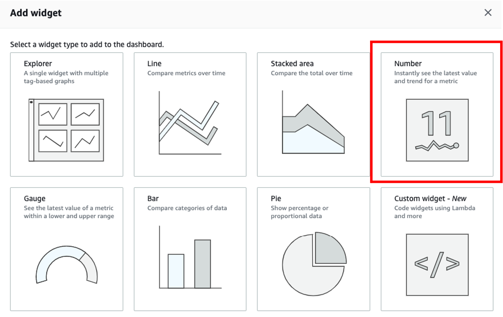

## 3. Add a metric to the widget

- Type AuroraGlobal in the search box and hit enter
- Select RDS>DBClusterIdentifier
- Select the metric AuroraGlobalReplicationLag
- Click on Create widget
- Keep the dashboard view open
- You may optionally add other metrics to your dashboard

# 4. Run inserts load against the primary

**Use Windows shell**

Commands to be run in Windows host against primary cluster..

To understand the replication latency, you will run load against the primary cluster and observe the change in latency. Feel free to carry out your own experiments.

- Get your cluster endpoint

```
$env:DBENDP = aws rds describe-db-clusters  `
      --db-cluster-identifier apgworkshop-dev `
      --query 'DBClusters[0].Endpoint' `
      --output text

echo $env:DBENDP
```

Insert data on the primary cluster & observe the change in latency in the dashboard. Keep in mind that there may be few seconds of delay in dashboard updates.

```
pgbench -i --fillfactor=90 --scale=500 -h $env:DBENDP -U postgres  testdb
```

# 5.Managed or Planned failover

By using managed planned failovers, you can relocate the primary cluster of your Aurora global database to a different AWS Region on a routine basis. This approach is intended for controlled environments, such as operational maintenance and other planned operational procedures.

### **Failover Process**

#### 1. Disconnect apps from DB to prevent writes againts the DB

#### 2. Check the AuroralDBGlobalReplicationLag for secondary regions & pick region with least latency.

#### 3. Failover to secondary

## 1. Initiate failover

- Since we have only 1 secondary cluster, we will skip step to check the latency
- Get the Arn of secondary DB cluster
- Region must be in quotes e.g., "us-west-2"

```
$env:AWS_SECONDARY_REGION = "<<Replace with your second region>>"
```

```
aws rds describe-db-clusters   `
    --db-cluster-identifier  apgworkshop-dev-secondary   `
    --query 'DBClusters[0].DBClusterArn'  `
    --output  text `
    --region $env:AWS_SECONDARY_REGION
```

- Run CLI command to failover [Command Reference](https://awscli.amazonaws.com/v2/documentation/api/latest/reference/rds/failover-global-cluster.html)

```
aws rds failover-global-cluster  `
    --global-cluster-identifier   apgworkshop-dev-global-db  `
    --target-db-cluster-identifier  <<Arn of secondary cluster>
```

- Check the status of the global DB cluster
- It will be failing-over, wait till the global db become available
- (Optional) track status of global DB in RDS console [Command Reference](https://awscli.amazonaws.com/v2/documentation/api/latest/reference/rds/describe-global-clusters.html)

```
aws rds describe-global-clusters   `
    --global-cluster-identifier  apgworkshop-dev-global-db  `
    --query 'GlobalClusters[0].Status'
```

## 2. Connect to EC2/Linux

- After successful failover, your second region is now primary
- Connect to EC2/Linux instance ( Instructions to connect (Run SQL to test block) )

```
sudo su - ec2-user
```

## 3. Get the cluster endpoint

**Use Linux shell**

Run commands in Linux EC2 instance in the secondary region

Get the secondary cluster cluster endpoint and set it in an environment variable.

```
export CLUSTER_EP=$(aws rds describe-db-clusters  \
    --db-cluster-identifier apgworkshop-dev-secondary \
    --query 'DBClusters[0].Endpoint' \
    --output text)

echo $CLUSTER_EP
```

## 4. Connect to the secondary cluster instance

Start a psql session; command will prompt you for the password.

```
psql -h $CLUSTER_EP  -U postgres -d testdb
```

## 5. Run the select queries in psql

Copy paste the query and see the results.

```
SELECT * FROM usertable;
```

## 6. Check out inserts

Copy paste the query and see the results.

```
INSERT INTO usertable  VALUES(102, 'Jenkin');
```

Remember last time we ran this SQL, it failed but this time it will succeed !!

## 7. Test the new secondary cluster

- Now open up PgAdmin on Windows host in the other region.
- Run SELECT query and you will see the last record that was added

```
SELECT * FROM usertable;
```

- Run the INSERT query and it will fail!!

```
INSERT INTO usertable  VALUES(102, 'Jenkin');
```

## 8. Failback global cluster

**Note:**

Run commands in Windows host

- Get the Arn of DB cluster first region

```
aws rds describe-db-clusters   `
    --db-cluster-identifier  apgworkshop-dev   `
    --query 'DBClusters[0].DBClusterArn'  `
    --output  text `
```

- Disconnect all DB sessions to the clusters
- Start failover

```
aws rds failover-global-cluster  `
    --global-cluster-identifier   apgworkshop-dev-global-db  `
    --target-db-cluster-identifier  <<Arn of  cluster>
```

- Wait for failover to complete

```
aws rds describe-global-clusters   `
    --global-cluster-identifier  apgworkshop-dev-global-db  `
    --query 'GlobalClusters[0].Status'
```

# Cleanup tasks

**Cleanup failure**

Any resources left running will lead to unneccesary charges in your account. Please ensure all resources are removed after use.

**Use Windows shell**

Commands to be run in Windows host in the primary region.

## 1. Delete the CloudWatch dashboard

- Region must be in quotes e.g., "us-west-2"

```
$env:AWS_SECONDARY_REGION = "<<Replace with your second region>>"
```

```
aws cloudwatch delete-dashboards `
    --dashboard-names  apgworkshop-dev-global-db `
    --region  $env:AWS_SECONDARY_REGION
```

## 2. Remove the cluster in second region from global db

```
aws rds describe-db-clusters  `
    --db-cluster-identifier  apgworkshop-dev-secondary `
    --query 'DBClusters[0].DBClusterArn'  `
    --output text  `
    --region $env:AWS_SECONDARY_REGION
```

This will fail if your second region is still primary !!! follow last step in the 5.Managed failover exercise to failback

```
aws rds remove-from-global-cluster  `
    --global-cluster-identifier   apgworkshop-dev-global-db `
    --region $env:AWS_SECONDARY_REGION  `
    --db-cluster-identifier  <<Replace with Arn>>
```

## 3. Remove the cluster in first region from global db

```
aws rds describe-db-clusters  `
    --db-cluster-identifier  apgworkshop-dev `
    --query 'DBClusters[0].DBClusterArn'  `
    --output text
```

```
aws rds remove-from-global-cluster  `
    --global-cluster-identifier   apgworkshop-dev-global-db `
    --db-cluster-identifier  <<Replace with Arn>>
```

## 4. Delete the Global DB cluster

After the successful run of this command, you will have two independent DB clusters. You will delete the cluster in the secondary region and retain the cluster in the primary region.

```
aws rds delete-global-cluster  `
    --global-cluster-identifier   apgworkshop-dev-global-db
```

## 5. Delete instances in the cluster in second region

- Delete the instance

```
aws rds delete-db-instance   `
    --db-instance-identifier    apgworkshop-dev-secondary-instance-1   `
    --region $env:AWS_SECONDARY_REGION
```

- Wait for the instance to get deleted; proceed when the instance is not found.

```
aws rds describe-db-instances `
    --db-instance-identifier    apgworkshop-dev-secondary-instance-1 `
    --query 'DBInstances[0].DBInstanceStatus'  `
    --region $env:AWS_SECONDARY_REGION
```

## 6. Delete the cluster in the second region

Once all DB instances in the cluster are deleted, you may delete the Aurora cloned cluster itself.

```
aws rds delete-db-cluster  `
    --db-cluster-identifier    apgworkshop-dev-secondary `
    --skip-final-snapshot   `
    --region $env:AWS_SECONDARY_REGION
```

Check the cluster status. Once the cluster is deleted this command will throw an error indicating that instance is not found (its OK). Before proceeding to next step, make sure the cluster is deleted.

```
aws rds describe-db-clusters `
    --db-cluster-identifier    apgworkshop-dev-secondary `
    --query 'DBClusters[0].Status'   `
    --region $env:AWS_SECONDARY_REGION
```

## 7. Delete the CloudFormation stack in second region

```
aws cloudformation delete-stack  `
    --stack-name  apgworkshop-dev-secondary  `
    --region  $env:AWS_SECONDARY_REGION
```

Check the status using this command. Once the command is successful, this command will throw a Stack not found error (it's OK).

**Stack delete failure**

If the delete fails, wait for a few minutes and run the delete-stack command again. You may use RDS Console to check reason for failure - may happen if you missed a cleanup step!!

```
aws cloudformation describe-stacks  `
    --stack-name  apgworkshop-dev-secondary  `
    --query  'Stacks[0].StackStatus'   `
    --region  $env:AWS_SECONDARY_REGION
```

# Lab-12 : Setup serverless v2 instance

### **Overview**

Our existing Aurora DB Cluster consists of only Provisioned instances. We can add additional read replicas that can be provisioned or serverless v2. In this part, you will add an Aurora Serverless v2 instance to the cluster as a result there will be one provisioned and one serverless v2 instance. A cluster with a mix of provisioned and serverless instances is said to have mixed configuration.

### Mixed configuration

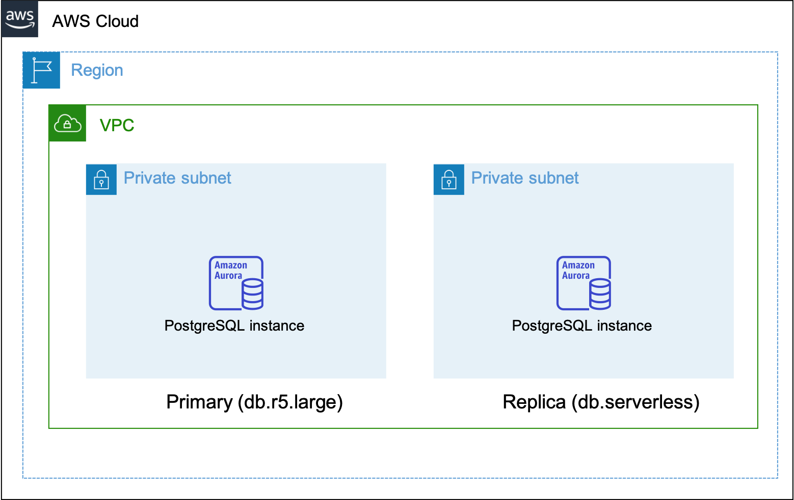

Once all provisioned instances are removed from the cluster, it will become a full serverless v2 cluster. At the end of the exercises in this section, our existing cluster will have a single serverless v2 cluster.

### Serverless v2 cluster

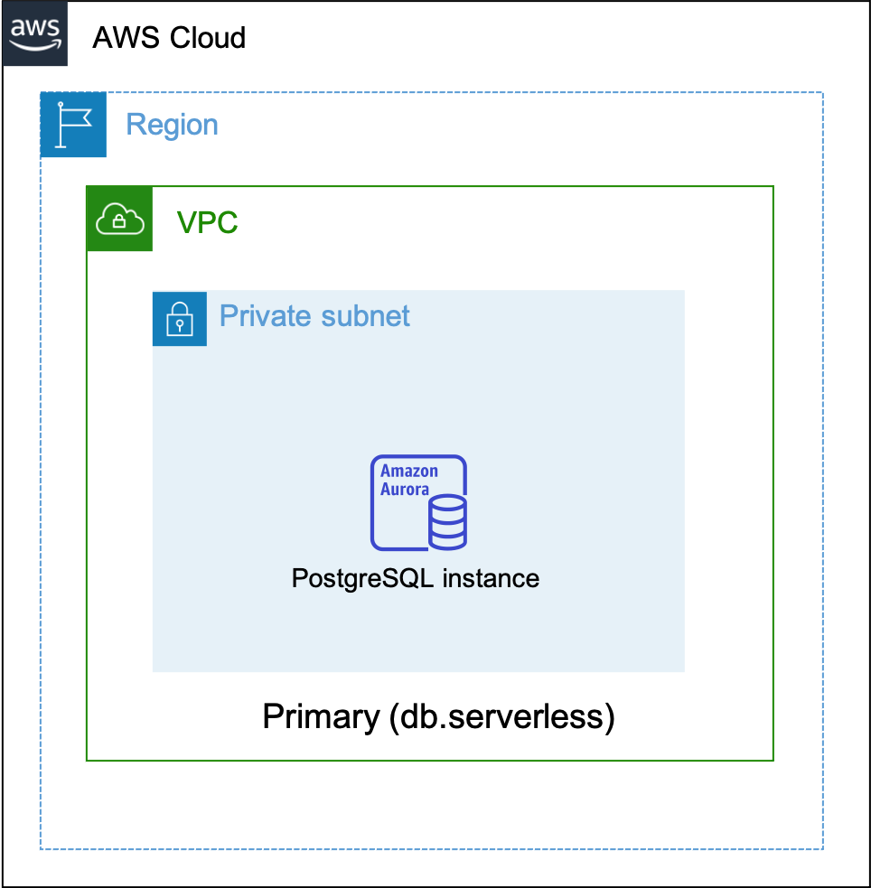

# 1. Convert to Serverless v2

## 1. Setup the capacity range for the cluster

- Set the min capacity = 4
- Set the max capacity = 32

```
aws rds modify-db-cluster `
    --db-cluster-identifier  apgworkshop-dev `
    --serverless-v2-scaling-configuration   MinCapacity=4,MaxCapacity=32 `
    --apply-immediately
```

Check the capacity range

```
aws rds describe-db-clusters   `
     --db-cluster-identifier apgworkshop-dev  `
     --query 'DBClusters[0].ServerlessV2ScalingConfiguration'
```

## 2. Add a serverless v2 instance

Add a serverless instance. To create a serverless v2 instance you just need to pass db.serverless to the instance class.

```
aws rds create-db-instance `
    --db-instance-identifier apgworkshop-dev-instance-2 `
    --db-cluster-identifier apgworkshop-dev `
    --engine aurora-postgresql `
    --db-instance-class db.serverless
```

Check the status of the instance. Wait for the instance to become available.

```
aws rds describe-db-instances `
    --db-instance-identifier    apgworkshop-dev-instance-2 `
    --query 'DBInstances[0].DBInstanceStatus'
```

Once the serverless v2 instance is created your cluster is in Mixed configuration.

## 3. Delete the provisioned instance

- Delete the instance

```
aws rds delete-db-instance   `
    --db-instance-identifier    apgworkshop-dev-instance-1
```

- Check the status
- Wait for the instance to be deleted

```
aws rds describe-db-instances `
    --db-instance-identifier    apgworkshop-dev-instance-1 `
    --query 'DBInstances[0].DBInstanceStatus'
```

After the successful deletion of the instance the cluster will have only 1 instance

## 4. Rename the DB instance

```
aws rds modify-db-instance `
    --db-instance-identifier apgworkshop-dev-instance-2    `
    --new-db-instance-identifier apgworkshop-dev-instance-1  `
    --apply-immediately
```

When you will run the command below - the status will show up as renaming

```
aws rds describe-db-instances `
    --db-instance-identifier    apgworkshop-dev-instance-2 `
    --query 'DBInstances[0].DBInstanceStatus'
```

Once the instance is renamed. You will have a cluster that is fully serverless v2

# 2. Serverless v2 load test

Often customers ask - how fast does Aurora Serverless v2 instances scale? This exercise will give you an idea on serverless v2 scaling rate. You will observe a fast scale up and a relatively slow scale down

### **ServerlessDatabaseCapacity**

This the metric that reports the DB instance capacity in terms of ACUs; the number represents the point in time capacity in use.

### **ACUUtilization**

This value is represented as a percentage. It's calculated as the value of the ServerlessDatabaseCapacity metric divided by the maximum ACU value of the DB cluster. You may think of it as similar to CPUUtilization for provisioned instance(s).

## 1. Create a CloudWatch dashboard

- Open AWS CloudWatch console
- Select Dashboard in left navigation panel
- Click on Create dashboard
- Name the dashboard as apgworkshop-dev-serverless-v2

## 2. Add widget to the dashboard

- You will be prompted to add a widget
- Select the line graph widget
- Select the Metrics as data source

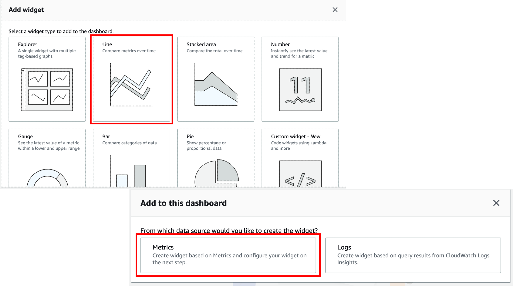

## 3. Add a metric to the widget

- Type AuroraGlobal in the search box and hit enter
- Select RDS>DBClusterIdentifier

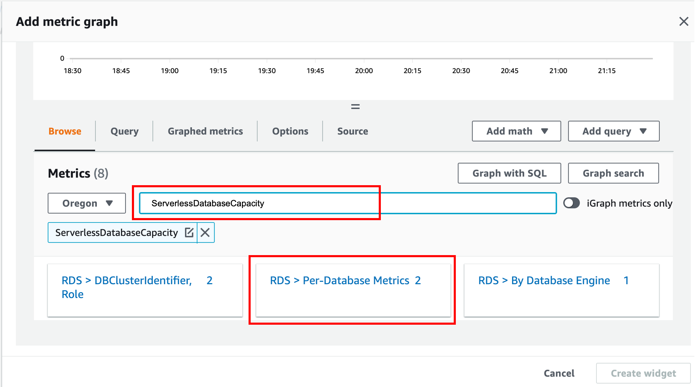

- Select the metric ServerlessDatabaseCapacity
- Click on Create widget
- Keep the dashboard view open
- You may optionally add other metrics to your dashboard

## 4. (Optional) Setup additional widget

Follow the steps above to add a Line graph widget for the serverless v2 metric ACUUtilization

## 5. Run inserts load against the primary

To understand the serverless v2 scaling, you will run load against the DB cluster and observe the change in ACU usage.

Feel free to carry out your own experiments. Pay attention to the rate of scale up/down.

- Get your cluster endpoint

```
$env:DBENDP = aws rds describe-db-clusters  `
      --db-cluster-identifier apgworkshop-dev `
      --query 'DBClusters[0].Endpoint' `
      --output text

echo $env:DBENDP
```

Insert data on the primary cluster & observe the change in latency in the dashboard. Keep in mind that there may be few seconds of delay in dashboard updates.

```
pgbench -i --fillfactor=90 --scale=500 -h $env:DBENDP -U postgres  testdb
```

Optionally you may run a load test against the cluster.

```
 pgbench -h $env:DBENDP -U postgres  -P 5 --time=120 --client=45  testdb
```

## 6. Analyze the results

Assume that load you ran was the peak load for the DB cluster from write perspective.

Answers to the questions below will give you an idea on the rate of scale up & scale down.

- How long did the test run?
- How quickly did the instance scale up?
- How long did it take for instance to scale down to min capacity?
- Based on the graphs do you think your DB can handle peak load?

# Cleanup tasks

## 1. Delete the CloudWatch dashboard

```
aws cloudwatch delete-dashboards `
    --dashboard-names  apgworkshop-dev-serverless-v2
```

# Cleanup the environment

If you are using AWS account provided by the AWS team, then these steps are optional as the account along with all resources will be automatically deleted at the end of the event.

**Cleanup failure**

Any resources left running will lead to unneccesary charges in your account. Please ensure all resources are removed after use.

If you are using your own account for this workshop, then please make sure to clean up the environment after you are done with the lab. Running instances will cost you $$. Follow the steps in sequence to delete all resources created in this workshop.

# 1. Delete Aurora Cluster

**VIA AWS CLI**

Deletion of Cluster using CLI involves multiple steps.

## 1. Delete all instances in the cluster

- Adjust the name of the instance in following command
- Run this command multiple times to delete all instances

```
aws rds delete-db-instance   `
    --db-instance-identifier    apgworkshop-dev-instance-1
```

- If you still have the second instance

```
aws rds delete-db-instance   `
    --db-instance-identifier    apgworkshop-dev-instance-2
```

Check the status of the instances; wait for the instances to be deleted. Once the instances are deleted this command will throw an error indicating that instance is not found (its OK).

```
aws rds describe-db-instances `
    --db-instance-identifier    apgworkshop-dev-instance-1 `
    --query 'DBInstances[0].DBInstanceStatus'
```

```
aws rds describe-db-instances `
    --db-instance-identifier    apgworkshop-dev-instance-2 `
    --query 'DBInstances[0].DBInstanceStatus'
```

## 2. Delete the cluster itself

Once all DB instances in the cluster are deleted, you may delete the Aurora cloned cluster itself.

```
aws rds delete-db-cluster  `
    --db-cluster-identifier    apgworkshop-dev `
    --skip-final-snapshot
```

Check the cluster status. Wait for it to be deleted. Once the cluster is deleted this command will throw an error indicating that instance is not found (its OK).

```
aws rds describe-db-clusters `
    --db-cluster-identifier    apgworkshop-dev `
    --query 'DBClusters[0].Status'
```

**VIA AWS RDS Console**

## 1. Open the RDS console

## 2. Delete the DB Reader instance

- Select the Reader instance
- Click on the Action dropdown
- Select the Delete from the Action menu
- Type delete me in the text box
- Click on the button Delete

## 3. Delete the DB Writer instance

- Select the Writer instance
- Select the Delete from Action menu

## 4. Confirm Deletion of Writer instance

- Uncheck the box Create final snapshot
- Check the box I acknowledge ...
- Type delete me in the text box
- Click on the button Delete

# 2. Delete CF Stack

**VIA AWS CLI**

```
aws cloudformation  delete-stack  `
     --stack-name apgworkshop-dev
```

```
aws cloudformation describe-stacks  `
    --stack-name apgworkshop-dev
```

**VIA AWS RDS Console**

## 1. Open the CloudFormation console

## 2. Select the workshop stack

Click on the button Delete
Confirm the stack deletion

# 3. Delete the Key pair

## 1. Open the EC2 console

## 2. Open the Key pairs list

- Click on Key Pairs in left navigation panel
- Select the Key pair apgworkshop-dev
- Click on dropdown Actions and select Delete
- Confirm the deletion by typing Delete in text box and clicking on button Delete

# 4. Delete CloudWatch Logs

## 1. Open the CloudWatch console

## 2. Select the Log Groups

- Click on Log Groups on left navigation menu
- Select the Log group for apgworkshop-dev
- Select the Log group

## 3. Delete the logs groups for Aurora

- Click on the drop down Actions and select Delete log group(s)

**Note:**

Repeat the process for all log groups that are not needed anymore.

## 4. Confirm the deletion

- Click on the button Delete
