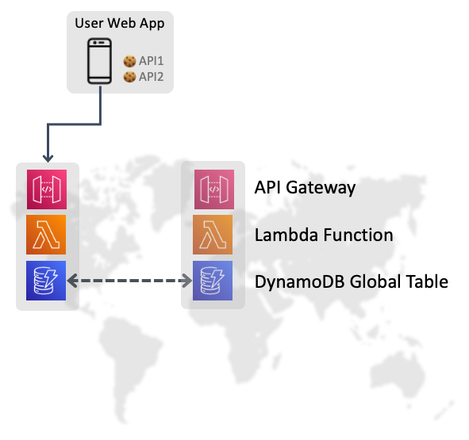
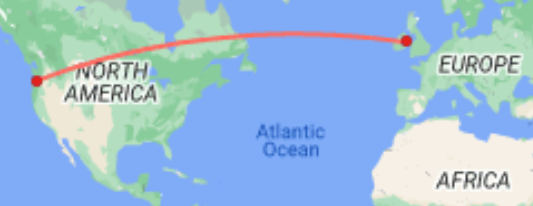
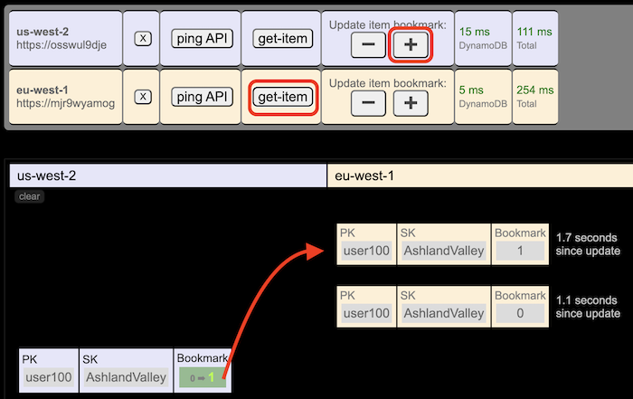
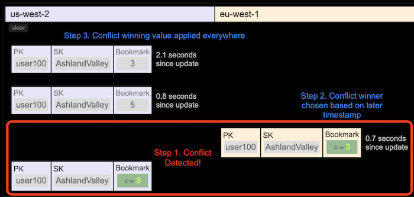

# Build and deploy a global serverless application

## **Workshop Overview**

In this workshop you will learn how to build and deploy a globally distributed serverless application and get experience with using Amazon DynamoDB Global Tables to replicate data across AWS Regions.

You will use serverless components to build an API to support a video player web application. The API service is designed to store bookmark records for any video show that a customer watches, so that the application can remember where a user left off during a watch session.

The target audience for this workshop is any developer or application architect who needs to understand multi-region data availability architectures for their application. At the end of this workshop you should:

- Feel comfortable creating a DynamoDB Global Table in multiple regions
- Understand how DynamoDB Global Tables Replication works
- Be able to explain what eventual consistentcy means in the context of DynamoDB Global Tables replication

# Getting Started at an AWS hosted event

## **Overview**

Thanks for participanting in this workshop. Since this is an AWS-sponsored and AWS-staffed event, you will have access to an AWS account with any optional pre-provisioned infrastructure and IAM policies needed to complete this workshop. The goal of this section is to help you access this AWS account. You may skip this section if you plan to use your own AWS account.

To get started, click the Next button to advance to the instructions on how to access your temporary AWS Account.

## Best Practices

Review the terms and conditions of the event. Do not upload any personal or confidential information in the account.
The AWS account will only be available for the duration of this workshop and you will not be able to retain access after the workshop is complete. Backup any materials you wish to keep access to after the workshop.
Any pre-provisioned infrastructure will be deployed to a specific region. Check your workshop content to determine whether other regions will be used.

## Accessing your AWS Account

After joining the event, you should see the page with event information and workshop details. You should also see a section titled "AWS account access" on the left navigation bar. You can use these options to access the temporary AWS account provided to you.

The AWS personnel in your session will give you specific url/links to get access to your AWS account for this session.

#### 1. From the Workshop Studio window, you will want to click on the Open AWS Console link on the left hand side of the screen like below.

#### 2. You should now be at the AWS console for our event. In the top menu bar of the console, please note the region should match your facilitators instructions (Oregon).

You are now ready to begin your workshop today so please proceed to the next section.

# Module 1: Deploy the backend resources

### **Prerequisites**

- CloudShell or an AWS Cloud9 instance

Or

- Command prompt with Python3, GIT, and the AWS Command Line Interface (CLI) installed and configured with credentials

### **Setup Steps**

This lab requires a terminal shell with Python3, GIT, and the AWS Command Line Interface (CLI) installed and configured with admin credentials.

We will use AWS CloudShell for this event.

In the previous step you opened the AWS Console, to open CloudShell, click the CloudShell icon (outlined in green below) at the top of your page.


## Verify Environment

#### 1. Run aws sts get-caller-identity to verify the AWS CLI is functioning

#### 2. Run python3 --version to verify that python3 is installed

#### 3. Run python3 -m pip install chalice boto3 to install [Boto3](https://boto3.amazonaws.com/v1/documentation/api/latest/index.html) and [AWS Chalice](https://github.com/aws/chalice)

You may see a couple of ERROR lines lines near the bottom of the command output about aws-sam-cli, these are safely ignored.

#### 4. Run git clone https://github.com/aws-samples/aws-dynamodb-examples.git

#### 5. Run cd aws-dynamodb-examples/global-serverless

#### 6. To see what application resources we will be deploying you can open the app.py file by running cat app.py. This code defines Lambda function and API Gateway routes.

## Deploy a new DynamoDB table

#### 1. In your command prompt, run:

```
aws dynamodb create-table \
  --region us-west-2 \
  --table-name global-serverless \
  --attribute-definitions \
    AttributeName=PK,AttributeType=S \
    AttributeName=SK,AttributeType=S \
  --key-schema \
    AttributeName=PK,KeyType=HASH \
    AttributeName=SK,KeyType=RANGE \
  --billing-mode PAY_PER_REQUEST \
  --query '{"New Table ":TableDescription.TableArn,
            "Status    ":TableDescription.TableStatus }'
```

#### 2. Wait a moment for the table to be created.

Check to see when the table status changes from CREATING to ACTIVE by running this command:

```
aws dynamodb describe-table \
  --table-name global-serverless \
  --region us-west-2 \
  --query '{TableStatus: Table.TableStatus}'
```

#### 3. Our table is in us-west-2 (Oregon). Let's make it a Global Table by requesting a replica in eu-west-1 (Europe/Dublin).

Run this command to create a new replica in the eu-west-1 (Europe/Dublin) region:

```
aws dynamodb update-table --table-name global-serverless --region us-west-2 --cli-input-json  \
'{"ReplicaUpdates": [
    {
        "Create": {"RegionName": "eu-west-1" }
        }
    ]}'
```

Check to see when the table replica status changes to ACTIVE by running this command:

```
aws dynamodb describe-table \
  --table-name global-serverless \
  --region us-west-2 \
  --query '{TableStatus: Table.TableStatus,
               Replicas: Table.Replicas}'
```

#### 4. Next, add some data to the table: Writing to a Global Table is done by writing to any of the regional replica tables.

Run this command to load video library items into the table with batch-write-item:

```
aws dynamodb batch-write-item \
  --region us-west-2 \
  --request-items file://sample-data.json
```

These items are how the UI will display which videos are available to stream.

#### 5. Verify data was written:

```
aws dynamodb get-item \
  --table-name global-serverless \
  --region us-west-2 \
  --key '{"PK": {"S": "library"}, "SK": {"S": "01"}}'
```

## Deploy the backend API service to the first region

#### 1. Run export AWS_DEFAULT_REGION=us-west-2 to instruct Chalice to deploy into us-west-2 for our first region

#### 2. Run chalice deploy and wait for the infrastructure to be created. Chalice is a Python based serverless framework.

#### 3. When the script completes, it reports a list of resources deployed. Copy and paste the Rest API URL into a note as you will need it later.

#### 4. Copy that REST API URL and paste it into a new browser tab to test it. You should see a JSON response of {ping: "ok"}

#### 5. You can type in certain paths to the end of the URL. Add the word scan so that the URL now ends with /api/scan You should see a JSON response representing the results of a table scan.

## Web Application

A single-page static web app is provided for you.

- https://dynamodbworkshop.s3.amazonaws.com/global-serverless/index.html
- This app allows you to enter one or more API endpoints, and stores each one as a browser cookie.
- The stored API endpoints will remain in the browser even if the backend were to have problems.
- In this way, the web app could make decisions about routing itself to an alternate API if there are errors or no response from the API being used.
- The web app does not contain any AWS code nor credentials, it simply makes HTTP GET calls to the API for you.
- The app's web content can be hosted from an S3 bucket, made globally available via Cloudfront, saved locally within Chrome, or converted into a mobile app. For this workshop we assume the user always has access to the web app even if the backend services become unavailable.

Steps:

- Within the web app, press the Add API button.
- Paste in the API URL you created previously and click OK.
- Review the buttons that appear. Click Ping to generate a request to the base level URL. The round trip latency will be displayed. This may be slower than expected do to a Lambda cold start. Click Ping again and check the latency.
- Click the get-item button. This will return the bookmark for user100 watching a show called AshlandValley.
- Click the forward and back buttons. They will generate requests to increment or decrement the bookmark by 1 second.

You now have a test harness where you can perform reads and writes to a DynamoDB record via the custom API.

## Deploy the service stack to the second region, Ireland

- Run export AWS_DEFAULT_REGION=eu-west-1 to instruct Chalice to deploy into eu-west-1 for our second region.
- Run chalice deploy and wait for the infrastructure to be created in eu-west-1.
- When the script completes, it reports a list of resources deployed. Again, copy down the new REST API URL to a note for later use.
- Return to the web app.
- Click Add API again and paste in the new API URL. A second row of buttons appears in an alternate color.

Note: In this workshop you have permissions for Global Tables in us-west-2 and eu-west-1. In your own account you could add any number of replicas in any regions.

Note 2: If you make any changes to the code in app.py, you can push the updates to your Lambda function
by running chalice deploy again.

# Module 2: Explore Global Tables

## Application Overview

Congratulations! You now have a serverless application stack running in both Oregon and Ireland. The stacks you deployed with Chalice each contain the following core components:

- Amazon API Gateway web service that responds to HTTP GET calls and forwards them to the Lambda function.
- AWS Lambda function that performs read and write requests to the DynamoDB table using Python.
- AWS IAM role to grant necessary permissions .

You then used the AWS Command Line Interface to deploy a DynamoDB Global Table called global-serverless and fill it with several items. These items represent bookmark records that can be set to record and retrieve the progress a customer has made when watching video content. There are also items representing a catalog of video content available.



## DynamoDB Global Table Details

### **Bookmark Design**

Our table has a two-part primary key consisting of a Partition Key and a Sort Key, named PK and SK. Each bookmark record will have the viewer's UserID as the PK value, and a ContentID value in the SK to denote the video they are watching. A third attribute, called Bookmark, will record the progress. The application will make periodic updates to this Bookmark attribute as the show is watched. If the user stops and then returns again later, a Get-Item call can locate the bookmark, read the Bookmark value, and queue up the video player to the right spot for the customer to continue watching.

### **Replication Performance**

When the application stack in Oregon makes calls to DynamoDB, it connects to the DynamoDB table in the same region. We can call this local table a regional replica since it participates in Global Tables replication. Writes to any regional replica will be detected by the DynamoDB service and the new item image will be shipped and applied to all other regional replicas. The goal of Global Tables is to bring all replicas to an identical state as quickly as possible. Callers such as our Lambda function in Oregon do not need to be aware of other regions and do not connect to any global endpoint since there isn't one.

Write operations to a replica table are confirmed successful to the caller with the same performance as a non-Global Table, typically within 10 milliseconds.

The distance between Oregon and Ireland is 4500 miles (7000 km). Information traveling at the speed of light will cross this distance in 24 ms.



The time it takes for DynamoDB to replicate changes to other regions can vary, but is typically 1-2 seconds. The ReplicationLatency statistic in Cloudwatch tracks the time required to replicate items.

## Testing Edge Cases in the Web Application

Let's prove that Global Tables replication is working.

#### 1. Click the plus button + in the first region and notice that the new bookmark value is displayed.

#### 2. Click Get-Item in the second region and compare the value to the bookmark in the first region. If they are the same, that means that Global Tables as applied the new state to all regions.

#### 3. Repeat steps 1 and 2 as quickly as possible.



The goal is to check the bookmark in region two before the replication completes. Since replication can occur in about one second, you will have to be quick to detect this. If you do, then click Get-Item again and the synchronized value should now be shown.
Note the app keeps a timer after every update, so you can see how many seconds have elapsed when performing a subsequent read.

### **Generate a Conflict**

There is an edge case with Global Tables that happens when writes to the same item occur at the same time in different regions. If the writes conflict during the 1-2 seconds of in-flight replication, then DynamoDB detects this as a Conflict, and makes a decision on which one of the writes will win the conflict. The timestamps of the updates are compared, and the later write becomes the winner. The earlier write is thrown out as if it never happened.

#### 1. In region one, click Get-Item and note the current bookmark value.

#### 2. Next, click the plus button.

#### 3. In region two, immediately click the minus button.

#### 4. Carefully examine the output. Did region two change the value back to the starting value? If so, then there was no conflict. The first update replicated completely before the second update began. If the second update took the bookmark lower than the starting value, that shows there WAS a conflict and that the first update was un-done.



You can read more about DynamoDB Global Tables in the final chapter of this workshop or in the [Global Tables Documentation](https://aws.amazon.com/ru/dynamodb/global-tables/)

# Module 3: Interact with the Globalflix Interface

## Navigate to the Globalflix Web App

Click the link below to open the Globalflix web app, or if you still have the app open from module 2, click the Globalflix logo on the top right. https://dynamodbworkshop.s3.amazonaws.com/global-serverless/globalflix.html

If you have already successfully loaded the API urls in the last module, you should see a grid of 12 video thumbnails. This has been displayed by performing a query against DynamoDB for the sample data you loaded in module 1.

The API region(s) you set in the previous module should be displayed on the top right, with the current "active" region in solid orange.

Select the outlined region to perform a local "failover" to the second region
For the sake of time in this module we are executing this regional failover within the web application, but in production a more common pattern is to make use of something like [Amazon Route 53 Application Recovery Controller](https://aws.amazon.com/ru/route53/application-recovery-controller/) to manage the health checks, failover, and recovery of your regional services.

## Watch a video to start loading bookmarks into the database

#### 2. Click on any of the videos to load the video player page.

On this page, the selected video will start playing in the middle with the following metrics displayed around it (from left to right):

- Video Progress: Current Timestamp of your progress through the video as seen by your web browser
- Write Latency: Time in milliseconds it took to write the last bookmark to the database
- Region 1 and 2 Progress: Current Timestamp of your progress through the video when reading the bookmark item from each region

Underneath the player you can see a log of each write operation performed, note the region being used.

## Simulate a Region Failure

#### 3. Return to the AWS console and search for "Lambda" using the search bar at the top

#### 4. A function named "global-serverless-dev" should be listed on the functions page, click the function name. If you do not see it listed check to make sure you are in one of the two regions you deployed to with Chalice on the top right of the page

#### 5. Use the "Throttle" button on the top right of the page to set the Lambda functions maximum concurrency to 0, halting any future invocations of the function in this region.

#### 6. Switch back to the Globalflix video player and observe that an API failure in that region has been detected

#### 7. Wait for the application to wait to failover

Even though the application stack in that region is now unresponsive, because we are using DynamoDB Global Tables, data updates are still being replicated into that region. When the service recovers, we need not worry about data loss during that outage.

You can verify this if you would like by running a query against the "global-serverless" DynamoDB Table in each of your regions

```
aws dynamodb query \
    --table-name global-serverless \
    --region us-west-2 \
    --key-condition-expression "PK = :PK" \
    --expression-attribute-values '{":PK": {"S": "user10"}}' \
    --query 'Items[*].bookmark.S' \
    --output text | awk '{print $1": us-west-2"}'
aws dynamodb query \
    --table-name global-serverless \
    --region eu-west-1 \
    --key-condition-expression "PK = :PK" \
    --expression-attribute-values '{":PK": {"S": "user10"}}' \
    --query 'Items[*].bookmark.S' \
    --output text | awk '{print $1": eu-west-1"}'
```

#### 8. Return to the Lambda console and click "Edit concurrency" at the top right

#### 9. Select the "Use unreserved account concurrency" button and then Save

Your resilient application has now successfully tolerated a failed regional stack, failed to an alternate region, and failed back, all with zero data loss or impact to the users experience.

# Global Tables Discussion Topics

Below are some discussion topics for people who’ve finished the development work or would like to discuss interesting aspects of Global Tables with a DynamoDB specialist.

## What are Global Tables?

- Global tables build on the global Amazon DynamoDB footprint to provide you with a fully managed, multi-Region, and multi-active database that delivers fast, local, read and write performance for massively scaled, global applications. Global tables replicate your DynamoDB tables automatically across your choice of AWS Regions.
- Global tables eliminate the difficult work of replicating data between Regions and resolving update conflicts, enabling you to focus on your application's business logic. In addition, global tables enable your applications to stay highly available even in the unlikely event of isolation or degradation of an entire Region.
- You can set up global tables in the AWS Management Console or AWS CLI. No application changes are required because global tables use existing DynamoDB APIs. There are no upfront costs or commitments for using global tables, and you pay only for the resources provisioned.

## How am I charged for using Global Tables?

- A write to a traditional DynamoDB table is priced in Write Units (where if you write a 5 KB item it incurs a charge of 5 Write Units). A write to a global table is priced in Replicated \* Write Capacity Units (rWCUs, for provisioned tables) or Replicated Write Request Units (rWRUs, for on-demand tables).
- Replicated write units include the cost of the streaming infrastructure needed to manage the replication. For on-demand tables in us-east-1 the price is $1.875 per replicated million write units instead of $1.25 per million. For Provisioned it’s $0.000975 per rWCU-hour instead of $0.00065 per WCU-hour. Cross-region data transfer fees do apply.
- Replicated Write Unit charges are incurred in every Region where the item is directly written or replicate written.
- Writing to a Global Secondary Index (GSI) is considered a local write and uses regular Write Units.
- There is no Reserved Capacity available for rWCUs at this time. Purchasing Reserved Capacity may still be beneficial for tables with GSIs consuming write units.

## What’s the main difference between GTv1 (2017) and GTv2 (2019)?

- DynamoDB has two version of Global Tables. Both are still supported, but we suggest you use GTv2 (2019) or upgrade when you can. All discussion other than this question here refers to GTv2 behaviors.
- With GTv2 the source and target tables are maintained together and kept aligned automatically (for throughput, TTL settings, auto-scaling settings, etc).
- With GTv2 the metadata attributes required to control replication are now hidden, preventing any accidental (or intentional) writing of them which would cause issues with the replication.
- Customer Managed Key (CMK) encryption is only available on GTv2.
- More Regions are supported with GTv2.
- GTv2 lets you add/remove Regions to an existing table.
- GTv2 is generally more cost effective.

## How would I upgrade from Global Tables v1 to v2?

- It’s a push-button on the Console. It’s a live upgrade that should finish in less than an hour.
- https://docs.aws.amazon.com/amazondynamodb/latest/developerguide/V2globaltables_upgrade.html

## How is read and write throughput managed for Global Tables?

- The write capacity must be the same on all table instances across Regions. With GTv2 the write capacity is automatically kept in sync by the GT infrastructure, so a write capacity change to one table replicates to the others. The table must support auto scaling or be in on-demand mode.
- Read capacity is allowed to differ because reads may not be equal across Regions. When adding a global replica to a table the capacity of the source Region is propagated. After creation you can adjust the read capacity, which is not transferred to the other side.

## What Regions does Global Tables support?

- As of today, GTv2 supports 17 Regions. The latest list can be seen in the drop-down on the Console when choosing a Region in which to add a replica.

## How are GSIs handled with Global Tables?

- With GTv2, you create a GSI in one Region, and it’s automatically replicated to the other Region(s) as well as automatically backfilled.

## How do I delete a global table?

- You can delete a replica table the same as any other, which will stop replication to that Region and delete the table copy kept in that Region. You cannot however ask to sever the replication and have copies of the table exist as independent entities.
- There’s also a rule you can’t delete a source table quickly after it’s used to initiate a new Region. If you try you get the error: “Replica cannot be deleted because it has acted as a source Region for new replica(s) being added to the table in the last 24 hours..”

## How are conflicting writes handled with Global Tables?

- Conflicts can arise if applications update the same item in different Regions at about the same time. To help ensure eventual consistency, DynamoDB global tables use a last writer wins reconciliation between concurrent updates, in which DynamoDB makes a best effort to determine the last writer. With this conflict resolution mechanism, all the replicas will agree on the latest update and converge toward a state in which they all have identical data. There are several ways to avoid conflicts, such as using an IAM policy to only allow writes to the table in one region, routing users to only one region and keeping the other as an idle standby, routing odd users to one region and even users to another region, avoiding the use of non-idempotent updates such as Bookmark = Bookmark + 1 in favor of static updates such as Bookmark=25.

## What are best practices for deploying Global Tables? How can I automate deployment?

- In AWS CloudFormation, each global table is controlled by a single stack, in a single Region, regardless of the number of replicas. When you deploy your template, CloudFormation will create/update all replicas as part of a single stack operation. You should not deploy the same AWS::DynamoDB::GlobalTable resource in multiple Regions. Doing so will result in errors, and is unsupported. If you deploy your application template in multiple Regions, you can use conditions to only create the resource in a single Region. Alternatively, you can choose to define your AWS::DynamoDB::GlobalTable resources in a stack separate from your application stack, and make sure it is only deployed to a single Region.
- https://docs.aws.amazon.com/AWSCloudFormation/latest/UserGuide/aws-resource-dynamodb-globaltable.html
- A DynamoDB table is AWS::DynamoDB::Table and a global table is AWS::DynamoDB::GlobalTable, which essentially makes them two different resources in regards to CFN. One approach then is to create all tables that might ever be global by using the GlobalTable construct, keep them as standalone tables initially, and later add Regions if needed.
- If you have a regular table and you want to convert it while using CloudFormation, here is the recipe: Set the deletion policy to retain, remove the table from the stack, convert the table to a Global Table in the console, then import the global table as a new resource to the stack.
- Note that cross-account replication is not supported at this time.

## How do I monitor Global Tables?

- Using Amazon CloudWatch you can observe a metric ReplicationLatency which tracks the elapsed time between when an item is written to a replica table and when that item appears in another replica in the global table. It’s expressed in milliseconds and is emitted for every source- and destination-Region pair.
- The latencies you will observe depends on many things including the distance between your chosen Regions. It’s common to see latencies in the 0.5 to 2.5 second range for Regions within the same geographic area.
- This is the only CloudWatch metric provided by Global Tables v2.

## How is Time To Live (TTL) handled with Global Tables v2?

- TTL is a feature where you can specify an attribute name whose value (as a number in seconds since epoch) indicates the time of expiration for the item. After that time DynamoDB can delete the item without incurring write costs.
- With Global Table, you configure TTL in one Region, and the setting is auto replicated to the other Region(s).
- When an item is deleted via a TTL rule, that work is performed without consuming Write Units on the source table, but the target table(s) do incur Replicated Write Unit costs. Be aware that if the source and target table have very low Provisioned write capacity, this may cause throttling as the TTL deletes require write capacity.

## How do DynamoDB Streams interact with Global Tables?

- Each global table produces an independent stream based on all its writes, wherever they started from. You can choose to consume the DynamoDB stream in one Region or in all Regions (independently). If you should want local writes processed but not replicated writes, you can add your own region attribute to each item that identifies the writing Region, then use a Lambda event filter to only invoke the Lambda for writes in the local Region.

## How do Global Tables handle transactions?

- Transactional operations provide ACID guarantees ONLY within the Region where the write is made originally. Transactions are not supported across Regions in global tables. For example, if you have a global table with replicas in the US East (Ohio) and US West (Oregon) Regions and perform a TransactWriteItems operation in the US East (Ohio) Region, you may observe partially completed transactions in US West (Oregon) Region as changes are replicated. Changes will only be replicated to other Regions once they have been committed in the source Region.

## How do Global Tables interact with the DynamoDB Accelerator cache (DAX)?

- Global Tables “write around” DAX by updating DynamoDB directly, so DAX will not be aware it’s holding stale data. The DAX cache will only be refreshed when the cache’s TTL expires.

## Do tags on tables propagate?

- No, they do not automatically propagate.

## Should I backup tables in all Regions or just one?

- The answer depends on the purpose of the backup. If it’s to ensure data durability, that’s a feature intrinsic to the DynamoDB service. If it’s about keeping a snapshot for historic records (such as for regulatory requirements) then backing up in one Region should suffice. The backed up data can be replicated to multiple Regions via AWS Backup. If it’s about recovering erroneously deleted or modified data, then PITR in one Region should suffice.

## What’s the best practice for using Global Tables as part of handling a potential Region outage?

- Have (or be able to quickly create) independent copies of your execution stack in alternative Regions, each accessing its local DynamoDB endpoint. Use Route53 or Global Accelerator to route to the nearest healthy Region, or have the client aware of the multiple endpoints it might use. Use health checks in each Region that will be able to determine reliably if there’s any issue with the stack, including if DynamoDB is degraded. For example, don’t just ping that the DynamoDB endpoint is up, actually do a call that ensures a full successful database flow. Should the health check fail, traffic can route to other Regions (by updating the DNS entry with Route53, by having Global Accelerator route differently, or by having the client choose a different endpoint). Global Tables have a good RPO (recovery point objective) because the data is continuously syncing and a good RTO (recovery time objective) because both Regions always keep a table ready for both read and write traffic.
- Note that DynamoDB is a core service on which other services frequently build their control plane operations, thus it’s unlikely you’ll encounter a scenario where DynamoDB has degraded service in a Region while other services are unimpacted.
- A good discussion of health checks can be found at https://docs.aws.amazon.com/Route53/latest/DeveloperGuide/health-checks-types.html

# Summary

We hope you enjoyed this workshop and learning about how to build and deploy global applications! Please let us know your feedback via the session survey.

If you are running this workshop as part of an AWS sponsored event, your temporary account will be destroyed at the end of the event and all the resources will be deleted, so there is nothing else for you to do.

If you are running this workshop in your own AWS account, you may delete the global-app CloudFormation Stack and the Chalice created components to avoid incurring any charges afterwards. The DynamoDB table was created in On Demand mode so there are no charges for provisioned capacity levels, only for actual usage.
