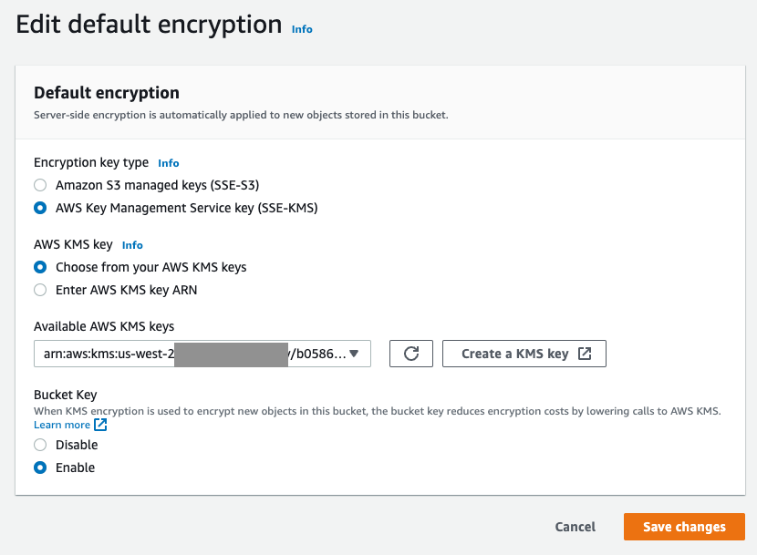
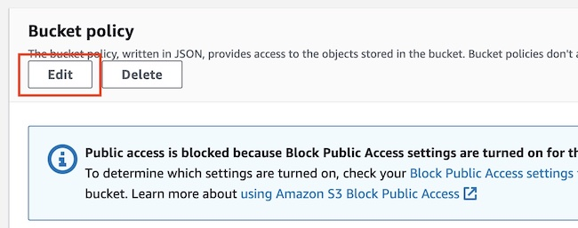

# Data protection in event driven architectures

## Introduction

Customers are moving to serverless architectures to increase speed to production and enhance their security posture. A common question customers ask when starting their journey is, “How do I protect data in an ephemeral environment?”. We create a demo serverless architecture with data protection specifically as the goal. Dive deep with AWS Key Management Service (AWS KMS ) to encrypt data at rest with a customer managed key (CMKs) and use key policies and resource policies to enforce least privilege. Gain hands on experience building and deploying a serverless app with Amazon SNS , Amazon SQS , and AWS Lambda .

In this workshop, you improve the security posture of an event driven architecture. Each module is designed to focus on another part of data security.

This workshop is intended for DevOps engineers and people with security roles. There is no prior experience required, though some background on SQS, SNS, S3 will help. This workshop takes approximately 45 minutes to complete. By the end of this workshop, you will be able to improve the security of your data in an event driven architecture.

## Module 1: Overview of the environment

In this module, you review the architecture that has been provisioned in your account and test the functionality.


The architecture consists of an Amazon SNS topic that sends messages to an Amazon SQS queue. The AWS Lambda function process the messages from the queue, and writes a receipt to Amazon S3 .

## Step 1: Send a test message

In this step, you use the AWS console to send a test message.

#### 1. Navigate to the Amazon SNS console .

#### 2. In the navigation pane, choose Topics.

#### 3. Select the topic that begins with dap351-cfn-template-DAPInstaller.

#### 4. Choose Publish message.


#### 5. For Message body to send to the endpoint, enter:

```
{
   "name": "apple",
   "quantity": 3,
   "price": 2
}
```

#### 6. Choose Publish message.


## Step 2: Verify output in Amazon S3

After publishing the message to Amazon SNS, the message is sent to Amazon SQS. The AWS Lambda function will process the message and store the result as an object in Amazon S3. In this step, you use the AWS console to view the output text file.

#### 1. Navigate to the [Amazon S3 console](https://s3.console.aws.amazon.com/s3) .

#### 2. Select the bucket that begins with dap351-cfn-template-dapinstaller-s3bucketreceipt.

#### 3. Select the object. Your object will have a different value for the name.

#### 4. To view the text, choose Open.

The file may be blocked depending on your browsers pop-up settings or extensions. You may need to allow it or try a different browser.

#### 5. The file should open in a new tab on your browser. If the file is downloaded instead, you can use any text editor on your local computer to view the contents.


## Step 3: Review CloudFormation outputs

This workshop uses CloudFormation to deploy resources. In this step, you review the output of the template for values you will need in later modules.

#### 1. Navigate to the [Cloudformation](https://console.aws.amazon.com/cloudformation) console.

#### 2. Choose the stack beginning with dap351-cfn-template-DAPInstaller.

#### 3. Select the Outputs tab. These are the values you will need for later modules. Leave this tab open for easy reference.


## Module 2: Protecting data at rest

In this module, you create new KMS keys and update the encryption settings for SNS, SQS, and S3 to use them. You send a test message and observe the results as you make changes.

## Step 1: Create a new Customer Managed Keys

The following steps creates two separate KMS keys , to be used by SQS, SNS, and S3 for encryption.

#### 1. Navigate to the Key Management Service (KMS) console.

#### 2. In the navigation pane, choose Customer managed keys.

#### 3. Choose Create key.

#### 4. For Key type and Key usage, leave the defaults.


#### 5. Choose Next.

#### 6. For Alias enter dap351-events. This will be used for encryption on SNS and SQS.

#### 7. Choose Next.

#### 8. On the Define key administrative permissions page, select the WSParticipantRole role.

#### 9. Choose Next.

#### 10. On the Define key usage permissions page, select the WSParticipantRole role.

#### 11. Choose Next.

#### 12. On the Review page, remove the default portion that enables IAM User Permissions from the Key policy.

```
  {
            "Sid": "Enable IAM User Permissions",
            "Effect": "Allow",
            "Principal": {
                "AWS": "arn:aws:iam::<account number>:root"
            },
            "Action": "kms:*",
            "Resource": "*"
  },
```


#### 13. Choose Finish.

#### 14. Repeat steps 3-13 to create another key. Choose the following:

- For Alias, enter dap351-s3.
- For Define key administrative permissions page, select the WSParticipantRole role.
- For Define key usage permissions page, select the FinanceRole role.
- Remember to remove the default IAM permissions as described in step 12.

## Step 2: Apply encryption to SNS and SQS

Now that we have created our encryption keys we need to update our SNS Topic and SQS Queue to use them for encryption at rest.

### Configure SNS Topic to use KMS-CMK

In this step, you configure the SNS topic to use the KMS key you created in the previous step. For more information, visit the [SNS Developer Guide](https://docs.aws.amazon.com/sns/latest/dg/sns-enable-encryption-for-topic.html)

#### 1. Navigate to the [Amazon SNS ](https://console.aws.amazon.com/sns/home) console.

#### 2. In the navigation pane, choose Topics.

#### 3. Choose the topic that begins with dap351-cfn.

#### 4. Choose Edit and expand the Encryption section.

#### 5. Toggle the Encryption button and select the alias/dap351-events from the CMK section.


#### 6. Choose Save changes.

## Configure SQS to use KMS-CMK

In this step, you configure the SQS queue to use the KMS key you created in the previous step. For more information, visit the [SQS Developer Guide](https://docs.aws.amazon.com/AWSSimpleQueueService/latest/SQSDeveloperGuide/sqs-configure-sse-existing-queue.html)

#### 1. Navigate to the [Amazon SQS](https://console.aws.amazon.com/sqs/home) console.

#### 2. In the navigation pane, choose Queues.

#### 3. Choose the queue that begins with dap351-cfn

#### 4. Choose Edit and expand the Encryption section.

#### 5. Amazon SQS provides in-transit encryption by default. We will update the configuration to use our own KMS key. For Encryption key type select AWS Key Management Service key (SSE-KMS).

#### 6. Select the alias/dap351-events from the Customer master key drop down.


#### 7. Choose Save.

## Step 3: Test an event

In this step you configure Amazon SNS delivery status logging and send a test message. You will notice that the event fails and does not make it all the way through. You will be able to publish to the SNS queue, as that is controlled through IAM permissions and your user has the ability to leverage the KMS key for SNS and publish to the queue.

### Configure delivery status logging for Amazon SNS

#### 1. Navigate to the [Amazon SNS](https://console.aws.amazon.com/sns/home) console.

#### 2. Choose the topic that begins with dap351-cfn.

#### 3. Choose Edit and expand the Delivery status logging section.

#### 4. or Log delivery status for these protocols, select Amazon SQS.

#### 5. Select Create new service role.

#### 6. Choose Create new roles.

#### 7. On the new IAM Management tab that opens, choose Allow.


#### 8. Choose Save changes.


If you get an error about the role, wait a few seconds and hit save again.

### Send a test event and troubleshoot

#### 1. Follow the steps in Module 1, step 1 to publish a new test message. Change the name from apple to orange.

```
{
   "name": "orange",
   "quantity": 3,
   "price": 2
}
```

Lets troubleshoot where the message might be stuck at.

#### 1. Navigate to the [CloudWatch](https://console.aws.amazon.com/cloudwatch/home) console.

#### 2. In the navigation pane, expand Logs choose Log groups.

#### 3. Select the log group for SNS. The name will begin with sns/.

#### 4. Choose Search log group.


#### 5. You will be able to see that the message you published is erroring when sending to SQS because it can not access the KMS key and gets a AccessDeniedException.


This is because the SNS topic does not have the ability to publish to the encrypted SQS queue. We need to modify the KMS policy to allow this.

## Step 4: Modify KMS Policy to allow messages from SNS to SQS

In this step, you update the KMS key policy to allow the SNS Topic to generate a data key and decrypt using the KMS key you created in module 1.

#### 1. Navigate to the [Key Management Service (KMS)](https://console.aws.amazon.com/kms/home) console.

#### 2. In the navigation pane, choose Customer managed keys.

#### 3. Select the alias dap351-events

The key policy currently contains three statements.

- Allow access for Key Administrators
- Allow use of the key
- Allow attachment of persistent resources

Add a new statement to allow access to SQS.

#### 4. For Key Policy, choose Edit.

#### 5. On line 61, add a comma after the } and enter the following:

```

        {
            "Sid": "AllowSNSToSendToSQS",
            "Effect": "Allow",
            "Principal": {
                "Service": "sns.amazonaws.com"
            },
            "Action": [
                "kms:GenerateDataKey",
                "kms:Decrypt"
            ],
            "Resource": "*",
            "Condition": {
                "StringEquals": {
                    "aws:SourceAccount": "<account number>"
                }
            }
        }
```

#### 6. Replace <account number> with your Account ID. This value is in the CloudFormation Outputs tab from module 1, step 3.

#### 7. Choose Save changes.

### Additional Troubleshooting

In this section, you learn that the event still fails and does not make it all the way through. We will troubleshoot where the message might be stuck at.

#### 1. Follow the steps in Module 1, step 1 to publish a new test message. Change the name from apple to banana.

```
{
   "name": "banana",
   "quantity": 3,
   "price": 2
}
```

#### 2. Navigate to the [Amazon SQS](https://console.aws.amazon.com/sqs/home) console.

#### 3. Observe Messages in flight for the queue that begins with dap351-cfn.


You will be able to see that the message you sent is visible to the queue. The message is stuck somewhere else since it has now made it to the queue. Let's review CloudTrail for errors.

#### 4. Navigate to the [CloudTrail](https://console.aws.amazon.com/cloudtrail/home) console.

#### 5. In the navigation pane, select Event history.

#### 6. Filter Lookup attributes so that Event name is set to Decrypt

It may take up to five minutes for the event to show in CloudTrail. Refresh the event history until you get the latest logs.

#### 1. Select the event where the username begins with awslambda\_


This event shows that a user is not authorized to perform Decrypt on resource.

## Step 5: Modify KMS policy to allow consumer access to SQS queue.

We identified that the issue is the Lambda function, as the consumer, does not have the ability to get the message from SQS. We need to allow the role access in the KMS policy.

#### 1. Navigate to the [Key Management Service (KMS)](https://console.aws.amazon.com/kms/home) console.

#### 2. In the navigation pane, choose Customer managed keys.

#### 3. Select the alias dap351-events

#### 4. For Key policy choose Edit.

#### 5. On line 78, add a comma after the } and enter the following:

```
        {
            "Sid": "AllowConsumersToReceiveFromTheQueue",
            "Effect": "Allow",
            "Principal": {
                "AWS": "<Lambda role>"
            },
            "Action": "kms:Decrypt",
            "Resource": "*"
        }
```

#### 6. Replace <Lambda role> with the arn of the Lambda role. This value is in the CloudFormation Outputs tab from module 1, step 3.

#### 7. Choose Save changes.

## Step 6: Validate flow with SNS and SQS encryption at rest

In this step, you observe that the event now has made it all the way through and is in your S3 bucket. You can view it the same way you did in Module 1.

#### 1. Follow the steps in Module 1, step 1 to publish a new test message. Change the name from apple to grape.

```
{
   "name": "grape",
   "quantity": 3,
   "price": 2
}
```

Depending on how quickly you completed the previous section, your previous tests may retry successfully. Select the latest objects in your S3 bucket to see the results. Look for the item name grape for step 6.

## Step 7: Apply encryption to S3

Now that we have created our encryption keys we need to update our S3 bucket to use them for encryption at rest.

Leverage KMS-CMK for S3 encryption at rest

#### 1. Navigate to the [S3 console](https://console.aws.amazon.com/s3/) :

#### 2. Choose the S3 bucket that starts with dap351-cfn-template-\*

#### 3. On the bucket page, select the Properties tab.

#### 4. In the Default encryption section, choose Edit.

#### 5. For Encryption key type select to AWS Key Management Service key (SSE-KMS).

#### 6. For AWS KMS key select Choose from your AWS KMS keys.

#### 7. For Available AWS KMS keys, choose dap351-s3 key.

#### 8. Leave the default Bucket key enabled to reduce cost.

#### 9. Choose Save changes.



## Modify KMS Policy to allow consumer access to S3 bucket.

We learned in the previous steps that we also need to update the key policy to give the Lambda function, the consumer, the ability to publish the contents to the S3 bucket. We need to allow the role access in the KMS policy. If you don't update the KMS key policy, the Lambda function would log an error in CloudWatch because it cannot access the KMS key.

#### 1. Navigate to the [Key Management Service (KMS)](https://console.aws.amazon.com/kms/home) console.

#### 2. In the navigation pane, choose Customer managed keys.

#### 3. Select the alias dap351-s3

#### 4. For Key policy choose Edit.

#### 5. On line 61, add a comma after the } and enter the following:

```
        {
            "Sid": "AllowLambdaToUploadToS3",
            "Effect": "Allow",
            "Principal": {
                "AWS": "<lambda role arn>"
            },
            "Action": [
                "kms:GenerateDataKey",
                "kms:Decrypt"
            ],
            "Resource": "*"
        }
```

#### 6. Replace <Lambda role> with the arn of the Lambda role. This value is in the CloudFormation Outputs tab from module 1, step 3.

#### 7. Choose Save changes.

## Step 8: Validate flow with encryption at rest

In this step, you test now that encryption at rest is configured on SQS, SNS and S3. You notice that the event now has made it all the way through and is in your S3 bucket. However, you will not be able to view it the same way you did in Module 1. The new event is encrypted with a KMS key that you do not have access with your current role. If you assume the FinanceRole you will be able to open up the new file that was published and encrypted in S3.

#### 1. Follow the steps in Module 1, step 1 to publish a new test message. Change the name from apple to plum.

```
{
   "name": "plum",
   "quantity": 3,
   "price": 2
}
```

You will not be able to access the new file created in your S3 bucket. The WSParticipantRole does not have decrypt permission for the KMS key used to encrypt the S3 object.

### Switch to the finance role to view the file.

New files are encrypted with a key the WSParticipant doesn't have access to. You have to switch to the FinanceRole to see any new files created.

#### 1. In the navigation bar, choose WSParticipant.

#### 2. Choose Switch role

#### 3. For Account, enter your Account ID.

#### 4. For Role, enter FinanceRole.

#### 5. Navigate to the the Amazon S3 console.

#### 6. Select the bucket that begins with dap351-cfn-template-dapinstaller-s3bucketreceipt.

#### 7. Choose the object you created in step 8. You should now be able to access the file.

Select the latest object in your S3 bucket to see the results. Look for the item name plum for step 8.

#### 8. When you are done viewing the file, switch back to your WSParticipantRole. Choose FinanceRole and select Switch Back.


You've now enabled encryption at rest for SQS, SNS, and S3. Continue to Module 3 to learn about encryption in transit protection in serverless environments.

## Module 3: Protecting data in transit

In this module, you enforce SQS and SNS encryption in transit to further secure your serverless environment.

## Step 1: Forcing SQS encryption

In this step, we will block unencrypted connections to Amazon SQS.

#### 1. Navigate to the [Amazon SQS](https://console.aws.amazon.com/sqs/) console :

#### 2. Choose the SQS queue that begins with dap351-cfn-template and choose Edit.


#### 3. In the Access policy section, notice how the SQS queue has an existing policy to send messages to an SNS topic. You are going to add the statement below to the policy.

#### 4. On line 16, add a comma after the } and enter the following.

```
        {
        "Sid": "DenyUnsecureTransport",
        "Effect": "Deny",
        "Principal": {
            "AWS": "*"
        },
        "Action": [
            "sqs:ReceiveMessage",
            "sqs:SendMessage"
        ],
        "Resource": "<SQS queue ARN>",
        "Condition": {
            "Bool": {
            "aws:SecureTransport": "false"
            }
        }
        }
```

#### 5. Replace the <SQS queue ARN> with the ARN of your SQS queue. This value is in the CloudFormation Outputs tab from module 1, step 3.

#### 6. Verify that your policy includes the DenyUnsecureTransport and the existing policy to send messages to an SNS topic. Your full policy should now include the following:

```
 {
    "Version": "2008-10-17",
    "Statement": [
        {
        "Effect": "Allow",
        "Principal": {
            "Service": "sns.amazonaws.com"
        },
        "Action": "sqs:SendMessage",
        "Resource": "arn:aws:sqs:us-west-2:<accountId>:reinforce-dap-SQSQueue-abcdefgxxx",
        "Condition": {
            "ArnEquals": {
            "aws:SourceArn": "arn:aws:sns:us-west-2:<accountId>:reinforce-dap-SNSTopic-abcdefgxxx"
            }
        }
        },
        {
        "Sid": "DenyUnsecureTransport",
        "Effect": "Deny",
        "Principal": {
            "AWS": "*"
        },
        "Action": [
            "sqs:ReceiveMessage",
            "sqs:SendMessage"
        ],
        "Resource": "arn:aws:sqs:us-west-2:<accountId>:reinforce-dap-SQSQueue-abcdefgxxx",
        "Condition": {
            "Bool": {
            "aws:SecureTransport": "false"
            }
        }
        }
    ]
    }
```

#### 7. Choose Save.

Now that this has been updated, the policy now denies messages sent or received without secure transport, or TLS.

## Step 2: Encrypting SNS traffic

Forcing encryption in SQS is only part of your defense in depth. Encryption of SNS traffic is needed as well, and will be enforced in this step.

#### 1. Navigate to the [SNS console](https://console.aws.amazon.com/sns/)

#### 2. In the navigation pane, select the topic that begins with dap351-cfn-template- and choose Edit.


#### 3. Choose Edit, and expand the section that says access policy.


#### 4. The SNS topic will have an existing policy statement. You will add the following policy statement to it.

#### 5. On line 27, add a comma after the } and enter the following:

```
        {
        "Sid": "AllowPublishThroughSSLOnly",
        "Action": "SNS:Publish",
        "Effect": "Deny",
        "Resource": [
            "<SNS TOPIC>"
        ],
        "Condition": {
            "Bool": {
            "aws:SecureTransport": "false"
            }
        },
        "Principal": "*"
        }
```

#### 6. Replace <SNS Topic> with your topic ARN. This value is in the CloudFormation Outputs tab from module 1, step 3.

#### 7. Verify that your policy includes the AllowPublishThroughSSLOnly and the existing default policy. Your full policy should now include the following:

```
{
  "Version": "2008-10-17",
  "Id": "__default_policy_ID",
  "Statement": [
    {
      "Sid": "__default_statement_ID",
      "Effect": "Allow",
      "Principal": {
        "AWS": "*"
      },
      "Action": [
        "SNS:GetTopicAttributes",
        "SNS:SetTopicAttributes",
        "SNS:AddPermission",
        "SNS:RemovePermission",
        "SNS:DeleteTopic",
        "SNS:Subscribe",
        "SNS:ListSubscriptionsByTopic",
        "SNS:Publish"
      ],
      "Resource": "arn:aws:sns:us-west-2:012345678910:reinforce-dap-SNSTopic-abcdefgxxx",
      "Condition": {
        "StringEquals": {
          "AWS:SourceOwner": "012345678910"
        }
      }
    },
    {
      "Sid": "AllowPublishThroughSSLOnly",
      "Effect": "Deny",
      "Principal": "*",
      "Action": "SNS:Publish",
      "Resource": "arn:aws:sns:us-west-2:012345678910:reinforce-dap-SNSTopic-abcdefgxxx",
      "Condition": {
        "Bool": {
          "aws:SecureTransport": "false"
        }
      }
    }
  ]
}
```

#### 8. Choose Save.

## Step 3: S3 Encryption in Transit

The last portion of defense in depth of information in transit is to ensure that network traffic to our S3 bucket is encrypted.

#### 1. Navigate to the [S3 console](https://console.aws.amazon.com/s3/) :

#### 2. Choose the S3 bucket that starts with dap351-cfn-template-\*

#### 3. On the bucket page, select the Permissions tab.

#### 4. In the Bucket policy section, choose Edit.



#### 5. Add the following statements to this policy.

#### 6. In line 12, add a comma after the } and enter the following.

```
            {
            "Sid": "DenyIncorrectEncryptionHeader",
            "Effect": "Deny",
            "Principal": "*",
            "Action": "s3:PutObject",
            "Resource": "<bucket_arn>/*",
            "Condition": {
                "StringNotEquals": {
                    "s3:x-amz-server-side-encryption": "aws:kms"
                }
            }
            },
            {
            "Sid": "DenyIncorrectEncryptionHeaderForKey",
            "Effect": "Deny",
            "Principal": "*",
            "Action": "s3:PutObject",
            "Resource": "<bucket_arn>/*",
            "Condition": {
                "StringNotEquals": {
                    "s3:x-amz-server-side-encryption-aws-kms-key-id": "<kms_key>"
                }
            }
            }
```

#### 7. Replace both <bucket_arn> with the ARN of your S3 bucket. This values is in the CloudFormation Outputs tab from module 1, step 3.

#### 8. Replace <kms_key> with the ARN of your KMS key dap531-s3 from Module 2. You can get your KMS key ARN by selecting the key in the KMS console.

#### 9. Verify that your policy includes the DenyIncorrectEncryptionHeader, DenyIncorrectEncryptionHeaderForKey, and the existing default policy. Your full policy should now include the following:

```
{
    "Version": "2012-10-17",
    "Statement": [
        {
            "Sid": "AllowLambda",
            "Effect": "Allow",
            "Principal": {
                "AWS": "arn:aws:iam::012345678910:role/reinforce-dap-ProcessSQSRole-abcdefgxxx"
            },
            "Action": "s3:PutObject",
            "Resource": "arn:aws:s3:::reinforce-dap-s3bucketreceipt-abcdefgxxx/*"
        },
        {
            "Sid": "DenyIncorrectEncryptionHeader",
            "Effect": "Deny",
            "Principal": "*",
            "Action": "s3:PutObject",
            "Resource": "arn:aws:s3:::reinforce-dap-s3bucketreceipt-abcdefgxxx/*",
            "Condition": {
                "StringNotEquals": {
                    "s3:x-amz-server-side-encryption": "aws:kms"
                }
            }
        },
        {
            "Sid": "DenyIncorrectEncryptionHeaderForKey",
            "Effect": "Deny",
            "Principal": "*",
            "Action": "s3:PutObject",
            "Resource": "arn:aws:s3:::reinforce-dap-s3bucketreceipt-abcdefgxxx/*",
            "Condition": {
                "StringNotEquals": {
                    "s3:x-amz-server-side-encryption-aws-kms-key-id": "arn:aws:kms:us-west-2:012345678910:key/b05861a4-fcfe-49c7-805a-6e7cb5b66d0a"
                }
            }
        }
    ]
}
```

#### 9. Choose Save.

The reason this statement may seem long, is that condition operators in a policy are processed as a logical AND, where all conditions need to match.

## Step 4: Update the Lambda code

Now that our S3 bucket requires a customer managed KMS key for encryption, we update our Lambda code to use the key. Our bucket settings will use the customer managed key by default, if no key is specified. The bucket policy now requires a specific key to be present in the request, or it will be denied.

#### 1. Navigate to the [Lambda](https://us-west-2.console.aws.amazon.com/lambda) console.

#### 2. Choose the function that begins with dap351-cfn-template.

#### 3. On line 30, add a comma after "ContentType": "text/plain" and enter the following:

```
"ServerSideEncryption": "aws:kms",
"SSEKMSKeyId": "alias/dap351-s3"
```


#### 4. Choose Deploy to save your changes.

## Step 5: Validate flow with encryption in transit

In this step, you check to make sure your messages are flowing as expected after enforcing SQS, SNS and S3 encryption in transit.

#### 1. Follow the steps in Module 1, step 1 to publish a new test message. Change the name from apple to pineapple.

```
{
   "name": "pineapple",
   "quantity": 3,
   "price": 2
}
```

Reminder, you will still need to switch to the finance role to view the file.

#### 2. Select the object with the most recent timestamp.

You've now enabled encryption in transit for SQS, SNS, and S3. Continue to Module 4 to learn about network protection in serverless environments.

## Module 4: Protecting network paths

In this module, you configure the Lambda function to run inside a VPC. By running your function in a VPC, you can control the network flow and security groups.

## Step 1: Update the Lambda VPC configuration

In this step, you update the Lambda function to run inside a VPC. The VPC, subnets, and routing have been created for you.

#### 1. Navigate to the [Lambda](https://console.aws.amazon.com/lambda/) console.

#### 2. Choose the function that begins with dap351-cfn-template.

#### 3. Select Configuration tab.

#### 4. Select VPC and choose Edit.

#### 5. For VPC, select the VPC with the 10.0.0.0/16 CIDR.

#### 6. For Subnets, choose the two private subnets, 10.0.30.0/24 and 10.0.40.0/24.

#### 7. For Security groups, choose the security groups with Lambda in the name.


#### 8. Choose Save.

## Step 2: Create an interface VPC endpoint for SQS

In this step, you create VPC endpoints for SQS so the network traffic remains in your VPC.

#### 1. Navigate to the [VPC](https://console.aws.amazon.com/vpc/) console.

#### 2. In the navigation pane, under Virtual Private Cloud, choose Endpoints.

#### 3. Choose Create endpoint.

#### 4. In Find resources by attribute or tag, enter sqs.

#### 5. Select com.amazonaws.us-west-2.sqs.

#### 6. For VPC, select the VPC with the 10.0.0.0/16 CIDR. Your VPC ID will be different.


#### 7. For Subnets, select the two private subnets.

#### 8. For IP address type, select IPv4.

#### 9. For Security groups, select the security group with dap351-cfn-template in the name.


#### 10. Leave Policy as Full access.

#### 11. Choose Create endpoint.

#### 12. Repeat step 3-11 to create another endpoint. Choose the following:

- For Find resources by attribute or tag, enter kms.

Do not choose kms-fips.

## Step 3: Create an gateway VPC endpoint for S3

In this step, you create VPC endpoints for S3 access to S3 remains in your VPC.

#### 1. Navigate to the [VPC](https://console.aws.amazon.com/vpc/) console.

#### 2. In the navigation pane, choose Endpoints.

#### 3. Choose Create endpoint.

#### 4. In Find resources by attribute or tag, enter gateway.

#### 5. Select com.amazonaws.us-west-2.s3.

#### 6. For VPC, select the VPC with the 10.0.0.0/16 CIDR. Your VPC ID will be different.


#### 7. For Route tables, select the private route table.


#### 8. Leave Policy as Full access.

#### 9. Choose Create endpoint.

## Step 4: Update the Lambda security group

In steps 2 and 3, we created VPC endpoints to allow communication to S3 and SQS within our subnet. Now we need to limit our security group. The Lambda security group is configured to allow tcp/443 with itself. We need to add a rule to allow outbound tcp/443 to S3.

### Review route table configuration

In this step, you update the security group to only allow 443 outbound to S3.

#### 1. Navigate to the [VPC](https://console.aws.amazon.com/vpc/) console.

#### 2. In the navigation pane, under Virtual Private Cloud, choose Route tables.

#### 3. Choose RouteTablePrivate01.

#### 4. In the details pane, choose the Routes tab.

#### 5. Notice the route with Destination starting with pl- and the target starting with vpce-. This route sends traffic destined for the IPs contained in the prefix list to a VPC endpoint. In this lab, it is any S3 traffic, goes to the VPC gateway endpoint we created in step 3.


Take note of the prefix list. You will need it in the next step.

## Update security group

#### 1. In the navigation pane, under Security, choose Security groups.

#### 2. Choose the security group containing dap351-cfn-template in the name.

#### 3. In the details pane, choose the Outbound rules tab.

#### 4. Choose Edit outbound rules.

#### 5. Choose Add rule and do the following:

- For Type, select HTTPS.
- For Destination choose custom and enter the prefix list from the previous step.


#### 6. Choose Save rules.

## Step 5: Validate flow with VPC endpoints

In this step, you check to make sure your messages are creating files in Amazon S3.

#### 1. Follow the steps in Module 1, step 1 to publish a new test message. Change the name from apple to mango.

```
{
   "name": "mango",
   "quantity": 3,
   "price": 2
}
```

Reminder, you will still need to switch to the finance role to view the file.

#### 2. Select the object with the most recent timestamp.

Congratulations, you finished the data protection in event driven architecture workshop. Continue to Conclusion to summarize what you have learned and additional resources.

## Conclusion

In this workshop, you improved the security posture of an event driven architecture.


The architecture diagram consists of an Amazon SNS topic that sends messages to an Amazon SQS queue. The AWS Lambda function process the messages from the queue, and writes a receipt to Amazon S3 . The data is protected in transit, and at rest. The Lambda function uses a VPC to communicate with SQS and S3.
